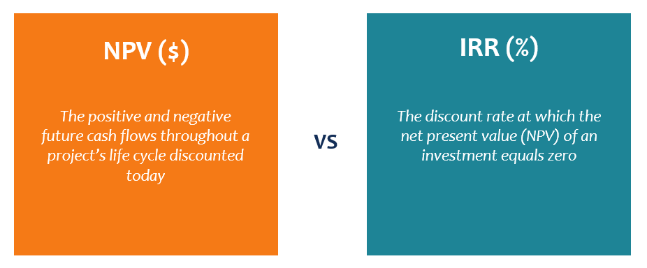

## Table of Contents

## What is Net Present Value (NPV)?

Net Present Value (NPV) is a financial tool used to evaluate the profitability of an investment or project. It works by calculating the difference between the present value of cash inflows and the present value of cash outflows over time. The idea is to see if the money you expect to gain from the investment, when adjusted for the time value of money, is more than what you put in.

To calculate NPV, you need to estimate future cash flows and choose a discount rate, which reflects the time value of money and risk. If the NPV is positive, it means the investment should theoretically increase the value of the company, making it a good choice. If it's negative, the investment might not be worth pursuing because it could decrease the company's value. This method helps businesses make smarter decisions about where to put their money.

## What is Internal Rate of Return (IRR)?

The Internal Rate of Return (IRR) is a way to figure out how good an investment is. It's the rate at which the net present value of all the cash flows (both coming in and going out) from a project or investment equals zero. In simpler terms, it's the interest rate that makes the money you expect to get from the investment equal to the money you put into it.

People use IRR to compare different investments. If the IRR of a project is higher than the cost of capital, which is the rate of return required to make an investment worthwhile, then the project is considered a good one. For example, if your cost of capital is 10% and the IRR of a project is 15%, the project could be a good choice because it's expected to earn more than it costs to fund it.

## How is NPV calculated?

To calculate the Net Present Value (NPV), you start by figuring out all the money you expect to get from an investment and all the money you need to spend on it. You then need to choose a discount rate, which is like an interest rate that shows how much you value money now compared to money in the future. You take each future cash flow and bring it back to today's value using this discount rate. This process is called discounting.

Once you've discounted all the cash flows, you add up the present values of all the money coming in and subtract the present values of all the money going out. If the result is positive, it means the investment should make more money than it costs, after adjusting for the time value of money. A positive NPV suggests the investment is a good one. If the NPV is negative, it means the investment might lose money, so it might not be worth doing.

## How is IRR calculated?

Calculating the Internal Rate of Return (IRR) can be a bit tricky because it involves finding the discount rate that makes the net present value of all cash flows from an investment equal to zero. You start by guessing a rate, then you calculate the NPV at that rate. If the NPV is positive, you try a higher rate, and if it's negative, you try a lower rate. You keep adjusting the rate until you find the one that makes the NPV zero. This is often done using a computer or a financial calculator because it involves trial and error.

Once you find the IRR, you can compare it to the cost of capital, which is the minimum rate of return you need to make an investment worthwhile. If the IRR is higher than the cost of capital, the investment is considered good because it's expected to earn more than it costs to fund it. For example, if your cost of capital is 8% and the IRR of a project is 12%, the project could be a good choice because it's expected to return more than the cost of funding it.

## What does a positive NPV indicate?

A positive NPV means that the investment or project is expected to make more money than it costs, after considering the time value of money. When you calculate the NPV, you're looking at all the money you'll get from the investment and all the money you'll spend on it, but you're bringing all those future amounts back to what they're worth today. If the result is positive, it shows that the investment will add value to your business or your money.

Think of it like this: if you invest $100 today and expect to get back more than $100 in today's dollars, then you're making a good choice. A positive NPV tells you that the investment is worth doing because it's going to be profitable. It's a useful tool for businesses to decide where to put their money to get the best return.

## What does an IRR higher than the cost of capital indicate?

When the Internal Rate of Return (IRR) of an investment is higher than the cost of capital, it means the investment is expected to earn more money than it costs to fund it. The cost of capital is like the minimum interest rate you need to make an investment worthwhile. If the IRR is higher, it's a sign that the project or investment will be profitable and add value to your business.

For example, if your cost of capital is 8% and the IRR of a project is 12%, the project is a good choice because it's expected to return more than what it costs to fund it. This helps businesses decide where to put their money to get the best return. If the IRR is lower than the cost of capital, it might not be worth doing because it won't make enough money to cover the costs.

## Can NPV and IRR give conflicting results? If so, why?

Yes, NPV and IRR can sometimes give conflicting results. This happens because they look at investments in slightly different ways. NPV calculates the difference between the present value of cash inflows and outflows using a specific discount rate. If the NPV is positive, it means the investment should add value to your business. On the other hand, IRR finds the rate at which the NPV equals zero. If the IRR is higher than your cost of capital, it suggests the investment is good. But these two methods might not always agree on whether an investment is worth it.

The main reason for these conflicts is the reinvestment assumption. NPV assumes that you can reinvest the cash flows at the discount rate you used, while IRR assumes you can reinvest them at the IRR itself. If the IRR is very high, this assumption might not be realistic. For example, if a project's IRR is 20% but the best reinvestment rate you can get is 10%, using the IRR's assumption could make the project look better than it really is. This is why, in practice, people often trust NPV more because it uses a more realistic reinvestment rate.

## How do NPV and IRR handle non-conventional cash flows differently?

NPV and IRR handle non-conventional cash flows differently because of how they calculate things. Non-conventional cash flows mean that the money coming in and going out doesn't follow a simple pattern. For example, you might have multiple times when you need to spend money instead of just at the start, or you might get money back at different times. NPV looks at all these cash flows and uses a set discount rate to figure out if the investment is worth it. It adds up the present value of all the money coming in and subtracts the present value of all the money going out. If the result is positive, the investment is good. NPV works well even with non-conventional cash flows because it uses the same discount rate for all cash flows.

On the other hand, IRR can get tricky with non-conventional cash flows. IRR tries to find the rate that makes the NPV equal to zero, but with multiple changes in cash flow direction, there can be more than one IRR. This is called multiple IRRs, and it makes it hard to decide if the investment is good or not. For example, if you have cash flows that go negative again after being positive, you might find two different rates where the NPV equals zero. This confusion doesn't happen with NPV because it uses a single discount rate to judge the investment. So, when cash flows are not straightforward, NPV is often a safer bet to use.

## What are the limitations of using IRR as a sole investment criterion?

Using IRR as the only way to decide on an investment can be tricky because it has some problems. One big issue is that IRR assumes you can reinvest the money you get back from the investment at the same high rate, which is often not true. For example, if your project has an IRR of 20%, it assumes you can put that money into another project that also gives you 20%. But in real life, you might only be able to get a 10% return on reinvestment. This can make a project look better than it really is. Also, IRR can be confusing when the cash flows are not simple. If money is coming in and going out at different times, you might end up with more than one IRR, making it hard to know which one to use.

Another limitation is that IRR doesn't tell you how much money you will actually make. It just gives you a rate of return, but it doesn't show the size of the investment or the total profit. For example, a small project might have a high IRR but bring in less total money than a larger project with a lower IRR. This means you might choose a project that looks good on paper but doesn't add as much value to your business. Because of these issues, it's usually better to use IRR along with other tools like NPV to get a fuller picture of an investment's worth.

## How does the scale of a project affect NPV and IRR?

The scale of a project can affect NPV and IRR in different ways. When you look at NPV, the size of the project matters a lot because NPV tells you the total amount of money you'll gain or lose in today's dollars. A bigger project usually means bigger cash flows, so if it's a good project, the NPV will be higher. For example, if you invest in a big factory that makes a lot of money, the NPV will be higher than if you invest in a small shop that makes less money, even if both have the same percentage return.

IRR, on the other hand, doesn't care as much about the size of the project. It tells you the rate of return you're getting, not the total amount of money. So, a small project and a big project could have the same IRR if they have the same percentage returns, but the big project will bring in more total money. This is why you might see a small project with a high IRR but a low NPV, and a big project with a lower IRR but a much higher NPV. When deciding between projects, it's important to look at both NPV and IRR to understand the full picture.

## In what scenarios might NPV be a better decision-making tool than IRR?

NPV might be a better choice for deciding on investments when the cash flows are not simple. Sometimes, money goes in and out at different times, and this can make IRR confusing because you might get more than one answer for IRR. NPV, on the other hand, uses a single discount rate to figure out if the investment is good, so it works well even when the cash flows are all over the place. This makes NPV easier to use and more reliable when things are not straightforward.

Another time when NPV is better is when you're looking at how much money you'll actually make from an investment. IRR tells you the rate of return, but it doesn't show you the total amount of money you'll get. NPV gives you the total profit in today's dollars, so you can see if a big project or a small one is better. If you're trying to choose between projects of different sizes, NPV helps you see which one will add more value to your business.

## How do multiple IRRs and no IRR scenarios impact investment decisions?

When you're looking at investments, sometimes you might find more than one IRR or no IRR at all. Multiple IRRs happen when the money coming in and going out changes direction more than once. For example, you might spend money to start a project, get money back, and then have to spend money again later. This can make it hard to decide if the project is a good idea because there's more than one rate that makes the NPV zero. If you see multiple IRRs, it's best to use NPV to make your decision because NPV gives you a clear answer about whether the project will make or lose money.

No IRR happens when the cash flows don't change direction at all, like if you're always spending money or always getting money back. In this case, you can't find a rate that makes the NPV zero because the cash flows are too one-sided. When you can't find an IRR, you should use NPV again to see if the investment is worth it. NPV will tell you if the money you expect to get back is more than what you're putting in, even if you can't find an IRR. So, in both situations with multiple IRRs or no IRR, NPV is a better tool to help you decide on your investment.

## What is Understanding Net Present Value (NPV)?

Net Present Value (NPV) is a financial metric that quantifies the value of an investment by comparing the present value of expected cash inflows to the present value of cash outflows over a specific period. This calculation takes into account the time value of money, providing a clear picture of the investment's potential profitability.

The time value of money is a fundamental principle in finance, reflecting the idea that a dollar today is worth more than a dollar received in the future due to its potential [earning](/wiki/earning-announcement) capacity. NPV incorporates this principle by applying discount rates to future cash flows, thereby adjusting them to their present values. The discount rate typically represents the investment's required rate of return or the cost of capital.

The mathematical formula for NPV is as follows:

$$
\text{NPV} = \sum_{t=0}^{n} \frac{C_t}{(1 + r)^t}
$$

Where:
- $C_t$ is the net cash flow at time $t$,
- $r$ is the discount rate,
- $n$ is the total number of periods.

A positive NPV indicates that the projected earnings (adjusted for time value) exceed the anticipated costs, suggesting that the investment is likely to be profitable. Conversely, a negative NPV implies that the costs outweigh the returns, signaling that the investment may be unwise. In essence, NPV serves as a tool for investors to evaluate whether the expected gains from a project justify the initial expenditure.

Calculating NPV involves estimating future cash flows and selecting an appropriate discount rate, which can be challenging due to uncertainties in projections and market fluctuations. To mitigate such challenges, investors often conduct sensitivity analyses, exploring how changes in assumptions about cash flows and discount rates affect NPV outcomes.

Python can be conveniently used to compute NPV, streamlining the process with easy-to-read code. Here's a basic example:

```python
def calculate_npv(cash_flows, discount_rate):
    npv = sum(cf / (1 + discount_rate) ** t for t, cf in enumerate(cash_flows))
    return npv

# Example cash flows: [-1000 (initial investment), 200, 300, 400]
cash_flows = [-1000, 200, 300, 400]
discount_rate = 0.10
npv = calculate_npv(cash_flows, discount_rate)
print(f"NPV: ${npv:.2f}")
```

In the context of capital budgeting, NPV stands as a critical criterion, often guiding decisions on project acceptance or rejection. By aligning cash flow valuations with financial goals through the inclusion of risk and return hurdles, NPV assists investors in making informed, strategic choices.

## What is Exploring Internal Rate of Return (IRR)?

Internal Rate of Return (IRR) is a crucial financial metric used to evaluate investment opportunities, measuring the rate at which the net present value (NPV) of cash inflows matches cash outflows, thereby making the NPV zero. It essentially answers the question: What is the break-even [interest rate](/wiki/interest-rate-trading-strategies) for this investment, considering its cash flow schedule?

### Calculation of IRR

IRR is calculated using the formula:

$$
0 = \sum_{t=0}^{N} \frac{C_t}{(1 + IRR)^t}
$$

In this formula, $C_t$ represents the cash inflows and outflows at time $t$, and $N$ is the total number of periods. The IRR is the discount rate that equates the present value of cash inflows to the present value of cash outflows, effectively setting the NPV to zero. The calculation of IRR typically involves iterative methods, as there is no straightforward algebraic solution for IRR; instead, numerical methods are often used. Python, for example, provides tools such as `numpy.irr` for estimating IRR:

```python
import numpy as np

# Example cash flows: Initial investment followed by annual inflows
cash_flows = [-1000, 300, 420, 600]
IRR = np.irr(cash_flows)
print(f"The Internal Rate of Return is: {IRR:.2%}")
```

### Significance in Evaluating Expected Rate of Return

IRR is particularly valuable for comparing the profitability of multiple investments. If a project’s IRR exceeds the required rate of return (or the company's hurdle rate), it is generally considered a good investment. This is because the project is expected to generate returns greater than the minimum acceptable return, implying value addition. Conversely, an IRR below the hurdle rate suggests a less desirable investment.

### Scenarios with Multiple IRRs

Certain investment scenarios can produce multiple IRRs, complicating the decision-making process. This typically occurs in projects with mixed cash flow patterns—where cash flows switch from positive to negative multiple times. Such cases are mathematically akin to solving polynomial equations with multiple roots.

For example, a project with an investment outlay followed by alternating periods of inflows and outflows might yield numerous IRRs. This creates ambiguity, as each IRR could imply a different investment threshold. To illustrate the complexity, consider:

```python
# Hypothetical cash flows that may generate multiple IRRs
cash_flows_multiple_irr = [-1000, 4000, -5000, 2000]
IRRs = np.roots(cash_flows_multiple_irr)
IRRs = [irr for irr in IRRs if irr.imag == 0]  # Consider real roots only
IRRs = [(irr.real - 1) for irr in IRRs]  # Convert from polynomial roots to discount rates
print("Possible IRRs are:", IRRs)
```

### Implications for Investment Analysis

When faced with multiple IRRs, investment analysts might consider using alternative metrics, such as Modified Internal Rate of Return (MIRR) or Net Present Value (NPV), for clearer insights. MIRR addresses the issue by assuming reinvestment at the project's cost of capital rather than the potentially unrealistic assumption of reinvestment at the project’s IRR.

In summary, while IRR is a powerful tool to gauge investment viability, multiple IRR scenarios require careful analysis. Understanding the limitations and nuances of IRR calculations enables more accurate and insightful investment evaluations, further contributing to well-informed strategic financial decision-making.

## What is a Real-World Application: Example of NPV and IRR?

In capital budgeting, evaluating potential investments involves calculating both Net Present Value (NPV) and Internal Rate of Return (IRR) to make informed decisions. Let's explore a hypothetical investment scenario to illustrate their practical application.

### Example Scenario
Consider a project requiring an initial investment of $500,000. The project is expected to generate the following cash flows over four years:

- Year 1: $150,000
- Year 2: $200,000
- Year 3: $250,000
- Year 4: $300,000

Assume the required rate of return, or the discount rate, is 10%.

### Calculating NPV

To determine the NPV, we calculate the present value of each future cash flow and subtract the initial investment. The formula for NPV is:

$$

NPV = \sum_{t=1}^{n} \frac{C_t}{(1 + r)^t} - C_0 
$$

Where:
- $C_t$ is the cash inflow at time $t$
- $r$ is the discount rate
- $C_0$ is the initial investment

Let's compute NPV:

$$
\begin{align*}
NPV &= \frac{150,000}{(1 + 0.10)^1} + \frac{200,000}{(1 + 0.10)^2} + \frac{250,000}{(1 + 0.10)^3} + \frac{300,000}{(1 + 0.10)^4} - 500,000 \\
&= \frac{150,000}{1.10} + \frac{200,000}{1.21} + \frac{250,000}{1.331} + \frac{300,000}{1.4641} - 500,000 \\
&= 136,364 + 165,289 + 187,970 + 204,610 - 500,000 \\
&= 694,233 - 500,000 \\
&= 194,233
\end{align*}
$$

The NPV of $194,233 indicates a profitable investment since it is positive, suggesting the project is expected to generate more value than its cost.

### Calculating IRR

IRR is the rate at which the NPV equals zero. It can be found using iterative methods or software tools like Python. Using Python's `numpy` library:

```python
import numpy as np

cash_flows = np.array([-500000, 150000, 200000, 250000, 300000])
irr = np.irr(cash_flows)
print(f"IRR: {irr:.2%}")
```

Running this code snippet would yield an IRR of approximately 20.2%.

### Significance and Influence on Decisions

The NPV result shows that the project adds value, making it a potentially beneficial undertaking. Comparatively, an IRR of 20.2% surpasses the required 10% rate of return, reinforcing the project's attractiveness. NPV is linear and sensitive to cash flow magnitude, whereas IRR focuses on profitability relative to scale.

Strategic decisions leverage these metrics to prioritize investments, considering funding availability and risk profiles. NPV aids in absolute profitability assessment, whereas IRR is crucial when comparing projects of varying scales. Together, they inform more balanced and thorough investment analysis.

## What is the relationship between Algorithmic Trading and the Importance of Financial Metrics?

Algorithmic trading has transformed financial markets by leveraging technology to execute trades at speeds and frequencies unachievable by human traders. At the heart of these sophisticated systems are quantitative metrics, including Net Present Value (NPV) and Internal Rate of Return (IRR), crucial for assessing the potential profitability and risk of trading strategies.

### Integration of NPV and IRR in Trading Algorithms

NPV and IRR are integrated into trading algorithms to evaluate the financial outcomes of potential trades and investment portfolios. The primary objective is to quantify the expected returns and associated risks to make data-driven investment decisions. 

1. **Net Present Value (NPV)**:
   NPV is used to estimate the value of an investment based on its expected future cash flows, discounted back to their present value. In trading algorithms, NPV can help determine whether a trade or a series of trades offers a positive return after accounting for the time value of money. The formula for calculating NPV is:
$$
   \text{NPV} = \sum_{t=0}^{T} \frac{C_t}{(1 + r)^t}

$$
   Where $C_t$ is the net cash flow at time $t$, $r$ is the discount rate, and $T$ is the total number of time periods.

2. **Internal Rate of Return (IRR)**:
   IRR is employed to calculate the expected growth rate of returns and is used in trading strategies to compare the profitability of different investments. IRR is the discount rate that makes the NPV of cash flows zero. Within [algorithmic trading](/wiki/algorithmic-trading), IRR aids in assessing whether the projected returns exceed the required rate of return, facilitating effective allocation of capital.

### Benefits of Using NPV and IRR

- **Quantitative Foundation**: Both NPV and IRR provide a solid quantitative basis for evaluating trades, aligning with the data-driven nature of algorithmic trading.
- **Risk Assessment**: These metrics help in assessing the risk-reward profile of trades by considering the time value of money and expected return rates.
- **Strategic Decision Making**: They enable traders to prioritize investments that are more likely to yield positive returns, thereby optimizing the use of capital.

### Challenges in High-Paced Environments

Despite their advantages, using NPV and IRR in the fast-paced environment of algorithmic trading presents challenges:

- **Market Volatility**: High market volatility can lead to significant fluctuations in expected cash flows, impacting the accuracy of NPV and IRR estimations.
- **Computational Complexity**: Real-time calculations require robust computational power and efficient algorithms to update and analyze these metrics rapidly.
- **Parameter Sensitivity**: Both metrics are sensitive to the assumptions regarding discount rates and cash flow estimates, making it crucial to base these inputs on accurate market data.

For algorithmic traders, mastering the application of NPV and IRR in trading strategies can enhance decision-making processes and improve the overall financial performance of their trading portfolios. As technology continues to evolve, the integration of these financial metrics into automated trading systems will remain pivotal in navigating the complexities of financial markets.

## References & Further Reading

[1]: ["Investment Valuation: Tools and Techniques for Determining the Value of Any Asset"](https://archive.org/details/investmentvaluat0000damo_n6k9) by Aswath Damodaran

[2]: ["Principles of Corporate Finance"](https://www.mheducation.com/highered/product/Principles-of-Corporate-Finance-Brealey.html) by Richard A. Brealey, Stewart C. Myers, and Franklin Allen

[3]: ["Corporate Finance"](https://www.investopedia.com/terms/c/corporatefinance.asp) by Jonathan Berk and Peter DeMarzo

[4]: ["Valuation: Measuring and Managing the Value of Companies"](https://www.amazon.com/Valuation-Measuring-Managing-Companies-Finance/dp/1119610885) by McKinsey & Company Inc.

[5]: ["The Little Book of Valuation: How to Value a Company, Pick a Stock, and Profit"](https://www.amazon.com/Little-Book-Valuation-Company-Profit/dp/1118004779) by Aswath Damodaran