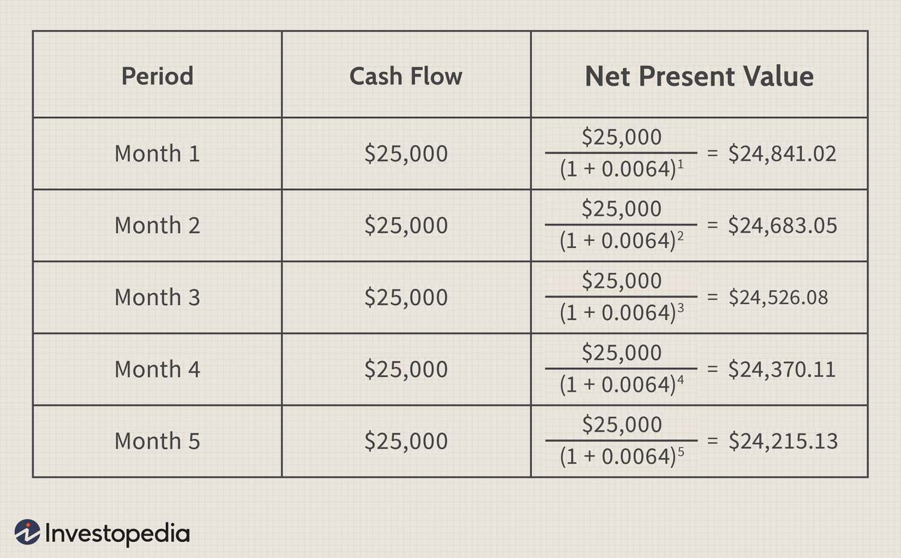

In finance and investment analysis, evaluating potential opportunities is foundational to making informed decisions. Among the most prominent evaluation techniques are Net Present Value (NPV) and Internal Rate of Return (IRR), both of which hold critical importance in assessing investment potential. NPV and IRR are widely recognized for their ability to measure the profitability and efficiency of investments, aiding stakeholders in determining the most financially viable projects.

Net Present Value (NPV) and Internal Rate of Return (IRR) provide different yet complementary insights into investment opportunities. NPV calculates the difference between the present value of cash inflows and outflows, allowing investors to understand the value an investment will add today. In contrast, IRR focuses on the discount rate that equalizes an investment's cash flows, setting NPV to zero, thereby offering a percentage-based indicator of expected profitability.



This article examines NPV and IRR comprehensively, contrasting their applications, benefits, and limitations. Understanding these methods allows investors to evaluate cash flows by considering the time value of money and the importance of discount rates in investment performance. Moreover, NPV and IRR extend their relevance beyond traditional evaluation by playing crucial roles in algorithmic trading. In this context, these metrics are integrated into trading strategies, shaping decisions in high-frequency and automated trading environments.

Overall, mastering the nuances of NPV and IRR is essential for investors, analysts, and traders looking to execute well-informed strategies in modern financial markets. Their application can lead to more strategic investment analyses, which are crucial in navigating the complex landscape of contemporary finance.

## Table of Contents

## Understanding Net Present Value (NPV)

Net Present Value (NPV) is a financial metric that quantifies the value of an investment by comparing the present value of expected cash inflows to the present value of cash outflows over a specific period. This calculation takes into account the time value of money, providing a clear picture of the investment's potential profitability.

The time value of money is a fundamental principle in finance, reflecting the idea that a dollar today is worth more than a dollar received in the future due to its potential earning capacity. NPV incorporates this principle by applying discount rates to future cash flows, thereby adjusting them to their present values. The discount rate typically represents the investment's required rate of return or the cost of capital.

The mathematical formula for NPV is as follows:

$$
\text{NPV} = \sum_{t=0}^{n} \frac{C_t}{(1 + r)^t}
$$

Where:
- $C_t$ is the net cash flow at time $t$,
- $r$ is the discount rate,
- $n$ is the total number of periods.

A positive NPV indicates that the projected earnings (adjusted for time value) exceed the anticipated costs, suggesting that the investment is likely to be profitable. Conversely, a negative NPV implies that the costs outweigh the returns, signaling that the investment may be unwise. In essence, NPV serves as a tool for investors to evaluate whether the expected gains from a project justify the initial expenditure.

Calculating NPV involves estimating future cash flows and selecting an appropriate discount rate, which can be challenging due to uncertainties in projections and market fluctuations. To mitigate such challenges, investors often conduct sensitivity analyses, exploring how changes in assumptions about cash flows and discount rates affect NPV outcomes.

Python can be conveniently used to compute NPV, streamlining the process with easy-to-read code. Here's a basic example:

```python
def calculate_npv(cash_flows, discount_rate):
    npv = sum(cf / (1 + discount_rate) ** t for t, cf in enumerate(cash_flows))
    return npv

# Example cash flows: [-1000 (initial investment), 200, 300, 400]
cash_flows = [-1000, 200, 300, 400]
discount_rate = 0.10
npv = calculate_npv(cash_flows, discount_rate)
print(f"NPV: ${npv:.2f}")
```

In the context of capital budgeting, NPV stands as a critical criterion, often guiding decisions on project acceptance or rejection. By aligning cash flow valuations with financial goals through the inclusion of risk and return hurdles, NPV assists investors in making informed, strategic choices.

## Exploring Internal Rate of Return (IRR)

Internal Rate of Return (IRR) is a crucial financial metric used to evaluate investment opportunities, measuring the rate at which the net present value (NPV) of cash inflows matches cash outflows, thereby making the NPV zero. It essentially answers the question: What is the break-even [interest rate](/wiki/interest-rate-trading-strategies) for this investment, considering its cash flow schedule?

### Calculation of IRR

IRR is calculated using the formula:

$$
0 = \sum_{t=0}^{N} \frac{C_t}{(1 + IRR)^t}
$$

In this formula, $C_t$ represents the cash inflows and outflows at time $t$, and $N$ is the total number of periods. The IRR is the discount rate that equates the present value of cash inflows to the present value of cash outflows, effectively setting the NPV to zero. The calculation of IRR typically involves iterative methods, as there is no straightforward algebraic solution for IRR; instead, numerical methods are often used. Python, for example, provides tools such as `numpy.irr` for estimating IRR:

```python
import numpy as np

# Example cash flows: Initial investment followed by annual inflows
cash_flows = [-1000, 300, 420, 600]
IRR = np.irr(cash_flows)
print(f"The Internal Rate of Return is: {IRR:.2%}")
```

### Significance in Evaluating Expected Rate of Return

IRR is particularly valuable for comparing the profitability of multiple investments. If a project’s IRR exceeds the required rate of return (or the company's hurdle rate), it is generally considered a good investment. This is because the project is expected to generate returns greater than the minimum acceptable return, implying value addition. Conversely, an IRR below the hurdle rate suggests a less desirable investment.

### Scenarios with Multiple IRRs

Certain investment scenarios can produce multiple IRRs, complicating the decision-making process. This typically occurs in projects with mixed cash flow patterns—where cash flows switch from positive to negative multiple times. Such cases are mathematically akin to solving polynomial equations with multiple roots.

For example, a project with an investment outlay followed by alternating periods of inflows and outflows might yield numerous IRRs. This creates ambiguity, as each IRR could imply a different investment threshold. To illustrate the complexity, consider:

```python
# Hypothetical cash flows that may generate multiple IRRs
cash_flows_multiple_irr = [-1000, 4000, -5000, 2000]
IRRs = np.roots(cash_flows_multiple_irr)
IRRs = [irr for irr in IRRs if irr.imag == 0]  # Consider real roots only
IRRs = [(irr.real - 1) for irr in IRRs]  # Convert from polynomial roots to discount rates
print("Possible IRRs are:", IRRs)
```

### Implications for Investment Analysis

When faced with multiple IRRs, investment analysts might consider using alternative metrics, such as Modified Internal Rate of Return (MIRR) or Net Present Value (NPV), for clearer insights. MIRR addresses the issue by assuming reinvestment at the project's cost of capital rather than the potentially unrealistic assumption of reinvestment at the project’s IRR.

In summary, while IRR is a powerful tool to gauge investment viability, multiple IRR scenarios require careful analysis. Understanding the limitations and nuances of IRR calculations enables more accurate and insightful investment evaluations, further contributing to well-informed strategic financial decision-making.

## NPV vs. IRR: A Comparative Analysis

Net Present Value (NPV) and Internal Rate of Return (IRR) serve as critical tools in investment analysis, both incorporating the time value of money into their calculations, yet differing significantly in approach and interpretation. Understanding these differences is vital for effectively applying these methodologies in various financial contexts.

**Similarities**:  
Both NPV and IRR aim to evaluate the attractiveness of an investment opportunity by considering all cash flows associated with a project. They account for the time value of money, a fundamental concept in finance, which recognizes that a dollar today is worth more than a dollar in the future due to its potential [earning](/wiki/earning-announcement) capacity. This shared foundation helps investors compare the profitability of different investments.

**Fundamental Differences**:  
The primary difference between NPV and IRR lies in their output and the decision-making criteria they offer:

- **NPV** provides a dollar value that represents the net difference between the present value of cash inflows and outflows. It facilitates straightforward decision-making by presenting an absolute value. An NPV greater than zero suggests that the investment is expected to generate more value than its cost, thus deemed profitable.

- **IRR**, on the other hand, provides a percentage that indicates the rate of return at which the NPV of cash flows equals zero. This internal rate allows investors to compare the expected return of the project to the required rate of return or cost of capital. If the IRR exceeds the cost of capital, the project is considered favorable.

**Pros and Cons**:

- **NPV Advantages**:  
  - **Absolute Value**: NPV offers a clear measure of the expected added value from an investment in dollar terms, providing precise insights.
  - **Direct Relation to Value**: By presenting an absolute figure, NPV directly correlates with changes in shareholder value.

- **NPV Disadvantages**:  
  - **Sensitivity to Discount Rate**: NPV's accuracy heavily depends on the chosen discount rate, which can be subjective and varies with market conditions.
  - **Lack of Scale Insight**: NPV does not provide information about the scale of the investment relative to its return, potentially misguiding comparisons between projects of different sizes.

- **IRR Advantages**:  
  - **Rate of Return**: IRR offers a normalized percentage return, making it easier to compare across different projects or investments.
  - **Independence from Scale**: Being a relative metric, IRR allows for easier comparison across projects of varying sizes.

- **IRR Disadvantages**:  
  - **Multiple IRRs**: Certain cash flow profiles can produce multiple IRRs, making the decision rule difficult to apply.
  - **Assumption of Reinvestment**: IRR assumes reinvestment of cash flows at the IRR itself, which may not be realistic. NPV compensates for this by allowing specification of the reinvestment rate.

**Preference Considerations**:  
When faced with mutually exclusive projects, NPV is generally preferred for its ability to quantify added value directly. However, if an investor seeks to evaluate projects based on efficiency of capital use or when comparing projects of varying sizes, IRR might be the preferred metric due to its rate-based nature.

In conclusion, while both NPV and IRR are indispensable tools for evaluating investments, their application depends on the specific decision context and the particular nuances of the investment opportunities being considered.

## Real-World Application: Example of NPV and IRR

In capital budgeting, evaluating potential investments involves calculating both Net Present Value (NPV) and Internal Rate of Return (IRR) to make informed decisions. Let's explore a hypothetical investment scenario to illustrate their practical application.

### Example Scenario
Consider a project requiring an initial investment of $500,000. The project is expected to generate the following cash flows over four years:

- Year 1: $150,000
- Year 2: $200,000
- Year 3: $250,000
- Year 4: $300,000

Assume the required rate of return, or the discount rate, is 10%.

### Calculating NPV

To determine the NPV, we calculate the present value of each future cash flow and subtract the initial investment. The formula for NPV is:

$$

NPV = \sum_{t=1}^{n} \frac{C_t}{(1 + r)^t} - C_0 
$$

Where:
- $C_t$ is the cash inflow at time $t$
- $r$ is the discount rate
- $C_0$ is the initial investment

Let's compute NPV:

$$
\begin{align*}
NPV &= \frac{150,000}{(1 + 0.10)^1} + \frac{200,000}{(1 + 0.10)^2} + \frac{250,000}{(1 + 0.10)^3} + \frac{300,000}{(1 + 0.10)^4} - 500,000 \\
&= \frac{150,000}{1.10} + \frac{200,000}{1.21} + \frac{250,000}{1.331} + \frac{300,000}{1.4641} - 500,000 \\
&= 136,364 + 165,289 + 187,970 + 204,610 - 500,000 \\
&= 694,233 - 500,000 \\
&= 194,233
\end{align*}
$$

The NPV of $194,233 indicates a profitable investment since it is positive, suggesting the project is expected to generate more value than its cost.

### Calculating IRR

IRR is the rate at which the NPV equals zero. It can be found using iterative methods or software tools like Python. Using Python's `numpy` library:

```python
import numpy as np

cash_flows = np.array([-500000, 150000, 200000, 250000, 300000])
irr = np.irr(cash_flows)
print(f"IRR: {irr:.2%}")
```

Running this code snippet would yield an IRR of approximately 20.2%.

### Significance and Influence on Decisions

The NPV result shows that the project adds value, making it a potentially beneficial undertaking. Comparatively, an IRR of 20.2% surpasses the required 10% rate of return, reinforcing the project's attractiveness. NPV is linear and sensitive to cash flow magnitude, whereas IRR focuses on profitability relative to scale.

Strategic decisions leverage these metrics to prioritize investments, considering funding availability and risk profiles. NPV aids in absolute profitability assessment, whereas IRR is crucial when comparing projects of varying scales. Together, they inform more balanced and thorough investment analysis.

## Algorithmic Trading and the Importance of Financial Metrics

Algorithmic trading has transformed financial markets by leveraging technology to execute trades at speeds and frequencies unachievable by human traders. At the heart of these sophisticated systems are quantitative metrics, including Net Present Value (NPV) and Internal Rate of Return (IRR), crucial for assessing the potential profitability and risk of trading strategies.

### Integration of NPV and IRR in Trading Algorithms

NPV and IRR are integrated into trading algorithms to evaluate the financial outcomes of potential trades and investment portfolios. The primary objective is to quantify the expected returns and associated risks to make data-driven investment decisions. 

1. **Net Present Value (NPV)**:
   NPV is used to estimate the value of an investment based on its expected future cash flows, discounted back to their present value. In trading algorithms, NPV can help determine whether a trade or a series of trades offers a positive return after accounting for the time value of money. The formula for calculating NPV is:
$$
   \text{NPV} = \sum_{t=0}^{T} \frac{C_t}{(1 + r)^t}

$$
   Where $C_t$ is the net cash flow at time $t$, $r$ is the discount rate, and $T$ is the total number of time periods.

2. **Internal Rate of Return (IRR)**:
   IRR is employed to calculate the expected growth rate of returns and is used in trading strategies to compare the profitability of different investments. IRR is the discount rate that makes the NPV of cash flows zero. Within [algorithmic trading](/wiki/algorithmic-trading), IRR aids in assessing whether the projected returns exceed the required rate of return, facilitating effective allocation of capital.

### Benefits of Using NPV and IRR

- **Quantitative Foundation**: Both NPV and IRR provide a solid quantitative basis for evaluating trades, aligning with the data-driven nature of algorithmic trading.
- **Risk Assessment**: These metrics help in assessing the risk-reward profile of trades by considering the time value of money and expected return rates.
- **Strategic Decision Making**: They enable traders to prioritize investments that are more likely to yield positive returns, thereby optimizing the use of capital.

### Challenges in High-Paced Environments

Despite their advantages, using NPV and IRR in the fast-paced environment of algorithmic trading presents challenges:

- **Market Volatility**: High market volatility can lead to significant fluctuations in expected cash flows, impacting the accuracy of NPV and IRR estimations.
- **Computational Complexity**: Real-time calculations require robust computational power and efficient algorithms to update and analyze these metrics rapidly.
- **Parameter Sensitivity**: Both metrics are sensitive to the assumptions regarding discount rates and cash flow estimates, making it crucial to base these inputs on accurate market data.

For algorithmic traders, mastering the application of NPV and IRR in trading strategies can enhance decision-making processes and improve the overall financial performance of their trading portfolios. As technology continues to evolve, the integration of these financial metrics into automated trading systems will remain pivotal in navigating the complexities of financial markets.

## Conclusion

Net Present Value (NPV) and Internal Rate of Return (IRR) are indispensable tools for evaluating the financial feasibility of investments and projects. Both metrics offer valuable insights, with NPV providing a measure of the absolute value of an investment in today's terms and IRR offering the expected rate of return that equates the net present values of cash inflows and outflows.

Each metric has unique advantages that make them suitable for different scenarios. NPV is particularly beneficial when comparing projects of different sizes or when the cost of capital needs explicit consideration. Its absolute measure helps in understanding the actual value added by the project, enabling a direct comparison with alternative opportunities. On the other hand, IRR provides a percentage yield of the investment, which can be intuitively appealing for comparing projects or understanding profitability in relative terms. Moreover, IRR can offer additional insights by showing how sensitive an investment is to changes in cost of capital.

Combining NPV and IRR allows for a more comprehensive investment analysis, reducing the risks associated with relying on a single metric. For instance, while IRR can sometimes suggest misleading conclusions when faced with non-traditional cash flow patterns, cross-referencing with NPV can clarify the financial implications.

In algorithmic trading, these metrics are equally critical. They facilitate a thorough examination of trading strategies by assessing potential profitability and risk levels. Algorithmic traders integrate them into quantitative models to gauge the long-term value and sustainability of their strategies. Mastering these tools is essential for optimizing trading algorithms, as it ensures the strategies not only perform under back-tested data but also remain robust across different market conditions.

Ultimately, leveraging both NPV and IRR in investment strategies enables more informed and strategic decision-making, enhancing the potential for financial success in both traditional finance settings and modern algorithmic trading environments.

## References & Further Reading

[1]: ["Investment Valuation: Tools and Techniques for Determining the Value of Any Asset"](https://archive.org/details/investmentvaluat0000damo_n6k9) by Aswath Damodaran

[2]: ["Principles of Corporate Finance"](https://www.mheducation.com/highered/product/Principles-of-Corporate-Finance-Brealey.html) by Richard A. Brealey, Stewart C. Myers, and Franklin Allen

[3]: ["Corporate Finance"](https://www.investopedia.com/terms/c/corporatefinance.asp) by Jonathan Berk and Peter DeMarzo

[4]: ["Valuation: Measuring and Managing the Value of Companies"](https://www.amazon.com/Valuation-Measuring-Managing-Companies-Finance/dp/1119610885) by McKinsey & Company Inc.

[5]: ["The Little Book of Valuation: How to Value a Company, Pick a Stock, and Profit"](https://www.amazon.com/Little-Book-Valuation-Company-Profit/dp/1118004779) by Aswath Damodaran