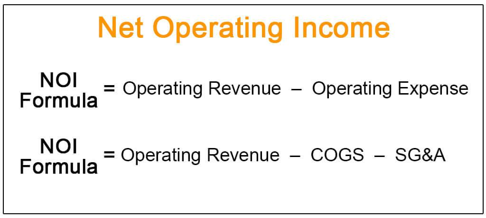

The world of financial metrics can be complex and intimidating, especially for those new to the field. Among the myriad of terms and metrics used to gauge financial performance, Net Operating Income (NOI) and Earnings Before Interest and Taxes (EBIT) are crucial elements for analysts and investors. NOI provides insights into the profitability of real estate investments by subtracting operating expenses from the total revenue generated by a property or business. It offers a clear perspective of operational efficiency, excluding non-operational factors such as taxes and interest. Meanwhile, EBIT reflects a company's operational profitability by focusing exclusively on earnings before accounting for interest and taxes, making it indispensable for evaluating core business performance across different companies.

Algorithmic (algo) trading has brought a new dimension to financial metrics, allowing for rapid analysis and decision-making. By leveraging computational algorithms, traders can analyze vast datasets to execute orders based on predefined financial metric criteria like NOI and EBIT. This approach enhances the ability to recognize investment opportunities with greater precision and speed, minimizing human error. 



This article will explore the significance of NOI and EBIT, how they are calculated and used in financial assessments, and the role of algorithmic trading in enhancing the interpretation and applicability of these metrics. With the increasing reliance on data-driven decisions in finance, understanding these metrics and advanced trading strategies can empower both novice and experienced investors. We'll begin by breaking down NOI and EBIT before exploring their implications in algorithmic trading.

## Table of Contents

## Understanding NOI and Its Importance

Net Operating Income (NOI) serves as a pivotal financial metric, particularly within the field of real estate investment analysis, where it functions as an indicator of a property's profitability. The calculation of NOI is straightforward: 

$$
\text{NOI} = \text{Total Revenue} - \text{Operating Expenses}
$$

Here, total revenue encompasses all income generated from a property, including rent, parking fees, and service charges. Operating expenses, on the other hand, cover costs necessary for maintaining and managing the property, such as maintenance fees, utilities, property management fees, insurance, and property taxes. Crucially, NOI omits non-operating expenses like taxes, interest, and capital expenditures, offering a focused view of operational efficiency.

The importance of NOI extends beyond mere profit calculation. By presenting a clear picture of a property’s operational income relative to its operating costs, NOI aids investors in making strategic decisions regarding real estate portfolios. It allows for a consistent comparison across various properties, regardless of the financing or tax implications. As a performance measure, it helps investors evaluate the potential profitability of real estate assets and plan acquisitions or dispositions more effectively.

While predominantly associated with real estate, the application of NOI principles is not limited to this sector. The methodology can be advantageous for assessing profitability in other business contexts where operational efficiencies and cost management are critical. For example, NOI can be adapted to evaluate other asset-heavy businesses, such as hotels or commercial enterprises, where distinguishing between operational and non-operational costs provides meaningful insights into core performance. 

Understanding the fundamentals and implications of NOI equips investors with a robust tool for financial analysis, enhancing the ability to structure informed investment strategies.

## The Role of EBIT in Financial Analysis

Earnings Before Interest and Taxes (EBIT) is a fundamental metric in financial analysis, providing a comprehensive measure of a company's operational performance. It is defined as the net income of a company before deducting interest and taxes, focusing on earnings generated from core business activities. The formula for calculating EBIT is:

$$
\text{EBIT} = \text{Revenue} - \text{Operating Expenses}
$$

EBIT offers valuable insights into a company’s operational profitability by removing the effects of financial and tax strategies. By excluding interest and tax liabilities, EBIT allows investors to evaluate the operational efficiency of companies without the distortions caused by varying tax environments and capital structures. This uniformity in analysis is crucial for accurately comparing businesses across different jurisdictions and with diverse financing arrangements.

The metric is particularly beneficial for assessing companies with intricate financial frameworks. Firms with complex debt arrangements or those operating in multiple tax jurisdictions can display skewed profitability levels if interest and tax expenses are included. EBIT isolates the core earnings capacity of such businesses, enabling a pure evaluation of their operational prowess.

Investors and analysts use EBIT to measure a company's ability to generate earnings from its primary business operations, independent of external financial and governmental factors. By focusing on operational earnings, decision-makers can assess the true operational health of a company, identifying strengths or potential areas for improvement in its business processes.

In summary, EBIT is an indispensable tool in financial analysis, particularly for investors interested in understanding the underlying operational performance of a company. It plays a critical role in the precise evaluation of an entity's business efficiency, enabling more informed investment decisions and comparative analyses across various industries and financial contexts.

## Algorithmic Trading and Financial Metrics

Algorithmic trading has significantly transformed the use of financial metrics in market operations, enhancing the precision and speed of trading activities. Through the use of sophisticated computer programs, [algorithmic trading](/wiki/algorithmic-trading) systems can execute orders based on predefined criteria, which often include critical financial metrics such as Net Operating Income (NOI) and Earnings Before Interest and Taxes (EBIT).

These computer programs enable traders to rapidly process and analyze extensive datasets, thus facilitating more accurate forecasting and strategic decision-making. For instance, algorithms can be developed to analyze a company's NOI or EBIT, selecting stocks that meet certain profitability or operational efficiency benchmarks. This capability allows for differentiated stock filtering, ensuring that trades are executed based on robust financial indicators.

The automation inherent in algorithmic trading minimizes the risk of human error in the trading process, offering a level of computational precision that is unparalleled. Algorithms can swiftly recognize trading opportunities by continuously scanning the market for stocks meeting the desired financial criteria, such as those exhibiting strong operational earnings or an attractive NOI.

Furthermore, by incorporating NOI and EBIT into algorithmic trading models, traders leverage these metrics for more nuanced strategy execution. For example, the formula for EBIT:

$$

EBIT = \text{Revenue} - \text{Operating Expenses} 
$$

This metric serves as a solid foundation for developing algorithms that can identify potentially lucrative trading opportunities based on a company’s core business performance, irrespective of its tax or interest liabilities.

Similarly, Python can be utilized to construct algorithms incorporating these metrics. Here is a simple example of how one might use Python to create a basic function that calculates EBIT:

```python
def calculate_ebit(revenue, operating_expenses):
    return revenue - operating_expenses

# Example Usage
revenue = 1000000  # Example revenue
operating_expenses = 300000  # Example operating expenses
ebit = calculate_ebit(revenue, operating_expenses)
print(f"The calculated EBIT is: {ebit}")
```

In summary, the integration of critical financial metrics like NOI and EBIT into algorithmic trading frameworks not only streamlines operations but also offers significant advancements in trading efficiency and accuracy. This methodological approach allows traders to exploit computational power to gain a competitive edge in the financial markets.

## Integrating NOI and EBIT in Trading Strategies

Integrating Net Operating Income (NOI) and Earnings Before Interest and Taxes (EBIT) into trading strategies can significantly enhance an investor's ability to identify profitable opportunities. These metrics offer critical insights into a company's operational performance, which, when incorporated into algorithmic trading models, can help discern undervalued or overvalued stocks. 

### Algorithm Development Using NOI and EBIT

Traders can develop advanced algorithms that utilize NOI and EBIT to screen potential investments. By focusing on operational performance, these algorithms can effectively isolate stocks demonstrating robust underlying financial health. For instance, an algorithm could be programmed to seek stocks with a consistently high NOI-to-revenue ratio, indicating high efficiency in generating income relative to their operational expenses. Similarly, a strong EBIT margin could signal a company’s capability to generate earnings before the impacts of interest and taxes, providing a measure of pure operational success. 

### Trading Strategies Enhanced by Financial Metrics

Various trading strategies can be optimized by embedding NOI and EBIT into their analytical frameworks:

1. **Mean Reversion**: This strategy operates on the principle that asset prices will revert to their historical mean over time. By using NOI and EBIT, traders can identify assets that deviate significantly from their expected operational profitability levels, betting on their eventual return to the average.

2. **Market Making**: Involves quoting both a buy and a sell price in a financial instrument. Traders can leverage NOI and EBIT to assess the intrinsic value of a company, allowing them to set more precise buy and sell quotes based on expected operational efficiency.

3. **Trend Following**: This strategy capitalizes on the momentum of existing market trends. Incorporating NOI and EBIT can aid in confirming the sustainability of a trend, ensuring that investments align with companies demonstrating authentic operational growth.

### Automated Screening Processes

Automation plays a pivotal role in contemporary trading environments. Automated screening processes equipped with real-time analysis of NOI and EBIT data can sift through large datasets, identifying viable investment prospects swiftly. Advanced algorithms can apply filters based on the financial health indicated by these metrics, expediting the decision-making process and enhancing the accuracy of stock selection.

### Refining Strategies for Optimal Returns

By refining traditional trading strategies with the integration of NOI and EBIT, investors can better gauge a company's operational revenue generation and efficiency. This refinement not only aids in identifying solid investment opportunities but also in minimizing risk by focusing on core financial performance. The strategic application of these metrics thus improves the likelihood of achieving desirable returns, creating more robust and agile investment strategies.

In conclusion, incorporating NOI and EBIT into trading strategies presents a structured approach to financial analysis that enriches an investor's toolkit. By leveraging these metrics, along with algorithmic trading systems, traders can achieve a deeper understanding of market dynamics, thus significantly improving their chances of success in the financial markets.

## Challenges and Considerations

While NOI (Net Operating Income) and EBIT (Earnings Before Interest and Taxes) are influential in financial analysis, they are subject to several challenges that can affect their utility in algorithmic trading models.

Non-operational factors, such as one-time expenses or revenue fluctuations, can cause inaccuracies when relying solely on NOI and EBIT for financial assessments. These metrics primarily highlight operational efficiency but fail to capture significant external elements influencing a company's profitability. For example, sudden regulatory changes or unexpected market movements can unbalance these metrics, leading to potentially misleading conclusions if not contextualized correctly.

Market [volatility](/wiki/volatility-trading-strategies) further complicates the application of NOI and EBIT. Rapid changes in market conditions can lead to substantial deviations in these metrics, undermining their reliability as indicators of financial health. This volatility necessitates a careful evaluation of financial statements, emphasizing the use of complementary metrics and qualitative assessments to form a holistic view.

Data quality is another crucial [factor](/wiki/factor-investing) influencing the dependability of NOI and EBIT. For algo trading strategies to be effective, they require precise and current data inputs. Any inconsistencies or inaccuracies can distort these metrics, leading to flawed trading signals and misaligned investment strategies.

Liquidity constraints present additional challenges. Implementing algorithmic strategies based on NOI and EBIT may encounter [liquidity](/wiki/liquidity-risk-premium) issues, especially in thinly traded markets. This can hinder efficient trade execution and affect the pricing of assets, limiting the applicability of these metrics in certain market environments.

Market impact is another significant consideration. Large trades based on algorithmic models can move the market, impacting the prices of the underlying assets. This can be problematic in scenarios where the models rely heavily on NOI and EBIT without considering potential market disruptions caused by large trading volumes.

Finally, staying updated on regulatory changes and technological advancements is crucial for managing risks associated with algorithmic trading. Regulations may affect how financial data is reported, potentially altering the interpretation of NOI and EBIT. Moreover, technological progress can offer new tools for enhancing data accuracy and processing power, but also require continuous adaptation and learning to maintain a competitive edge in trading strategies.

In conclusion, while NOI and EBIT provide valuable insights into operational efficiency, challenges such as non-operational factors, market volatility, data quality, liquidity constraints, and market impact must be carefully managed to maximize their usefulness in algorithmic trading.

## Conclusion

NOI (Net Operating Income) and EBIT (Earnings Before Interest and Taxes) serve as crucial financial metrics, offering profound insights into a firm's operational profitability and efficiency. These metrics enable investors and analysts to separate core operational performance from non-operational factors, allowing for a clearer assessment of a company's financial health. By focusing on NOI, analysts can evaluate the profitability generated from real estate or business operations by subtracting operating expenses from the total revenue. The formula for NOI is straightforward:

$$
\text{NOI} = \text{Total Revenue} - \text{Operating Expenses}
$$

Similarly, EBIT provides a window into a company's operational earnings before the impact of interest and tax expenses, calculated as follows:

$$
\text{EBIT} = \text{Revenue} - \text{Operating Expenses} - \text{Cost of Goods Sold}
$$

Algorithmic trading amplifies the utility of these metrics by incorporating them into data-driven trading strategies, allowing traders to execute transactions with heightened speed and accuracy. By leveraging algorithms, traders can systematically utilize NOI and EBIT to filter potential investment opportunities and execute trades based on a predefined set of financial criteria. This approach minimizes human error and improves the precision of market entry and [exit](/wiki/exit-strategy) points, optimizing investment decisions.

As investors integrate NOI and EBIT into their trading strategies, they gain the ability to navigate complex financial markets with greater confidence. Despite challenges such as market volatility or data accuracy that might affect these metrics, ongoing advancements in technology and data analysis continue to refine algorithmic models. With these technological improvements, investors can expect a promising horizon for algorithmic trading strategies.

In sum, the informed application of NOI and EBIT, combined with sophisticated trading technologies, can significantly enhance investment strategies. By systematically leveraging these metrics, investors can make more effective decisions, potentially leading to more desirable investment outcomes.

## References & Further Reading

[1]: Brueggeman, W. B., & Fisher, J. D. (2010). ["Real Estate Finance and Investments."](https://www.semanticscholar.org/paper/Real-Estate-Finance-and-Investments-Brueggeman-Fisher/e2edab62457a6b506c551ee095bc9510c266193c) McGraw-Hill Education.

[2]: Damodaran, A. (2012). ["Investment Valuation: Tools and Techniques for Determining the Value of Any Asset."](https://books.google.com/books/about/Investment_Valuation.html?id=5SRHAAAAQBAJ) John Wiley & Sons.

[3]: Harris, L. (2003). ["Trading and Exchanges: Market Microstructure for Practitioners."](https://academic.oup.com/book/52292) Oxford University Press.

[4]: Narang, R. K. (2009). ["Inside the Black Box: The Simple Truth About Quantitative Trading."](https://onlinelibrary.wiley.com/doi/book/10.1002/9781118267738) John Wiley & Sons.

[5]: Pardo, R. (2008). ["The Evaluation and Optimization of Trading Strategies."](https://onlinelibrary.wiley.com/doi/book/10.1002/9781119196969) John Wiley & Sons.