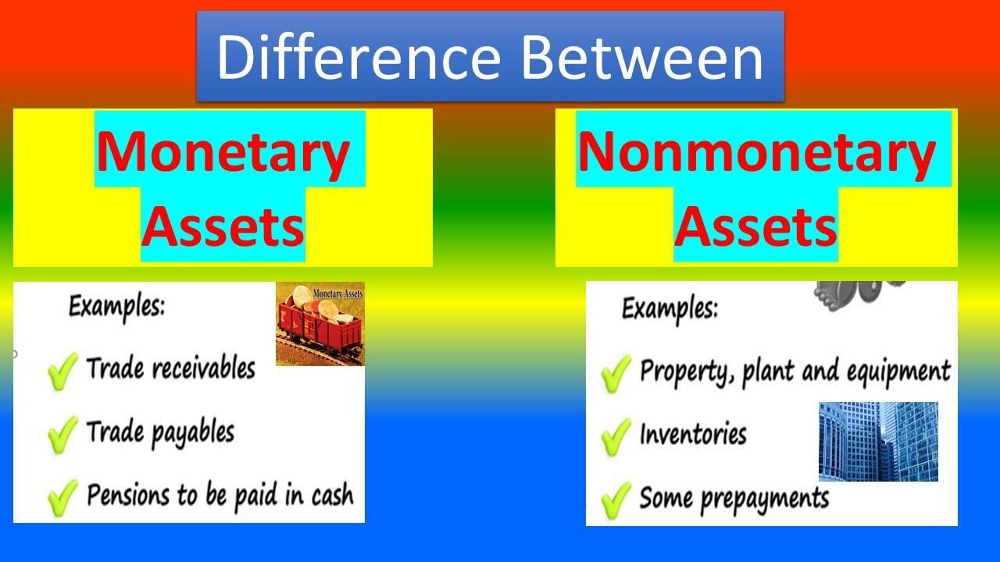

## Table of Contents

## What are nonmonetary assets?

Nonmonetary assets are things a business owns that aren't cash or things that can be easily turned into cash. These can include things like buildings, equipment, and even things like patents or trademarks. They are important because they help a business operate and make money, even if they can't be quickly sold for cash.

These assets are different from monetary assets, like cash or bank accounts, because they don't have a fixed value that can be easily measured. Instead, their value might change over time or depend on how they are used. For example, a piece of machinery might be worth more if it's in good condition and being used to make products, but less if it's old and broken. Because of this, businesses need to be careful about how they keep track of and report the value of their nonmonetary assets.

## What are monetary assets?

Monetary assets are things that a business owns that can be easily turned into cash. They include things like cash itself, money in bank accounts, and even investments like stocks and bonds that can be sold quickly. These assets are important because they help a business pay for things it needs and keep running smoothly.

The value of monetary assets is usually easy to figure out because they have a set price. For example, if you have $100 in your bank account, you know exactly how much it's worth. This makes it easier for businesses to keep track of these assets and plan for the future. Unlike nonmonetary assets, which can be harder to value, monetary assets give businesses a clear picture of their financial health.

## Can you give examples of nonmonetary assets?

Nonmonetary assets are things a business owns that you can't easily turn into cash. These include things like buildings and land. If a company owns an office building, that's a nonmonetary asset because it's not cash, but it's still very important for the business to have a place to work.

Another type of nonmonetary asset is equipment, like computers or machinery. These are things that help the business make products or provide services, but they aren't cash. For example, a factory might have machines that make cars. Those machines are nonmonetary assets because they are valuable but not easy to turn into cash quickly.

There are also intangible nonmonetary assets, like patents or trademarks. These are things you can't touch but still have value. A patent for a new invention or a trademark for a company's logo can help the business make money, even though they aren't cash. These assets are important because they can give a business an advantage over others.

## Can you give examples of monetary assets?

Monetary assets are things that a business can easily turn into cash. The most common example is cash itself. If a business has money in its cash register or in a safe, that's a monetary asset. Another example is money in a bank account. If a company has money in a checking or savings account, that's also a monetary asset because it can be taken out and used as cash whenever the business needs it.

Another type of monetary asset is investments that can be sold quickly, like stocks and bonds. If a business owns shares in another company, it can sell those shares and get cash. The same goes for bonds, which are like loans that can be sold to someone else. These investments are considered monetary assets because they can be turned into cash pretty fast, usually within a few days.

## How do nonmonetary assets differ from monetary assets in terms of valuation?

Nonmonetary assets and monetary assets are valued differently because of how easy it is to turn them into cash. Monetary assets, like cash or money in a bank account, have a clear value. If you have $100 in your bank, it's worth $100. You can use it right away or know exactly how much you'll get if you sell it. This makes it easy for businesses to know how much their monetary assets are worth at any time.

Nonmonetary assets, on the other hand, are harder to value because they can't be turned into cash quickly. Things like buildings, equipment, or patents don't have a set price that stays the same. Their value can change over time or depend on how they're used. For example, a piece of machinery might be worth a lot if it's in good condition and helps make products, but it could be worth less if it's old and broken. Because of this, businesses need to think carefully about how they figure out and report the value of their nonmonetary assets.

## What are the accounting treatments for nonmonetary assets?

When it comes to accounting for nonmonetary assets, businesses need to keep track of them on their balance sheet. These assets, like buildings, equipment, and patents, are recorded at their original cost when they are bought. Over time, some nonmonetary assets, like equipment, lose value because they wear out or become outdated. This loss of value is called depreciation, and businesses need to account for it by reducing the value of the asset on their balance sheet each year. This helps show a more accurate picture of what the asset is really worth.

For intangible nonmonetary assets, like patents or trademarks, the accounting treatment can be a bit different. These assets might not lose value in the same way as physical assets, but they still have a limited life. Businesses often use a process called amortization to spread out the cost of these assets over their useful life. This means they record a portion of the asset's cost as an expense each year until the asset is no longer useful. This helps businesses match the cost of the asset with the income it helps generate, giving a clearer picture of their financial health.

## What are the accounting treatments for monetary assets?

When it comes to accounting for monetary assets, businesses record them at their current value on the balance sheet. Monetary assets, like cash and money in bank accounts, are easy to value because they have a set price. If a business has $100 in its bank account, it's recorded as $100 on the balance sheet. This makes it simple for businesses to keep track of how much money they have available to use.

For investments like stocks and bonds, which are also considered monetary assets, the accounting treatment can be a bit different. These assets are usually recorded at their market value, which can change over time. If a business owns stocks, it needs to update the value of those stocks on its balance sheet to reflect what they would be worth if sold today. This helps give a more accurate picture of the business's financial health, even though the value of these assets can go up and down.

## How do nonmonetary assets impact a company's financial statements?

Nonmonetary assets, like buildings, equipment, and patents, show up on a company's balance sheet. They are listed at the price the company paid for them when they were bought. Over time, some of these assets, like equipment, lose value because they get old or worn out. This loss of value is called depreciation, and it's shown on the balance sheet by reducing the value of the asset each year. This helps everyone see a more accurate picture of what the asset is really worth now.

These nonmonetary assets also affect the income statement. When a company calculates its profit, it needs to subtract the cost of using these assets. For example, the yearly depreciation of equipment is considered an expense. This expense reduces the company's profit for that year. For intangible assets like patents, the cost is spread out over time through a process called amortization. This also shows up as an expense on the income statement, helping to match the cost of the asset with the income it helps generate.

## How do monetary assets impact a company's financial statements?

Monetary assets, like cash and money in bank accounts, show up on a company's balance sheet. They are listed at their current value, which means if a company has $100 in its bank account, it's recorded as $100 on the balance sheet. This makes it easy for everyone to see how much money the company has available to use. If a company also owns investments like stocks and bonds, these are recorded at their market value, which can change over time. The company needs to update the value of these investments on the balance sheet to show what they would be worth if sold today.

These monetary assets also affect the company's income statement. When a company earns interest from its bank account or sells investments like stocks for a profit, this income is added to the company's total earnings. On the other hand, if the company loses money on its investments, this loss is subtracted from the earnings. This helps show a clear picture of how well the company is doing financially, including how it's managing its cash and investments.

## What are the risks associated with holding nonmonetary assets?

Holding nonmonetary assets can be risky because their value can change a lot over time. Things like buildings or equipment can lose value if they get old or if new technology comes along that makes them less useful. For example, if a company buys a new machine to make products, but a better machine comes out a few years later, the old machine might not be worth as much anymore. Also, if something unexpected happens, like a natural disaster, it could damage the asset and make it worth even less.

Another risk is that nonmonetary assets can be hard to turn into cash quickly. If a company needs money fast, it might be hard to sell a building or a piece of equipment right away. This can be a problem if the company needs to pay for something important, like buying more supplies or paying its workers. Because of these risks, companies need to think carefully about how much they invest in nonmonetary assets and make sure they have enough cash or other monetary assets to cover their needs.

## What are the risks associated with holding monetary assets?

Holding monetary assets, like cash or money in a bank account, can be risky because their value can go down over time. If the money is just sitting in an account without [earning](/wiki/earning-announcement) interest, inflation can make it worth less. Inflation means that the prices of things go up, so the same amount of money can buy less stuff in the future. Also, if a company keeps too much money in cash, it might miss out on chances to invest that money in things that could make more money, like buying new equipment or investing in stocks.

Another risk with monetary assets is that they can be lost or stolen. If a company keeps a lot of cash in its office, someone could break in and take it. Even money in a bank account isn't always completely safe. If the bank has problems and goes out of business, the company might not get all its money back. Because of these risks, companies need to be careful about how much money they keep in cash and think about other ways to keep their money safe and make it grow.

## How do changes in economic conditions affect the value of nonmonetary versus monetary assets?

Changes in economic conditions can affect the value of nonmonetary assets a lot. These assets, like buildings and equipment, can lose value if the economy gets bad. For example, if there's a recession, companies might not be able to sell their buildings for as much money as before because fewer people are buying. Also, if interest rates go up, it can be more expensive for companies to borrow money to buy new equipment, so they might not want to buy as much. On the other hand, if the economy is doing well, nonmonetary assets can go up in value. More people might want to buy buildings or use equipment, so their prices can go up.

Changes in economic conditions also affect monetary assets, but in a different way. If the economy is growing, the value of money in a bank account might not change much, but inflation can make it worth less over time. For example, if prices are going up because of inflation, the same amount of money can buy fewer things. Also, if interest rates go up, the money in a bank account might earn more interest, which is good. But if the economy gets bad and interest rates go down, the money might not earn as much, and it could be harder to make money from investments like stocks and bonds. So, while monetary assets are easier to turn into cash, their value can still change because of the economy.

## What is the understanding of nonmonetary assets?

Nonmonetary assets represent a critical category of resources for businesses and investors, comprising both tangible and intangible items that lack a fixed or readily convertible cash value. Unlike monetary assets, which are geared towards short-term [liquidity](/wiki/liquidity-risk-premium), nonmonetary assets are geared towards long-term strategic growth and value appreciation.

Key examples of nonmonetary assets include real estate, equipment, and intellectual property. Real estate encompasses land and buildings owned by an entity, offering potential for value appreciation over time and serving as collateral for financing purposes. Equipment, covering machinery and technological tools, is essential for operational productivity and efficiency improvements. These assets, while not immediately liquid, underpin the productive capacity of a business.

Intellectual property (IP) forms the intangible segment of nonmonetary assets. It includes patents, trademarks, copyrights, and trade secrets. Patents protect inventions and encourage innovation by granting inventors exclusive rights. Trademarks safeguard brand identity, ensuring that businesses retain exclusive use of their logos and branding elements. Copyrights offer protection to creators of original works, such as literature and art, while trade secrets cover proprietary processes and knowledge contributing to a firm's competitive edge.

In financial reporting, nonmonetary assets are usually recorded at their historical cost, which is adjusted for depreciation or amortization to reflect their usage and wear over time. For example, the straight-line method of depreciation, represented mathematically as:

$$
\text{Annual Depreciation} = \frac{\text{Cost of Asset} - \text{Residual Value}}{\text{Useful Life of Asset}}
$$

allows firms to allocate the cost of tangible assets over their useful lives. This allocation is crucial for accurately presenting the value of nonmonetary assets on balance sheets, impacting perceptions of a company's long-term financial health.

Furthermore, the valuation and management of nonmonetary assets require careful strategic planning. Unlike monetary assets, their value can fluctuate significantly due to market dynamics, technological advancements, or changes in regulatory environments. Consequently, businesses continuously evaluate these assets to optimize their value, leveraging them strategically for growth and innovation.

In summary, while nonmonetary assets may not offer immediate liquidity, their importance in fostering long-term strategic growth, enhancing operational capabilities, and supporting innovation is indisputable. Understanding their characteristics and implications is essential for stakeholders aiming to maximize potential value and ensure sustained competitive advantages.

## What is the Role of Asset Classification in Financial Reporting?

Asset classification plays a pivotal role in financial reporting by providing a structured way to evaluate a company's financial standing. Accurate classification of assets into monetary and nonmonetary categories facilitates an in-depth understanding of a company's liquidity, solvency, and overall financial health, crucial for stakeholders such as investors, management, and regulatory authorities.

**Liquidity Analysis:**

Monetary assets, due to their nature, are central to liquidity analysis. These assets, including cash and equivalents, accounts receivable, and marketable securities, have a known value and can be quickly converted into cash with minimal impact on their price. Proper classification of these assets allows for an accurate calculation of liquidity ratios such as the current ratio and quick ratio. The current ratio is calculated as:

$$
\text{Current Ratio} = \frac{\text{Current Assets}}{\text{Current Liabilities}}
$$

These ratios help assess a company's capability to meet its short-term obligations, providing insights into its operational efficiency.

**Solvency Evaluation:**

Nonmonetary assets, which include tangible items like property and intangible items like patents, contribute to the analysis of a company's solvency. While these assets are less liquid, they represent long-term economic benefits and can be leveraged for financing or investment opportunities. Solvency is often evaluated through ratios such as the debt-to-equity ratio, which takes into account all asset classes:

$$
\text{Debt-to-Equity Ratio} = \frac{\text{Total Liabilities}}{\text{Shareholders' Equity}}
$$

By distinguishing between asset classes, companies can better manage their debt levels relative to their equity.

**Financial Health Indicators:**

A comprehensive asset classification ensures transparency in financial reports, leading to reliable comparability and analysis across different periods and with other enterprises. For instance, International Financial Reporting Standards (IFRS) and Generally Accepted Accounting Principles (GAAP) emphasize the correct classification of assets to maintain consistency in reporting. Investors rely heavily on this transparency to assess potential investment risks and returns.

**Impact for Investors and Regulatory Bodies:**

Accurate asset classification provides detailed insights into a company's financial practices and stability. For investors, this means better-informed decision-making processes, as they gain clearer insights into how a company utilizes its resources and plans for future growth. Regulatory bodies benefit from standardized measures of corporate health and compliance with reporting standards, which aids in market regulation and reduces systemic risk.

In conclusion, precise asset classification underpins effective financial reporting by illuminating the liquidity and solvency positions of companies, ultimately facilitating informed decisions by various stakeholders. As financial markets and regulations evolve, the emphasis on accurate classification is likely to intensify, underscoring its integral role in financial transparency and accountability.

## References & Further Reading

[1]: Bergstra, J., Bardenet, R., Bengio, Y., & Kégl, B. (2011). ["Algorithms for Hyper-Parameter Optimization."](https://dl.acm.org/doi/10.5555/2986459.2986743) Advances in Neural Information Processing Systems 24.

[2]: ["Advances in Financial Machine Learning"](https://www.amazon.com/Advances-Financial-Machine-Learning-Marcos/dp/1119482089) by Marcos Lopez de Prado

[3]: ["Evidence-Based Technical Analysis: Applying the Scientific Method and Statistical Inference to Trading Signals"](https://www.amazon.com/Evidence-Based-Technical-Analysis-Scientific-Statistical/dp/0470008741) by David Aronson

[4]: ["Machine Learning for Algorithmic Trading"](https://github.com/stefan-jansen/machine-learning-for-trading) by Stefan Jansen

[5]: ["Quantitative Trading: How to Build Your Own Algorithmic Trading Business"](https://www.amazon.com/Quantitative-Trading-Build-Algorithmic-Business/dp/1119800064) by Ernest P. Chan