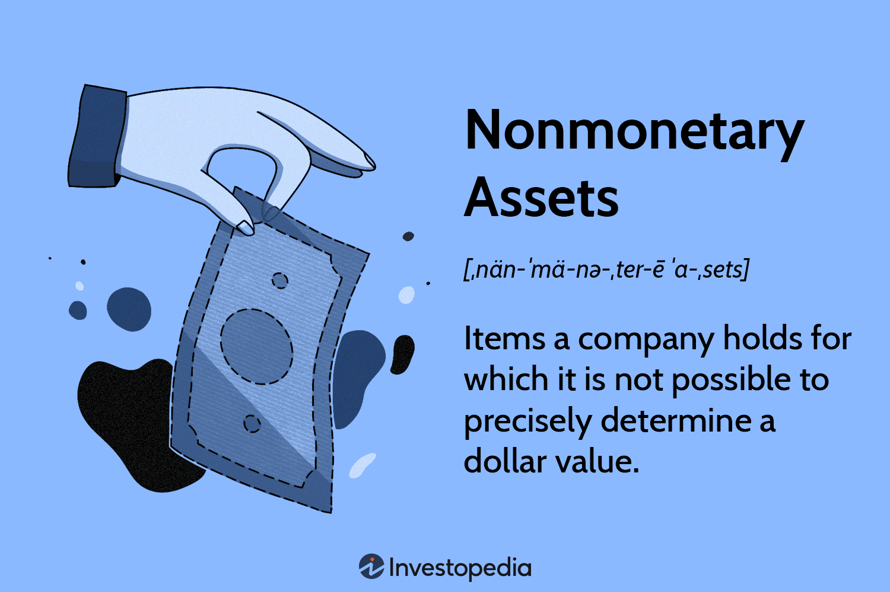

In the ever-evolving financial landscape, the capability to distinguish between different asset types plays a pivotal role in influencing investment decisions. Assets are generally classified into two primary categories: monetary and nonmonetary. Monetary assets are those that can be readily converted into cash or cash equivalents, such as bank deposits and accounts receivable. They typically have a fixed or determinable income value, making them essential for meeting short-term financial obligations. In contrast, nonmonetary assets include both tangible and intangible resources that do not possess a fixed or easily convertible cash value. Examples of these assets include real estate, equipment, and intellectual property such as patents and trademarks, which are critical for fostering long-term strategic growth.

The comparison between monetary and nonmonetary assets becomes increasingly significant in the context of algorithmic trading, a practice that uses computer algorithms to execute trading strategies efficiently. Understanding the nature and classification of assets is fundamental for developing optimized trading strategies that balance risk management with potential returns. As the financial markets become more complex, the ability to accurately classify and evaluate assets will remain an indispensable element of sound financial reporting and investment strategies. The nuanced appreciation of these asset types not only enhances the execution of algorithmic trades but also supports more informed, strategic financial decision-making.



## Table of Contents

## Understanding Monetary Assets

Monetary assets are financial instruments or holdings that can be readily converted into cash or cash equivalents without any significant loss in value. Common examples include cash on hand, bank deposits, and accounts receivable. These assets are characterized by their liquidity and are vital for businesses and individuals to meet short-term financial obligations effectively.

The primary feature of monetary assets is their determinable value. This means that the value of these assets is fixed or can be calculated with precision, which is particularly useful for budgeting and forecasting financial needs. For instance, bank deposits can be withdrawn, and accounts receivable can be collected, both reflecting a clear and ascertainable worth.

The ease with which monetary assets can be converted into cash makes them highly liquid. Liquidity is a crucial aspect for entities needing to cover operational expenses, pay salaries, or address unexpected expenditures. For instance, a company's balance sheet will typically list cash and accounts receivable as current assets, reflecting their role in fulfilling short-term liabilities.

Moreover, holding adequate monetary assets is a strategic approach to manage financial health and avoid liquidity crises. For businesses, maintaining an optimum level of cash reserves ensures that they can seize investment opportunities quickly or address urgencies that require immediate financial intervention.

The valuation of monetary assets is straightforward since they are usually recorded at their nominal or book value. This simplicity in valuation allows for precise financial reporting and assists in maintaining transparency in financial statements. By accurately reporting monetary assets, companies can provide better insights into their [liquidity](/wiki/liquidity-risk-premium) position to investors, creditors, and regulatory authorities.

In terms of accounting standards, monetary assets are often subject to less fluctuation than nonmonetary assets. This stability is beneficial for stakeholders seeking to analyze a firm's financial stability and short-term solvency. The predictable nature of these assets also supports more accurate risk assessments and financial planning.

In conclusion, monetary assets play a fundamental role in financial management due to their liquidity and determinable value. They are indispensable for meeting short-term commitments and ensuring a seamless financial operation. Proper classification and management of these assets are essential for maintaining financial stability and operational efficiency.

## Understanding Nonmonetary Assets

Nonmonetary assets represent a critical category of resources for businesses and investors, comprising both tangible and intangible items that lack a fixed or readily convertible cash value. Unlike monetary assets, which are geared towards short-term liquidity, nonmonetary assets are geared towards long-term strategic growth and value appreciation.

Key examples of nonmonetary assets include real estate, equipment, and intellectual property. Real estate encompasses land and buildings owned by an entity, offering potential for value appreciation over time and serving as collateral for financing purposes. Equipment, covering machinery and technological tools, is essential for operational productivity and efficiency improvements. These assets, while not immediately liquid, underpin the productive capacity of a business.

Intellectual property (IP) forms the intangible segment of nonmonetary assets. It includes patents, trademarks, copyrights, and trade secrets. Patents protect inventions and encourage innovation by granting inventors exclusive rights. Trademarks safeguard brand identity, ensuring that businesses retain exclusive use of their logos and branding elements. Copyrights offer protection to creators of original works, such as literature and art, while trade secrets cover proprietary processes and knowledge contributing to a firm's competitive edge.

In financial reporting, nonmonetary assets are usually recorded at their historical cost, which is adjusted for depreciation or amortization to reflect their usage and wear over time. For example, the straight-line method of depreciation, represented mathematically as:

$$
\text{Annual Depreciation} = \frac{\text{Cost of Asset} - \text{Residual Value}}{\text{Useful Life of Asset}}
$$

allows firms to allocate the cost of tangible assets over their useful lives. This allocation is crucial for accurately presenting the value of nonmonetary assets on balance sheets, impacting perceptions of a company's long-term financial health.

Furthermore, the valuation and management of nonmonetary assets require careful strategic planning. Unlike monetary assets, their value can fluctuate significantly due to market dynamics, technological advancements, or changes in regulatory environments. Consequently, businesses continuously evaluate these assets to optimize their value, leveraging them strategically for growth and innovation.

In summary, while nonmonetary assets may not offer immediate liquidity, their importance in fostering long-term strategic growth, enhancing operational capabilities, and supporting innovation is indisputable. Understanding their characteristics and implications is essential for stakeholders aiming to maximize potential value and ensure sustained competitive advantages.

## Key Differences Between Monetary and Nonmonetary Assets

Monetary assets are characterized by their high liquidity, meaning they can be rapidly converted into cash or cash equivalents without significant loss in value. This liquidity makes monetary assets beneficial for addressing immediate financial needs and obligations. Examples include cash on hand, bank deposits, and accounts receivable, each of which has a fixed or determinable income value. The liquidity of monetary assets is an essential [factor](/wiki/factor-investing) in short-term financial planning and ensures that a business can meet its operational obligations.

In contrast, nonmonetary assets lack a fixed cash value and are not easily convertible to liquid form. These assets encompass both tangible and intangible resources such as real estate, machinery, equipment, patents, and trademarks. Nonmonetary assets are often acquired for their potential to appreciate in value over time, offering strategic opportunities for long-term growth. Despite their lack of liquidity, these assets contribute significantly to a company's overall valuation and strategic positioning.

The fundamental difference in liquidity between these asset types necessitates different management strategies. Monetary assets are managed to maintain fluidity and support operational frameworks, while nonmonetary assets are managed with a focus on growth potential and strategic advantage. Balancing these two types of assets is crucial to achieving both immediate financial stability and long-term developmental goals. In financial analysis, understanding this balance enables investors and managers to assess a company’s financial health more accurately.

## The Role of Asset Classification in Financial Reporting

Asset classification plays a pivotal role in financial reporting by providing a structured way to evaluate a company's financial standing. Accurate classification of assets into monetary and nonmonetary categories facilitates an in-depth understanding of a company's liquidity, solvency, and overall financial health, crucial for stakeholders such as investors, management, and regulatory authorities.

**Liquidity Analysis:**

Monetary assets, due to their nature, are central to liquidity analysis. These assets, including cash and equivalents, accounts receivable, and marketable securities, have a known value and can be quickly converted into cash with minimal impact on their price. Proper classification of these assets allows for an accurate calculation of liquidity ratios such as the current ratio and quick ratio. The current ratio is calculated as:

$$
\text{Current Ratio} = \frac{\text{Current Assets}}{\text{Current Liabilities}}
$$

These ratios help assess a company's capability to meet its short-term obligations, providing insights into its operational efficiency.

**Solvency Evaluation:**

Nonmonetary assets, which include tangible items like property and intangible items like patents, contribute to the analysis of a company's solvency. While these assets are less liquid, they represent long-term economic benefits and can be leveraged for financing or investment opportunities. Solvency is often evaluated through ratios such as the debt-to-equity ratio, which takes into account all asset classes:

$$
\text{Debt-to-Equity Ratio} = \frac{\text{Total Liabilities}}{\text{Shareholders' Equity}}
$$

By distinguishing between asset classes, companies can better manage their debt levels relative to their equity.

**Financial Health Indicators:**

A comprehensive asset classification ensures transparency in financial reports, leading to reliable comparability and analysis across different periods and with other enterprises. For instance, International Financial Reporting Standards (IFRS) and Generally Accepted Accounting Principles (GAAP) emphasize the correct classification of assets to maintain consistency in reporting. Investors rely heavily on this transparency to assess potential investment risks and returns.

**Impact for Investors and Regulatory Bodies:**

Accurate asset classification provides detailed insights into a company's financial practices and stability. For investors, this means better-informed decision-making processes, as they gain clearer insights into how a company utilizes its resources and plans for future growth. Regulatory bodies benefit from standardized measures of corporate health and compliance with reporting standards, which aids in market regulation and reduces systemic risk.

In conclusion, precise asset classification underpins effective financial reporting by illuminating the liquidity and solvency positions of companies, ultimately facilitating informed decisions by various stakeholders. As financial markets and regulations evolve, the emphasis on accurate classification is likely to intensify, underscoring its integral role in financial transparency and accountability.

## Algorithmic Trading and its Dependence on Asset Classification

Algorithmic trading has transformed financial markets by utilizing computer programs to make high-speed trading decisions. The success of these algorithms often hinges on the precise classification of assets, distinguishing between monetary and nonmonetary assets to tailor strategies effectively.

Monetary assets, characterized by their liquidity and fixed income value, are essential for strategies that emphasize speed and immediate returns. In [algorithmic trading](/wiki/algorithmic-trading), these assets support high-frequency trading ([HFT](/wiki/high-frequency-trading-strategies)) strategies where rapid order execution is crucial. The algorithms prioritize monetary assets like cash, bank deposits, and securities with high turnover rates to take advantage of short-term market inefficiencies. The principal objective is to capitalize on swift market movements, making liquidity a key factor.

Nonmonetary assets, in contrast, often require a different approach due to their long-term value potential and lack of liquidity. These assets, including real estate, intellectual property, and machinery, are less frequently traded but are integral for strategic investment algorithms. Algorithms focusing on these assets tend to use medium to long-term strategies, analyzing market conditions to identify growth potential over time. Such strategies might include mean-reversion or trend-following algorithms, which predict future asset value beyond immediate market fluctuations.

Effective asset classification aids in fine-tuning risk management within these trading algorithms. For example, risk models might be calibrated to assess liquidity risk for monetary assets differently than for nonmonetary assets. The variance in liquidity and [volatility](/wiki/volatility-trading-strategies) between the two necessitates tailored risk assessments. This distinction is crucial for maintaining an optimal balance between risk and return—a fundamental aspect of algorithmic trading.

The processing of asset characteristics can be illustrated with a Python snippet, demonstrating how one might differentiate between monetary and nonmonetary assets based on their attributes:

```python
class Asset:
    def __init__(self, name, asset_type, liquidity):
        self.name = name
        self.asset_type = asset_type
        self.liquidity = liquidity

    def classify(self):
        if self.asset_type == 'Monetary' and self.liquidity > 0.8:
            return f"{self.name} is suitable for HFT."
        elif self.asset_type == 'Nonmonetary' and self.liquidity < 0.2:
            return f"{self.name} is suitable for long-term investment."
        else:
            return f"{self.name} requires further analysis."

# Example usage
asset1 = Asset('Government Bond', 'Monetary', 0.9)
asset2 = Asset('Real Estate', 'Nonmonetary', 0.1)

print(asset1.classify())  # Output: Government Bond is suitable for HFT.
print(asset2.classify())  # Output: Real Estate is suitable for long-term investment.
```

The optimization of trading strategies through asset classification ultimately leads to enhanced trade execution efficiency. By tailoring algorithms to the specific characteristics of monetary and nonmonetary assets, traders can maximize returns while minimizing risks, reinforcing the integral role of precise asset classification in algorithmic trading.

## Case Studies: Asset Classification in Action

Several case studies offer insight into how asset classification can significantly affect trading strategies, impacting both short-term and long-term financial objectives. 

**Case Study 1: Utilization of Nonmonetary Assets for Long-term Growth**  
One prominent example of strategic asset classification is seen in companies focusing on real estate and intellectual property. A technology firm opting to capitalize on its patents and proprietary technology showcases how nonmonetary assets form the core of long-term growth strategy. By leveraging these intangible assets, the firm can ensure sustained competitive advantages, invest in research and development, and ultimately achieve substantial market influence. Historical data from companies such as Google and IBM illustrates this point as they consistently prioritize intellectual property as core to their strategic initiatives.

**Case Study 2: Monetary Assets for Liquidity Management**  
In contrast, companies that specialize in short-term investments, such as hedge funds, often emphasize monetary assets for their liquidity management. For instance, a [hedge fund](/wiki/hedge-fund-trading-strategies) might maintain a significant portion of its portfolio in cash equivalents and accounts receivable to quickly adapt to market changes and capitalize on short-term trading opportunities. The immediacy with which these assets can be converted into cash allows for rapid repositioning in volatile markets. Data from market reactions, as seen in firms like Renaissance Technologies, highlight how monetary assets play a pivotal role in executing quick trades and maximizing returns on short-lived market trends.

**Case Study 3: Balanced Portfolio Approach**  
A balanced approach is often employed by diversified investment funds, which manage both monetary and nonmonetary assets. These funds aim to mitigate risk by diversifying asset types, blending the liquidity of monetary assets with the growth potential of nonmonetary holdings. For example, Vanguard's balanced funds illustrate how asset classification enables strategic allocation that stabilizes returns against market fluctuations, providing both liquidity for immediate financial needs and long-term value appreciation.

These case studies underscore the importance of precise asset classification within financial strategies. They demonstrate how understanding asset characteristics can dictate the efficiency and direction of investment tactics, whether targeting immediate liquidity or fostering long-term growth and stability.

## Conclusion

A comprehensive grasp of monetary and nonmonetary assets is vital for ensuring financial stability and gaining a strategic edge in algorithmic trading. The financial markets are characterized by their dynamism and complexity, which necessitates precise asset differentiation to inform strategic decision-making. Monetary assets, with their liquidity and fixed value, serve immediate financial needs and influence short-term trading strategies. On the other hand, nonmonetary assets, providing potential for value appreciation, cater to long-term growth objectives and are central to strategic investments.

As algorithmic trading continues to advance, the precise classification of these assets significantly enhances the performance of trading algorithms. Accurate asset classification allows for tailored trading strategies, optimizing risk management and improving trade execution efficiency. For investors and regulatory bodies, accurate classification is crucial for evaluating liquidity, assessing solvency, and ensuring the financial transparency of companies. This transparency not only aids in comparability across financial statements but also strengthens investor confidence.

As financial markets continue to evolve, driven by technological advancements and global economic shifts, the importance of understanding and accurately classifying assets will intensify. This knowledge will not only impact the efficacy of algorithmic trading but also enhance the integrity and reliability of financial reporting. As such, the role of asset classification will remain pivotal, influencing both individual investment strategies and broader market practices.

## References & Further Reading

[1]: Bergstra, J., Bardenet, R., Bengio, Y., & Kégl, B. (2011). ["Algorithms for Hyper-Parameter Optimization."](https://dl.acm.org/doi/10.5555/2986459.2986743) Advances in Neural Information Processing Systems 24.

[2]: ["Advances in Financial Machine Learning"](https://www.amazon.com/Advances-Financial-Machine-Learning-Marcos/dp/1119482089) by Marcos Lopez de Prado

[3]: ["Evidence-Based Technical Analysis: Applying the Scientific Method and Statistical Inference to Trading Signals"](https://www.amazon.com/Evidence-Based-Technical-Analysis-Scientific-Statistical/dp/0470008741) by David Aronson

[4]: ["Machine Learning for Algorithmic Trading"](https://github.com/stefan-jansen/machine-learning-for-trading) by Stefan Jansen

[5]: ["Quantitative Trading: How to Build Your Own Algorithmic Trading Business"](https://www.amazon.com/Quantitative-Trading-Build-Algorithmic-Business/dp/1119800064) by Ernest P. Chan