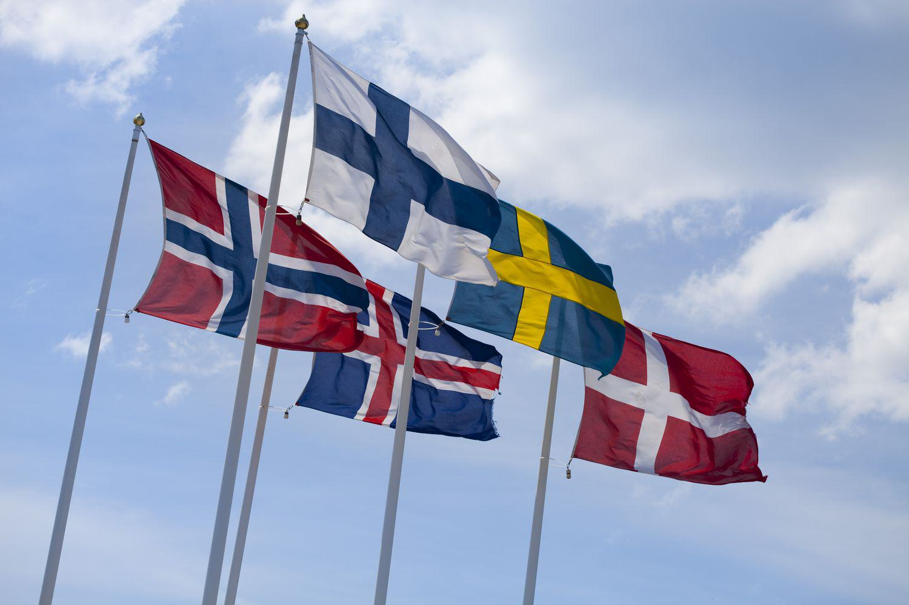

The concept of economic models provides diverse methodologies for the management and functioning of national economies, each with its unique set of principles and implications. Two prominent examples are the Nordic model and the U.S. economic system, which represent contrasting approaches to economic governance. The Nordic model is often characterized by a blend of capitalism with extensive social welfare systems, whereas the U.S. model leans towards a predominantly capitalist framework with a focus on economic freedom and minimal state intervention.

In recent years, advancements in technology have introduced algorithmic trading as a significant player within these economic systems. Algorithmic trading, or algo trading, utilizes complex algorithms and high-speed computations to trade financial instruments, revolutionizing how market transactions occur. This technological evolution offers both opportunities, such as enhanced efficiency and liquidity, and challenges, including increased market volatility.

This article aims to explore the economic comparison between the Nordic model and the U.S. system, investigating their foundational philosophies and operational differences. Furthermore, it will assess the impact of algorithmic trading on these economies, analyzing how this modern technological tool influences economic decisions and outcomes. Understanding these elements provides a comprehensive view of two unique economic models and the transformative role of technology in shaping national economic landscapes.

## Table of Contents

## Understanding the Nordic Model

The Nordic model represents a unique economic and social framework that synthesizes elements of capitalism with a robust social welfare infrastructure. This model is particularly evident in countries like Sweden, Norway, Finland, Denmark, and Iceland, which are often noted for their comprehensive social policies and high standard of living.

A defining feature of the Nordic model is its combination of high taxation with extensive welfare state provisions. High taxes, often exceeding those in many other developed economies, are utilized to fund universal welfare programs. These programs provide a wide array of services, including healthcare, education, and income security, available to all citizens, thereby promoting social equity and reducing poverty levels. The emphasis on high tax rates is supported by a broad tax base, which ensures that the necessary revenues are generated to maintain these welfare systems.

Labor protections are also a critical component of the Nordic model. Collective bargaining is a standard practice, supported by strong trade unions that play a significant role in negotiating wages and working conditions. This system helps maintain a balanced power dynamic between employers and employees, securing fair wages and safe working environments. Additionally, employment regulations promote job security and provide unemployment benefits, which cushion the impact of economic fluctuations on the workforce.

The model places a strong emphasis on equality and social safety nets, focusing on reducing income and wealth disparities. This focus on equality is reflected in public policies designed to promote inclusive economic growth and social cohesion. Moreover, investment in human capital is prioritized. Nordic countries allocate substantial resources to education and skills development, ensuring that individuals have the opportunity to engage productively in the economy.

The nations adopting this model exhibit a commitment to innovation and efficiency, driven by a competitive market environment. Despite the significant role of the state in providing welfare services, the Nordic economies are characterized by vibrant private sectors. This dual approach allows them to enjoy the benefits of a market economy while simultaneously ensuring that the social needs of the population are met.

The Nordic model's emphasis on both economic competition and social welfare has contributed to the high rankings these countries receive in global quality of life and happiness indices. This model's success, however, is partly attributed to the cultural and historical contexts of the Nordic countries, which may not be directly transferable to different geopolitical settings. External references support the effectiveness of the Nordic model in achieving low levels of inequality and high standards of living, alongside economic stability and growth.

## The U.S. Economic Model

The U.S. economy is predominantly characterized by its capitalist framework, which prioritizes market freedom and competition. A foundational aspect of the U.S. economic model is its focus on lower taxation rates compared to those found in the Nordic countries. This approach is intended to stimulate individual entrepreneurship and business expansion by allowing enterprises and individuals to retain a larger portion of their profits. The U.S. tax structure is progressive, meaning that higher-income earners pay a larger percentage of their income in taxes. However, the overall tax burden remains lower than in more welfare-centric economies like those of the Nordic countries.

In addition to its taxation policy, the U.S. economic model places a significant emphasis on economic freedom. This is achieved through measures such as deregulation and privatization. Deregulation involves reducing the number or severity of regulations imposed on businesses, which seeks to remove potential barriers to entry and enable a more dynamic business environment. Privatization, on the other hand, refers to the process of transferring ownership of businesses, property, or services from the public sector (government) to private individuals or organizations. These policies are based on the belief that the private sector is more efficient than the public sector in delivering goods and services due to competition and profit incentives.

While the U.S. supports economic freedom, it also maintains a range of social safety nets designed to offer necessary assistance to its population. Programs such as Medicare, Medicaid, Social Security, and unemployment insurance provide critical support to certain groups within the society. However, when compared to the Nordic model, these safety nets are less extensive and comprehensive. The Nordic countries often provide universal access to services such as healthcare and education, which are partially funded through higher taxation. In contrast, the U.S. places a greater reliance on private sector solutions and means-tested programs, which are targeted at specific needs rather than offering universal coverage.

The economic strategy of the United States reflects a clear prioritization of individualism and choice, aiming to foster innovation and economic growth. Nonetheless, this model also results in significant income disparity and inequality, as the distribution of wealth often skews disproportionately in favor of the affluent. Despite these challenges, the U.S. remains one of the largest and most formidable economies globally, driven by its emphasis on innovation, technological advancement, and a business-friendly environment.

## Nordic vs U.S. Economy: Key Differences

The Nordic and U.S. economic models present stark contrasts, rooted in distinct ideological and institutional frameworks. The Nordic model is marked by higher tax rates, which fund extensive welfare services. This system relies on progressive taxation to provide universal healthcare, education, and social security, contributing to robust social safety nets. In contrast, the U.S. economic model prioritizes individual economic freedom, maintaining relatively lower taxation rates. The emphasis in the U.S. is on minimal government intervention, which aligns with principles of economic liberalism and encourages entrepreneurship and private sector growth.

Income inequality is another critical difference between these models. Nordic countries, through their redistributive policies, achieve lower levels of income inequality. The Gini coefficient, a measure of income inequality, is significantly lower in Nordic nations compared to the U.S., indicating a more equitable income distribution. According to the World Bank, countries like Sweden and Norway routinely report Gini coefficients below 0.30, while the U.S. has reported values closer to 0.41, showcasing the disparity in income equality.

The roles of public and private sectors further distinguish these economic models. In the Nordic economies, the public sector plays a vital role, with government agencies heavily involved in the provision of social services and regulation of industries to ensure fair practices and competition. The comprehensive public sector involvement is often a result of historical trends toward a social-democratic governance structure. Conversely, the U.S. model skews towards a dominant private sector, with limited government intervention. This framework promotes privatization and deregulation, reinforcing the notion of a free market economy.

Despite these differences, both models strive for economic growth and societal well-being, albeit through disparate pathways. Understanding the contrasting features of the Nordic and U.S. economies provides insights into diverse approaches to achieving socio-economic objectives.

## Algorithmic Trading in Modern Economies

Algorithmic trading, often referred to as algo trading, employs computer algorithms to execute orders based on predetermined criteria, effectively reducing manual intervention. By automating the trading process, algo trading enhances the efficiency and [liquidity](/wiki/liquidity-risk-premium) of financial markets. This method relies heavily on advanced algorithms and high-frequency trading ([HFT](/wiki/high-frequency-trading-strategies)) technologies to optimize the buying and selling of securities.

In both the Nordic and U.S. economies, [algorithmic trading](/wiki/algorithmic-trading) has become an integral part of market operations, although its influence varies across these regions. The U.S. markets, known for their size and dynamism, extensively utilize algo trading practices, with a significant proportion of trading [volume](/wiki/volume-trading-strategy) attributed to algorithmic processes. This prevalence is driven by the desire for faster trade execution and reduced transaction costs, allowing market participants to capitalize on minute price fluctuations. The Securities and Exchange Commission (SEC) has noted that algorithmic trading accounts for a substantial portion of all equity trading in the United States.

Nordic markets, while smaller in scale compared to the U.S., have also adopted algorithmic trading, benefiting from increased market liquidity and efficiency. Despite this, the impact of algo trading in Nordic countries may differ due to regulatory and structural variations within these financial systems. Nordic economies prioritize market stability and transparency, which can influence the implementation and regulation of algorithmic trading practices.

Algorithmic trading introduces additional complexity to financial markets, necessitating sophisticated risk management strategies. Algorithms can execute trades at speeds and volumes impractical for human traders, giving rise to concerns about market [volatility](/wiki/volatility-trading-strategies) and systemic risks. The phenomenon of "flash crashes," where rapid and significant price changes occur in short durations, is often cited as a potential downside of algo trading.

Moreover, algorithmic trading influences economic decisions by providing rich data for market analysis, enabling traders to make informed choices based on real-time information. However, it also magnifies the importance of robust technology and cybersecurity measures to protect against algorithmic malfunctions and cyber threats.

As both Nordic and U.S. economies continue to embrace algorithmic trading, they face the ongoing challenge of balancing innovation with the need for regulatory oversight to ensure market integrity and stability.

## Economic Outcomes and Social Implications

Nordic countries are often praised for their high levels of social welfare and exemplary quality of life indicators. These nations have established comprehensive systems that include universal healthcare, extensive educational opportunities, and robust social safety nets. This approach results in a populace that exhibits high levels of societal contentment and equity. The emphasis on social welfare can be attributed to redistributive tax policies aimed at reducing income inequality. Reports such as the World Happiness Report have consistently placed Nordic countries at the top, emphasizing indicators like high trust in institutions, social support, and life expectancy.

In contrast, the United States is recognized for its substantial GDP and a dynamic landscape for innovation. The nation fosters an environment conducive to entrepreneurship and technological advancements, contributing to its status as a global leader in economic productivity. However, these advantages come with challenges, notably income inequality and varying access to social services. The Gini coefficient, a measure of income inequality, is significantly higher in the United States compared to Nordic countries. This indicates a wider income distribution gap, which has social and economic implications.

Algorithmic trading, or algo trading, has become a substantial aspect of modern financial markets, bringing both opportunities and challenges. By deploying complex algorithms and high-speed data processing, algo trading enhances market efficiency and liquidity. This technology helps in narrowing bid-ask spreads and processing large volumes of orders quickly. However, it also introduces the risk of increased market volatility. Events such as the 2010 Flash Crash have demonstrated how algorithmic trading can precipitate rapid market movements, potentially destabilizing financial systems.

Both economic models face sustainability challenges rooted in demographic shifts and technological changes. Nordic countries must address issues related to aging populations and the financial sustainability of their welfare systems. The pressure of maintaining generous social benefits with a shrinking working-age population necessitates policy innovation and reform. Similarly, the United States must contend with technological disruption in labor markets and economic disparity. Automated and algorithm-driven processes are reshaping traditional employment landscapes, necessitating strategies to mitigate adverse social and economic impacts.

Overall, while both models strive for economic stability and growth, they must balance innovation and equity with emerging global challenges to ensure long-term sustainability and societal well-being.

## Conclusion

The Nordic model and the U.S. economic system exemplify two distinct approaches to managing national economies, each underpinned by cultural and historical factors that shape their unique characteristics. The Nordic model, with its emphasis on social welfare and equality, offers robust social safety nets and investments in human capital. In contrast, the U.S. system prioritizes economic freedom, deregulation, and a lower tax regime, fostering a landscape ripe for innovation and high GDP growth.

Despite their differences, both models encounter opportunities and challenges in the modern era, particularly with the advent of algorithmic trading. Algorithmic trading, which employs computer algorithms for trading financial assets, is revolutionizing capital markets. It enhances market liquidity and efficiency but also introduces risks such as increased market volatility. In both Nordic and U.S. markets, algorithmic trading serves as a double-edged sword, offering potential for wealth creation yet demanding careful regulation to mitigate systemic risks.

Ultimately, understanding these economic models and their interaction with technological advancements like algorithmic trading is crucial for navigating the global economic landscape. By examining the strengths and weaknesses of the Nordic and U.S. systems, policymakers and economic stakeholders can glean valuable insights into crafting strategies that balance economic growth with social welfare, ensuring a sustainable future in an increasingly interconnected world.

## References & Further Reading

[1]: Andersen, T. B., & Holmström, B. (2013). ["The Nordic Model: Embracing Globalization and Sharing Risks."](https://www.etla.fi/en/publications/b232-en/) The Review of Economics and Statistics.

[2]: Esping-Andersen, G. (1990). ["The Three Worlds of Welfare Capitalism"](https://www.researchgate.net/publication/243774920_The_Three_Worlds_Of_Welfare_Capitalism). Princeton University Press.

[3]: Freixas, X., & Rochet, J.-C. (2008). ["Microeconomics of Banking."](https://mitpress.mit.edu/9780262062701/microeconomics-of-banking/) MIT Press.

[4]: Johansen, H., & Neumann, J. (2020). ["Algorithmic Trading and Market Quality in Small Markets: Evidence from the Trading in Shares of the Biggest Nordic Firms"](https://www.nature.com/articles/s41579-020-0331-1) in Journal of Financial Markets.

[5]: Krugman, P. (2009). ["The Return of Depression Economics and the Crisis of 2008"](https://books.google.com/books/about/The_Return_of_Depression_Economics_and_t.html?id=0B_8f3BBwdwC). W. W. Norton & Company.

[6]: Lareau, M. R. (2010). ["Basics of Algorithmic Trading: Concepts and Examples"](https://web.sas.upenn.edu/annettelareau/unequal-childhoods/). Wiley Trading.

[7]: Piketty, T. (2014). ["Capital in the Twenty-First Century"](https://www.jstor.org/stable/j.ctt6wpqbc). Harvard University Press.

[8]: Sachs, J. D. (2011). ["The Price of Civilization: Reawakening American Virtue and Prosperity"](https://books.google.com/books/about/The_Price_of_Civilization.html?id=iQwOEDPNgrIC). Random House.