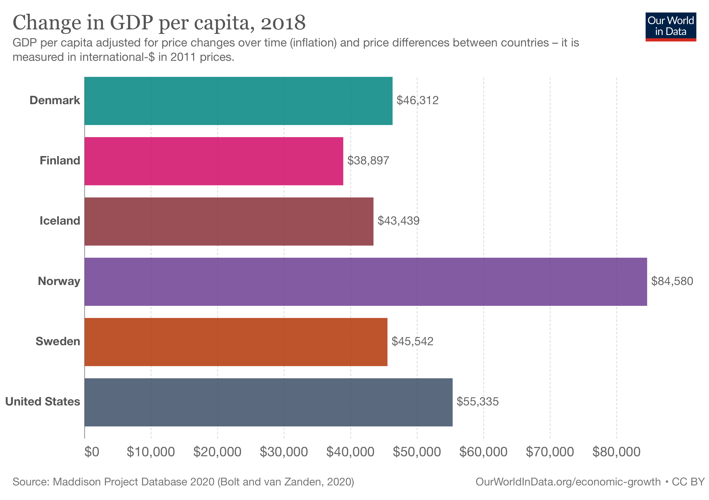

## Table of Contents

## What are the main Nordic countries included in this comparison?

The main Nordic countries included in this comparison are Sweden, Norway, Denmark, Finland, and Iceland. These countries are located in Northern Europe and are known for their high quality of life, strong economies, and beautiful landscapes.

Sweden and Norway share a long border and have many similarities, but they also have their own unique cultures and histories. Denmark, located to the south of Sweden, is known for its capital city, Copenhagen, and its famous pastries. Finland, which borders Sweden, Norway, and Russia, is known for its beautiful lakes and forests. Iceland, the most western of the Nordic countries, is famous for its volcanoes, geysers, and the Northern Lights.

## What are the key features of the United States economic system?

The United States has a big and strong economy. It is a capitalist system, which means businesses and people can own things and make money. The government does not control everything, but it helps by making rules to keep things fair. People can start their own businesses and try to make them successful. This freedom to start and grow businesses is a big part of the U.S. economy.

Another important part is the stock market, where people can buy and sell parts of companies. This helps companies get money to grow and helps people make more money if the companies do well. The U.S. also trades a lot with other countries, buying and selling things like cars, electronics, and food. This trade helps the economy grow. Overall, the U.S. economy is about freedom, competition, and trading with others.

## How do the GDP growth rates of Nordic countries compare to the United States?

The GDP growth rates of Nordic countries like Sweden, Norway, Denmark, Finland, and Iceland can be different from the United States. In recent years, the U.S. has often had higher GDP growth rates than many Nordic countries. For example, the U.S. economy might grow by around 2-3% each year, while some Nordic countries might grow by 1-2%. This difference can be because the U.S. has a much bigger economy and more people, which can lead to more business and more growth.

However, Nordic countries focus on stability and quality of life, so their growth rates might be slower but more steady. They have strong social systems and good education, which help keep their economies stable even if they don't grow as fast as the U.S. Sometimes, a Nordic country might have a year with higher growth, but overall, their growth is usually more consistent and less up and down than the U.S. This balance helps them maintain a high standard of living for their people.

## What are the differences in taxation systems between Nordic countries and the United States?

In Nordic countries like Sweden, Norway, Denmark, Finland, and Iceland, people and businesses pay higher taxes than in the United States. These high taxes help pay for things like free healthcare, education, and good social services. For example, in Sweden, the top income tax rate can be over 50%, and there are also high taxes on things like cars and alcohol. This means that people in Nordic countries might take home less money from their jobs, but they get a lot of help from the government in return.

In the United States, taxes are generally lower. The top income tax rate is around 37%, and there are fewer taxes on things like sales and property. This means that people in the U.S. might keep more of their earnings, but they have to pay for things like healthcare and education out of their own pockets. The U.S. government does provide some help, but it's not as much as in Nordic countries. This difference in tax systems reflects different ideas about how much the government should help its citizens and how much people should be responsible for themselves.

## How do welfare systems in Nordic countries differ from those in the United States?

In Nordic countries like Sweden, Norway, Denmark, Finland, and Iceland, the welfare system is very strong. People get a lot of help from the government. This includes free healthcare, free education, and good support if they lose their job or can't work. The idea is that everyone should have a good life, no matter how much money they have. So, people pay high taxes, but they get a lot in return. This system helps make sure that everyone has what they need to live well.

In the United States, the welfare system is different. People don't pay as much in taxes, but they also don't get as much help from the government. Healthcare and education cost money, and if someone loses their job, they might not get as much support. The U.S. government does have programs to help people, but they are not as big or as complete as in Nordic countries. This means that people in the U.S. have to take more care of themselves and their families, but they also get to keep more of their own money.

## What role does government intervention play in the economies of Nordic countries versus the United States?

In Nordic countries like Sweden, Norway, Denmark, Finland, and Iceland, the government plays a big role in the economy. They use high taxes to pay for things like free healthcare, free education, and good support for people who lose their jobs or can't work. This helps make sure that everyone has what they need to live well. The government also makes rules to keep businesses fair and to protect the environment. This kind of system is called a social welfare state, where the government helps a lot to make life better for everyone.

In the United States, the government plays a smaller role in the economy. Taxes are lower, and people have to pay for things like healthcare and education themselves. The government does have some programs to help people, but they are not as big or as complete as in Nordic countries. The U.S. focuses more on letting businesses and people make their own choices and take care of themselves. This system is called capitalism, where the government makes fewer rules and lets the economy grow on its own.

## How do employment rates and labor market policies compare between Nordic countries and the United States?

In Nordic countries like Sweden, Norway, Denmark, Finland, and Iceland, employment rates are generally high, often above 70%. These countries have strong labor market policies that help people find and keep jobs. They offer good support for people who lose their jobs, like unemployment benefits and job training programs. This means that even if someone loses their job, they can get help to find a new one quickly. The government also makes rules to make sure workers are treated fairly, like having good wages and safe working conditions. This helps keep the employment rate high and makes sure that people can have a good life.

In the United States, the employment rate can also be high, but it can change more often than in Nordic countries. The U.S. has fewer government programs to help people who lose their jobs. Unemployment benefits are available, but they might not last as long as in Nordic countries, and there are fewer job training programs. The U.S. focuses more on letting businesses and people make their own choices about work. This can lead to more jobs being created, but it can also mean that people have to take more care of themselves if they lose their job. Overall, the U.S. labor market can be more up and down, but it also gives people more freedom to choose their own path.

## What are the differences in income inequality between Nordic countries and the United States?

In Nordic countries like Sweden, Norway, Denmark, Finland, and Iceland, income inequality is lower than in the United States. This means that the difference between what rich people and poor people earn is smaller. The government in these countries helps to make things more equal by having high taxes and good social programs. These programs, like free healthcare and education, help everyone have a good life, no matter how much money they make. This way, even people with less money can live well and have the same chances as others.

In the United States, income inequality is higher. This means that the difference between what rich people and poor people earn is bigger. The U.S. has lower taxes and fewer social programs than Nordic countries. This means that people with more money can keep more of it, while people with less money might struggle more. The U.S. focuses more on letting people and businesses make their own choices, which can lead to big differences in how much people earn. This can make life harder for people who don't have a lot of money.

## How do innovation and technological advancement compare in Nordic countries and the United States?

In Nordic countries like Sweden, Norway, Denmark, Finland, and Iceland, innovation and technological advancement are strong. These countries have good education systems that help people learn and come up with new ideas. They also have a lot of support for new businesses and technology. For example, Finland is known for its work in mobile technology, and Sweden has many successful tech companies. The government helps by giving money and support to new ideas and businesses. This makes it easier for people to try new things and create new technology.

In the United States, innovation and technological advancement are also very strong, but in a different way. The U.S. has a big economy and a lot of big companies that spend a lot of money on research and new technology. Places like Silicon Valley are famous for new tech ideas and companies. The U.S. government helps too, but it's more about letting businesses and people do their own thing. This can lead to a lot of new ideas and technology, but it can also mean that only big companies with a lot of money can do the biggest projects.

## What are the impacts of trade policies on the economies of Nordic countries compared to the United States?

In Nordic countries like Sweden, Norway, Denmark, Finland, and Iceland, trade policies help their economies grow in a steady way. They are part of the European Union, which means they can trade easily with other European countries. This helps them sell things like fish, wood, and technology to other places. They also have rules to make sure that trade is fair and good for everyone. This means that even small businesses can sell their things in other countries. Overall, these trade policies help keep the economy strong and make sure that everyone can benefit from trading with other countries.

In the United States, trade policies can have a big impact on the economy, but in a different way. The U.S. has a lot of big companies that sell things all over the world, like cars, electronics, and food. The government makes rules about trade to help these companies grow and make money. Sometimes, these rules can make it harder for other countries to sell things in the U.S., which can lead to disagreements. But these trade policies also help the U.S. economy grow a lot, because they help businesses make more money and create more jobs. Overall, the U.S. focuses on making sure its big businesses can do well in the world market.

## How do the educational systems and their economic impacts differ between Nordic countries and the United States?

In Nordic countries like Sweden, Norway, Denmark, Finland, and Iceland, education is free for everyone, from preschool to university. The government pays for it, so people don't have to worry about money when they want to learn. This helps a lot of people go to school and get good jobs later. Because education is good and free, more people can learn new things and come up with new ideas. This makes the economy stronger because people are smart and can do good work. The government also helps by making sure schools have what they need, so everyone can learn well.

In the United States, education is not free in the same way. People have to pay for college, and it can be very expensive. This means that not everyone can go to college if they want to. The U.S. has good schools and universities, but the cost can make it hard for some people to get a good education. This can affect the economy because not everyone can learn as much as they want. But the U.S. also has a lot of money for research and new ideas, which helps the economy grow. So, while education can be a challenge for some, the U.S. still does well in creating new technology and jobs.

## What are the long-term sustainability prospects of the economic models in Nordic countries versus the United States?

In Nordic countries like Sweden, Norway, Denmark, Finland, and Iceland, the economic model focuses on long-term sustainability. They have high taxes that pay for things like free healthcare and education, which helps everyone live well. This system makes sure that people can take care of themselves and the environment. The government also makes rules to protect nature and help businesses be green. This means that the economy can grow without hurting the planet. Over time, this helps keep the economy strong and stable, even if it doesn't grow as fast as some other places.

In the United States, the economic model is different. It focuses more on letting businesses and people make their own choices. This can lead to fast growth and a lot of new ideas, but it can also be harder on the environment. The U.S. has big companies that can make a lot of money, but they might not always think about how their actions affect the planet. Over time, this can make it harder to keep the economy sustainable. The government does make some rules to help, but it's not as much as in Nordic countries. So, while the U.S. economy can grow quickly, it might face more challenges in the long run when it comes to sustainability.

## References & Further Reading

[1]: Andersen, T. B., & Holmström, B. (2013). ["The Nordic Model: Embracing Globalization and Sharing Risks."](https://www.etla.fi/en/publications/b232-en/) The Review of Economics and Statistics.

[2]: Esping-Andersen, G. (1990). ["The Three Worlds of Welfare Capitalism"](https://www.researchgate.net/publication/243774920_The_Three_Worlds_Of_Welfare_Capitalism). Princeton University Press.

[3]: Freixas, X., & Rochet, J.-C. (2008). ["Microeconomics of Banking."](https://mitpress.mit.edu/9780262062701/microeconomics-of-banking/) MIT Press.

[4]: Johansen, H., & Neumann, J. (2020). ["Algorithmic Trading and Market Quality in Small Markets: Evidence from the Trading in Shares of the Biggest Nordic Firms"](https://www.nature.com/articles/s41579-020-0331-1) in Journal of Financial Markets.

[5]: Krugman, P. (2009). ["The Return of Depression Economics and the Crisis of 2008"](https://books.google.com/books/about/The_Return_of_Depression_Economics_and_t.html?id=0B_8f3BBwdwC). W. W. Norton & Company.

[6]: Lareau, M. R. (2010). ["Basics of Algorithmic Trading: Concepts and Examples"](https://web.sas.upenn.edu/annettelareau/unequal-childhoods/). Wiley Trading.

[7]: Piketty, T. (2014). ["Capital in the Twenty-First Century"](https://www.jstor.org/stable/j.ctt6wpqbc). Harvard University Press.

[8]: Sachs, J. D. (2011). ["The Price of Civilization: Reawakening American Virtue and Prosperity"](https://books.google.com/books/about/The_Price_of_Civilization.html?id=iQwOEDPNgrIC). Random House.