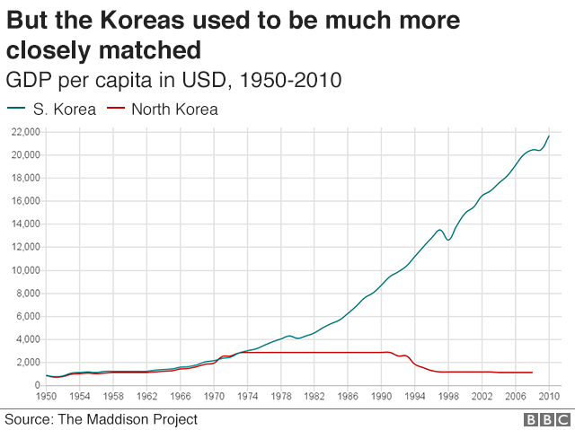

## Table of Contents

## What are the basic economic systems of North Korea and South Korea?

North Korea has a command economy. This means the government controls everything about the economy. They decide what to produce, how much to produce, and who gets the products. The government owns most businesses and farms. People don't have much freedom to start their own businesses. The goal is to follow the ideas of their leaders and keep everyone equal, but it often leads to shortages and poverty.

South Korea has a market economy. In a market economy, people and businesses can make their own economic decisions. They can start businesses, choose what to produce, and decide what to buy. The government has some rules, but it doesn't control everything. This system encourages competition and innovation. South Korea's economy has grown a lot because of this, and many people have become wealthy, though there are still some poor people.

## How do the GDPs of North Korea and South Korea compare?

South Korea's GDP is much larger than North Korea's. In 2022, South Korea's GDP was around $1.8 trillion, while North Korea's was estimated to be about $28 billion. This huge difference shows how much more South Korea's economy has grown compared to North Korea's. South Korea's market economy has helped it become one of the world's leading economies, with strong industries like electronics, cars, and ships. On the other hand, North Korea's command economy has struggled to produce enough goods and services, leading to a much smaller GDP.

The difference in GDP per person is even more striking. In South Korea, the GDP per capita is around $35,000, meaning each person, on average, has access to that much economic output. In North Korea, the GDP per capita is estimated to be less than $1,000. This means that the average person in South Korea has a much higher standard of living than the average person in North Korea. The large gap in GDP per capita reflects the different economic systems and their impact on the well-being of the people in each country.

## What are the main industries in North Korea and South Korea?

In North Korea, the main industries are mining, manufacturing, and agriculture. They mine a lot of coal, iron ore, and other minerals. Manufacturing includes things like military equipment, textiles, and some basic goods. Agriculture is important too, but it struggles because of bad farming methods and not enough modern equipment. The government controls all these industries, so they don't produce as much as they could.

In South Korea, the main industries are electronics, automobiles, and shipbuilding. They make a lot of smartphones, TVs, and computer chips. Companies like Samsung and LG are famous around the world. South Korea also builds many cars and ships, which they sell to other countries. Agriculture is less important than industry, but they grow rice, vegetables, and fruits. The market economy in South Korea helps these industries grow and innovate, making the country very wealthy.

## How does the standard of living differ between North Korea and South Korea?

The standard of living in South Korea is much higher than in North Korea. In South Korea, people have access to good healthcare, education, and modern technology. Many people live in nice homes with electricity and running water. They can buy a variety of food and goods in stores. The economy is strong, so many people have jobs and can afford to enjoy life. South Korea is known for its high-tech cities and good quality of life.

In North Korea, the standard of living is very low. Many people struggle to get enough food and basic needs. Healthcare and education are not as good as in South Korea. Homes are often old and in bad shape. The government controls everything, so people don't have many choices about what they can buy or do. Life is hard for most people in North Korea, and they don't have the same comforts and opportunities as people in South Korea.

## What is the role of government in the economies of North Korea and South Korea?

In North Korea, the government has total control over the economy. It decides what to make, how much to make, and who gets what. The government owns all the businesses and farms. People can't start their own businesses easily. The government wants everyone to be equal, but this often leads to not enough food and goods. Life is hard for most people because the government's control makes the economy struggle.

In South Korea, the government plays a smaller role in the economy. It sets some rules and helps the economy grow, but people and businesses can make their own choices. They can start businesses, decide what to make, and buy what they want. This freedom helps the economy grow and innovate. The government helps with things like education and healthcare, but it doesn't control everything like in North Korea. This makes life better for most people in South Korea.

## How do North Korea and South Korea differ in terms of international trade?

North Korea does not trade much with other countries. The government controls all trade and they mostly trade with China and Russia. They export things like coal, minerals, and some textiles, but not a lot because of international sanctions. These sanctions are rules that other countries put on North Korea because of their nuclear weapons. So, North Korea's trade is very limited and they struggle to get the things they need from other countries.

South Korea, on the other hand, trades a lot with other countries. They are one of the biggest trading nations in the world. They export electronics, cars, and ships to many countries. They also import a lot of things they need, like oil and raw materials. South Korea has good trade relationships with many countries, which helps their economy grow. Their market economy makes it easy for them to trade and do business with the rest of the world.

## What are the key economic challenges faced by North Korea and South Korea?

North Korea faces big economic challenges. The government's tight control over everything makes it hard for the economy to grow. They struggle to produce enough food and goods for their people. International sanctions because of their nuclear program make it even harder to trade with other countries. This means they can't get the things they need easily. The economy is very weak, and most people live in poverty.

South Korea also has some economic challenges, but they are different. One big challenge is the high cost of living, especially in cities like Seoul. This makes it hard for some people to afford a good life. Another challenge is the aging population. As more people get older, there are fewer young people to work and support the economy. South Korea also depends a lot on trade, so if there are problems with other countries, it can hurt their economy. But overall, South Korea's economy is strong and growing.

## How have historical events influenced the economic development of North Korea and South Korea?

The Korean War in the 1950s had a big impact on both North Korea and South Korea. North Korea was supported by the Soviet Union and China, which helped them set up a command economy. This system made the government control everything, which slowed down their growth. After the war, North Korea focused on military and nuclear programs instead of the economy, making life hard for people. International sanctions because of their nuclear weapons made it even harder for them to trade and grow.

South Korea, on the other hand, got help from the United States and other countries after the war. They set up a market economy, which let people and businesses make their own choices. This helped South Korea grow very fast. They started making electronics, cars, and ships, and became rich. But they had some tough times too, like the Asian Financial Crisis in the 1990s, which hurt their economy for a while. Still, they bounced back and kept growing because of their strong businesses and trade.

## What are the impacts of economic sanctions on North Korea's economy?

Economic sanctions have made life very hard for North Korea. These sanctions are rules that other countries put on North Korea because they don't like their nuclear weapons. The sanctions stop North Korea from trading with many countries. They can't sell their coal, minerals, and other things easily. They also can't buy the things they need, like oil and food. This makes their economy weak and it's hard for them to grow.

Because of the sanctions, North Korea struggles to get money and resources. Their factories and farms don't work as well because they can't get new machines or parts. This means they can't make enough food and goods for their people. Many people are poor and hungry. The government tries to control everything, but the sanctions make it even harder for them to help their people. So, the sanctions have a big impact on making life tough in North Korea.

## How do North Korea and South Korea approach technological advancement and innovation?

North Korea doesn't focus much on technological advancement and innovation. The government controls everything and spends a lot of money on military and nuclear programs instead of technology. They don't have many modern gadgets or new inventions. People in North Korea use old technology and don't have much chance to come up with new ideas. The government doesn't let them work with other countries on technology, and the sanctions make it hard to get new tech from outside. So, North Korea stays behind in technology and innovation.

South Korea, on the other hand, is very good at technological advancement and innovation. They have a market economy, which lets people and businesses try new things and come up with new ideas. Companies like Samsung and LG make a lot of new technology, like smartphones and TVs. South Korea works with other countries on technology and learns from them. They spend a lot of money on research and development, which helps them stay ahead in technology. This makes life better for people in South Korea because they have access to the latest gadgets and inventions.

## What are the long-term economic forecasts for North Korea and South Korea?

The long-term economic forecast for North Korea looks tough. Their command economy and focus on military and nuclear programs instead of technology and innovation make it hard for them to grow. International sanctions keep them from trading and getting the things they need. If things stay the same, North Korea will stay poor and struggle to give their people a good life. But if they make friends with other countries and change their economy, they might do better. It's a big challenge, but it's possible if they try something new.

South Korea's long-term economic forecast is much brighter. Their market economy and focus on technology and innovation help them grow fast. They trade a lot with other countries and have strong businesses like Samsung and LG. But they have some challenges too, like the high cost of living and an aging population. If they can solve these problems, South Korea will keep being rich and successful. They need to keep working hard and coming up with new ideas to stay ahead.

## How do economic policies in North Korea and South Korea affect income inequality?

In North Korea, the government's economic policies try to make everyone equal. They control everything about the economy, so they decide who gets what. The idea is that everyone should have the same, but it doesn't work well. Some people, like those in the government or military, get more than others. Most people are very poor and struggle to get enough food and basic things. So, even though the government wants to reduce income inequality, their policies make it hard for people to get ahead and end up keeping many people poor.

In South Korea, the market economy lets people and businesses make their own money. This helps the economy grow a lot, and many people become rich. But it also means some people have a lot more money than others. There are rich people who own big companies and poor people who work hard but don't make much. The government tries to help by giving money to poor people and making sure everyone can go to school and see a doctor. But income inequality is still a big problem in South Korea. The gap between rich and poor is big, even though the country is doing well overall.

## References & Further Reading

[1]: [International Monetary Fund (IMF) World Economic Outlook Database](https://www.imf.org/en/Publications/SPROLLS/world-economic-outlook-databases)

[2]: [Korean Statistical Information Service (KOSIS)](https://kosis.kr/eng/)

[3]: ["Advances in Financial Machine Learning"](https://www.amazon.com/Advances-Financial-Machine-Learning-Marcos/dp/1119482089) by Marcos Lopez de Prado

[4]: ["Capitalist in North Korea: My Seven Years in the Hermit Kingdom"](https://books.google.com/books/about/Capitalist_in_North_Korea.html?id=MJkdBAAAQBAJ) by Felix Abt

[5]: ["Korea's Development Under Park Chung Hee"](https://www.taylorfrancis.com/books/mono/10.4324/9780203356425/korea-development-park-chung-hee-hyung-kim) by Huck-ju Kwon

[6]: [World Bank North Korea Overview](https://www.worldbank.org/en/country/korea/overview) 

[7]: ["The Two Koreas: A Contemporary History"](https://www.amazon.com/Two-Koreas-Contemporary-History/dp/0465031234) by Don Oberdorfer and Robert Carlin