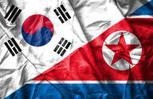

Following the Korean War, a significant economic divide developed between South Korea and North Korea. Both nations were left devastated by the conflict, but each chose a different path forward, resulting in divergent economic outcomes. South Korea embraced rapid industrialization and open-market policies, transforming itself into a technological and economic powerhouse. As of recent data, South Korea ranks as the 12th largest economy in the world, distinguished by its advanced technology sector and global influence in automobile manufacturing, electronics, and shipbuilding.

Conversely, North Korea remains one of the world's most isolated economies, with a rigidly controlled system heavily focused on military expenditure. The nation grapples with severe economic challenges, including international sanctions that affect its trade and development. Despite glimpses of market-based reforms, North Korea continues to face immense obstacles, and reliable economic data is scarce.

This article examines the economic differences between these two nations, providing insights into their contrasting trajectories. Additionally, it explores the role of algorithmic trading in economic analysis today—a tool significantly deployed by South Korea to enhance market efficiency, yet largely inaccessible to North Korea due to stringent digital and trade restrictions. Algorithmic trading has reshaped how analysts monitor economies, offering a modern lens through which the South and North Korean economic landscapes can be compared.

## Table of Contents

## Economic Overview of South Korea

South Korea has emerged as a quintessential model of rapid economic development and successful industrialization. Its transformation over the past few decades from a war-torn nation to a leading global economic powerhouse is often termed the 'Miracle on the Han River.' Central to this transformation has been South Korea's focus on export-led growth, with technology and automobile manufacturing serving as major pillars of its economy.

The country's Gross Domestic Product (GDP) is significantly driven by exports. Notable South Korean conglomerates, such as Samsung, Hyundai, and LG, have been pivotal in establishing the nation as a leader in electronics and automobile production. This export-driven model has enabled South Korea to secure its position as the world's 12th largest economy by nominal GDP, as of recent data from the International Monetary Fund (IMF).

However, South Korea's rapid ascent has not been without challenges. The nation faces a deceleration in growth due, in part, to demographic shifts that impact various segments of its society, particularly the youth and elderly. A declining birth rate, coupled with an ageing population, presents pressing social and economic challenges. These demographic changes strain the social welfare system and pose risks to the long-term sustainability of economic growth. According to [statistics](/wiki/bayesian-statistics) from the Korean Statistical Information Service (KOSIS), the youth unemployment rate has been higher than the national average, underscoring the need for policies that support job creation and innovation.

Technological advancement and a highly educated workforce have been instrumental in South Korea's continued economic success. The government has actively invested in research and development, supporting initiatives that promote digital innovation and smart technologies. This strategic focus aims to maintain South Korea's competitive edge in the global marketplace, despite the current slowdown in economic expansion.

In summary, South Korea's journey of economic development is a testimony to its strategic focus on industrialization and exports. While confronting demographic challenges, the nation continues to seek sustainable growth pathways to ensure future prosperity.

## Economic Overview of North Korea

North Korea's economy is characterized by its isolation and central control, with a significant portion of its resources devoted to military expenditure. The Democratic People's Republic of Korea (DPRK) has long maintained a "military first" policy, which prioritizes defense spending over other economic needs. This allocation, combined with the lack of access to global markets and external financial systems, significantly constrains economic growth.

International sanctions, primarily imposed due to North Korea’s nuclear program, further impede economic development. These sanctions restrict international trade, financial transactions, and foreign investments, exacerbating the country's economic isolation. Despite these adversities, there have been nascent signs of market-based reforms within North Korea. Small-scale markets, known locally as 'jangmadang,' have emerged, representing a shift from the strictly controlled distribution system to a limited engagement with informal market activities.

China remains North Korea's principal economic partner, providing essential commodities and acting as the gateway for limited international engagement. Chinese support is critical, given the DPRK’s restricted trade relations due to sanctions. However, this dependence also subjects North Korea's economy to vulnerabilities linked to Chinese economic policies and geopolitical strategies.

Reliability of economic data poses a significant challenge for analysts attempting to assess North Korea's economic conditions. The DPRK does not publish comprehensive data, and whatever figures are released are often subject to scrutiny regarding their accuracy and completeness. Consequently, many assessments rely on satellite imagery, defector testimonies, and reports from non-governmental organizations to estimate economic activity, though these methods have inherent limitations.

In conclusion, while there are inklings of economic reform through emergent market activities, the impact of international sanctions, persistent focus on military capabilities, and dependence on China continue to define North Korea's economic narrative. These factors, coupled with unreliable data, complicate a clear analysis of the DPRK’s economic trajectory.

## Comparative Economic Indicators

When comparing the economic indicators of South Korea and North Korea, the stark contrast in their economic trajectories becomes evident. South Korea's economy, characterized by robust growth and global integration, stands in sharp contrast to North Korea's stagnated and isolated economic structure.

South Korea's Gross Domestic Product (GDP) substantially outpaces that of North Korea. According to World Bank data, South Korea's GDP was approximately USD 1.8 trillion in 2021, making it the 12th largest economy in the world. In contrast, estimates suggest North Korea's GDP is only USD 30 billion, highlighting a massive economic disparity between the two nations. This difference in economic output can be attributed to South Korea's successful industrialization, diversification of industries, and effective integration into global markets.

Export levels further illuminate the economic gulf between the two Koreas. South Korea is a powerhouse in global trade, driven largely by its technology and automotive industries. As of 2021, South Korea's exports totaled over USD 644 billion, with significant contributions from companies like Samsung, Hyundai, and LG. These industries not only enhance South Korea's global economic presence but also contribute significantly to the national GDP. Furthermore, South Korea's participation in international trade agreements has enabled access to broader markets, fostering sustained economic growth.

In stark contrast, North Korea's export levels are severely restricted due to international sanctions aimed at curtailing the regime’s missile and nuclear programs. With its economy heavily reliant on China, North Korea's exports mainly consist of minerals, textiles, and agricultural products, amounting to less than USD 200 million in 2021. The impact of sanctions, coupled with limited trade partners, impedes North Korea's ability to develop its industrial base or generate significant economic growth.

Industrial output also highlights the divergence in economic capabilities of the two countries. South Korea's industrial sector is highly advanced, encompassing manufacturing, electronics, and shipbuilding, among others. The country's focus on research, development, and technological advancement ensures a consistent influx of innovation, contributing to high industrial output.

Conversely, North Korea's industrial output is constrained by obsolete technology, lack of investment, and resource misallocation focused on the military. Although the country has shown sporadic efforts toward market-based reforms and economic modernization, the overall impact remains minimal due to stringent international restrictions and internal policy limitations.

The limitations imposed by economic sanctions continue to hinder North Korea’s opportunities for growth, whereas South Korea’s expanding global trade network underscores its economic dynamism. These comparative economic indicators not only reflect the current state of the two economies but also underscore the consequences of their differing political and economic strategies over the years.

## The Role of Algorithmic Trading

Algorithmic trading has become an integral component of modern financial markets, fundamentally altering the landscape through enhanced speed, precision, and efficiency in executing trades. It involves using computer algorithms to automatically make trading decisions, submit orders, and manage those orders after submission. The primary advantages include reduced transaction costs, the ability to process vast volumes of data, and executing complex strategies unavailable to human traders.

In South Korea, a nation positioned at the forefront of technology and innovation, [algorithmic trading](/wiki/algorithmic-trading) is embraced in its financial markets. The country's advanced infrastructure and high-speed internet access, coupled with a robust regulatory framework, create a conducive environment for algo trading. South Korea's equity and derivatives markets benefit from this technology through improved market [liquidity](/wiki/liquidity-risk-premium) and stability. This adoption contributes to the country's economic output by allowing for more efficient capital allocation and risk management.

South Korean financial institutions and independent traders utilize algorithmic systems to automate trading, capitalize on [arbitrage](/wiki/arbitrage) opportunities, and implement market-making strategies. For instance, [machine learning](/wiki/machine-learning) algorithms analyze historical data to predict future price movements, optimizing trade timing and execution. The application of high-frequency trading, which relies heavily on algorithmic strategies, is evident in South Korea's competitive financial market landscape.

In contrast, North Korea remains hindered by its isolated position in the global economy, with severely restricted internet access and limited technical infrastructure. These constraints impede the development and implementation of algorithmic trading in the country. The economic policies in North Korea, focused primarily on centralization and control, restrict financial market participation and innovation. As a result, North Korean markets, if operational, likely rely on manual processes, missing the efficiency and opportunities made possible through technology.

Consequently, while South Korea capitalizes on the advancements afforded by algorithmic trading to drive economic growth and integration into global markets, North Korea lags significantly, constrained not only by technology but also by broader economic and political issues. The disparity in the use of algorithmic trading technologies underscores the broader economic divide between the two Koreas.

## Conclusion

The economic divide between South Korea and North Korea is a striking example of how governance and policy choices can lead to vastly different outcomes for neighboring nations. South Korea, with its market-driven economy, has successfully integrated into the global economic system, leveraging industries such as technology and automotive manufacturing to achieve significant economic growth. It continues to capitalize on advanced technologies like algorithmic trading to enhance market efficiency and optimize economic performance. This, combined with a focus on exports, has positioned the country as a significant player on the global stage, ranked as the 12th largest global economy.

In contrast, North Korea remains largely cut off from the international economic community due to its centralized planning model and focus on military expenditure. The country's potential wealth is largely untapped, constrained by rigid control and international sanctions. Although there are signs of market-based reforms, progress remains slow, and accurate economic analysis is hindered by unreliable data. The use of algorithmic trading and other financial technologies is currently beyond reach for North Korea because of restricted internet access and a lack of infrastructure.

The evolution of financial technologies presents a window of opportunity that South Korea is well-positioned to exploit, driving further economic innovation and competitiveness. However, for North Korea to unlock its economic potential, fundamental changes in governance and policy are required, coupled with the lifting of sanctions to allow integration into the global economy. The path toward economic parity between the two Koreas remains challenging but not insurmountable, contingent upon shifts in policy and international relations.

## References & Further Reading

[1]: [International Monetary Fund (IMF) World Economic Outlook Database](https://www.imf.org/en/Publications/SPROLLS/world-economic-outlook-databases)

[2]: [Korean Statistical Information Service (KOSIS)](https://kosis.kr/eng/)

[3]: ["Advances in Financial Machine Learning"](https://www.amazon.com/Advances-Financial-Machine-Learning-Marcos/dp/1119482089) by Marcos Lopez de Prado

[4]: ["Capitalist in North Korea: My Seven Years in the Hermit Kingdom"](https://books.google.com/books/about/Capitalist_in_North_Korea.html?id=MJkdBAAAQBAJ) by Felix Abt

[5]: ["Korea's Development Under Park Chung Hee"](https://www.taylorfrancis.com/books/mono/10.4324/9780203356425/korea-development-park-chung-hee-hyung-kim) by Huck-ju Kwon

[6]: [World Bank North Korea Overview](https://www.worldbank.org/en/country/korea/overview) 

[7]: ["The Two Koreas: A Contemporary History"](https://www.amazon.com/Two-Koreas-Contemporary-History/dp/0465031234) by Don Oberdorfer and Robert Carlin