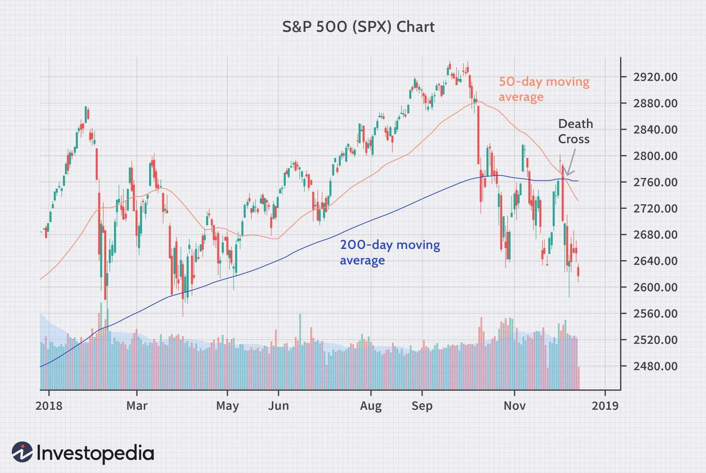

## Table of Contents

## What is a Simple Moving Average (SMA)?

A Simple Moving Average (SMA) is a way to smooth out price data by creating a constantly updated average price. It is calculated by adding up the closing prices of a stock or other financial instrument over a certain number of time periods, then dividing that total by the number of periods. For example, a 10-day SMA would add up the closing prices for the last 10 days and divide by 10.

This tool is used by traders and investors to help identify trends and potential buying or selling points. By plotting the SMA on a chart along with the actual price, it's easier to see if the price is generally going up, down, or staying the same over time. If the price is above the SMA, it might be a good time to buy, and if it's below, it might be a good time to sell. However, it's important to use other tools and information too, because the SMA alone doesn't tell the whole story.

## How is a 50-day SMA calculated?

A 50-day Simple Moving Average (SMA) is calculated by taking the closing prices of a stock or any financial instrument over the last 50 days and finding their average. You do this by adding up all the closing prices from these 50 days and then dividing the total by 50. This gives you a single number that represents the average price over that period.

This average price is updated every day. For example, if you want to calculate the 50-day SMA for today, you would use the closing prices from today and the previous 49 days. Tomorrow, you would drop today's price, add tomorrow's closing price, and then divide by 50 again. This way, the SMA keeps moving and gives a smooth view of the price trend over time.

## How is a 100-day SMA calculated?

A 100-day Simple Moving Average (SMA) is calculated by taking the closing prices of a stock or any financial instrument over the last 100 days and finding their average. You do this by adding up all the closing prices from these 100 days and then dividing the total by 100. This gives you a single number that represents the average price over that period.

This average price is updated every day. For example, if you want to calculate the 100-day SMA for today, you would use the closing prices from today and the previous 99 days. Tomorrow, you would drop today's price, add tomorrow's closing price, and then divide by 100 again. This way, the SMA keeps moving and gives a smooth view of the price trend over time.

## How is a 200-day SMA calculated?

A 200-day Simple Moving Average (SMA) is calculated by adding up the closing prices of a stock or any financial instrument over the last 200 days and then dividing that total by 200. This gives you the average price over those 200 days. It's a way to see the overall trend of the price over a longer period of time.

Every day, the 200-day SMA is updated. For example, to find today's 200-day SMA, you would use the closing prices from today and the previous 199 days. Tomorrow, you would drop today's price, add tomorrow's closing price, and divide by 200 again. This keeps the average moving and helps show how the price is trending over time.

## What are the typical uses of a 50-day SMA in trading?

Traders often use the 50-day SMA to help them see if a stock's price is going up or down over time. It acts like a smooth line on a chart that shows the average price over the last 50 days. If the stock's price is above the 50-day SMA, it might mean the stock is doing well and could keep going up. But if the price is below the 50-day SMA, it might mean the stock is not doing as well and could keep going down. This helps traders decide when to buy or sell.

Another way traders use the 50-day SMA is to look for times when the price crosses over the SMA. If the price goes from being below the 50-day SMA to above it, some traders see this as a good sign to buy the stock. On the other hand, if the price drops from above the 50-day SMA to below it, it might be a signal to sell. This method helps traders catch trends early and make decisions based on clear signals from the chart.

## What are the typical uses of a 100-day SMA in trading?

The 100-day Simple Moving Average (SMA) is used by traders to get a sense of the longer-term trend of a stock's price. It helps smooth out the price data over a 100-day period, making it easier to see if the stock is generally going up or down. Traders look at where the current price is in relation to the 100-day SMA. If the price is above the SMA, it might suggest that the stock is in an uptrend and could continue to rise. If the price is below the SMA, it might indicate a downtrend, suggesting that the stock could keep falling.

Traders also use the 100-day SMA to spot potential buy or sell signals. When the stock's price crosses above the 100-day SMA, it can be seen as a bullish signal, hinting that it might be a good time to buy. Conversely, if the price crosses below the 100-day SMA, it's often viewed as a bearish signal, suggesting it might be time to sell. This method helps traders make decisions based on clear trends and movements in the stock's price over a longer timeframe than shorter-term SMAs.

## What are the typical uses of a 200-day SMA in trading?

The 200-day Simple Moving Average (SMA) is a tool that traders use to understand the long-term trend of a stock's price. It takes the average price over the last 200 days, which helps smooth out the ups and downs and shows if the stock is generally going up or down over time. If the stock's price is above the 200-day SMA, it might mean the stock is in a long-term uptrend and could keep going up. If the price is below the 200-day SMA, it might mean the stock is in a long-term downtrend and could keep going down.

Traders also use the 200-day SMA to find good times to buy or sell a stock. When the price moves from below the 200-day SMA to above it, some traders see this as a sign that it might be a good time to buy because the stock could be starting a new uptrend. On the other hand, if the price drops from above the 200-day SMA to below it, it might be a signal to sell because the stock could be starting a new downtrend. This helps traders make decisions based on clear, long-term trends in the stock's price.

## How do the 50-day, 100-day, and 200-day SMAs differ in terms of sensitivity to price changes?

The 50-day, 100-day, and 200-day Simple Moving Averages (SMAs) differ in how quickly they react to changes in a stock's price. The 50-day SMA is the most sensitive to recent price changes because it only looks at the last 50 days of data. This means that if the stock's price goes up or down a lot in a short time, the 50-day SMA will show that change faster than the other SMAs. Traders who want to catch short-term trends might find the 50-day SMA more useful because it reacts quickly to what's happening with the stock's price.

On the other hand, the 100-day and 200-day SMAs are less sensitive to recent price changes because they look at a longer period of time. The 100-day SMA takes into account the last 100 days, so it smooths out the price data more than the 50-day SMA. This makes it a bit slower to react to price changes, which can be helpful for traders looking at medium-term trends. The 200-day SMA is the least sensitive because it averages the price over the last 200 days. It's the slowest to react to price changes, making it a good tool for traders who want to see the long-term trend of a stock's price without being distracted by short-term ups and downs.

## What are the advantages of using a 50-day SMA over a 100-day or 200-day SMA?

The 50-day SMA has an advantage over the 100-day or 200-day SMA because it reacts faster to changes in a stock's price. Since it only looks at the last 50 days, it can catch short-term trends more quickly. This makes it useful for traders who want to make quick decisions based on what's happening with the stock's price right now. If a stock's price starts to go up or down, the 50-day SMA will show that change sooner than the longer SMAs, helping traders to act fast.

Another advantage of the 50-day SMA is that it can be less confusing for people who are new to trading. Because it moves more quickly, it's easier to see clear signals about whether to buy or sell a stock. The 50-day SMA can help new traders understand the market better because it shows trends in a simpler way. While the 100-day and 200-day SMAs are good for seeing longer trends, the 50-day SMA is better for getting a quick and clear picture of what's happening with a stock's price.

## What are the advantages of using a 200-day SMA over a 50-day or 100-day SMA?

The 200-day SMA is good for seeing the long-term trend of a stock's price. It looks at the last 200 days, so it doesn't get too excited about small changes in the price. This makes it easier to see if the stock is going up or down over a long time. Traders who want to know if a stock is doing well over months or even a year might find the 200-day SMA very helpful. It helps them make decisions without worrying too much about what happened just last week or last month.

Another advantage of the 200-day SMA is that it can help traders stay calm during times when the stock's price is jumping around a lot. Because it moves slowly, it doesn't react to every little up or down in the price. This can be really useful for traders who don't want to make quick decisions based on short-term changes. Instead, they can focus on the bigger picture and make choices that fit with the long-term trend of the stock.

## How can traders use the crossovers between 50-day, 100-day, and 200-day SMAs to make trading decisions?

Traders can use crossovers between the 50-day, 100-day, and 200-day SMAs to find good times to buy or sell stocks. A crossover happens when one SMA line crosses over another. For example, if the 50-day SMA moves above the 200-day SMA, it's called a "golden cross." Many traders see this as a strong sign that the stock's price might keep going up, so it could be a good time to buy. On the other hand, if the 50-day SMA moves below the 200-day SMA, it's called a "death cross." This can be a sign that the stock's price might keep going down, so it might be a good time to sell.

Traders can also look at crossovers between the 50-day and 100-day SMAs. If the 50-day SMA crosses above the 100-day SMA, it might mean the stock is starting a new uptrend, and it could be a good time to buy. If the 50-day SMA crosses below the 100-day SMA, it might mean the stock is starting a new downtrend, and it could be a good time to sell. By watching these crossovers, traders can get clear signals about when to make their moves, helping them make better decisions based on what the stock's price is doing over time.

## What are some advanced strategies that combine 50-day, 100-day, and 200-day SMAs with other technical indicators?

Traders often use the 50-day, 100-day, and 200-day SMAs along with other tools like the Relative Strength Index (RSI) to make better trading decisions. The RSI helps show if a stock is overbought or oversold. If the 50-day SMA crosses above the 200-day SMA (a golden cross) and the RSI is below 30, it might mean the stock is starting to go up from being oversold. This could be a strong signal to buy. On the other hand, if the 50-day SMA crosses below the 200-day SMA (a death cross) and the RSI is above 70, it might mean the stock is starting to go down from being overbought. This could be a good time to sell.

Another way traders use these SMAs is with the Moving Average Convergence Divergence (MACD). The MACD helps show the strength and direction of a stock's trend. If the 50-day SMA crosses above the 100-day SMA and the MACD line crosses above the signal line, it might mean the stock is starting a strong uptrend. This could be a good time to buy. If the 50-day SMA crosses below the 100-day SMA and the MACD line crosses below the signal line, it might mean the stock is starting a strong downtrend. This could be a good time to sell. By using these SMAs with other indicators, traders can get a clearer picture of what's happening with the stock's price and make smarter trading choices.

## What is the Understanding of Simple Moving Averages (SMA)?

Simple Moving Averages (SMA) are a fundamental tool in technical analysis, widely used to smooth out price data and better identify trends in financial markets. The SMA is calculated by taking the arithmetic mean of a given set of prices over a specific number of periods. For example, a 10-day SMA would be the average of the closing prices for the last ten days. The formula for an SMA is given by:

$$
\text{SMA} = \frac{P_1 + P_2 + P_3 + ... + P_n}{n}
$$

where $P$ represents the price at each time period and $n$ is the number of time periods.

The primary function of an SMA is to reduce the noise from random price fluctuations, allowing traders to focus on an underlying trend. This smoothing effect is instrumental in identifying bullish or bearish trends, as it provides a clearer picture of the price's direction. For instance, if the price is consistently above the SMA, this may be interpreted as a bullish signal, whereas a price below the SMA might suggest a bearish trend.

The selection of timeframe for an SMA is critical and varies based on the trader's objective. Common timeframes include short-term SMAs, such as 10-day or 20-day, used for [momentum](/wiki/momentum) trading and capturing short-term movements. Medium-term SMAs, like 50-day averages, are popular for analyzing intermediate trends. Longer-term SMAs, such as 200-day, are utilized for evaluating long-term market cycles. The chosen period directly affects how rapidly the SMA responds to price changes – shorter SMAs react quickly, while longer SMAs provide more stable signals.

To illustrate, consider a trader analyzing a stock with a current closing price series of: 10, 11, 12, 13, 14 over the last five days. The 5-day SMA would calculate as:

$$
\text{SMA} = \frac{10 + 11 + 12 + 13 + 14}{5} = 12
$$

When applying this SMA to trading decisions, if the stock's price rises above the 5-day SMA, it may suggest an entry point for buying. Conversely, a price decline below the SMA might signal to sell or short the asset.

Despite their utility, SMAs have limitations. They are lagging indicators, meaning they depend on past price data, potentially resulting in delayed reactions to recent market changes. This lag can limit SMAs' effectiveness in rapidly changing markets or during significant price movements. Furthermore, SMAs assume market data is naturally mean-reverting, which may not always hold true, especially in volatile markets.

Overall, SMAs are valued for their simplicity and reliability. They serve as a foundation for many trading strategies, providing basic yet essential insights into market trends. However, traders must weigh their strengths against their delayed response and consider complementing them with other indicators or analysis techniques.

## What is the comparison of moving averages?

Moving averages are a fundamental tool in technical analysis, providing traders with insights into market trends by smoothing price fluctuations. Different types of moving averages are employed depending on the desired sensitivity and trading strategy. Among the most common are the Simple Moving Average (SMA), Exponential Moving Average (EMA), and Weighted Moving Average (WMA). Each of these averages has distinct calculation methods and varying levels of responsiveness to price changes.

### Simple Moving Average (SMA)

The SMA is calculated by taking the arithmetic mean of a specified number of closing prices. The formula for an n-period SMA is:

$$
\text{SMA} = \frac{P_1 + P_2 + \cdots + P_n}{n}
$$

where $P_i$ represents the price at period i. The SMA gives equal weight to all price points in the calculation period, making it less responsive to price changes and prone to lag.

### Exponential Moving Average (EMA)

The EMA places more weight on recent prices, making it more responsive to new information. The calculation involves a smoothing [factor](/wiki/factor-investing), typically represented as:

$$
\text{EMA}_t = \alpha \cdot P_t + (1 - \alpha) \cdot \text{EMA}_{t-1}
$$

where $\alpha = \frac{2}{n+1}$ and $\text{EMA}_{t-1}$ is the EMA value of the previous period. The EMA's responsiveness to price changes is faster than that of the SMA due to its weighting approach.

### Weighted Moving Average (WMA)

The WMA assigns a different weight to each of the period's data points. The most recent data is usually given more importance. The formula is:

$$
\text{WMA} = \frac{w_1 \cdot P_1 + w_2 \cdot P_2 + \cdots + w_n \cdot P_n}{w_1 + w_2 + \cdots + w_n}
$$

where $w_i$ is the weight assigned to the price $P_i$. The WMA is particularly useful when a trader wants to focus more on recent price movements.

### Advantages and Disadvantages

- **SMA**: Its simplicity and ease of use are advantageous, making it suitable for identifying long-term trends. However, its equal weighting can lead to slow responsiveness to rapid price changes.

- **EMA**: The EMA is often preferred for its faster response to price volatility, which can be beneficial for short-term trading. However, it may result in false signals during high volatility periods.

- **WMA**: The WMA provides a more customized approach by allowing specific weighting of data points, making it superior for highlighting recent price actions. However, the complexity in choosing appropriate weights can be challenging.

### Preferred Scenarios

- **SMA**: Best suited for long-term trend assessment where smooth data representation is more critical than responsiveness to price changes.

- **EMA**: Ideal for short to medium-term trading, especially in volatile markets where quick adaptation to price changes is essential.

- **WMA**: Useful in scenarios where specific periods require more focus due to recent market events.

### Visual Comparison

To visualize these differences, consider a simple Python script that plots SMA, EMA, and WMA for a sample set of data:

```python
import numpy as np
import pandas as pd
import matplotlib.pyplot as plt

data = np.random.randn(100).cumsum() + 50
dates = pd.date_range('20230101', periods=100)
price_series = pd.Series(data, index=dates)

sma = price_series.rolling(window=10).mean()
ema = price_series.ewm(span=10, adjust=False).mean()
weights = np.arange(1, 11)
wma = price_series.rolling(window=10).apply(lambda prices: np.dot(prices, weights)/weights.sum(), raw=True)

plt.figure(figsize=(14, 7))
plt.plot(price_series, label='Price', color='black')
plt.plot(sma, label='SMA', color='blue')
plt.plot(ema, label='EMA', color='red')
plt.plot(wma, label='WMA', color='green')
plt.title('Comparison of Moving Averages')
plt.xlabel('Date')
plt.ylabel('Price')
plt.legend()
plt.show()
```

This code generates a random price series and illustrates how SMA, EMA, and WMA behave relative to each other. The chart will show that while SMA smoothens the data, the EMA and WMA will better reflect recent price movements, thus being useful in scenarios requiring higher sensitivity to new market data.

## References & Further Reading

[1]: Brockwell, Peter J., and Richard A. Davis. ["Introduction to Time Series and Forecasting."](https://link.springer.com/book/10.1007/978-3-319-29854-2) Springer Science & Business Media, 2002.

[2]: Chan, Ernest P. ["Algorithmic Trading: Winning Strategies and Their Rationale."](https://github.com/ftvision/quant_trading_echan_book) John Wiley & Sons, 2013.

[3]: Harris, Larry. ["Trading and Exchanges: Market Microstructure for Practitioners."](https://www.amazon.com/Trading-Exchanges-Market-Microstructure-Practitioners/dp/0195144708) Oxford University Press, 2003.

[4]: Murphy, John J. ["Technical Analysis of the Financial Markets: A Comprehensive Guide to Trading Methods and Applications."](https://archive.org/details/technicalanalysi0000murp) New York Institute of Finance, 1999.

[5]: Pardo, Robert. ["The Evaluation and Optimization of Trading Strategies."](https://onlinelibrary.wiley.com/doi/book/10.1002/9781119196969) John Wiley & Sons, 2009.

[6]: Tsay, Ruey S. ["Analysis of Financial Time Series."](https://onlinelibrary.wiley.com/doi/book/10.1002/9780470644560) John Wiley & Sons, 2010.