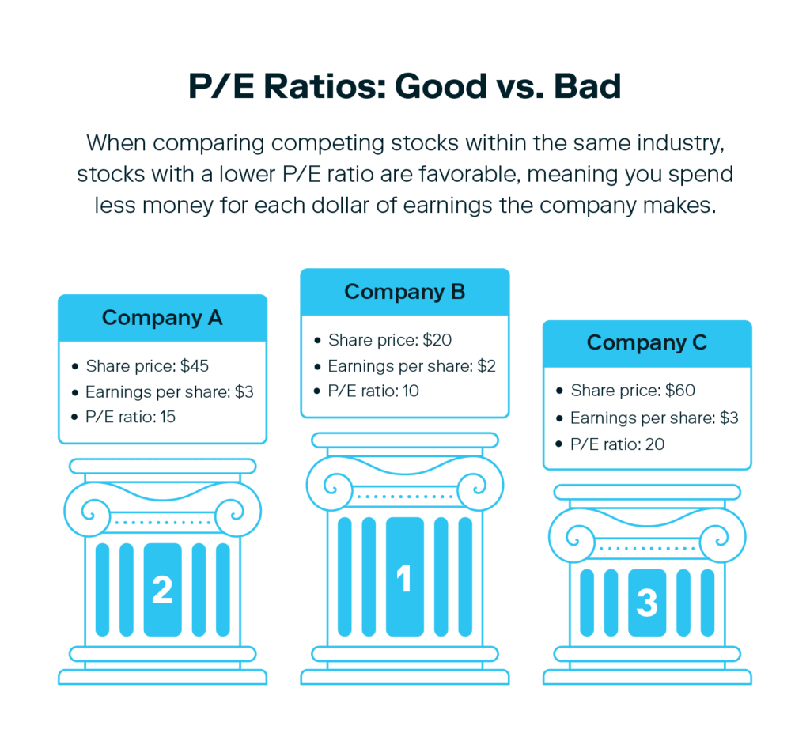

## Table of Contents

## What is a P/E ratio?

The P/E ratio, or Price-to-Earnings ratio, is a way to figure out how much investors are willing to pay for a company's earnings. It's calculated by dividing the current stock price by the company's earnings per share (EPS). This number tells you how many years it would take for the company to earn back the amount you paid for the stock, if the earnings stay the same.

A high P/E ratio might mean that people think the company will grow a lot in the future, so they're willing to pay more for it now. On the other hand, a low P/E ratio could mean that the company is not expected to grow much, or it might be seen as a good value if you think the company is better than what the market thinks. It's important to compare the P/E ratio of a company with others in the same industry, because what's considered high or low can vary a lot from one industry to another.

## What is the difference between absolute and relative P/E ratios?

The absolute P/E ratio is a simple way to value a company. It's just the stock price divided by the earnings per share (EPS). This number tells you how much you're paying for each dollar of the company's earnings. If a company has an absolute P/E ratio of 15, that means you're paying $15 for every $1 of earnings. It's a quick and easy way to see if a stock might be expensive or cheap, but it doesn't tell you much about how the company is doing compared to others.

The relative P/E ratio, on the other hand, helps you compare a company's P/E ratio to something else. Usually, it's compared to the average P/E ratio of the industry the company is in, or to the overall market's P/E ratio. For example, if a company's P/E ratio is 20 and the industry average is 15, the relative P/E ratio would be 20/15, or 1.33. This means the company's stock is more expensive than the average in its industry. Using the relative P/E ratio can give you a better idea of whether a stock is a good deal or not, because it puts the company's valuation into context.

## How is the absolute P/E ratio calculated?

The absolute P/E ratio is calculated by dividing the current stock price by the earnings per share (EPS). The stock price is how much one share of the company costs right now. The earnings per share is the company's total earnings divided by the number of shares. So, if a company's stock is trading at $50 and its EPS is $2, the absolute P/E ratio would be $50 divided by $2, which equals 25.

This ratio tells you how many years it would take for the company to earn back the amount you paid for the stock, assuming the earnings stay the same. A high absolute P/E ratio might mean that investors expect the company to grow a lot in the future. A low ratio could mean the company is not expected to grow much, or it might be seen as a good value if you think the company is better than what the market thinks.

## How is the relative P/E ratio calculated?

The relative P/E ratio is a way to compare a company's P/E ratio to the average P/E ratio of its industry or the overall market. To find the relative P/E ratio, you take the company's absolute P/E ratio and divide it by the average P/E ratio of the industry or market you're comparing it to. For example, if a company's P/E ratio is 20 and the industry average P/E ratio is 15, the relative P/E ratio would be 20 divided by 15, which equals 1.33. This tells you that the company's stock is more expensive than the average in its industry.

Using the relative P/E ratio helps you see if a stock is a good deal or not by putting its price in context. If the relative P/E ratio is less than 1, it means the stock is cheaper than the average in its industry or market. If it's more than 1, the stock is more expensive. This can be really helpful when you're trying to decide if a stock is worth buying, because it shows you how the stock's price compares to others in the same field.

## What does a high absolute P/E ratio indicate about a company?

A high absolute P/E ratio means that investors are willing to pay a lot for each dollar of the company's earnings. If a company has a high P/E ratio, it often means that people think the company will grow a lot in the future. They are ready to pay more for the stock now because they believe the company will make more money later on.

However, a high P/E ratio can also mean that the stock might be overvalued. This means that the price of the stock is too high compared to how much the company is actually [earning](/wiki/earning-announcement). If the company doesn't grow as much as expected, the stock price could go down, and investors might lose money. So, it's important to look at other things too, like how the company is doing compared to others in its industry, before deciding if a high P/E ratio is a good sign or not.

## What does a low relative P/E ratio suggest about a stock compared to its industry?

A low relative P/E ratio suggests that a stock is cheaper compared to other companies in its industry. If the relative P/E ratio is less than 1, it means the stock's price is lower than the average for its industry. This could mean that the stock is a good deal, or that it's undervalued. Investors might see this as a chance to buy the stock at a lower price, hoping that its value will go up in the future.

However, a low relative P/E ratio doesn't always mean the stock is a great buy. It could also mean that the company is not doing as well as others in its industry, or that people don't expect it to grow much. So, it's important to look at other things too, like the company's financial health and future plans, before deciding if a low relative P/E ratio makes the stock a good investment.

## How can investors use absolute P/E ratios to evaluate stock value?

Investors can use the absolute P/E ratio to see if a stock might be a good buy or too expensive. The absolute P/E ratio is the stock price divided by the earnings per share. If the ratio is high, it means investors are willing to pay a lot for each dollar of the company's earnings. This could mean they think the company will grow a lot in the future. But, if the ratio is too high, it might mean the stock is overvalued, which means its price is too high compared to what the company is actually earning.

On the other hand, if the absolute P/E ratio is low, it might mean the stock is a good deal. A low ratio could suggest that the company is not expected to grow much, or it might be seen as undervalued if investors think the company is better than what the market thinks. When looking at the absolute P/E ratio, it's important for investors to compare it with other companies in the same industry, because what's considered high or low can vary a lot from one industry to another.

## In what scenarios is the relative P/E ratio more useful than the absolute P/E ratio?

The relative P/E ratio is more useful than the absolute P/E ratio when you want to compare a company's stock price to others in the same industry. It helps you see if a stock is a good deal by showing how its price compares to the average in its field. For example, if a company's P/E ratio is lower than the industry average, it might be a good buy because it's cheaper than similar companies. This can help investors find stocks that might be undervalued and have the potential to go up in price.

Another scenario where the relative P/E ratio is more useful is when you're trying to understand how the market views a company's future growth compared to its peers. If a company's relative P/E ratio is higher than 1, it means the stock is more expensive than the industry average. This might mean investors expect the company to grow faster than others in its industry. By using the relative P/E ratio, investors can make better decisions by seeing how a stock's price fits into the bigger picture of its industry.

## What are the limitations of using absolute P/E ratios for investment decisions?

Using absolute P/E ratios to make investment decisions can be tricky because they don't tell the whole story about a company. For example, a high P/E ratio might mean that investors think the company will grow a lot in the future, but it could also mean that the stock is just too expensive. On the other hand, a low P/E ratio might seem like a good deal, but it could also mean that the company isn't doing well or that it's not expected to grow much. So, looking at just the absolute P/E ratio might lead investors to make the wrong choices if they don't consider other important factors.

Another problem with using absolute P/E ratios is that they don't take into account how a company is doing compared to others in its industry. What's considered a high or low P/E ratio can be very different from one industry to another. For example, tech companies often have higher P/E ratios than utility companies. Without comparing the P/E ratio to the industry average, it's hard to know if a stock is a good value or not. So, while the absolute P/E ratio is a quick way to get a sense of a stock's price, it's not enough by itself to make a smart investment decision.

## How does the economic cycle affect the interpretation of relative P/E ratios?

The economic cycle can change how we look at relative P/E ratios. During good times, when the economy is growing, companies usually make more money. This can make their P/E ratios go up because their stock prices might go up faster than their earnings. If everyone thinks the good times will keep going, they might be willing to pay more for stocks, making relative P/E ratios seem high but still okay. But, if the economy starts to slow down, people might start to worry. They might not want to pay as much for stocks, so P/E ratios could go down even if earnings stay the same. This means a high relative P/E ratio during a boom might not be a bad thing, but the same ratio during a downturn could be a warning sign.

It's also important to think about how different industries do at different points in the economic cycle. Some industries, like tech or consumer goods, might do better during a boom and have higher relative P/E ratios. Others, like utilities or basic goods, might not change as much and keep their P/E ratios more stable. When the economy is slowing down, people might move their money to safer industries, making their relative P/E ratios go up. So, when looking at relative P/E ratios, it's smart to think about where we are in the economic cycle and how it might affect different industries.

## Can you provide a case study where the use of relative P/E ratios led to a successful investment?

In early 2017, an investor named Sarah was looking to invest in the technology sector. She noticed that Company A, a well-known tech firm, had a relative P/E ratio of 0.8 compared to the industry average of 1.2. This meant that Company A's stock was cheaper than most other tech companies. Sarah did some more research and found that Company A was about to launch a new product that was expected to do well. She decided to buy shares in Company A because she believed the stock was undervalued and had good growth potential.

By the end of 2017, Company A's new product was a big hit, and the company's earnings went up a lot. The stock price also went up, and the relative P/E ratio moved closer to the industry average. Sarah's investment in Company A turned out to be a great success. She made a good profit because she used the relative P/E ratio to find a stock that was cheaper than others in its industry and had strong growth prospects.

## How do analysts adjust P/E ratios for cyclical industries, and what impact does this have on the comparison between absolute and relative P/E ratios?

Analysts adjust P/E ratios for cyclical industries by using something called the normalized P/E ratio. This means they look at the company's earnings over a full economic cycle, instead of just one year. In cyclical industries, like car makers or building companies, earnings can go up and down a lot depending on how the economy is doing. So, analysts use the average earnings over several years to get a better idea of what the company is really worth. This helps them see if a stock is a good deal even when the economy is not doing well.

Using the normalized P/E ratio changes how we compare absolute and relative P/E ratios. The absolute P/E ratio just looks at the current stock price and earnings for one year. But in cyclical industries, this can be misleading because earnings can be really high or really low depending on the economy. The relative P/E ratio compares the company's P/E to the industry average, but if you use the normalized P/E, you get a better comparison. This way, you can see if a stock is cheaper or more expensive than others in its industry, even when the economy is going through ups and downs.

## What is Understanding Stock Valuation?

Stock valuation assesses the fair market value of a company's shares, a fundamental aspect of investment analysis. The process helps investors ascertain whether a stock is priced correctly by comparing its market value with various financial metrics, primarily based on the company's earnings.

One of the primary metrics used in stock valuation is the Price-to-Earnings (P/E) ratio. The P/E ratio is defined as the market value per share divided by the earnings per share (EPS), mathematically represented as:

$$
\text{P/E Ratio} = \frac{\text{Market Value per Share}}{\text{Earnings per Share (EPS)}}
$$

This ratio provides insight into what the market is willing to pay today for a company's earnings. A high P/E ratio might indicate that the market expects future growth and is willing to pay a premium for it. Conversely, a low P/E ratio could suggest that the stock is undervalued or that the company has limited growth prospects.

Another critical metric closely related to the P/E ratio is the Price/Earnings-to-Growth (PEG) ratio. The PEG ratio enhances the analysis by incorporating the growth rate of a company's earnings. It's calculated by dividing the P/E ratio by the company's earnings growth rate. This formula is expressed as:

$$
\text{PEG Ratio} = \frac{\text{P/E Ratio}}{\text{Earnings Growth Rate}}
$$

The PEG ratio allows investors to evaluate a stock's value while considering its earnings growth. A PEG ratio of 1 suggests that the stock is fairly valued, as its price matches its earnings growth expectation. A PEG ratio below 1 may point towards undervaluation, indicating that the stock's growth potential is not fully appreciated by the market. Conversely, a PEG ratio above 1 suggests potential overvaluation, hinting that the market might be overestimating the company's growth potential.

By utilizing the P/E and PEG ratios, investors can make informed judgments about whether a stock is overvalued, undervalued, or fairly valued based on its current earnings performance and anticipated growth trajectory. These metrics, while insightful, should be employed alongside a range of other financial analyses to form a comprehensive valuation of a company's shares.

## What is the P/E Ratio and how can we explore it?

The Price-to-Earnings (P/E) ratio is an essential metric in evaluating a company's stock price relative to its earnings. It is calculated using the formula:

$$
\text{P/E Ratio} = \frac{\text{Market Value per Share}}{\text{Earnings per Share (EPS)}}
$$

This ratio indicates what the market is willing to pay for each dollar of a company's earnings, offering insight into the perceived value of the company's earnings potential. A high P/E ratio generally suggests the market expects significant growth and is willing to pay more for the company's earnings. Conversely, a low P/E ratio might indicate that the market perceives the stock as undervalued or expects limited growth, thus paying less for the company's earnings. 

It's important for investors to consider these interpretations in the context of overall market conditions and specific industry trends, as they can impact the ratio's significance. High P/E ratios in growth sectors might signal expected rapid growth, while in mature industries, the same ratio could indicate overvaluation.

## How can the PEG Ratio enhance P/E Analysis?

The Price/Earnings-to-Growth (PEG) ratio serves as a crucial enhancement to the basic P/E ratio by incorporating expected earnings growth, providing a more comprehensive view of a stock's valuation. This metric is particularly useful for investors seeking to assess whether a stock is overvalued or undervalued in relation to its growth potential.

Mathematically, the PEG ratio is defined as:

$$
\text{PEG Ratio} = \frac{\text{P/E Ratio}}{\text{Earnings Growth Rate}}
$$

Here, the earnings growth rate is typically expressed as a percentage. By integrating growth potential, the PEG ratio addresses one of the P/E ratio's primary limitations: its failure to account for future earnings expansion.

A PEG ratio of 1 suggests that the market's valuation of a stock is in line with its growth prospects, indicating fair value. A PEG ratio below 1 implies that the stock might be undervalued, as its earnings growth is expected to exceed current valuations. Conversely, a ratio above 1 suggests potential overvaluation, where the market may be pricing the stock higher than its anticipated earnings growth justifies.

Consider this Python snippet to calculate the PEG ratio:

```python
def calculate_peg_ratio(pe_ratio, growth_rate):
    if growth_rate == 0:
        return float('inf')  # Avoid division by zero
    return pe_ratio / growth_rate

# Example usage:
pe_ratio = 20  # Example P/E ratio
growth_rate = 10  # Example growth rate in percentage form

peg_ratio = calculate_peg_ratio(pe_ratio, growth_rate)
print(f"PEG Ratio: {peg_ratio}")
```

This straightforward calculation can be instrumental for investors seeking deeper insights beyond the traditional P/E ratio, enabling a more informed analysis by factoring in future earnings potential. Understanding how the PEG ratio adjusts for growth is vital for making more nuanced investment evaluations.

## References & Further Reading

[1]: ["The Little Book That Still Beats the Market"](https://www.amazon.com/Little-Book-Still-Beats-Market/dp/0470624159) by Joel Greenblatt

[2]: ["Valuation: Measuring and Managing the Value of Companies"](https://www.amazon.com/Valuation-Measuring-Managing-Companies-Finance/dp/1119610885) by McKinsey & Company Inc.

[3]: ["Quantitative Value, + Web Site: A Practitioner's Guide to Automating Intelligent Investment and Eliminating Behavioral Errors"](https://www.amazon.com/Quantitative-Value-Web-Site-Practitioners/dp/1118328078) by Wesley R. Gray and Tobias E. Carlisle

[4]: ["The Intelligent Investor: The Definitive Book on Value Investing. A Book of Practical Counsel"](https://www.amazon.com/Intelligent-Investor-Definitive-Investing-Essentials/dp/0060555661) by Benjamin Graham

[5]: ["Algorithmic Trading and DMA: An introduction to Direct Access Trading Strategies"](https://www.amazon.com/Algorithmic-Trading-DMA-introduction-strategies/dp/0956399207) by Barry Johnson

[6]: ["Python for Finance: Mastering Data-Driven Finance"](https://www.amazon.com/Python-Finance-Mastering-Data-Driven/dp/1492024333) by Yves Hilpisch