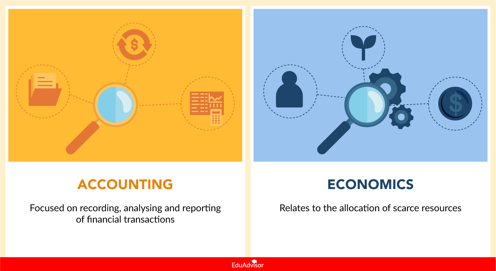

## Table of Contents

## What is accounting?

Accounting is the process of keeping track of a business's money. It involves recording, summarizing, and reporting financial transactions. This helps business owners and managers understand how much money they have, how much they owe, and how much they are earning. It's like keeping a detailed diary of all the money coming in and going out of a business.

Accounting also helps businesses follow the law. Governments require companies to keep accurate records and report their finances correctly. This way, they can make sure businesses are paying the right amount of taxes. Additionally, accounting helps businesses plan for the future by providing information that can be used to make smart decisions about spending, investing, and growing the company.

## What is economics?

Economics is a way to study how people use money, goods, and services. It looks at how people make choices about what to buy, sell, or trade. Economists try to understand why people do what they do with their money and how these choices affect the whole world. They study things like jobs, prices, and how money moves around in a country or between countries.

Economics is split into two main parts: microeconomics and macroeconomics. Microeconomics looks at small pieces of the economy, like how a single business decides what to produce or how a person decides what to buy. It's about understanding the choices and behaviors of individuals and small groups. Macroeconomics, on the other hand, looks at the big picture. It studies things like the total amount of money in a country, how many people have jobs, and how fast the economy is growing. Both parts help us understand and predict what might happen in the future with money and resources.

## How do accounting and economics differ in their primary focus?

Accounting and economics both deal with money, but they focus on different things. Accounting is all about keeping track of the money that comes in and goes out of a business. It's like a detailed diary that helps a business know exactly how much money it has, how much it owes, and how much it is making. Accountants make sure all the numbers are right and that the business follows the rules about reporting money to the government. This helps the business stay organized and plan for the future.

Economics, on the other hand, looks at how people use money, goods, and services in a bigger way. It tries to understand why people make the choices they do with their money and how these choices affect the whole economy. Economists study things like how many people have jobs, how prices change, and how money moves around in a country or between countries. While accounting focuses on the money of a single business, economics looks at the money and resources of everyone together.

## What are the main branches of accounting and how do they relate to economics?

The main branches of accounting are financial accounting and managerial accounting. Financial accounting focuses on preparing reports for people outside the business, like investors and the government. It helps them understand how the business is doing financially. Managerial accounting, on the other hand, helps the people inside the business make decisions. It gives them information about costs, budgets, and how to make the business run better. Both branches help a business keep track of its money, but they serve different audiences and purposes.

These branches of accounting relate to economics in different ways. Financial accounting provides data that economists can use to study the overall health of businesses and the economy. For example, economists might look at financial reports to understand trends in profits and losses across industries. Managerial accounting, while focused on internal decision-making, also ties into economics because it deals with how businesses allocate resources, which is a key part of economic study. By understanding how businesses manage their costs and make decisions, economists can better predict economic behavior and outcomes. Both branches of accounting, therefore, provide valuable information that helps economists analyze and understand economic systems.

## How do economists and accountants use financial data differently?

Economists use financial data to understand big picture things about the economy. They look at numbers from many businesses and people to see how the whole economy is doing. For example, they might use financial data to figure out if people are spending more or less money, if businesses are making more or less profit, and if the economy is growing or shrinking. This helps them make guesses about what might happen next in the economy and give advice to governments and businesses.

Accountants use financial data to keep track of money for one business. They make sure all the numbers are correct and follow the rules. They use this data to create reports that show how much money the business has, how much it owes, and how much it is making. These reports help the business owners and managers make decisions about spending, saving, and investing. Accountants focus on making sure the financial information is accurate and useful for the people inside the business.

## What role does time play in accounting versus economics?

In accounting, time is very important because it helps keep everything organized. Accountants use time to sort money coming in and going out into different periods, like months or years. This helps businesses see how they are doing over time and plan for the future. For example, they can compare this year's profits to last year's to see if they are doing better or worse. Time also helps accountants follow the rules about when to report money to the government, which is important for paying taxes correctly.

In economics, time is also key, but it's used in a different way. Economists look at time to understand how things change in the economy over the long run. They study trends over many years to see how people's spending, saving, and investing habits change. This helps them predict what might happen in the future and give advice on how to make the economy better. Time helps economists see the big picture and understand how different parts of the economy affect each other over time.

## How do accounting standards impact economic analysis?

Accounting standards are the rules that businesses follow when they keep track of their money. These rules help make sure that all businesses report their money in the same way. This is important for economic analysis because economists need to compare financial information from different businesses. If every business follows the same rules, economists can trust the numbers they are looking at. This makes it easier for them to understand how the economy is doing and make good guesses about the future.

When businesses follow accounting standards, it also helps economists see the big picture of the economy. For example, if all businesses report their profits and losses the same way, economists can add up these numbers to see if the whole economy is making more or less money. This helps them figure out if the economy is growing or shrinking. Without these standards, the numbers might be all mixed up, and economists would have a hard time making sense of them. So, accounting standards make the financial data more useful for economic analysis.

## Can economic theories influence accounting practices?

Yes, economic theories can influence accounting practices. Economists study how people and businesses make choices about money, and their ideas can change how accountants keep track of money. For example, if economists find out that a certain way of calculating costs helps businesses make better decisions, accountants might start using that method. This means that economic theories can lead to new rules or ways of doing things in accounting, making it more useful for businesses.

Another way economic theories can influence accounting is through changes in laws and regulations. Governments often listen to economists when they make rules about money. If economists think that a new rule will help the economy, the government might make that rule into a law. Then, accountants have to follow this new law when they keep track of money for businesses. So, economic theories can lead to changes in accounting practices through new laws and rules.

## What are the implications of macroeconomic policies on accounting?

Macroeconomic policies are big decisions made by governments and central banks that affect the whole economy. These policies can change how businesses keep track of their money. For example, if the government changes tax laws, accountants have to follow these new rules when they report how much money a business makes or owes. This means they might need to change how they do their work to make sure they are following the new laws correctly. Also, if the central bank changes interest rates, it can affect how much money businesses can borrow and how they plan for the future. Accountants need to think about these changes when they help businesses make decisions about spending and saving.

Another way macroeconomic policies impact accounting is through economic conditions. When the economy is doing well, businesses might make more money, and accountants have to keep track of this growth. But if the economy is not doing well, businesses might lose money, and accountants need to report these losses correctly. Macroeconomic policies can also change how businesses think about the future. For example, if the government starts a new program to help businesses, accountants might need to think about how this will affect the business's money over time. So, macroeconomic policies can change what accountants do every day and how they help businesses plan for the future.

## How do microeconomic principles affect business accounting decisions?

Microeconomic principles help businesses make choices about their money. These principles look at things like how much it costs to make something, how much people want to buy it, and how to set prices. When businesses use these ideas, they can decide how to spend their money in a smart way. For example, if a business knows that making a certain product costs a lot, they might decide to make less of it or find a cheaper way to do it. This helps them save money and make more profit. Accountants use these microeconomic ideas to help businesses figure out their costs and make good choices about what to do with their money.

Another way microeconomic principles affect accounting is by helping businesses set prices. If a business knows that people really want to buy something, they might decide to charge more for it. Accountants need to keep track of these prices and make sure the business is making enough money to cover its costs. They also help businesses understand how changing prices can affect how much they sell and how much money they make. By using microeconomic principles, accountants can give businesses good advice on how to make the most money and stay successful.

## What are the advanced analytical tools used in economic forecasting compared to those in accounting?

Economists use special tools to guess what might happen in the economy. They use things like big computer programs that look at a lot of numbers from the past to predict the future. These programs can find patterns and trends that help economists see if the economy will grow or shrink. They also use models that show how different parts of the economy, like jobs and prices, affect each other. These models help economists test different ideas and see what might happen if the government changes a law or if people start spending more money. Economists also use surveys to ask people about their plans for spending and saving, which helps them make better guesses about the future.

Accountants use different tools to help businesses keep track of their money. They use software that helps them add up numbers and make reports. These reports show how much money a business has, how much it owes, and how much it is making. Accountants also use tools that help them check if the numbers are right and if the business is following the rules. These tools are important for making sure the business knows exactly how it is doing and can plan for the future. While accountants use these tools to look at the past and present, economists use their tools to look at the future and make guesses about what might happen.

## How do international accounting standards and economic policies interact in global business?

International accounting standards are rules that businesses all over the world follow when they keep track of their money. These rules help make sure that everyone is doing things the same way, no matter where they are. This is important for global business because it means that people in different countries can understand each other's financial reports. When businesses follow these standards, it makes it easier for them to work together and for investors to decide where to put their money. Economic policies, like those set by governments and central banks, can change how businesses keep track of their money. For example, if a government changes its tax laws, businesses have to follow these new rules when they report their money. This means that accountants need to know about these policies and make sure the business is doing everything right.

Economic policies can also affect how businesses plan for the future. If a country's central bank changes interest rates, it can make it easier or harder for businesses to borrow money. This can change how much money businesses have to spend and invest. When businesses in different countries are affected by these policies, it can change how they work together. For example, if one country's economy is doing well because of its policies, businesses there might want to work with businesses in other countries. But if another country's economy is not doing well, businesses might be more careful about working together. So, international accounting standards and economic policies are important for global business because they help businesses understand each other and plan for the future.

## References & Further Reading

[1]: ["Advances in Financial Machine Learning"](https://www.amazon.com/Advances-Financial-Machine-Learning-Marcos/dp/1119482089) by Marcos Lopez de Prado

[2]: ["Machine Learning for Algorithmic Trading"](https://github.com/stefan-jansen/machine-learning-for-trading) by Stefan Jansen

[3]: ["Quantitative Trading: How to Build Your Own Algorithmic Trading Business"](https://www.amazon.com/Quantitative-Trading-Build-Algorithmic-Business/dp/1119800064) by Ernest P. Chan

[4]: ["Evidence-Based Technical Analysis: Applying the Scientific Method and Statistical Inference to Trading Signals"](https://www.amazon.com/Evidence-Based-Technical-Analysis-Scientific-Statistical/dp/0470008741) by David Aronson

[5]: Bergstra, J., Bardenet, R., Bengio, Y., & Kégl, B. (2011). ["Algorithms for Hyper-Parameter Optimization."](https://dl.acm.org/doi/10.5555/2986459.2986743) Advances in Neural Information Processing Systems 24.