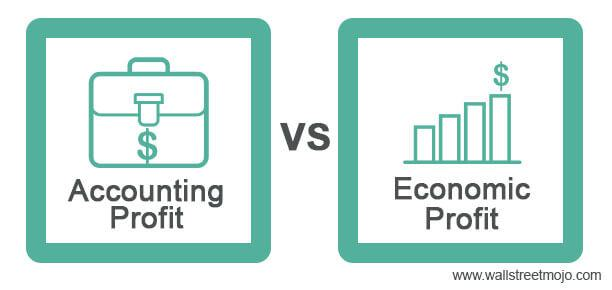

Accounting, economics, and algorithmic trading are three pivotal fields in the modern financial landscape, each playing a significant role in shaping the way businesses and markets operate. Accounting is the systematic process of recording, analyzing, and reporting financial transactions within a business. It is fundamental in facilitating informed decision-making by providing transparency and accountability. Economics, on the other hand, is a social science that studies the production, distribution, and consumption of goods and services. It helps in understanding how individuals, businesses, and governments allocate resources, influencing policy formulation and business strategies. Algorithmic trading involves the use of computers to execute trading orders based on pre-defined strategies, often at speeds far surpassing human capability. This practice has revolutionized financial markets by increasing efficiency and liquidity while impacting market dynamics.

In today's fast-paced financial environment, these fields hold significant relevance. Accounting acts as the cornerstone of financial transparency, essential for maintaining stakeholder trust and regulatory compliance. Economics offers insights into market trends and consumer behavior, aiding businesses and policymakers in navigating economic fluctuations. Algorithmic trading introduces a technological edge to financial markets, enabling rapid execution and the ability to capitalize on minute price discrepancies.



The purpose of this article is to compare these three fields, examining how each contributes uniquely to the financial industry. We will explore their interconnections and how advancements in technology are increasingly blurring the lines between them, leading to innovative solutions and strategies.

Technology has been a transformative force across these three domains. In accounting, automation and artificial intelligence are streamlining processes and minimizing human errors. Economics is leveraging big data and machine learning for more accurate forecasts and analysis, enhancing our understanding of complex economic dynamics. Algorithmic trading relies heavily on advanced algorithms and high-frequency trading technology to optimize trading performance in real-time.

Readers can expect to gain a comprehensive understanding of each field's fundamental concepts, their role in the financial industry, and how technology is integrating and transforming these areas. By the end of the article, readers will be equipped with insights into the evolving nature of these fields and their potential career opportunities.

## Table of Contents

## Understanding Accounting

Accounting is a systematic process that involves recording, summarizing, and reporting financial transactions of a business. It serves as the financial backbone for organizations, providing essential information that aids in decision-making, financial analysis, and regulatory compliance.

The primary functions of accounting within a business include bookkeeping, preparation of financial statements, auditing, and tax planning. Bookkeeping ensures that all financial transactions are accurately recorded in an orderly manner. Financial statements, such as the balance sheet, income statement, and cash flow statement, provide a comprehensive overview of an organization's financial health. Auditing, typically conducted by independent accountants, verifies the accuracy and reliability of financial data, building trust with stakeholders. Tax planning involves evaluating financial options to minimize tax liabilities while ensuring compliance with tax laws.

Accounting plays a vital role in financial decision-making by offering insights into an organization's financial status. It helps managers evaluate business performance, strategize growth opportunities, and control operational costs. Investors and creditors analyze accounting data to assess potential risks and returns, influencing their investment and lending decisions.

Key accounting principles and standards ensure consistency and transparency in financial reporting. The Generally Accepted Accounting Principles (GAAP) and International Financial Reporting Standards (IFRS) are widely adopted frameworks that dictate how financial transactions should be recorded and reported. These standards provide users with accurate financial information and facilitate comparability across businesses.

Technological advancements have significantly transformed accounting practices. Artificial Intelligence (AI) and automation have revolutionized processes such as data entry, reconciliation, and anomaly detection. AI algorithms enhance accuracy and efficiency, reducing the workload on accountants while enabling them to focus on more strategic tasks. Automation tools streamline repetitive activities, ensuring real-time financial insights and faster decision-making.

The role of accountants in businesses today extends beyond mere number crunching. Accountants serve as strategic advisors, leveraging financial data to support business development and drive organizational success. With the advent of technology, accountants are expected to possess a mix of analytical skills and technical proficiency to navigate advanced accounting software and tools effectively.

In summary, accounting is an indispensable element of any business structure, providing the financial insights required for informed decision-making and strategic planning. With the integration of new technologies, the profession continues to evolve, demanding continuous learning and adaptation to changing financial landscapes.

## Exploring Economics

Economics is a social science concerned with the study of how individuals, businesses, and governments allocate scarce resources to satisfy unlimited wants. It seeks to understand the decision-making processes and behaviors that influence the production, distribution, and consumption of goods and services. Economics is divided into two primary branches: microeconomics and macroeconomics, each with distinct yet interconnected areas of focus.

Microeconomics examines the behavior of individual economic [agents](/wiki/agents), such as households and firms, and how they interact in markets. It studies concepts like demand and supply, price determination, consumer behavior, and production costs. Microeconomic analysis often involves the use of models to predict outcomes based on rational choices and market structures. For example, the theory of supply and demand explains how the equilibrium price and quantity of a good are determined in a competitive market.

In contrast, macroeconomics looks at the economy as a whole, focusing on aggregate indicators and the interactions between the major components of the economy, such as households, firms, and the government. It addresses broad issues like inflation, unemployment, economic growth, and fiscal and monetary policy. Macroeconomics aims to understand how these elements interact to influence national and global economic performance.

Economic theories are applied in various real-world scenarios to inform decision-making and policy formulation. For example, cost-benefit analysis, derived from microeconomic principles, helps evaluate the effectiveness of projects or policies by comparing expected costs and benefits. Macroeconomic theories guide central banks and governments in managing economic stability through monetary and fiscal policies. An example is the use of monetary policy tools, such as interest rates, to influence economic activity and control inflation.

The impact of economic policies on businesses and markets can be profound. Fiscal policies, which involve government spending and taxation, directly affect aggregate demand. For instance, increasing government spending can stimulate economic activity and create employment opportunities, while changes in tax policy can influence consumer spending and investment decisions. Monetary policies, implemented by central banks, impact interest rates and [liquidity](/wiki/liquidity-risk-premium), shaping borrowing and spending behaviors in the economy.

The advancement of data analytics and algorithms has revolutionized economic forecasting. By leveraging large datasets and sophisticated analytical techniques, economists can model complex economic phenomena and predict future trends with greater accuracy. Machine learning algorithms, for example, are increasingly used to analyze patterns in historical data to forecast variables like GDP growth, unemployment rates, and inflation. Python is widely used in these analyses for its robust libraries, such as pandas, NumPy, and sci-kit-learn, which facilitate data manipulation, statistical analysis, and predictive modeling.

```python
import pandas as pd
from sklearn.linear_model import LinearRegression

# Sample code for a simple economic forecast model
# Assume 'data' is a DataFrame containing historical economic data

# Feature columns and target variable for GDP forecasting
features = data[['interest_rate', 'unemployment_rate']]
target = data['gdp_growth']

# Create and train the linear regression model
model = LinearRegression()
model.fit(features, target)

# Predict future GDP growth based on new interest rate and unemployment rate values
new_data = [[1.5, 5.0]]  # Example values for interest rate and unemployment rate
predicted_gdp_growth = model.predict(new_data)

print("Predicted GDP Growth:", predicted_gdp_growth)
```

In conclusion, economics provides essential insights into how resources are allocated and how policies influence economic activity. Its application across microeconomic and macroeconomic dimensions enhances our understanding of the economic environment, fosters informed decision-making, and supports effective policy development. As technology continues to evolve, the integration of data analytics and predictive algorithms will further augment the capabilities of economic analysis and forecasting.

## An Insight into Algorithmic Trading

Algorithmic trading, often referred to as algo trading, is the use of computer algorithms to automate trading processes in financial markets. It harnesses the power of advanced mathematical models and high-speed computations to make trading decisions at a speed and frequency that is impossible for human traders. The significance of [algorithmic trading](/wiki/algorithmic-trading) lies in its ability to enhance trading efficiency, reduce transaction costs, and mitigate psychological influences on trading decisions.

Algorithms in trading are designed to execute specific strategies based on predefined criteria. These algorithms analyze a multitude of market data, searching for trading opportunities that meet predetermined criteria such as price, timing, and [volume](/wiki/volume-trading-strategy). The decisions made by these algorithms are based on quantitative models that incorporate statistical analysis and real-time market data. A simple example of algorithmic trading would be a pair-trading strategy, which involves statistical [arbitrage](/wiki/arbitrage) by identifying pairs of stocks with historical price correlations. The algorithm would automatically execute trades to exploit deviations from this correlation.

The advantages of algorithmic trading are numerous. Firstly, it allows for [backtesting](/wiki/backtesting) using historical market data, which can validate trading strategies before deployment. This reduces the risk of implementing unprofitable strategies. Secondly, it eliminates human emotions from the trading process, thereby potentially increasing consistency and accuracy in decision-making. Furthermore, algorithms can process large volumes of data with precision and execute trades across multiple markets simultaneously.

However, algorithmic trading also presents challenges. One significant concern is the risk of technical failures which may lead to unintended trades. Moreover, the complexity of algorithms might lead to unforeseen outcomes in volatile market conditions. The "flash crash" of May 6, 2010, serves as a cautionary tale, where high-frequency trading algorithms exacerbated a rapid, automated sell-off, causing the Dow Jones Industrial Average to plummet nearly 1,000 points within minutes before swiftly recovering.

The role of technology and data in algorithmic trading is pivotal. Advances in computing have enabled the development of more sophisticated algorithms capable of processing vast amounts of data in real-time. Big data analytics and [machine learning](/wiki/machine-learning) techniques are increasingly used to enhance algorithmic models, enabling them to learn and adapt to new market trends and anomalies.

Examples of algorithms used in trading include high-frequency trading ([HFT](/wiki/high-frequency-trading-strategies)) algorithms, which execute a large number of orders at extremely fast speeds. These algorithms seek to profit from short-term market inefficiencies. Statistical arbitrage, another type of strategy, uses complex statistical models to identify opportunities where the price movement of different securities deviates from their historical relationships.

Overall, algorithmic trading represents a significant evolution in the way financial markets operate, driven by the interplay of technology, data analytics, and advanced mathematical models. Its impact continues to grow as technological advancements further refine and expand the capabilities of trading algorithms.

## Comparing Accounting, Economics, and Algorithmic Trading

Accounting, economics, and algorithmic trading each play critical roles within the financial industry, contributing uniquely to decision-making processes and organizational strategies. By examining their similarities and differences, we gain insight into their collective impact on contemporary finance.

**Similarities and Differences**

Accounting, economics, and algorithmic trading intersect at their core focus on financial data. All three fields rely heavily on data analysis to derive insights, forecast trends, and make informed decisions. However, they differ significantly in methodology, objectives, and practical application.

Accounting focuses primarily on recording, summarizing, and reporting financial transactions. It provides stakeholders with a clear picture of an organization's financial status through carefully maintained financial statements. By contrast, economics encompasses a broader understanding of resource allocation, production, and consumption on both micro and macro levels. While accounting is descriptive, economics is analytical, examining causative factors within economic activities. Algorithmic trading, meanwhile, utilizes automated systems to execute trades—often within split seconds—based on mathematical models and strategies, prioritizing speed and precision over conventional analytical approaches.

**Impact on the Financial Industry and Decision-Making**

Each field influences decision-making differently. Accounting's methodical nature ensures financial compliance and informs strategic business decisions by detailing current financial conditions. Economic analysis can predict market trends and guide policy-making, influencing both governmental and corporate strategies. Algorithmic trading introduces efficiency and speed into financial markets, enabling rapid position adjustments and exploiting fleeting opportunities to potentially increase profitability.

**Integration through Technology**

Technological advancements serve as a common thread, integrating accounting, economics, and algorithmic trading. Artificial intelligence and machine learning have revolutionized these fields, offering enhanced data analysis, predictive capabilities, and automation. In accounting, technology simplifies data entry and reconciliation processes. Economists harness big data for sophisticated modeling and forecasting. Algorithms in trading leverage high processing power to analyze vast data sets and execute complex strategies in real-time.

**Interdisciplinary Nature and Overlaps**

The boundaries between accounting, economics, and algorithmic trading increasingly blur due to their shared reliance on data and technology. Economic principles inform accounting strategies, while economic forecasts drive algorithmic trading decisions. Accountants use economic indicators to contextualize financial statements and provide a comprehensive view of business performance.

**Career Opportunities and Required Skills**

Opportunities in these fields are abundant, though distinct skill sets are required. Accountants need proficiency in financial regulations, meticulous attention to detail, and strong analytical capabilities. Economists benefit from robust quantitative skills, the ability to synthesize complex data, and theoretical acumen. Careers in algorithmic trading demand expertise in programming languages (e.g., Python, C++), statistical knowledge, and an understanding of financial markets.

All three fields require adaptability and continuous learning, especially as technology reshapes financial landscapes. Professionals skilled in harnessing technology, interpreting data, and understanding financial intricacies are well-positioned to excel within these dynamic fields.

## Conclusion

The exploration of accounting, economics, and algorithmic trading throughout this article underscores the interconnectedness and significance of these fields in the contemporary financial landscape. Each discipline offers unique insights and tools that contribute to effective financial decision-making and strategy formulation. Accounting provides the foundational language of business, essential for tracking financial activities and ensuring transparency. Economics offers critical insights into market dynamics and decision-making processes at both micro and macro levels. Meanwhile, algorithmic trading represents a technological evolution in finance, changing how transactions occur in increasingly automated and data-driven markets.

Understanding these fields not only bridges gaps in financial theory and practice but also equips individuals and businesses with the knowledge needed to thrive in a rapidly evolving sector. As technology continues to transform how we approach finance, both professionals and scholars must adapt by embracing emerging tools like [artificial intelligence](/wiki/ai-artificial-intelligence) and data analytics. These technologies are not only enhancing efficiency but also creating opportunities for groundbreaking innovation in financial strategies.

Looking forward, accounting, economics, and algorithmic trading will be further shaped by technological advancements. Machine learning and artificial intelligence promise to redefine areas such as predictive analysis and risk management, making technology's integration into these fields more pivotal than ever. As these frontiers expand, they open new career paths and require professionals to continuously upskill, particularly in areas like data science and quantitative analysis, to remain relevant.

For those interested in deepening their understanding, several resources can provide an excellent foundation. Core textbooks in financial accounting principles, introductory economics, and algorithmic trading strategies are invaluable. Additionally, numerous online courses and certifications, such as those offered by universities or platforms like Coursera and edX, can provide up-to-date insights and practical skills in these domains. Engaging with online communities, such as forums and professional networks, can also offer opportunities for the exchange of ideas and experiences, further broadening one's perspective on the dynamic intersection of these fields.

## References & Further Reading

[1]: ["Advances in Financial Machine Learning"](https://www.amazon.com/Advances-Financial-Machine-Learning-Marcos/dp/1119482089) by Marcos Lopez de Prado

[2]: ["Machine Learning for Algorithmic Trading"](https://github.com/stefan-jansen/machine-learning-for-trading) by Stefan Jansen

[3]: ["Quantitative Trading: How to Build Your Own Algorithmic Trading Business"](https://www.amazon.com/Quantitative-Trading-Build-Algorithmic-Business/dp/1119800064) by Ernest P. Chan

[4]: ["Evidence-Based Technical Analysis: Applying the Scientific Method and Statistical Inference to Trading Signals"](https://www.amazon.com/Evidence-Based-Technical-Analysis-Scientific-Statistical/dp/0470008741) by David Aronson

[5]: Bergstra, J., Bardenet, R., Bengio, Y., & Kégl, B. (2011). ["Algorithms for Hyper-Parameter Optimization."](https://dl.acm.org/doi/10.5555/2986459.2986743) Advances in Neural Information Processing Systems 24.