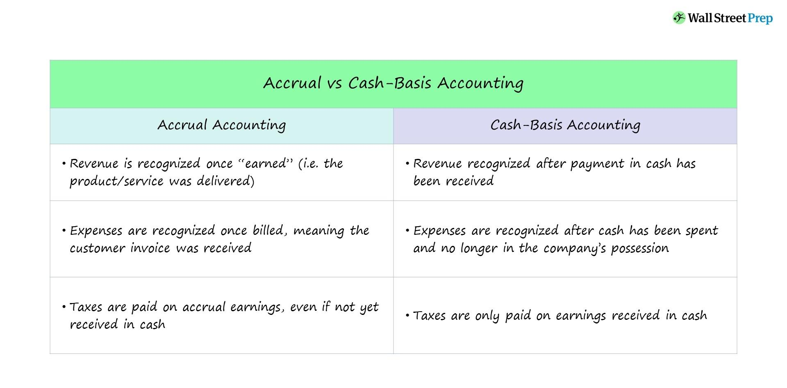

## Table of Contents

## What is accrual basis accounting?

Accrual basis accounting is a method of recording financial transactions when they happen, not when money changes hands. This means that if a company provides a service or sells a product, it records the revenue at that time, even if the customer hasn't paid yet. Similarly, if a company gets a bill for something it used, it records the expense right away, even if it hasn't paid the bill yet. This method gives a more accurate picture of a company's financial health because it shows all the income and expenses related to a specific time period.

Using accrual accounting can be more complicated than other methods, like cash basis accounting, because it requires tracking receivables and payables. However, it is preferred by many businesses and required by Generally Accepted Accounting Principles (GAAP) for companies above a certain size. This is because it provides a clearer view of a company's financial situation by matching revenues with the expenses incurred to generate those revenues, which helps in better decision-making and financial planning.

## What is cash basis accounting?

Cash basis accounting is a simple way of keeping track of money where you only write down transactions when you actually get or spend cash. If you sell something, you don't count the money until the customer pays you. If you buy something, you don't write it down until you pay for it. This method is easy to use because you only need to keep track of the cash coming in and going out.

Small businesses often use cash basis accounting because it's straightforward and doesn't require keeping track of money that people owe you or money you owe others. However, it can make it hard to see the full picture of how the business is doing, especially if there's a lot of time between when you do the work and when you get paid. Because of this, bigger companies and those that have to follow strict accounting rules usually use a different method called accrual accounting.

## How does accrual accounting differ from cash accounting?

Accrual accounting and cash accounting are two ways to keep track of a business's money, but they work differently. Accrual accounting records money when it's earned or when a bill comes in, not when the money actually changes hands. So if you do a job in January but don't get paid until February, you still count that money in January. This method gives a clearer picture of how a business is doing over time because it matches up the money coming in with the costs of making that money.

On the other hand, cash accounting is simpler because it only counts money when it's actually received or paid out. If you do a job in January but get paid in February, you count the money in February. This method is easier for small businesses to use because it's straightforward and doesn't need to keep track of money that's owed to or by the business. However, it can make it harder to see the true financial health of a business because it doesn't show all the money coming in and going out in the right time periods.

The main difference between the two methods is when you record the money. Accrual accounting gives a more complete view of a business's financial situation by showing all income and expenses when they happen, while cash accounting only shows the money when it moves. Because of this, bigger businesses and those that need to follow strict accounting rules usually use accrual accounting, while smaller businesses might prefer cash accounting for its simplicity.

## What are the advantages of using accrual basis accounting?

Accrual basis accounting helps businesses see their financial health more clearly. It records income and expenses when they happen, not just when money changes hands. This means a business can match the money it earns with the costs it takes to earn that money, giving a true picture of how well it's doing. For example, if a company does work in one month but gets paid the next, accrual accounting shows the income in the month the work was done, not when the payment was received. This helps business owners make better decisions because they can see the real impact of their operations over time.

Another advantage is that accrual accounting follows the Generally Accepted Accounting Principles (GAAP), which are important for bigger companies. This makes it easier to compare a company's financials with other companies and helps if the business wants to get loans or attract investors. They can trust the financial statements because they follow standard rules. Even though it's more complicated than cash accounting and requires keeping track of money owed and owing, the detailed and accurate view it provides is worth it for businesses that need a clear financial picture.

## What are the advantages of using cash basis accounting?

Cash basis accounting is easy to use because it only counts money when you actually get it or spend it. This means you don't have to keep track of money that people owe you or money you owe others, which makes it simpler for small businesses. If you run a small shop or a service business, you can just look at your bank account to see how much money you have, and that's all you need to know.

Another good thing about cash basis accounting is that it can help you manage your cash flow better. Since you only count the money when it comes in or goes out, you can see exactly how much cash you have at any time. This can be really helpful if you need to make sure you have enough money to pay your bills or if you're planning to buy something new for your business. It's straightforward and helps you stay on top of your money day by day.

## In what scenarios is accrual accounting more suitable?

Accrual accounting is more suitable for bigger businesses that need to see a clear picture of how they are doing over time. It records money when it's earned or when a bill comes in, not just when the money moves. This way, a business can match the money it makes with the costs of making that money. For example, if a company does work in January but gets paid in February, accrual accounting shows the income in January. This helps business owners make better decisions because they can see the real impact of their work month by month.

Accrual accounting is also important for companies that have to follow strict accounting rules, like the Generally Accepted Accounting Principles (GAAP). These rules are needed for bigger companies and help them compare their financials with other companies. If a business wants to get loans or attract investors, using accrual accounting can make their financial statements more trustworthy. Even though it's more complicated than cash accounting, the detailed and accurate view it provides is worth it for businesses that need to show a clear financial picture.

## In what scenarios is cash accounting more suitable?

Cash accounting is great for small businesses because it's easy to use. It only counts money when you get it or spend it. So, if you run a small shop or a service business, you can just look at your bank account to see how much money you have. You don't need to keep track of money that people owe you or money you owe others, which makes it simpler.

Another reason cash accounting is good for small businesses is that it helps you manage your cash flow better. Since you only count the money when it comes in or goes out, you can see exactly how much cash you have at any time. This can be really helpful if you need to make sure you have enough money to pay your bills or if you're planning to buy something new for your business. It's straightforward and helps you stay on top of your money day by day.

## How do accrual and cash basis accounting affect financial statements?

Accrual accounting and cash basis accounting show money in different ways on financial statements. With accrual accounting, you write down income and expenses when they happen, not when you get or spend the money. So, if you do a job in January but get paid in February, you put the money in January's financial statement. This gives a better picture of how the business is doing over time because it matches the money you make with the costs of making that money. It's like seeing the full story of your business's money.

On the other hand, cash basis accounting only counts money when it actually moves. If you do a job in January but get paid in February, you put the money in February's financial statement. This method is simpler because you just look at your bank account to see how much money you have. But it can make it hard to see the full picture of how your business is doing, especially if there's a lot of time between when you do the work and when you get paid. It's like only seeing part of the story of your business's money.

## What are the legal and regulatory requirements for using accrual versus cash accounting?

The rules about using accrual or cash accounting can be different depending on where you live and the size of your business. In the United States, the Generally Accepted Accounting Principles (GAAP) say that bigger companies need to use accrual accounting. This is because accrual accounting gives a clearer picture of how the business is doing over time. If a company has to follow GAAP, it usually has to use accrual accounting. The Internal Revenue Service (IRS) also has rules about this. Small businesses with less than $25 million in average annual gross receipts can use cash accounting for their taxes, but bigger businesses have to use accrual accounting.

In other countries, the rules can be different. For example, in the European Union, the International Financial Reporting Standards (IFRS) are often used, and they also require accrual accounting for bigger companies. But smaller businesses might still be allowed to use cash accounting. It's important for a business to check the rules in their own country or region to make sure they are using the right method. Using the wrong method can cause problems with taxes and can make it hard to compare the business's financials with other companies.

## How do accrual and cash basis accounting impact tax reporting?

Accrual and cash basis accounting can affect how you report your taxes. If you use cash basis accounting, you only report income when you get the money and expenses when you pay them. This can be simpler for small businesses because you just look at your bank account to see what to report. The IRS lets small businesses with less than $25 million in average annual gross receipts use cash accounting for taxes. This means if you do a job in December but get paid in January, you report that income on your taxes for the next year.

On the other hand, if you use accrual accounting, you report income and expenses when they happen, not when the money moves. So if you do a job in December but get paid in January, you still report that income on your taxes for the current year. Bigger businesses usually have to use accrual accounting for their taxes because it follows the Generally Accepted Accounting Principles (GAAP). This can make tax reporting more complicated, but it gives a clearer picture of how your business is doing over time.

## What are the challenges and complexities of implementing accrual accounting?

Using accrual accounting can be tricky because it's more complicated than cash accounting. You have to keep track of money you haven't gotten yet, which is called accounts receivable, and money you owe, which is called accounts payable. This means you need a good system to manage all these numbers and make sure they're right. It can take more time and might need special software or even an accountant to help you keep everything in order.

Another challenge is that it can be hard to understand at first. You're not just looking at the money in your bank account; you're trying to match up the money you've earned with the costs of [earning](/wiki/earning-announcement) it, even if you haven't been paid yet. This can make your financial statements look different from what you see in your bank account, which can be confusing. But once you get the hang of it, accrual accounting can give you a much better idea of how your business is really doing.

## How can businesses transition from cash basis to accrual basis accounting?

Switching from cash basis to accrual basis accounting can be a big change for a business. You'll need to start keeping track of money you haven't gotten yet, called accounts receivable, and money you owe, called accounts payable. This means you might need new software or an accountant to help you. It's important to make sure all your past records are right before you switch, so you might need to go back and change some of your old financial statements to match the new way of doing things.

Once you've got your past records sorted out, you can start using accrual accounting for new transactions. This means recording income when you earn it and expenses when you get the bill, not just when the money moves. It can be confusing at first because your financial statements won't match what's in your bank account anymore. But with time and practice, you'll get used to it, and you'll have a better picture of how your business is doing over time.

## References & Further Reading

[1]: ["Accounting Standards Update No. 2014-09—Revenue from Contracts with Customers (Topic 606)"](https://fasb.org/page/document?pdf=ASU+2014-09_Section+A.pdf&title=UPDATE%20NO.%202014-09%E2%80%94REVENUE%20FROM%20CONTRACTS%20WITH%20CUSTOMERS%20(TOPIC%20606)%20SECTION%20A%E2%80%94SUMMARY%20AND%20AMENDMENTS%20THAT%20CREATE%20REVENUE%20FROM%20CONTRACTS%20WITH%20CUSTOMERS%20(TOPIC%20606)%20AND%20OTHER%20ASSETS%20AND%20DEFERRED%20COSTS%E2%80%94CONTRACTS%20WITH%20CUSTOMERS%20(SUBTOPIC%20340-40)) by Financial Accounting Standards Board (FASB).

[2]: ["International Financial Reporting Standards (IFRS)"](https://www.ifrs.org/) by IFRS Foundation.

[3]: ["The Basics of Accrual Accounting for Algorithmic Traders"](https://www.investopedia.com/terms/a/accrualaccounting.asp) on Investopedia.

[4]: "Financial Accounting: An Introduction to Concepts, Methods and Uses" by Clyde P. Stickney, Roman L. Weil, Katherine Schipper (Book on generally accepted accounting principles and financial reporting).

[5]: ["Overcoming Technical Debt in Machine Learning Systems"](https://proceedings.neurips.cc/paper/2015/file/86df7dcfd896fcaf2674f757a2463eba-Paper.pdf) by D. Sculley et al., 2015. (Discusses challenges in financial systems, relevant for understanding financial data systems in trading).

[6]: ["Accrual Accounting Concepts"](https://www.investopedia.com/terms/a/accrualaccounting.asp) on AccountingTools.