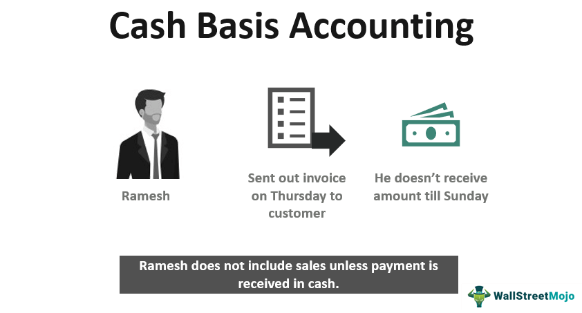

Understanding the various methods of recording financial transactions is key for businesses and investors. Financial accounting methods provide frameworks to capture, record, and report a company's financial activities effectively, which can ultimately influence decision-making, business strategy, and regulatory compliance.

This article examines two primary accounting methods: cash basis accounting and accrual accounting. Cash basis accounting records revenues and expenses at the time cash transactions occur, while accrual accounting records financial transactions when they are earned or incurred, regardless of cash flow. Each method has its unique advantages and disadvantages, affecting financial statement clarity and business operations.

For algorithmic trading firms, these accounting methods hold specific importance because they directly influence the accuracy of financial tracking and compliance with financial reporting standards. Algo trading, characterized by high-frequency and complex transactions, necessitates precise financial recording to maintain a realistic view of the firm's performance and obligations.

By comprehensively understanding cash and accrual accounting, businesses can choose the appropriate strategy that not only aligns with their operational model but also bolsters their financial planning and regulatory adherence. This strategic choice enhances a firm's competitiveness by ensuring accurate financial representation and facilitating informed decisions.

## Table of Contents

## Understanding Cash Basis Accounting

Cash basis accounting is a method of recording financial transactions at the time cash is exchanged. Its simplicity makes it an attractive option for small businesses and sole proprietorships, which often do not face complex accounting challenges. In this system, revenue is recorded when cash is received from customers, and expenses are recorded when cash is paid to suppliers or employees.

This accounting approach is straightforward, eliminating the need for tracking receivables or payables. As a result, it is less complicated and less costly to maintain compared to other accounting methods such as accrual accounting. For example, if a small bakery sells a cake on credit in March but receives payment in April, the revenue would only be recorded in April when the cash is received.

While cash basis accounting offers simplicity and ease of understanding, it can potentially misrepresent a company's financial health. This occurs because revenues and expenses may not accurately reflect the period in which the economic events occur. As a result, companies may see fluctuations in reported net income that do not truly represent their business activities. This discrepancy can hinder financial analysis, strategic planning, and proper tax reporting.

Consider a consulting firm that incurs significant expenses for a project in December but doesn't receive payment until January. Under cash basis accounting, the expenses would lower the firm's profit in December, but the revenue and associated tax liability would be pushed to January. This mismatch can obscure the firm's actual financial performance for each period, creating challenges in assessing the business's true profitability.

In more complex business environments, cash basis accounting's limitations become more pronounced. Companies engaged in long-term contracts, those that require inventory management, or those that need detailed financial statements for external stakeholders may struggle with its constraints.

In summary, while cash basis accounting is beneficial for its simplicity and cost-effectiveness, it is not suitable for all businesses, particularly those with intricate financial transactions or the need for comprehensive financial reporting. Understanding when this method can be advantageous versus when its limitations could impact financial clarity is crucial for appropriate application.

## Exploring Accrual Accounting

Accrual accounting is a method that records financial transactions when they occur, irrespective of when the cash flows are received or paid. This approach provides a more comprehensive view of a company's financial health than cash basis accounting. Unlike cash basis, which only acknowledges transactions upon cash exchange, accrual accounting captures the economic events in the periods they relate to, which allows for a more accurate reflection of a company’s operations.

### Revenue and Expenses in Accrual Accounting

In accrual accounting, revenue is recognized when it is earned, and expenses are recognized when they are incurred. This means that revenue is recorded at the moment a service is performed or goods are delivered, regardless of when payment is received. Similarly, expenses are recognized when they are billed, even if payment is not made immediately.

For example, if a company delivers services worth $50,000 in December, but does not receive payment until January, the revenue will still be recorded in December under accrual accounting. Conversely, if the company receives an invoice for services in December to be paid in January, the expense will be recorded in December.

This method employs the matching principle, ensuring that expenses are matched to the revenue they help generate in the same period. This principle enhances the accuracy of financial records, supporting better financial analyses and strategic planning. The matching principle is crucial for understanding profitability and financial performance over specific periods. 

### Impact on Financial Planning and Analysis

Accrual accounting is particularly beneficial for larger companies, providing a clearer picture of financial health and business performance. By acknowledging all earned revenues and incurred expenses within the same period, it portrays a more accurate reflection of a company's long-term financial conditions.

The impact on financial planning is significant. Accurate financial statements generated through accrual accounting can offer insights into trends and patterns over time, which are essential for informed decision-making and forecasting. This comprehensive overview aids businesses in budgeting, strategic planning, and evaluating financial performance.

Moreover, accrual accounting facilitates better compliance with standards such as the Generally Accepted Accounting Principles (GAAP) and International Financial Reporting Standards (IFRS), which require such a method to reflect true financial performance and position. The insights gained from accrual-based financial statements are more reliable for investors, lenders, and other stakeholders who require a deeper understanding of the financial health and future potential of a business.

In conclusion, accrual accounting is a sophisticated method that favours detailed and forward-looking financial analysis, making it a preferred choice for larger firms aiming for a more precise financial depiction. This method’s benefits in planning and compliance significantly contribute to sound financial strategies and robust market positioning.

## Key Differences Between Cash Basis and Accrual Accounting

The primary distinction between cash basis and accrual accounting hinges on the timing of transaction recognition. In cash basis accounting, transactions are recognized when cash is exchanged. Revenue is recorded when payment is received, and expenses are documented when they are paid. This method focuses mainly on cash flow and provides a straightforward view of a firm's liquid cash position at any given time. For example, a consulting firm using cash basis accounting would record income not when they invoice a client but when the client pays the invoice.

In contrast, accrual accounting records transactions when they are incurred, regardless of when cash is actually exchanged. This method offers a more comprehensive view of a company’s financial health by accounting for all recognized transactions, whether payments have been received or disbursed or not. Revenue is recorded when earned, and expenses when incurred, providing a detailed insight into future revenues and obligations. For instance, if a retail business makes a sale on credit, accrual accounting recognizes the revenue at the point of sale, not when the customer pays later.

In practical terms, using different accounting methods can significantly alter a company's financial statements. Consider a business that performs services worth $10,000 in December but receives payment in January. Under cash basis accounting, the income would be recorded in January. In contrast, with accrual accounting, it would be recorded in December, which could affect the company’s reported revenue and taxes for the fiscal year.

The choice between cash and accrual accounting can also impact how financial statements are utilized. Cash basis accounting often suits small businesses that prioritize cash flow tracking over long-term financial forecasting. It simplifies accounting processes but can misrepresent a company’s financial performance in any given period, as it doesn’t account for outstanding invoices or unpaid bills. On the other hand, accrual accounting provides a more accurate reflection of a company’s financial performance and position, which is crucial for larger corporations that need detailed financial analysis for decision-making and strategic planning.

In summary, the primary difference between cash basis and accrual accounting lies in transaction timing. Cash accounting zeros in on [liquidity](/wiki/liquidity-risk-premium), while accrual accounting highlights earnings processes and obligations. The choice between the two can significantly influence financial statements and a business’s perception to investors and regulatory bodies.

## Special Considerations in Accounting for Algo Trading

Algorithmic trading, characterized by high-frequency and automated execution of trades, necessitates precise financial recording. This sector faces unique accounting challenges, primarily due to the sheer [volume](/wiki/volume-trading-strategy) and speed of transactions. Accrual accounting is generally more suitable for [algorithmic trading](/wiki/algorithmic-trading) firms as it provides a more accurate picture of an entity's financial status by recognizing economic events regardless of when cash transactions occur.

**Accrual Accounting for Algo Trading:**

Accrual accounting aligns well with the needs of algo trading firms as it records revenues and expenses at the time they are incurred, providing a realistic view of a firm's financial health. This method allows firms to manage ongoing market positions and evaluate performance in near real-time, essential for the high-speed environment of algorithmic trading.

**Compliance with GAAP and IFRS:**

For algo trading firms, adherence to Generally Accepted Accounting Principles (GAAP) or International Financial Reporting Standards (IFRS) is crucial. These standards ensure consistency, transparency, and comparability in financial reporting. Under GAAP, accrual accounting requires recognizing income when earned and expenses when incurred, which is critical for accurately reflecting the financial outcomes of rapid trades. Similarly, IFRS mandates the accrual basis, supporting coherent financial statements across different jurisdictions.

**Specific Accounting Considerations:**

1. **Transaction Volume:** Algo trading generates a massive number of transactions, necessitating sophisticated systems to track these activities accurately. Firms need automated solutions to efficiently manage this data and ensure compliance with accounting standards.

2. **Valuation of Financial Instruments:** The valuation of complex financial instruments in real-time is essential for accurate financial reporting. Models that adhere to IFRS 9 or equivalent GAAP provisions are necessary for measuring fair value and impairments.

3. **Revenue Recognition:** Algo trading firms must closely monitor revenue recognition principles to ensure that trading profits are reported accurately according to the nature and timing stipulated by the controlling accounting framework.

4. **Hedge Accounting:** Many trading strategies involve hedging to mitigate risk. Proper documentation and application of hedge accounting models, as prescribed by both GAAP and IFRS, are crucial to reflect the economic reality of risk management activities accurately.

5. **Regulatory Compliance:** Given the global nature of markets, algo trading firms must stay updated with regulatory changes across different regions, ensuring their financial records remain compliant with local requirements.

Accrual accounting's ability to provide a detailed and forward-looking financial picture makes it invaluable for the dynamic field of algorithmic trading. Its adoption enables firms to maintain regulatory compliance, administer transactions effectively, and strategically position themselves in a competitive market.

## Implications of Accounting Methods in Algo Trading

Choosing the correct accounting method in algorithmic trading is crucial for accurately assessing tax liabilities and ensuring precise financial reporting. Algorithmic trading, characterized by rapid and high-frequency transactions, necessitates accounting methods that adequately capture the [volatility](/wiki/volatility-trading-strategies) and fast-paced nature of the trading environment.

**Impact on Algo Trading Strategies**

The selection of accounting methods directly influences algorithmic trading strategies. With cash basis accounting, transactions are recorded only when cash changes hands. This method might delay the recognition of gains or losses, potentially obscuring the true performance of trading algorithms over short periods. Conversely, accrual accounting, which records financial events as they occur irrespective of cash flow, provides a more immediate reflection of trading outcomes. It captures revenues and expenses in real-time, aligning more closely with the high-frequency trading strategies often employed by algo trading firms.

**Risk Management and Portfolio Performance**

Accrual accounting enhances risk management by providing a comprehensive view of outstanding obligations and anticipated revenues. This method allows algo trading firms to better assess their financial health and make informed decisions about resource allocation. In contrast, cash basis accounting may lead to inadequate risk assessment due to delayed visibility into gains and expenses, potentially impacting portfolio performance. For algorithmic traders, the real-time accuracy of accrual accounting supports dynamic risk management, allowing for timely responses to market changes.

**Tax Implications**

The choice between cash and accrual accounting also affects tax reporting. Under cash basis accounting, taxes are paid on received income, which can defer tax liabilities if payments are outstanding at the fiscal year-end. While advantageous for smaller firms with liquidity constraints, this may not suit high-volume algo trading firms where delayed income recognition could lead to unexpected tax obligations if substantial trades close after the year's end. Accrual accounting, however, aligns with Generally Accepted Accounting Principles (GAAP) and International Financial Reporting Standards (IFRS), facilitating consistent tax reporting. Algorithmic trading firms adopting accrual methods might experience a smoother tax reporting process due to its alignment with standard regulatory frameworks.

**Regulatory Requirements**

Complying with regulatory requirements is a pivotal consideration in accounting method selection. Accrual accounting generally meets the criteria set by financial oversight bodies such as the SEC in the United States, ensuring that financial statements reflect true economic activities. For algo trading firms, adherence to accrual methods supports compliance with international regulations, a crucial [factor](/wiki/factor-investing) given the global nature of financial markets. This compliance ensures that the accounting practices employed can withstand scrutiny by regulators and investors alike.

In conclusion, algorithmic trading firms must weigh the implications of choosing between cash and accrual accounting methods. While cash basis accounting offers simplicity, it lacks the immediacy and completeness needed for dynamic trading environments. Accrual accounting provides a detailed financial picture, aiding in strategic and regulatory compliance, thus supporting the firm's long-term stability and growth.

## Examples of Accounting Methods in Action

In the context of algorithmic trading, accounting methods have distinct impacts on how financial transactions are recorded and analyzed. Let's examine two case studies illustrating the use of cash and accrual accounting in algo trading firms.

### Case Study 1: Cash Basis Accounting in a Small Algo Trading Firm

A small algorithmic trading firm, primarily focused on high-frequency trading ([HFT](/wiki/high-frequency-trading-strategies)), decided to adopt cash basis accounting due to its simplicity and ease of implementation. The firm, run by an individual trader, operates with limited resources and low transaction volumes, making cash accounting appealing.

#### Practical Application:
- **Transaction Recording**: The firm records transactions when cash actually changes hands. Profits from trades, for example, are recognized only when the cash is settled in their trading accounts.
- **Expense Recognition**: Similarly, expenses such as brokerage fees and data subscriptions are recorded when payment is made.

#### Results:
- **Pros**: The firm benefits from a straightforward bookkeeping process without the complexities of tracking receivables and payables. This simplicity saves time and reduces administrative costs.
- **Cons**: The major drawback is that financial health might not be accurately reflected, especially during volatile trading periods. For instance, the firm may have unrealized gains or losses on open positions that are not accounted for until they close, potentially misrepresenting its financial position during interim periods.

### Case Study 2: Accrual Accounting in a Mid-Sized Algo Trading Firm

A mid-sized algo trading firm opted for accrual accounting to manage its diverse portfolio and extensive trading activities. The firm trades in multiple markets, with operations spanning various financial instruments and derivatives.

#### Practical Application:
- **Revenue Recognition**: The firm records revenue when a trade is executed, regardless of when cash is received. For instance, if a trade results in a receivable from a counterparty, the revenue is recognized immediately, ensuring that financial statements reflect the firm's current financial commitments and income accurately.
- **Expense Recognition**: Similarly, expenses are logged when incurred. If the firm subscribes to a trading platform on an annual basis, the expense is recorded evenly over the year as an accrued expense, providing a more balanced view of financial performance.

#### Results:
- **Pros**: This approach offers holistic visibility into the firm's financial position, considering both immediate transactions and future obligations. The firm gains improved insights for strategy development and risk management, aligning with compliance obligations under Generally Accepted Accounting Principles (GAAP) or International Financial Reporting Standards (IFRS).
- **Cons**: While more comprehensive, accrual accounting requires sophisticated financial systems to manage and report data accurately, leading to higher administrative costs and complexities.

### Conclusion

These case studies demonstrate the distinct features and impacts of cash and accrual accounting within algorithmic trading contexts. Cash basis provides simplicity and ease of use for smaller operations, whereas accrual accounting offers comprehensive financial insights, essential for larger firms. By carefully selecting the appropriate method, algo trading firms can enhance their financial governance, align with regulations, and bolster strategic planning.

## Conclusion

Understanding cash basis and accrual accounting is vital for businesses striving to optimize their financial strategies and ensure accurate financial reporting. Selecting the appropriate accounting method is crucial as it not only aligns with regulatory standards such as Generally Accepted Accounting Principles (GAAP) and International Financial Reporting Standards (IFRS) but also enhances strategic financial planning. Each method offers distinct advantages and presents unique challenges, necessitating a careful assessment tailored to the specific needs of the business.

Cash basis accounting is characterized by its simplicity and straightforward application, making it an attractive option for small businesses and sole proprietorships that primarily focus on cash flow. It records transactions only when cash changes hands, providing an immediate picture of the cash position. However, this method can potentially misrepresent a company's true financial health, particularly in complex business environments, due to delayed recognition of revenues and expenses.

In contrast, accrual accounting offers a comprehensive view of a business's financial condition by recording transactions when they occur, regardless of cash movement. This approach is favored by larger firms for its accuracy in capturing long-term financial obligations and future revenues. By recognizing income and expenses as they are incurred, accrual accounting aids in more robust financial planning and analysis, making it better suited for organizations engaging in complex transactions such as algorithmic trading, where reflecting ongoing market positions accurately is crucial.

Businesses must weigh these considerations thoughtfully to align their chosen approach with both their operational needs and compliance requirements. The implications of this decision extend to various aspects, including tax liabilities, financial reporting, and overall strategic positioning. By adopting the accounting method that best aligns with their objectives, businesses can navigate the complexities of the financial landscape more effectively and position themselves for success in a competitive market. With the right method in place, firms can enhance decision-making processes, improve transparency in financial reporting, and ultimately achieve a well-informed and strategic approach to managing their finances.

## References & Further Reading

[1]: ["Accounting Standards Update No. 2014-09—Revenue from Contracts with Customers (Topic 606)"](https://fasb.org/page/document?pdf=ASU+2014-09_Section+A.pdf&title=UPDATE%20NO.%202014-09%E2%80%94REVENUE%20FROM%20CONTRACTS%20WITH%20CUSTOMERS%20(TOPIC%20606)%20SECTION%20A%E2%80%94SUMMARY%20AND%20AMENDMENTS%20THAT%20CREATE%20REVENUE%20FROM%20CONTRACTS%20WITH%20CUSTOMERS%20(TOPIC%20606)%20AND%20OTHER%20ASSETS%20AND%20DEFERRED%20COSTS%E2%80%94CONTRACTS%20WITH%20CUSTOMERS%20(SUBTOPIC%20340-40)) by Financial Accounting Standards Board (FASB).

[2]: ["International Financial Reporting Standards (IFRS)"](https://www.ifrs.org/) by IFRS Foundation.

[3]: ["The Basics of Accrual Accounting for Algorithmic Traders"](https://www.investopedia.com/terms/a/accrualaccounting.asp) on Investopedia.

[4]: "Financial Accounting: An Introduction to Concepts, Methods and Uses" by Clyde P. Stickney, Roman L. Weil, Katherine Schipper (Book on generally accepted accounting principles and financial reporting).

[5]: ["Overcoming Technical Debt in Machine Learning Systems"](https://proceedings.neurips.cc/paper/2015/file/86df7dcfd896fcaf2674f757a2463eba-Paper.pdf) by D. Sculley et al., 2015. (Discusses challenges in financial systems, relevant for understanding financial data systems in trading).

[6]: ["Accrual Accounting Concepts"](https://www.investopedia.com/terms/a/accrualaccounting.asp) on AccountingTools.