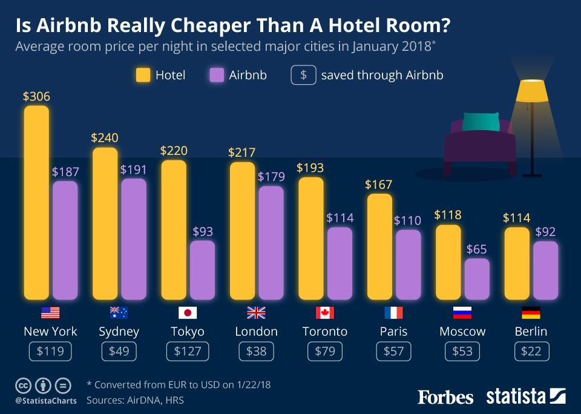

The hospitality and real estate markets have experienced significant transformation over the past decade, driven by technological advancements and innovative investment approaches. One of the most notable developments in this space is the rise of Airbnb, a platform that has redefined how people find and utilize lodging across the globe. Unlike traditional hotels that operate through standardized service models and amenities, Airbnb leverages the sharing economy, offering a diverse range of accommodations that provide more personalized experiences. This model allows individuals to rent out their properties or spare rooms, thus creating a vast and varied marketplace for travelers seeking short-term rentals.

Airbnb's growth has not only broadened lodging options for consumers but also introduced new dynamics into the hospitality market. The platform's peer-to-peer service model offers flexibility in pricing, amenities, and geographical offerings that traditional hotel chains often struggle to match. As a result, hotels have had to innovate and diversify their services to remain competitive, highlighting the substantial impact of Airbnb on the hospitality sector.



Parallel to the rise of Airbnb, the application of algorithmic trading in real estate investment is reshaping how investors engage with these markets. Algorithmic trading employs sophisticated algorithms to analyze extensive data sets, optimizing investment strategies by identifying trends, forecasting property values, and managing risk-reward profiles. These capabilities allow investors to make data-driven decisions swiftly, thereby capitalizing on market opportunities that may have otherwise gone unnoticed in a rapidly changing landscape.

This article examines the contrasting yet interconnected aspects of hotels and Airbnb, and the transformative role algorithmic trading plays within these industries. By dissecting the unique advantages and challenges associated with Airbnb and hotels, alongside the influence of advanced trading technologies, we aim to provide a comprehensive understanding of how these elements are reconfiguring the broader market dynamics. Through this exploration, investors and industry stakeholders can better navigate the evolving landscape of hospitality and real estate, utilizing insights and tools that align with emerging trends and investment strategies.

## Table of Contents

## Airbnb vs. Hotels: An Overview

Airbnb has significantly altered the landscape of the hospitality industry by introducing a peer-to-peer lodging platform that leverages the principles of the sharing economy. This model enables property owners to rent out accommodations on a short-term basis, transforming millions of residences into potential hotel rooms and establishing an extensive marketplace for short-term rentals. By 2023, Airbnb operates in over 100,000 cities in more than 220 countries, highlighting its rapid expansion and wide-reaching impact.\[^1\]

Hotels, in contrast, have traditionally relied on a standardized service model. This model emphasizes consistency and quality in hospitality and amenities, providing guests with predictable and reliable experiences. Hotels offer a range of services such as room service, housekeeping, concierge, and more, often within large, purpose-built establishments that may include amenities like swimming pools, gyms, and conference facilities. The service delivery in hotels is designed to meet specific brand and quality standards, appealing to consumers who prioritize reliable service and structured environments.

A key differentiator between Airbnb and hotels is their pricing structure. Airbnb hosts have the flexibility to adjust pricing based on various factors, including demand fluctuations, local events, and personal preferences. This dynamic pricing model can lead to cost savings for consumers, particularly in locations where hotel rates are high due to demand surges. Hotels typically use a more static and tiered pricing strategy, aligned with their brand positioning and service offerings, yet sometimes implement revenue management systems to adjust prices in response to market demands.

Regulatory challenges present another key difference. Hotels must adhere to a comprehensive set of regulations, which typically includes health and safety standards, zoning laws, and occupancy taxes. These regulations ensure a baseline of quality and safety but can also increase operational costs. In contrast, Airbnb hosts often face a diverse set of regulatory environments depending on local jurisdictions. Some cities have embraced the platform, while others have imposed restrictions or bans on short-term rentals to counteract housing shortages or preserve community character. This regulatory variability introduces both opportunities and risks for Airbnb hosts and users.

Finally, the consumer experience varies significantly between these models. Hotels offer a homogeneous experience with standardized services, which appeal to travelers seeking predictability. Airbnb, however, caters to those desiring unique and authentic experiences, allowing guests to immerse themselves in local cultures by staying in residential neighborhoods. This flexibility has prompted hotels to seek innovation, such as enhancing loyalty programs, personalizing guest experiences, and adopting technology to better compete with Airbnb's diverse offerings.

In summary, the rise of Airbnb has introduced both challenges and opportunities for the traditional hotel sector, pushing it toward innovation and adaptation to remain competitive in a changing market landscape.\[^2\]

\[^1\]: Inside Airbnb. "Adding Data to the Debate." [Inside Airbnb](http://insideairbnb.com/).

\[^2\]: Barron, Kyle, Edward Kung, and Davide Proserpio. "Airbnb, Rising Rent, and the Housing Crisis in Los Angeles." [Link to source](https://www.nber.org/papers/w27357)

## Key Differences Between Hotels and Airbnb

Hotels and Airbnb represent two distinct models in the lodging sector, each offering unique advantages and challenges. A significant difference between these models lies in the regulatory framework. Hotels must comply with a range of regulatory standards, including occupancy taxes, health and safety regulations, and licensing requirements. These regulations ensure that hotels maintain certain service and safety standards, promoting reliability for guests. Conversely, Airbnb operates within a more flexible regulatory environment, although the degree of regulation varies by region. In many areas, Airbnb hosts face fewer restrictions, allowing for greater diversity in the types of accommodations available.

Pricing strategies further distinguish hotels from Airbnb. Hotels typically maintain a more static pricing model, driven by fixed operational costs and established pricing tiers based on amenities and room types. By contrast, Airbnb enables hosts to dynamically adjust pricing according to factors such as demand, seasonality, local events, and personal preferences. This flexibility can lead to competitive pricing for guests and potentially higher returns for hosts in high-demand periods.

The guest experience also varies significantly between hotels and Airbnb. Hotels offer a standardized level of service, characterized by consistent amenities such as room service, housekeeping, and concierge services. This uniformity appeals to guests seeking reliable and predictable service levels. On the other hand, Airbnb provides a wide array of lodging options, which can range from a single room in a shared apartment to an entire villa. This diversity caters to varied guest preferences and provides unique and personalized experiences, often reflecting the local culture and environment.

Finally, the emergence of Airbnb has catalyzed innovation within the hotel industry, pushing hotels to explore novel strategies to attract and retain guests. Traditional hotels have begun incorporating personalized services and adopting technology-driven solutions to enhance the guest experience, thereby staying competitive against the expanding Airbnb offerings. This dynamic competition has incentivized both sectors to improve service quality and broaden customer appeal.

## Factors Influencing Airbnb Investment Success

Airbnb investment success is significantly influenced by various factors that investors need to consider thoroughly to optimize returns and minimize risks. 

Location is perhaps the most critical aspect, as properties situated in tourist hotspots generally yield higher returns due to increased demand. These areas not only attract more visitors but also typically command higher rental prices, enhancing potential income. In contrast, properties in less trafficked areas might suffer from prolonged vacancy periods, affecting overall profitability.

Local regulations present another vital consideration for investors. Some cities have implemented stringent short-term rental laws to cap the number of available Airbnb units, address housing shortages, or ensure compliance with safety and zoning requirements. For instance, cities like Barcelona and New York have established regulations that limit short-term rental durations and require hosts to register or obtain specific licenses. Failure to comply with these regulations can lead to hefty fines, making it imperative for investors to conduct due diligence on local laws prior to property acquisition.

The costs associated with acquiring a property relative to its potential rental income is a fundamental determinant of Airbnb investment success. Analyzing the price-to-rent ratio can offer insights into whether a property is priced favorably relative to its expected rental income. The formula for the price-to-rent ratio is:

$$
\text{Price-to-Rent Ratio} = \frac{\text{Property Market Price}}{\text{Annual Gross Rental Income}}
$$

A lower ratio generally indicates a more favorable investment, suggesting that a property is potentially undervalued compared to its income-generating potential.

Lastly, balancing potential revenue against operational and maintenance costs is crucial for long-term success. Airbnb properties require consistent upkeep, guest management, and possibly third-party cleaning services, all of which can add up significantly. Investors must evaluate these ongoing expenses and consider using property management software or services to streamline operations and reduce costs.

Thus, understanding these factors—location, regulations, acquisition costs, and maintenance expenses—enables investors to make informed Airbnb investment decisions.

## The Role of Algorithmic Trading in Real Estate Investment

Algorithmic trading has become increasingly significant in the landscape of real estate investment, transforming traditional approaches by employing sophisticated algorithms to process and analyze extensive datasets. This computational method allows investors to derive insights more effectively, offering a strategic edge in decision-making.

In the context of real estate, [algorithmic trading](/wiki/algorithmic-trading) excels in identifying market trends and predicting property valuations. Through the use of historical data, [machine learning](/wiki/machine-learning) models can be trained to recognize patterns and forecast future price movements with a high degree of accuracy. These predictive capabilities are crucial for investors seeking to anticipate shifts in market conditions and capitalize on opportunities in a timely manner.

One of the fundamental aspects of algorithmic trading in real estate is portfolio optimization. By analyzing various parameters such as location data, economic indicators, and historical performance, algorithms can construct portfolios that maximize returns while managing risk. This process involves continuously adjusting asset allocations in response to market changes, which is particularly valuable in a volatile environment.

Technologies such as machine learning and advanced data analytics play a pivotal role in assessing the risk-reward profiles of potential real estate investments, including platforms like Airbnb. By evaluating variables such as rental income, occupancy rates, and local market regulations, sophisticated models can offer a comprehensive risk assessment, aiding investors in making informed decisions.

For example, a basic Python implementation to predict property values using machine learning might involve the following steps:

```python
from sklearn.model_selection import train_test_split
from sklearn.ensemble import RandomForestRegressor
from sklearn.metrics import mean_squared_error
import pandas as pd

# Sample dataset of property features and prices
data = pd.read_csv('real_estate_data.csv')
X = data.drop('price', axis=1)  # Features
y = data['price']  # Target variable

# Split data into training and testing sets
X_train, X_test, y_train, y_test = train_test_split(X, y, test_size=0.3, random_state=42)

# Initialize and train the model
model = RandomForestRegressor(n_estimators=100, random_state=42)
model.fit(X_train, y_train)

# Predict and evaluate model performance
predictions = model.predict(X_test)
mse = mean_squared_error(y_test, predictions)
print(f'Mean Squared Error: {mse}')
```

This code snippet demonstrates a basic approach to using a machine learning model (Random Forest Regressor) to predict real estate prices based on available data. By refining such models with more data and sophisticated features, investors can enhance their predictive accuracy, thereby gaining a significant advantage in the market.

In conclusion, algorithmic trading introduces a level of precision and efficiency to real estate investment that manual analysis cannot match. By leveraging data science methodologies, investors can optimize strategies to navigate the complexities of the real estate market, culminating in informed, profitable decisions.

## Conclusion: Navigating the Hospitality and Real Estate Markets

Understanding the nuances between Airbnb and hotels is crucial for investors and consumers alike. This knowledge enables stakeholders to make informed decisions that optimize both financial returns and consumer satisfaction. The comparative analysis of these lodging models reveals distinct operational and experiential differences that influence investment strategies.

Algorithmic trading and advanced analytics provide powerful tools for navigating this complex landscape. Incorporating these technologies allows investors to process vast datasets, recognize patterns, and execute decisions rapidly, thereby enhancing the accuracy and timeliness of investment actions. For example, by utilizing machine learning algorithms, investors can predict property values and rental trends more precisely, increasing the reliability of investment forecasts. 

Effective investment strategies in this sector must consider several factors: location, regulation, market composition, and technological applications. Location remains a pivotal [factor](/wiki/factor-investing), influencing demand and rental yields. Regulatory environments can significantly impact the viability of short-term rental operations, as cities impose varying degrees of restriction on platforms like Airbnb. Moreover, understanding the market composition—such as consumer preferences and competitive dynamics—provides additional insights that can guide strategic investments.

The future of hospitality and real estate investment will likely be defined by those who adeptly integrate these insights and technologies. Investors who leverage algorithmic trading and data-driven analytics to assess risk-reward profiles can capitalize on emerging trends and adapt to market shifts more efficiently. As the landscape evolves, success will depend on the ability to synthesize these elements into coherent strategies that balance innovation with traditional investment principles.

## References & Further Reading

Research on regulatory impacts and market dynamics can be explored through the study "Airbnb, Rising Rent, and the Housing Crisis in Los Angeles" by Kyle Barron, Edward Kung, and Davide Proserpio. This work investigates how Airbnb influences urban rental markets, contributing to increased rent and housing shortages. The study's methodology and findings illustrate the broader implications of short-term rental platforms on traditional housing markets and regulatory landscapes.

For those interested in data analytics within real estate, "Advances in Financial Machine Learning" by Marcos Lopez de Prado provides a comprehensive guide. This book discusses sophisticated machine learning approaches for financial data, which can be adapted to real estate to enhance investment strategies. Techniques such as feature importance and model validation are crucial for identifying patterns and predicting market trends effectively.

A comparative analysis of hotels and Airbnb is presented in "Inside Airbnb: Adding Data to the Debate" by Inside Airbnb. This project collects and analyzes data on Airbnb listings, providing insights into the impact on local communities, housing markets, and traditional hospitality sectors. The initiative encourages open data usage to assess Airbnb's footprint and fosters informed discussions on policy and urban planning.

For insights into algorithmic trading, "Quantitative Trading: How to Build Your Own Algorithmic Trading Business" by Ernest P. Chan offers a foundational guide. The book details developing trading strategies, [backtesting](/wiki/backtesting), and deploying algorithms in live markets. It emphasizes quantitative finance principles and practical steps for launching an algorithmic trading venture, including handling financial data and optimizing performance for real estate investment portfolios.