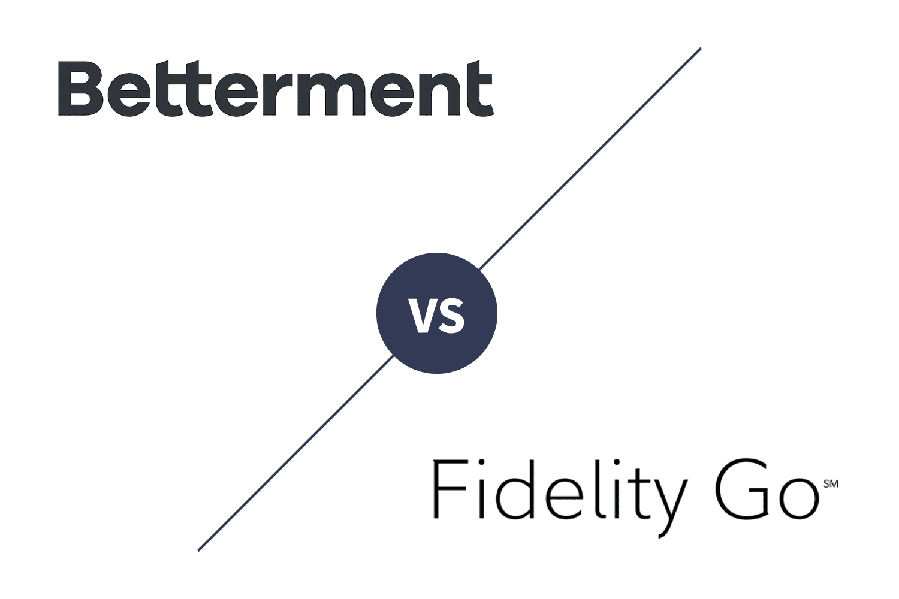

## Table of Contents

## What are Betterment and Fidelity Go?

Betterment and Fidelity Go are both robo-advisors, which are online platforms that use computer algorithms to manage your investments. Betterment was one of the first robo-advisors and it helps you invest your money in a way that matches your goals and how much risk you want to take. You can start investing with a small amount of money, and Betterment will automatically adjust your investments to keep them balanced.

Fidelity Go is another robo-advisor, but it is offered by Fidelity, a big financial company. Like Betterment, Fidelity Go uses technology to manage your investments based on your goals and risk level. One difference is that Fidelity Go is free if you have less than a certain amount of money invested, but you need to have a Fidelity account to use it. Both services make it easy for people to invest without needing to know a lot about the stock market.

## How do the fee structures of Betterment and Fidelity Go compare?

Betterment has two different plans. The first plan is called the Digital plan, and it costs 0.25% of the money you have invested each year. This means if you have $10,000 invested, you will pay $25 a year. The second plan is called the Premium plan, and it costs 0.40% of your money each year. This plan is for people who have at least $100,000 to invest and want extra help from financial experts.

Fidelity Go, on the other hand, is free if you have less than $25,000 invested. If you have more than $25,000, you will pay 0.35% of your money each year. So, if you have $30,000 invested, you will pay $105 a year. This makes Fidelity Go a good choice if you are just starting out and don't have a lot of money to invest yet.

## What are the minimum investment requirements for Betterment and Fidelity Go?

Betterment does not have a minimum amount of money you need to start investing. This means you can begin with any amount you want, even if it's just a few dollars. This makes it easy for anyone to start investing, no matter how much money they have.

Fidelity Go also does not have a minimum investment requirement. You can start investing with any amount of money. This is great for people who are just starting out and want to begin saving and investing without needing a large sum of money upfront.

## How do the investment portfolios of Betterment and Fidelity Go differ?

Betterment offers a range of investment portfolios designed to match different goals and levels of risk. They use a mix of stocks and bonds to create these portfolios. Betterment also offers special portfolios like ones focused on socially responsible investing or ones that aim to reduce taxes. They use a method called tax-loss harvesting to help you save on taxes, which is a feature not all robo-advisors have. Betterment also lets you choose how much risk you want to take, from very safe to more risky, and adjusts your investments automatically to keep them in line with your goals.

Fidelity Go, on the other hand, has a simpler approach to its investment portfolios. They use a mix of Fidelity's own mutual funds and ETFs to create portfolios that are based on your risk level. Fidelity Go does not offer special portfolios like socially responsible ones, but it does keep things straightforward and easy to understand. They also adjust your investments automatically to keep them balanced, but they do not offer tax-loss harvesting like Betterment does. Overall, Fidelity Go aims to be easy to use and clear about what you are investing in.

## What tax strategies do Betterment and Fidelity Go offer?

Betterment offers a tax strategy called tax-loss harvesting. This means they look for chances to sell investments that have gone down in value, to help you save on taxes. By selling these investments at a loss, you can use that loss to lower your tax bill. Betterment does this automatically, so you don't have to think about it. They also offer different types of accounts like IRAs and 401(k)s, which have their own tax benefits. This makes Betterment a good choice if you want to save on taxes while investing.

Fidelity Go does not offer tax-loss harvesting like Betterment. They keep things simple and focus on making investing easy to understand. Fidelity Go does let you invest in different types of accounts like IRAs, which can help you save on taxes. But they don't have the extra tax-saving strategies that Betterment has. If you want a simple way to invest without worrying about taxes too much, Fidelity Go might be a good fit for you.

## How do the customer support services of Betterment and Fidelity Go compare?

Betterment offers customer support through different ways like email, phone, and live chat. If you have the Premium plan, you get to talk to a financial expert who can help you with your investments. They are good at answering questions quickly and helping you understand how to use their service. Betterment also has a lot of helpful articles and guides on their website to teach you about investing.

Fidelity Go also gives you customer support through email, phone, and live chat. They are known for being easy to reach and helpful when you have questions. Since Fidelity is a big company, they have a lot of resources to help you, like guides and videos on their website. But, unlike Betterment, Fidelity Go does not offer personal financial advice from experts as part of their service.

## What tools and features does Betterment offer that Fidelity Go does not, and vice versa?

Betterment offers some tools and features that Fidelity Go does not have. One big one is tax-loss harvesting, which helps you save money on taxes by selling investments at a loss. Betterment also has special portfolios like socially responsible investing options, which let you invest in companies that match your values. If you have the Premium plan, you can talk to a financial expert for personal advice. Betterment also has a tool called Smart Saver, which helps you save more money by putting it into a high-yield savings account.

Fidelity Go, on the other hand, has its own unique features. They offer a cash management account that comes with a debit card and lets you earn interest on your money. Fidelity Go also has a feature called Fractional Shares, which lets you buy parts of stocks instead of whole ones. This can be helpful if you want to invest in expensive stocks but don't have enough money to buy a full share. Fidelity Go keeps things simple and easy to understand, focusing on clear investment choices without the extra bells and whistles that Betterment has.

## How have Betterment and Fidelity Go performed historically in terms of returns?

Betterment has been around since 2010, and over the years, it has shown good performance for its users. The exact returns depend on which portfolio you choose and how much risk you are willing to take. For example, if you picked a portfolio with more stocks, you might see higher returns but also more ups and downs. Betterment says that their average annual return for a balanced portfolio has been around 6-8% over the long term. Keep in mind, past performance does not guarantee future results, but it gives you an idea of how well Betterment has done.

Fidelity Go started in 2016, so it has a shorter history than Betterment. Like Betterment, the returns you get with Fidelity Go depend on your chosen portfolio and risk level. Fidelity Go also aims for a balanced portfolio and has reported average annual returns similar to Betterment, around 6-8%. Again, these numbers can change based on the market and your specific investments. Fidelity Go focuses on using their own funds, which might affect performance in different ways compared to Betterment.

## What are the security measures in place at Betterment and Fidelity Go?

Betterment takes security very seriously. They use strong encryption to keep your information safe when you use their website or app. They also have two-[factor](/wiki/factor-investing) authentication, which means you need more than just a password to log in. This helps keep your account secure. Betterment also follows strict rules to protect your data and they are watched by groups like the Securities and Exchange Commission to make sure they are doing everything right.

Fidelity Go also has strong security measures. They use encryption to protect your information and they have two-factor authentication too. This makes it harder for someone else to get into your account. Fidelity is a big company and they follow a lot of rules to keep your money and information safe. They are also watched by the same groups as Betterment to make sure they are keeping everything secure.

## How do Betterment and Fidelity Go integrate with external financial accounts?

Betterment lets you connect to other financial accounts easily. You can link your bank accounts, credit cards, and other investment accounts to see all your money in one place. This helps you keep track of your spending and savings goals. Betterment uses a service called Plaid to make this connection safe and secure. Once you link your accounts, Betterment can show you a full picture of your finances and even suggest ways to save more money.

Fidelity Go also lets you connect to other financial accounts. You can link your bank accounts and other investment accounts to get a complete view of your money. Fidelity uses a tool called Quicken to help with this. By seeing all your accounts together, you can better manage your money and make sure you are on track with your financial goals. Both Betterment and Fidelity Go make it easy to see all your finances in one place, but they use different tools to do it.

## What advanced features are available for expert investors on Betterment and Fidelity Go?

Betterment offers several advanced features for expert investors. One key feature is tax-loss harvesting, which helps you save money on taxes by selling investments at a loss and using those losses to offset gains. Betterment also lets you customize your portfolio with different asset classes and even offers socially responsible investing options if you want to invest in companies that match your values. If you have the Premium plan, you can talk to a financial expert who can give you personalized advice on how to reach your goals. These features make Betterment a good choice for investors who want more control and advanced strategies.

Fidelity Go focuses on simplicity but still has some features for expert investors. They offer a cash management account that comes with a debit card and lets you earn interest on your money, which can be useful for managing cash flow. Fidelity Go also allows you to buy fractional shares, meaning you can invest in parts of stocks instead of whole ones, which can be handy if you want to diversify your portfolio without buying full shares. While Fidelity Go does not have the same level of advanced features as Betterment, these options can still be useful for investors looking for straightforward ways to manage their money.

## How do the mobile apps of Betterment and Fidelity Go compare in terms of functionality and user experience?

Betterment's mobile app is easy to use and has a lot of features. You can check your investments, add money, and see how your portfolio is doing all from your phone. The app lets you set up automatic deposits and even has tools to help you save more money. It's good for people who want to manage their investments on the go. The app looks nice and is easy to understand, but some people might find it a bit busy with all the options.

Fidelity Go's mobile app is also user-friendly but keeps things simpler. You can see your investments and add money easily. The app focuses on showing you clear information about your portfolio and making it easy to manage. It doesn't have as many extra features as Betterment's app, but it's good if you want a straightforward way to keep track of your investments. The design is clean and easy to navigate, which makes it a good choice for people who like simplicity.

## References & Further Reading

[1]: Bergstra, J., Bardenet, R., Bengio, Y., & Kégl, B. (2011). ["Algorithms for Hyper-Parameter Optimization."](https://papers.nips.cc/paper/4443-algorithms-for-hyper-parameter-optimization) Advances in Neural Information Processing Systems 24.

[2]: ["Advances in Financial Machine Learning"](https://www.amazon.com/Advances-Financial-Machine-Learning-Marcos/dp/1119482089) by Marcos Lopez de Prado

[3]: ["Evidence-Based Technical Analysis: Applying the Scientific Method and Statistical Inference to Trading Signals"](https://www.amazon.com/Evidence-Based-Technical-Analysis-Scientific-Statistical/dp/0470008741) by David Aronson

[4]: ["Machine Learning for Algorithmic Trading"](https://github.com/stefan-jansen/machine-learning-for-trading) by Stefan Jansen

[5]: ["Quantitative Trading: How to Build Your Own Algorithmic Trading Business"](https://www.amazon.com/Quantitative-Trading-Build-Algorithmic-Business/dp/1119800064) by Ernest P. Chan