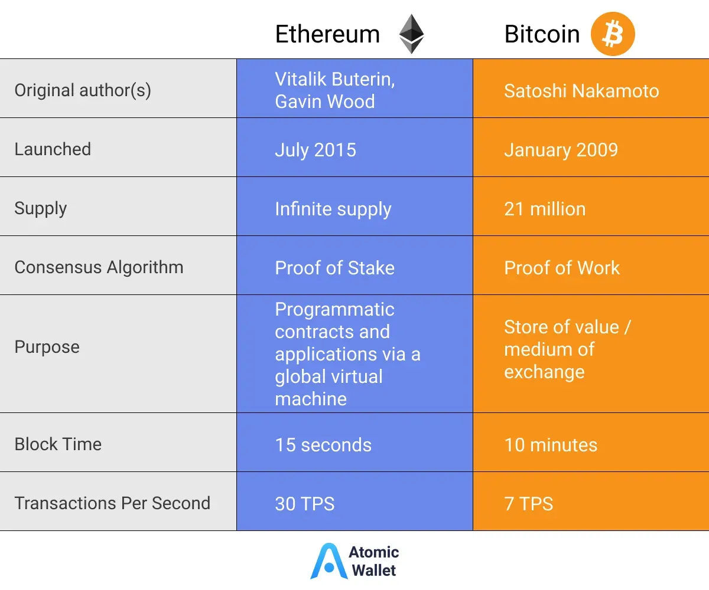

## Table of Contents

## What are Bitcoin and Ethereum?

Bitcoin is a type of digital money that you can use to buy things online. It was created in 2009 by someone using the name Satoshi Nakamoto. Unlike regular money, Bitcoin is not controlled by any government or bank. Instead, it uses a technology called blockchain, which is like a public record of all transactions. People can send and receive Bitcoins through the internet, and it's often used for things like investing or buying stuff on the internet.

Ethereum is another type of digital money, but it also has a platform where people can create and run their own programs, called smart contracts. It was started by a guy named Vitalik Buterin in 2015. Like Bitcoin, Ethereum uses blockchain technology, but it can do more than just handle money. With Ethereum, people can build things like games, apps, and other digital tools. It's popular for people who want to create new types of digital projects and for those who want to invest in this technology.

## How were Bitcoin and Ethereum created?

Bitcoin was created in 2009 by someone using the name Satoshi Nakamoto. Nobody knows who this person really is, but they wrote a paper explaining how Bitcoin could work. They made a computer program that let people send and receive Bitcoins without needing a bank. This program used a special technology called blockchain, which is like a big list that keeps track of all the Bitcoins and who owns them. People started using Bitcoin because they liked the idea of money that nobody could control.

Ethereum was started by Vitalik Buterin in 2015. He was a young programmer who thought it would be cool if digital money could do more than just be money. He wanted to create a system where people could make their own programs, called smart contracts, that could do things automatically. So, he and some other people built Ethereum, which also uses blockchain technology. With Ethereum, people can create all sorts of digital projects, like games and apps, and it became popular quickly because it offered new possibilities for what digital money could do.

## What is the primary purpose of Bitcoin compared to Ethereum?

The main purpose of Bitcoin is to be a type of digital money that people can use to buy things online without needing a bank or government to control it. It was created to let people send and receive money directly to each other, using a special technology called blockchain. This technology keeps a record of all the transactions, making sure that nobody can cheat or spend the same Bitcoin twice.

Ethereum, on the other hand, was created not just as a digital money, but also as a platform where people can build and run their own programs, known as smart contracts. These programs can do things automatically, like making sure a deal is followed correctly without needing a middleman. So, while you can use Ethereum as money, its main purpose is to help people create new types of digital projects, like games and apps, on its platform.

## How do the total supplies of Bitcoin and Ethereum differ?

Bitcoin has a total supply that will never go above 21 million coins. This limit was set by its creator, Satoshi Nakamoto, to make sure Bitcoin stays valuable over time. As of now, most of these Bitcoins have already been made, and the rest will be created slowly until the last one is mined around the year 2140. This fixed supply is one of the reasons some people like to invest in Bitcoin, thinking it will become more valuable as it gets harder to find.

Ethereum, on the other hand, doesn't have a set limit on how many coins can be made. When it started, new Ether (the name for Ethereum's money) was created every time someone helped run the Ethereum network. But, in 2022, Ethereum changed how it works to use less energy, and now the total supply of Ether is expected to stay about the same or grow very slowly. This means that, unlike Bitcoin, the total amount of Ethereum can change over time, depending on how the network is used.

## What are the consensus mechanisms used by Bitcoin and Ethereum?

Bitcoin uses a consensus mechanism called Proof of Work (PoW). This means that to add new transactions to the Bitcoin blockchain, special computers called miners have to solve hard math problems. The first miner to solve the problem gets to add a new block of transactions to the blockchain and is rewarded with new Bitcoins. This process is very energy-intensive because it requires a lot of computing power. PoW helps keep Bitcoin secure because it's hard for anyone to cheat the system; they would need a lot of energy and computing power to do so.

Ethereum used to use Proof of Work too, but in 2022, it switched to a different mechanism called Proof of Stake (PoS). With PoS, instead of solving math problems, people can become validators by locking up, or "staking," some of their Ether. These validators are then chosen to add new blocks to the Ethereum blockchain based on how much Ether they have staked and for how long. This system uses a lot less energy than PoW and is designed to be more eco-friendly. PoS also helps keep the network secure because validators have a lot to lose if they try to cheat the system.

## How do transaction speeds and fees compare between Bitcoin and Ethereum?

Bitcoin transactions can take a while to process, usually between 10 minutes to an hour. This is because the Bitcoin network can only handle a certain number of transactions at once. The fees for Bitcoin transactions can vary a lot, depending on how busy the network is. If you want your transaction to go through faster, you might have to pay a higher fee. On average, Bitcoin transaction fees can be anywhere from a few cents to a few dollars.

Ethereum transactions are usually faster than Bitcoin transactions, often taking just a few seconds to a few minutes. Ethereum can handle more transactions at once than Bitcoin, which helps keep things moving quickly. However, Ethereum transaction fees can also vary a lot, especially when the network is busy. These fees are often higher than Bitcoin's, sometimes costing several dollars per transaction. This is because Ethereum is used for more than just sending money; it's also used for running smart contracts and other applications, which can make the network busier and more expensive to use.

## What are smart contracts and how do they function on Ethereum but not on Bitcoin?

Smart contracts are like special computer programs that run automatically on the Ethereum network. They work a bit like a vending machine: you put in some money, and the machine does what it's supposed to do without anyone else needing to help. On Ethereum, smart contracts can do things like make sure a deal is followed correctly, or automatically send money when certain conditions are met. For example, if you're renting a house, a smart contract could make sure the rent is paid on time and automatically release the payment to the landlord. Because they run on the Ethereum blockchain, smart contracts are secure and nobody can change them once they're set up.

Bitcoin, on the other hand, doesn't support smart contracts in the same way. Bitcoin's main job is to be a type of digital money, and it focuses on sending and receiving that money securely. While there are some basic ways to add extra information to a Bitcoin transaction, like adding a message, it can't run complex programs like Ethereum can. This means Bitcoin can't do things like automatically enforcing deals or running apps. So, if you need something more than just sending money, Ethereum's smart contracts are the way to go.

## How do the programming languages and scripting capabilities of Bitcoin and Ethereum differ?

Bitcoin uses a programming language called Script for its transactions. This language is pretty simple and can only do basic things, like checking if someone has enough Bitcoin to spend or making sure a transaction follows some rules. It's not very flexible, so you can't use it to make complex programs or smart contracts. Bitcoin's Script is mainly used to keep transactions safe and make sure they follow the rules of the Bitcoin network.

Ethereum, on the other hand, uses a more advanced programming language called Solidity. This language lets you write smart contracts, which are like special programs that run automatically on the Ethereum network. With Solidity, you can make all sorts of digital tools, like games, apps, and automatic deals. It's much more flexible than Bitcoin's Script, so people can create a lot more with Ethereum. This is why Ethereum is popular for people who want to build new types of digital projects.

## What are the environmental impacts of Bitcoin mining compared to Ethereum's?

Bitcoin mining uses a lot of energy because it relies on a system called Proof of Work. Miners have to solve hard math problems to add new transactions to the Bitcoin blockchain, and this takes a lot of electricity. Because of this, Bitcoin mining has a big impact on the environment. It's like running a lot of computers all the time, which uses up a lot of power and can lead to more pollution if the electricity comes from sources like coal or gas.

Ethereum used to use Proof of Work too, but it switched to a different system called Proof of Stake in 2022. With Proof of Stake, people can become validators by locking up some of their Ether, and they don't need to solve math problems to add new transactions. This uses a lot less energy than Bitcoin mining, making Ethereum much more eco-friendly. By changing to Proof of Stake, Ethereum has reduced its environmental impact a lot, and it's a big reason why it's seen as a greener option compared to Bitcoin.

## How have Bitcoin and Ethereum been adopted by institutions and in what ways?

Bitcoin has been adopted by some big institutions like banks and investment firms. They see it as a new type of money that can be used for investing. Some of these institutions now offer Bitcoin trading services, where people can buy and sell Bitcoin through them. They also use Bitcoin as a way to store value, similar to gold. This has helped make Bitcoin more mainstream and accepted by more people. However, not all institutions are on board with Bitcoin, and some worry about its ups and downs in value and the energy it uses.

Ethereum has been adopted by institutions in different ways. Many companies and banks are interested in Ethereum because it can do more than just be money; it can run smart contracts and other programs. Some big companies have started using Ethereum to create new types of digital tools, like supply chain management systems or automatic payment systems. This has made Ethereum popular for businesses looking to use blockchain technology for more than just money. Like Bitcoin, not all institutions are fully on board with Ethereum, but its ability to do more things has attracted a lot of interest.

## What are the scalability solutions proposed or implemented by Bitcoin and Ethereum?

Bitcoin has faced challenges with how many transactions it can handle at once, which can slow things down and make fees go up. To fix this, people have come up with a few ideas. One big idea is called the Lightning Network. It's like a shortcut for Bitcoin transactions, letting them happen off the main Bitcoin network. This can make transactions faster and cheaper. Another idea is called Segregated Witness, or SegWit, which changes how data is stored in Bitcoin transactions to make room for more of them. These solutions are trying to help Bitcoin work better and handle more transactions without losing its security.

Ethereum also has its own problems with how many transactions it can process. To solve this, Ethereum is working on something called Ethereum 2.0, or Eth2. This big update is all about making Ethereum faster and able to handle more transactions. One part of Eth2 is called sharding, which splits the Ethereum network into smaller pieces so they can work on different transactions at the same time. Another solution that's already being used is called Layer 2 solutions, like Optimism and Arbitrum. These are like extra layers on top of Ethereum that help speed things up and lower fees. With these changes, Ethereum hopes to keep growing and stay useful for more people and projects.

## How do the governance models of Bitcoin and Ethereum influence their development and future?

Bitcoin's governance is pretty loose and depends a lot on what the community thinks. There isn't one boss or group in charge; instead, people who run the Bitcoin software, called nodes, and the miners who add new transactions to the blockchain have a say in how things go. If someone wants to change Bitcoin, like adding a new feature or fixing a problem, they have to talk it over with everyone else. If most people agree, the change can happen. This way of doing things can be slow, but it helps keep Bitcoin safe and fair because no one person can make big decisions on their own. In the future, this could mean Bitcoin stays strong and trusted, but changes might happen slowly.

Ethereum's governance is a bit different. It has a group called the Ethereum Foundation, which helps guide the project, but it doesn't control everything. The community, including developers and users, also has a big say in what happens. When big changes are needed, like the switch to Proof of Stake, the Ethereum community talks about it a lot and tries to come to an agreement. This can be faster than Bitcoin's way of doing things because there's more of a structure to help move things along. In the future, this might mean Ethereum can change and grow more quickly, but it could also lead to disagreements if not everyone is happy with the direction things are going.

## References & Further Reading

[1]: Nakamoto, S. (2008). ["Bitcoin: A Peer-to-Peer Electronic Cash System."](https://nakamotoinstitute.org/library/bitcoin/)

[2]: Buterin, V. (2013). ["Ethereum White Paper."](https://ethereum.org/en/whitepaper/)

[3]: Schär, F. (2021). ["Decentralized Finance: On Blockchain- and Smart Contract-Based Financial Markets."](https://www.stlouisfed.org/publications/review/2021/02/05/decentralized-finance-on-blockchain-and-smart-contract-based-financial-markets) Federal Reserve Bank of St. Louis Review.

[4]: Ethereum Foundation. ["Ethereum 2.0: Scaling Ethereum."](https://ethereum.org/en/roadmap/scaling/)

[5]: Antonopoulos, A. M. (2017). ["Mastering Bitcoin: Unlocking Digital Cryptocurrencies."](https://books.google.com/books/about/Mastering_Bitcoin.html?id=IXmrBQAAQBAJ) O'Reilly Media.

[6]: Narayanan, A., Bonneau, J., Felten, E., Miller, A., & Goldfeder, S. (2016). ["Bitcoin and Cryptocurrency Technologies: A Comprehensive Introduction."](https://press.princeton.edu/books/hardcover/9780691171692/bitcoin-and-cryptocurrency-technologies) Princeton University Press.

[7]: Jiang, Z., & Liang, J. (2017). ["Cryptocurrency Portfolio Management with Deep Reinforcement Learning."](https://arxiv.org/abs/1612.01277) arXiv preprint arXiv:1612.01277.

[8]: Lopez de Prado, M. (2018). ["Advances in Financial Machine Learning."](https://www.amazon.com/Advances-Financial-Machine-Learning-Marcos/dp/1119482089) Wiley.