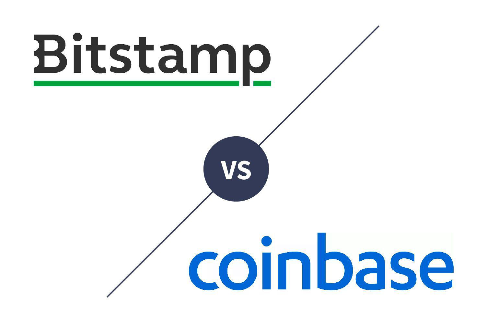

Cryptocurrency trading has emerged as a potent force in the financial world, driven by rapid technological advancements. Key to this evolution are platforms like Coinbase and Bitstamp, which stand as two of the world's leading cryptocurrency exchanges. Each platform offers its own set of unique benefits, appealing to a wide range of traders across the globe.

Coinbase, founded in 2012, is renowned for its user-friendly interface that caters to beginners while offering robust features for seasoned traders. Bitstamp, on the other hand, established in 2011, has built a reputation as a solid choice for experienced traders, with a focus on security and advanced trading options.



A significant development in cryptocurrency trading on these platforms is the integration of algorithmic trading. This form of trading uses automated and pre-programmed trading instructions to efficiently execute trades. Such automation not only reduces the emotional component of trading but also increases the potential for executing trades 24/7 with consistent strategies.

This article examines the distinctive features of Coinbase and Bitstamp, and explores how algorithmic trading is changing the landscape of cryptocurrency transactions. The analysis aims to illuminate what differentiates these exchanges and how they serve various trader preferences and needs. Understanding these dynamics is crucial for traders looking to optimize their strategies in an increasingly complex and competitive market environment.

## Table of Contents

## Overview of Coinbase

Coinbase, established in 2012 by Brian Armstrong and Fred Ehrsam, has emerged as one of the most prominent cryptocurrency exchanges globally. Renowned for its user-friendly interface, it is particularly appealing to novice cryptocurrency traders who seek effortless navigation and accessibility. The platform's intuitiveness is evident in its streamlined design, which facilitates easy buying, selling, and managing of cryptocurrencies.

Coinbase offers a wide repertoire of cryptocurrency options, granting access to over 240 different digital assets. Beyond its trading functionality, Coinbase engages users with staking services, allowing them to earn rewards on certain cryptocurrencies. The reward programs aim to incentivize users further and enhance their overall trading experience by providing additional opportunities to benefit from their holdings.

For those seeking advanced trading functionalities, Coinbase provides a specialized platform known as Coinbase Pro. Tailored for intermediate and advanced traders, this platform delivers enhanced charting tools, order types, and comprehensive analytics. It is designed to support more strategic and informed trading decisions, catering to users who require more sophisticated trading infrastructure.

Security is a paramount concern for Coinbase. The platform employs rigorous security measures, including storing 98% of customer funds in offline cold storage. This system significantly mitigates the risk of hacking and unauthorized access. Additionally, Coinbase ensures that USD balances are covered by Federal Deposit Insurance Corporation (FDIC) insurance, providing added financial security for its United States-based customers. Such robust security measures underscore Coinbase's commitment to protecting users' assets and information.

The combination of user-friendly features, a wide array of cryptocurrencies, advanced trading options, and stringent security protocols positions Coinbase as a versatile platform suitable for both beginner and seasoned [cryptocurrency](/wiki/cryptocurrency) traders.

## Overview of Bitstamp

Bitstamp, founded in 2011, is one of the longest-standing cryptocurrency exchanges, catering primarily to experienced traders. It has built a reputation as a reliable and secure platform within the cryptocurrency community. As of now, Bitstamp provides trading services for over 80 different cryptocurrencies, including well-known assets like Bitcoin (BTC), Ethereum (ETH), and Ripple (XRP), among others. This diverse range of trading pairs allows traders to engage in extensive portfolio diversification and take advantage of various market opportunities.

One of Bitstamp's notable strengths is its competitive fee structure. It offers a tiered fee system based on the trader's 30-[day trading](/wiki/day-trading-spy) [volume](/wiki/volume-trading-strategy), making it particularly attractive for high-frequency and high-volume traders. This fee structure helps in reducing the overall trading costs, which can significantly impact profitability, especially for active traders.

Bitstamp has an impressive record in terms of security. The platform prioritizes safeguarding its digital assets by storing 98% of them in offline, cold storage wallets. This measure drastically reduces the likelihood of successful cyber attacks, providing a secure environment for users' cryptocurrency holdings. Additionally, Bitstamp implements rigorous security protocols and features, such as two-[factor](/wiki/factor-investing) authentication (2FA), to enhance user account protection.

The platform's robustness is further demonstrated by its support for various order types. Traders have the flexibility to execute different trading strategies through market orders, limit orders, stop orders, and other complex order types. This functionality is particularly advantageous for institutional traders and experienced individuals who require sophisticated tools to implement their trading strategies effectively. Bitstamp's interface accommodates API access, allowing users to automate trading strategies through data-driven decisions, which is highly valued by those engaged in [algorithmic trading](/wiki/algorithmic-trading).

Overall, Bitstamp's focus on security, competitive fees, and advanced trading options has established it as a preferred choice for experienced cryptocurrency traders seeking a reliable and versatile trading platform.

## Algorithmic Trading on Coinbase and Bitstamp

Algorithmic trading is a method of executing trades using automated and pre-programmed trading instructions, which accounts for variables such as timing, price, and volume. This approach allows traders to efficiently manage large volumes of transactions simultaneously, thereby reducing the effects of human error and emotional decision-making.

Coinbase provides an accessible API that facilitates automated trading strategies across multiple cryptocurrencies. Through its API, developers can implement various algorithmic trading strategies—such as [market making](/wiki/market-making), statistical [arbitrage](/wiki/arbitrage), or technical analysis-based algorithms—by writing scripts to execute buy and sell orders based on specified conditions. For instance, a user could create a Python script using the `cbpro` package, which interfaces with Coinbase Pro’s public and private API endpoints. Basic functionalities of such a script could look like:

```python
import cbpro

client = cbpro.AuthenticatedClient('your_api_key', 
                                   'your_api_secret', 
                                   'your_passphrase')

def place_buy_order():
    client.place_market_order(product_id='BTC-USD',
                              side='buy',
                              funds='100.00')  # Buys Bitcoin with $100

def place_sell_order():
    client.place_market_order(product_id='BTC-USD',
                              side='sell',
                              size='0.01')  # Sells 0.01 Bitcoin

# Example condition
if market_condition():
    place_buy_order()
else:
    place_sell_order()
```

Bitstamp also offers robust API support, encouraging the development of bots and custom applications for algorithmic trading. This feature enables traders to implement complex trading algorithms that can respond to market shifts in real-time. Users can leverage the Bitstamp API functionalities to create, cancel, and monitor orders, data retrieval, account balances, and transaction histories. For example, setting up a simple bot to execute trades according to moving averages could be easily coded by integrating their API endpoints.

Both platforms distinguish themselves in easily accommodating algorithmic trading setups, whether by individual traders or institutional entities looking to scale their trading operations. By providing comprehensive documentation and tools, they enable traders to create, test, refine, and execute their algorithms efficiently. With API access, traders can leverage market data, backtest strategies against historical data, and monitor performance in real-time to ensure the strategies remain effective and adaptive to market conditions.

However, while these platforms provide the necessary tools, successful algorithmic trading also requires a depth of market knowledge, technical expertise, and risk management skills to navigate potential challenges such as technical failures or abrupt market anomalies.

## Comparing Coinbase and Bitstamp

Coinbase and Bitstamp are two widely recognized cryptocurrency exchanges with distinct characteristics that cater to different types of traders. Coinbase is renowned for its beginner-friendly platform, which simplifies the trading process for newcomers. It emphasizes education and provides numerous learning resources to help users understand the complexities of cryptocurrency trading. Features such as a straightforward user interface and comprehensive customer support make Coinbase an attractive choice for those new to the cryptocurrency market.

In contrast, Bitstamp appeals more to experienced traders, offering advanced trading options that include a variety of order types such as limit, stop, and trailing stop orders. It is known for its competitive fee structure, particularly for traders with significant trading volumes. Generally, Bitstamp offers lower fees compared to Coinbase’s basic platform. However, Coinbase Pro, an advanced version of Coinbase, offers a fee structure that can be competitive with Bitstamp, especially for higher-tier traders.

When it comes to the range of cryptocurrencies available, Coinbase provides a broader selection, giving traders access to over 240 different digital assets. This extensive variety enables traders to diversify their portfolios more easily and provides more opportunities for discovering emerging cryptocurrencies. Bitstamp, on the other hand, supports trading for over 80 cryptocurrencies, focusing on established digital currencies and offering a straightforward approach for those focusing on high-cap market options.

Security is a critical consideration for any cryptocurrency trading platform, and both Coinbase and Bitstamp have implemented robust security measures to protect users' assets. Coinbase is particularly noted for its detailed security documentation and practices, which include storing 98% of customer assets offline in cold storage and providing FDIC insurance for USD balances. Similarly, Bitstamp employs stringent security protocols, storing a significant portion of digital assets offline to prevent unauthorized access.

In summary, the choice between Coinbase and Bitstamp may be influenced by individual trading preferences. Coinbase is suited for beginners who value ease of use and educational support, while Bitstamp caters to seasoned traders seeking advanced trading functions and lower fees. Both platforms maintain strong security standards, albeit with varying transparency in their security practices. Ultimately, traders must weigh these factors when deciding which platform aligns best with their trading strategy and experience level.

## Pros and Cons of Using Algorithmic Trading

Algorithmic trading, a technique leveraging computer algorithms to automate trading strategies, presents a mix of advantages and drawbacks for cryptocurrency traders on platforms like Coinbase and Bitstamp. Among its primary benefits is the ability to execute trades 24/7, thereby capitalizing on market opportunities without the constraints of human availability. This round-the-clock trading capability ensures that traders can respond to market movements in real time, potentially increasing profitability.

Efficiency and consistency are hallmarks of algorithmic trading. Automated systems can process and execute trades faster than any human, significantly reducing the lag time associated with manual trading. Such systems also maintain consistent behavior, following predefined rules and strategies without deviation. This helps minimize the influence of emotions, such as fear or greed, which often impact the decision-making processes of traders.

However, the complexity of algorithmic trading poses notable challenges. Setting up and fine-tuning the trading algorithms requires a significant level of technical knowledge and financial expertise. Developing an algorithm entails defining strategies using programming languages, which can be a barrier for those unfamiliar with coding or quantitative finance.

Algorithms require constant monitoring to remain effective. Market conditions can shift rapidly, rendering a previously successful strategy obsolete. Traders must therefore be vigilant and ready to adapt their algorithms to evolving market situations. This need for oversight contradicts the notion of a fully "hands-off" approach, demanding a blend of automation and human intervention.

Technical failures or market anomalies represent additional risks. Unexpected system downtimes, bugs in the trading algorithms, or sudden market events can lead to substantial losses. Ensuring robust testing and implementing fail-safes or risk management strategies is crucial to mitigate such risks.

Platforms like Coinbase and Bitstamp offer robust tools for algorithmic trading but necessitate a level of technical proficiency to harness them effectively. Both exchanges provide APIs that enable the development and deployment of trading bots. Yet, only traders who understand the intricacies of these systems and maintain a proactive approach to monitoring and adaptation can truly maximize the benefits of algorithmic trading.

## Conclusion

Both Coinbase and Bitstamp serve as leading cryptocurrency exchanges, each distinguished by unique features that tailor to varying trading needs. Coinbase's platform is notably beginner-friendly, offering an accessible entry point for novice traders and a wider range of cryptocurrency options. Conversely, Bitstamp's structure and fee model appeal more to seasoned traders who require robust trading options and lower transaction costs.

Algorithmic trading is an advanced domain suitable for experienced traders aiming to automate their strategies on these exchanges. It allows for the implementation of programmed trading instructions, thus optimizing the execution of trades across multiple currency pairs efficiently. Algorithms, when properly set, execute trades with precision, significantly reducing the impact of human emotions in trading decisions. However, developing and deploying these trading algorithms requires a deep understanding of both the technical and financial aspects involved.

The decision to choose between Coinbase and Bitstamp largely hinges on personal preferences relating to user experience, fee structures, and the breadth of trading options. Coinbase is better suited for those who value ease of use and a vast selection of cryptocurrencies. In contrast, Bitstamp is more appropriate for individuals prioritizing advanced trading features and competitive fees.

Irrespective of the platform used, traders must recognize the inherent risks and complexities of algorithmic trading. This includes not only constant monitoring and adjustment of strategies to accommodate market shifts, but also an awareness of potential technical failures. Having a sound understanding of these considerations is crucial for leveraging the benefits of algorithmic trading effectively.

## References & Further Reading

[1]: Coinbase. (2023). ["API Documentation."](https://docs.cdp.coinbase.com/)

[2]: Bitstamp. (2023). ["API Documentation."](https://www.bitstamp.net/api/)

[3]: Jha, N. K., & Bhavnani, S. (2018). ["Algorithmic Trading in Cryptocurrency Markets: A Data-driven Analysis."](https://www.researchgate.net/publication/329498105_A_High-Frequency_Algorithmic_Trading_Strategy_for_Cryptocurrency) arXiv.

[4]: Narang, R. K. (2013). ["Inside the Black Box: A Simple Guide to Quantitative and High-Frequency Trading."](https://onlinelibrary.wiley.com/doi/book/10.1002/9781118662717) Wiley.

[5]: Hull, J. C. (2018). ["Options, Futures, and Other Derivatives."](https://www.semanticscholar.org/paper/Options%2C-Futures%2C-and-Other-Derivatives-Hull/89bdee500c8623864fc9eb7a471546aa713acc44) Pearson Education, 10th Edition.