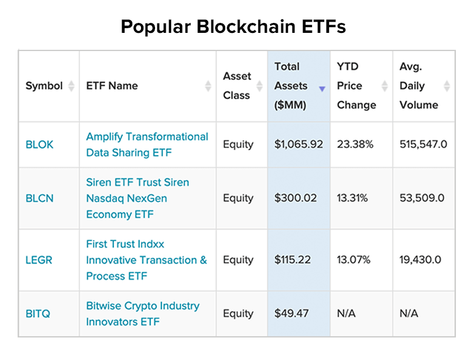

## Table of Contents

## What is a blockchain?

A blockchain is like a digital notebook where lots of people can write information, but once something is written, it can't be changed or erased. It's made up of many pages, called blocks, and each block is filled with information about transactions, like buying or selling something. These blocks are connected in a chain, so if you want to change something in an old block, you'd have to change all the blocks that come after it, which is really hard to do.

People use blockchains to keep track of things securely without needing a boss or a central place to manage everything. For example, cryptocurrencies like Bitcoin use blockchains to record who owns what and who sent money to whom. Because the information is spread out across many computers and everyone can see it, it's hard for anyone to cheat or mess with the records. This makes blockchains useful for things like banking, voting, and keeping records safe.

## What is Bitcoin?

Bitcoin is a type of digital money that you can use to buy things online. It's different from regular money because it's not controlled by any government or bank. Instead, it uses a special system called blockchain to keep track of who owns what. You can send Bitcoin to anyone with an internet connection, and it's fast and usually doesn't cost much to do.

People store their Bitcoin in something called a digital wallet, which is like a safe place on your computer or phone. To use Bitcoin, you need a special code called a private key, which is like a secret password that lets you spend your Bitcoin. Bitcoin started in 2009 and has become popular because it gives people more control over their money and can be used anywhere in the world.

## What are ETFs?

ETFs, or Exchange-Traded Funds, are like baskets that hold a bunch of different investments, like stocks, bonds, or commodities. They are traded on stock exchanges, just like regular stocks, which means you can buy and sell them throughout the day. This makes it easy for people to invest in a variety of assets without having to buy each one separately.

ETFs are popular because they offer a simple way to diversify your investments. Instead of [picking](/wiki/asset-class-picking) individual stocks, you can buy one [ETF](/wiki/etf-trading-strategies) that holds many different stocks or other assets. This can help spread out the risk, so if one investment doesn't do well, the others might make up for it. Plus, ETFs often have lower fees than other types of funds, which can save you money over time.

## How do Blockchain ETFs work?

Blockchain ETFs are special kinds of investment funds that focus on companies involved in blockchain technology. Just like regular ETFs, you can buy and sell these on stock exchanges during the day. The companies in these ETFs might be working on cryptocurrencies like Bitcoin, or they might be developing other uses for blockchain, like secure record-keeping or supply chain management. By investing in a Blockchain ETF, you're betting that these companies will do well as blockchain technology grows.

These ETFs work by tracking an index or a set of rules that decide which blockchain-related companies to include. The ETF manager picks the companies and decides how much of each to buy, trying to match the performance of the index they're following. This means your investment in the ETF goes up or down based on how well the companies in the index are doing. It's a way to invest in the future of blockchain without having to pick individual companies yourself.

## How do Bitcoin ETFs work?

Bitcoin ETFs are a type of investment fund that you can buy and sell on stock exchanges, just like regular stocks. They let you invest in Bitcoin without actually owning the [cryptocurrency](/wiki/cryptocurrency) directly. Instead, the ETF holds Bitcoin or Bitcoin futures contracts, which are agreements to buy or sell Bitcoin at a future date. When you buy shares of a Bitcoin ETF, you're betting that the price of Bitcoin will go up, and if it does, the value of your ETF shares will also go up.

The way a Bitcoin ETF works is by tracking the price of Bitcoin. The fund manager buys Bitcoin or Bitcoin futures and then divides this into shares that people can buy. If the price of Bitcoin goes up, the value of the ETF goes up too, and if the price goes down, the ETF value goes down. This makes it easier for people who want to invest in Bitcoin but don't want to deal with the complexities of buying and storing the cryptocurrency themselves.

## What are the key differences between Blockchain and Bitcoin ETFs?

Blockchain ETFs and Bitcoin ETFs are both investment funds you can buy on stock exchanges, but they focus on different things. A Blockchain ETF invests in a bunch of companies that work with blockchain technology. This could include companies that make cryptocurrencies like Bitcoin, but also companies that use blockchain for other stuff, like keeping records safe or tracking goods in a supply chain. So, when you buy a Blockchain ETF, you're betting on the growth of lots of different companies in the blockchain world.

On the other hand, a Bitcoin ETF focuses only on Bitcoin. It tracks the price of Bitcoin by holding the cryptocurrency or Bitcoin futures contracts. When you buy a Bitcoin ETF, you're betting that the price of Bitcoin will go up. This is a more direct way to invest in Bitcoin without having to buy and store the cryptocurrency yourself. So, while a Blockchain ETF gives you a broader exposure to the blockchain industry, a Bitcoin ETF is all about the performance of Bitcoin itself.

## What are the investment risks associated with Blockchain ETFs?

Investing in Blockchain ETFs comes with some risks. One big risk is that the whole blockchain industry is still pretty new and can be unpredictable. If people lose interest in blockchain or if there are big problems with the technology, the companies in the ETF might not do well, and the value of your investment could go down. Another risk is that the ETF might not pick the best companies to invest in, or it might focus too much on certain types of companies, which can make your investment less safe.

Also, since Blockchain ETFs often include companies that are new or smaller, they can be more likely to fail or have big changes in their stock prices. This can make the value of the ETF go up and down a lot, which might be too risky for some people. Plus, because blockchain is linked to cryptocurrencies like Bitcoin, if the crypto market has a big drop, it could hurt the companies in the ETF, even if they're not directly involved in cryptocurrencies. So, it's important to think about these risks before you decide to invest in a Blockchain ETF.

## What are the investment risks associated with Bitcoin ETFs?

Investing in Bitcoin ETFs can be risky because they are closely tied to the price of Bitcoin. If Bitcoin's price goes down a lot, the value of your Bitcoin ETF will go down too. Bitcoin is known for having big price swings, so your investment could change a lot in a short time. This can be exciting, but it can also be scary if you're not ready for it. Also, since Bitcoin ETFs don't hold the actual cryptocurrency, they might use futures contracts instead, which can add more risk because futures can be tricky and unpredictable.

Another risk is that Bitcoin and other cryptocurrencies are not controlled by governments or banks, so they can be affected by things like new laws or rules that might make them less popular or harder to use. If a country decides to ban Bitcoin, for example, it could hurt the value of your ETF. Plus, since Bitcoin ETFs are new, they might not be as easy to buy and sell as other types of investments, which could make it harder to get your money out when you want to. So, it's important to think about these risks before you decide to invest in a Bitcoin ETF.

## How have Blockchain ETFs performed historically?

Blockchain ETFs have been around since about 2017, and their performance has been a bit of a roller coaster. They tend to go up and down a lot because they are tied to the blockchain industry, which is still new and can be unpredictable. When the interest in blockchain and cryptocurrencies like Bitcoin is high, these ETFs can do really well. For example, during the big crypto boom in late 2020 and early 2021, many Blockchain ETFs saw big gains. But when the market cools down or if there are problems with the technology or the companies involved, the ETFs can lose value quickly.

Over the years, the performance of Blockchain ETFs has depended a lot on how the broader crypto market is doing. If Bitcoin and other cryptocurrencies are doing well, the ETFs usually follow suit. But if there's a big drop in crypto prices, like the one that happened in 2018 or in the second half of 2022, the ETFs can suffer big losses. So, while some investors have made money from Blockchain ETFs, others have lost money, showing that these investments can be risky and it's important to be ready for big ups and downs.

## How have Bitcoin ETFs performed historically?

Bitcoin ETFs have been around for a shorter time than Blockchain ETFs, with the first ones launching in late 2021. Their performance has been closely tied to the price of Bitcoin itself. When Bitcoin goes up, Bitcoin ETFs usually go up too, and when Bitcoin goes down, the ETFs go down. For example, in late 2021, when Bitcoin hit its all-time high, Bitcoin ETFs saw big gains. But in 2022, when Bitcoin's price fell a lot, the ETFs also lost a lot of value. This shows that Bitcoin ETFs can be very risky because they follow the ups and downs of Bitcoin so closely.

Because Bitcoin ETFs are new, there isn't a long history to look at yet. But so far, they have shown that they can be very volatile. If you invest in a Bitcoin ETF, you might make a lot of money if Bitcoin does well, but you could also lose a lot if Bitcoin's price drops. It's important to understand that Bitcoin ETFs are not for everyone because of how much their value can change in a short time. If you're thinking about investing in one, it's a good idea to be ready for big swings in the value of your investment.

## What regulatory considerations should be taken into account for Blockchain and Bitcoin ETFs?

When thinking about investing in Blockchain or Bitcoin ETFs, it's important to know about the rules that governments and financial watchdogs have set up. These rules can be different in each country. For example, in the United States, the Securities and Exchange Commission (SEC) keeps a close eye on ETFs. They want to make sure these funds are safe and fair for people to invest in. The SEC has been careful about approving Bitcoin ETFs because they worry about things like fraud and the wild swings in Bitcoin's price. For Blockchain ETFs, the rules can be a bit easier because they invest in companies, not just Bitcoin, but they still have to follow strict rules about what they can and can't do.

Another thing to think about is how new laws might change the future of Blockchain and Bitcoin ETFs. Governments might decide to make new rules that could make it harder or easier to invest in these ETFs. For example, if a country decides to ban or limit cryptocurrencies, it could hurt Bitcoin ETFs a lot. On the other hand, if a country makes rules that help blockchain technology grow, it could be good for Blockchain ETFs. So, it's a good idea to keep an eye on what lawmakers and regulators are doing because their decisions can have a big impact on your investments.

## What advanced strategies can investors use when investing in Blockchain and Bitcoin ETFs?

When investing in Blockchain and Bitcoin ETFs, one advanced strategy is to use dollar-cost averaging. This means you put in the same amount of money regularly, no matter if the price is high or low. Over time, this can help you buy more shares when the price is low and fewer when it's high, which can make your overall cost lower. Another strategy is to use stop-loss orders. This is a way to tell your broker to sell your shares if the price drops to a certain level. It can help you limit how much money you might lose if the ETF's value goes down a lot.

Another smart move is to diversify your investments. Instead of putting all your money into one Blockchain or Bitcoin ETF, you could spread it out across different ETFs or even mix in other types of investments like stocks or bonds. This can help lower your risk because if one investment does badly, the others might do better and balance things out. Also, keeping up with news and trends in the blockchain and crypto world can help you make better choices. Knowing what's going on can give you a heads-up on when to buy or sell your ETFs.

## References & Further Reading

[1]: Biais, B., Bisiere, C., Bouvard, M., & Casamatta, C. (2019). ["The Blockchain Folk Theorem,"](https://academic.oup.com/rfs/article/32/5/1662/5427771) American Economic Review, 109(6), 1753-1778.

[2]: Malkiel, B. G. (2019). ["A Random Walk Down Wall Street: The Time-Tested Strategy for Successful Investing"](https://yourknowledgedigest.org/wp-content/uploads/2020/04/a-random-walk-down-wall-street.pdf), W. W. Norton & Company.

[3]: Liew, J., & Hewlett, J. (2017). ["The Case for Bitcoin as a Portfolio Diversifier: A Cautionary Tale."](https://papers.ssrn.com/sol3/papers.cfm?abstract_id=3082808) Forthcoming in The Journal of Alternative Investments.

[4]: Narang, R. K. (2013). ["Inside the Black Box: A Simple Guide to Quantitative and High-Frequency Trading"](https://onlinelibrary.wiley.com/doi/book/10.1002/9781118662717), Wiley.

[5]: Fabozzi, F. J., Focardi, S. M., & Kolm, P. N. (2010). ["Quantitative Equity Investing: Techniques and Strategies"](https://www.semanticscholar.org/paper/Quantitative-Equity-Investing%3A-Techniques-and-Fabozzi-Focardi/1c49a2a53919f7e65cb96f16691b8ff726fd3cd7), Wiley.