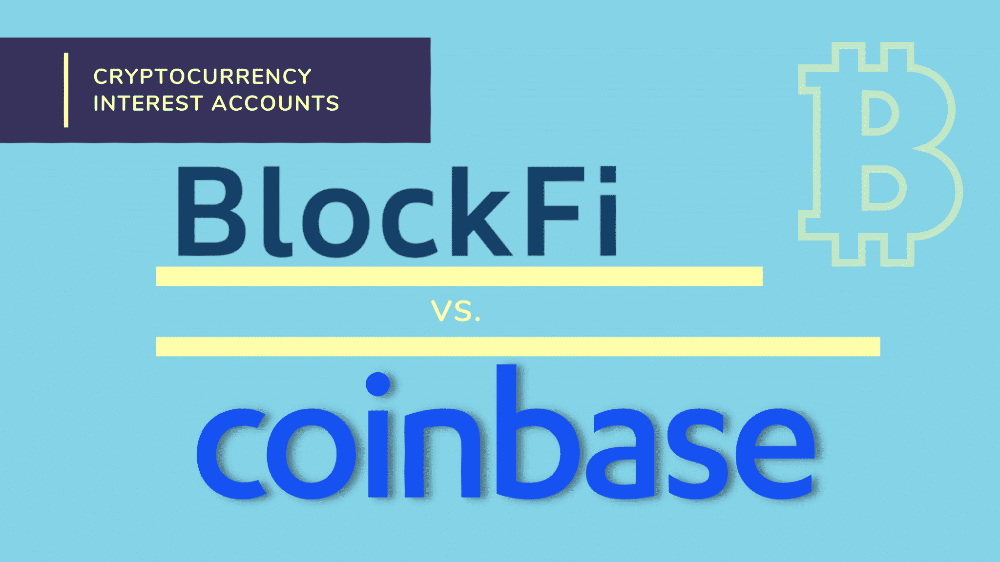

## Table of Contents

## What are BlockFi and Coinbase?

BlockFi is a company that lets you borrow money and earn interest using your cryptocurrencies. You can use your Bitcoin or other digital coins as a way to get a loan, or you can put your crypto in their accounts to earn interest over time. It's like a bank, but for cryptocurrencies. They help people who want to use their digital money in different ways, not just holding onto it.

Coinbase is a place where you can buy, sell, and store cryptocurrencies easily. It's like an online marketplace where you can trade different types of digital money, like Bitcoin, Ethereum, and many others. Coinbase makes it simple for people who are new to cryptocurrencies to start using them. They also have a wallet where you can keep your digital money safe.

## How do BlockFi and Coinbase generate revenue?

BlockFi makes money in a few ways. One way is by lending out the cryptocurrencies that people deposit with them. When people put their Bitcoin or other digital coins into BlockFi's interest accounts, BlockFi can then lend those coins to others and charge interest on the loans. This interest is how they make money. Another way BlockFi earns revenue is by charging fees on the loans they give to people who use their cryptocurrencies as collateral. So, when someone borrows money from BlockFi using their crypto as a guarantee, BlockFi charges a fee for that service.

Coinbase earns money mainly through fees. Every time someone buys or sells cryptocurrencies on Coinbase, they charge a small fee for the transaction. This fee can vary depending on how much you're trading and how you're paying. Coinbase also makes money from something called the "spread," which is the difference between the price they buy a [cryptocurrency](/wiki/cryptocurrency) for and the price they sell it at. Additionally, Coinbase offers services like Coinbase Pro and Coinbase Wallet, which might have their own fees or ways of making money. So, every time you use Coinbase to trade or store your digital money, they're [earning](/wiki/earning-announcement) a little bit from you.

## What types of cryptocurrencies can be traded on BlockFi versus Coinbase?

BlockFi lets you trade and use a few popular cryptocurrencies. You can put in Bitcoin (BTC), Ethereum (ETH), and stablecoins like USD Coin (USDC) and Gemini Dollar (GUSD) to earn interest or use them as collateral for loans. BlockFi keeps things simple by focusing on these main cryptocurrencies, which are well-known and widely used.

Coinbase, on the other hand, offers a much bigger list of cryptocurrencies. You can trade over 100 different types of digital money on Coinbase, including Bitcoin, Ethereum, Litecoin, and many others. They keep adding new cryptocurrencies, so if you're looking for variety, Coinbase has a lot more options to choose from than BlockFi.

## What are the fee structures for BlockFi and Coinbase?

BlockFi has pretty simple fees. When you take out a loan using your cryptocurrencies as collateral, they charge an origination fee. This fee can be between 1% to 5% of the loan amount. There are also interest rates on the loans you take out, and these rates can change depending on the loan size and the type of cryptocurrency you use. For their interest accounts, BlockFi doesn't charge any fees for depositing or withdrawing your cryptocurrencies, but they do take a small percentage of the interest you earn as their fee.

Coinbase's fees are a bit more complicated because they depend on what you're doing. When you buy or sell cryptocurrencies, Coinbase charges a fee that can be anywhere from 0.5% to 4.5%. The exact fee depends on things like how much you're trading, what payment method you're using, and whether you're using Coinbase's regular platform or Coinbase Pro. Coinbase Pro has lower fees, usually around 0.5% or less, but it's meant for more experienced traders. There's also a fee for transferring cryptocurrencies in and out of Coinbase, and this fee changes based on which cryptocurrency you're moving.

## How do the interest rates for borrowing and lending compare between BlockFi and Coinbase?

BlockFi offers interest rates for both lending and borrowing. When you lend your cryptocurrencies to BlockFi by putting them in their interest accounts, you can earn interest. The rates can change, but for example, you might get around 4-8% per year for Bitcoin and up to 9% for stablecoins like USDC. When you borrow money from BlockFi using your cryptocurrencies as collateral, the interest rates are higher. For example, borrowing against Bitcoin might cost you around 4.5% to 9.75% per year, depending on how much you borrow and other factors.

Coinbase, on the other hand, doesn't offer traditional lending and borrowing services like BlockFi. Instead, Coinbase focuses on trading and storing cryptocurrencies. They do have a feature called Coinbase Borrow, but it's limited to borrowing against Bitcoin, and the [interest rate](/wiki/interest-rate-trading-strategies) is fixed at around 8% per year. If you're looking to earn interest on your cryptocurrencies, Coinbase has a product called Coinbase Earn, where you can earn different cryptocurrencies by learning about them, but it's not the same as earning interest on your holdings like you would with BlockFi.

## What are the security measures implemented by BlockFi and Coinbase?

BlockFi takes security seriously to protect your cryptocurrencies. They use strong encryption to keep your data safe when you're using their website or app. They also keep most of your cryptocurrencies in offline storage, called cold storage, which makes it harder for hackers to steal them. BlockFi also has insurance to cover losses if something goes wrong. They check everyone who works for them carefully and use two-[factor](/wiki/factor-investing) authentication to make sure only you can access your account. They also watch for any strange activity to stop fraud before it happens.

Coinbase also works hard to keep your digital money safe. They use encryption to protect your information and keep most of your cryptocurrencies in cold storage, just like BlockFi. Coinbase has insurance to help if there's a security problem. They make sure their employees are trustworthy and use two-factor authentication to keep your account secure. Coinbase also keeps an eye out for anything unusual and has a team that works all the time to find and fix security issues. They even offer a reward if you can find a way to make their security better.

## How user-friendly are the BlockFi and Coinbase platforms for beginners?

BlockFi is pretty easy to use, even if you're new to cryptocurrencies. When you go to their website, it's clean and simple, so you can quickly figure out how to start earning interest or take out a loan. They explain everything in a way that's easy to understand, and they have a helpful support team if you have questions. But, BlockFi doesn't have as many cryptocurrencies to choose from, so if you want to use different types of digital money, you might find it a bit limited.

Coinbase is very user-friendly for beginners. Their website and app are designed to be easy to use, with clear instructions on how to buy, sell, and store cryptocurrencies. They have a lot of different digital money to choose from, so you can try out different types easily. Coinbase also has a lot of guides and support to help you learn about cryptocurrencies. The only thing is, with so many options and features, it might feel a bit overwhelming at first, but they do a good job of making it simple for new users.

## What are the withdrawal and deposit limits for BlockFi and Coinbase?

BlockFi has different limits for depositing and withdrawing your cryptocurrencies. When you want to put money into BlockFi, there's usually no limit on how much you can deposit, but it depends on the type of cryptocurrency. For example, you can deposit as much Bitcoin or Ethereum as you want, but for stablecoins like USDC, there might be a daily limit. When you want to take your money out, BlockFi has withdrawal limits to keep things safe. For Bitcoin, you might be able to withdraw up to 100 BTC per day, but this can change based on your account and how long you've been using BlockFi.

Coinbase also has rules about how much you can deposit and withdraw. When you deposit money into Coinbase, the limits can be different depending on how you're paying. If you use a bank account or a debit card, you might be able to deposit up to $25,000 per day, but if you use a credit card, the limit might be lower. For withdrawing money, Coinbase has daily limits too. You might be able to take out up to $10,000 per day if you're using a bank transfer, but again, this can change based on your account's verification level and how long you've been using Coinbase.

## How do BlockFi and Coinbase handle customer support and dispute resolution?

BlockFi has a good customer support team that you can reach through email or by filling out a form on their website. They try to answer your questions quickly, usually within a day or two. If you have a problem or a dispute, like if you think there's a mistake with your account, you can reach out to them. They'll look into it and try to fix it. BlockFi also has a clear way to handle disputes, so you know what to expect. They want to make sure you're happy and trust them with your cryptocurrencies.

Coinbase also has a strong customer support system. You can get help through their website, by email, or even through social media. They have a lot of help articles and guides to answer common questions, which is great if you're new to cryptocurrencies. If you have a dispute or a problem, like a transaction issue, you can contact their support team. They'll work to solve it and keep you updated. Coinbase has a clear process for disputes too, so you know how they'll handle it. They want to make sure you feel supported and safe using their platform.

## What advanced trading features does Coinbase offer that BlockFi does not?

Coinbase offers a lot more advanced trading features than BlockFi. One big feature is Coinbase Pro, which is made for people who trade a lot and want more control. On Coinbase Pro, you can use different types of orders, like limit orders and stop orders, to buy and sell cryptocurrencies at the prices you want. You can also see more detailed charts and graphs to help you make better decisions. Plus, the fees on Coinbase Pro are lower than on the regular Coinbase, so it's good if you're trading a lot.

Another feature Coinbase has is something called staking. With staking, you can earn more cryptocurrencies by holding onto certain types of digital money, like Ethereum 2.0 or Cardano. It's like earning interest, but it's a bit different. BlockFi doesn't offer staking, so if you want to do that, Coinbase is the place to go. Coinbase also lets you trade more cryptocurrencies than BlockFi, so if you're into different types of digital money, Coinbase gives you more options and tools to work with.

## How do the insurance policies of BlockFi and Coinbase protect user funds?

BlockFi has insurance to help keep your cryptocurrencies safe. They work with a company called Fireblocks to store most of your digital money in cold storage, which means it's kept offline where hackers can't easily get to it. BlockFi also has insurance from another company called Lloyd's of London. This insurance covers losses if something goes wrong, like if there's a security breach. So, if someone steals your cryptocurrencies from BlockFi, this insurance can help get your money back. It's a way to make sure your digital money is protected even if something bad happens.

Coinbase also uses insurance to protect your cryptocurrencies. They keep most of your digital money in cold storage too, which makes it harder for hackers to steal. Coinbase has insurance from a company called Aon, which covers losses up to $255 million if there's a security problem. This means if someone hacks into Coinbase and steals your cryptocurrencies, the insurance can help replace what was taken. Coinbase wants to make sure you feel safe using their platform, so they use this insurance to give you extra protection.

## What are the long-term investment options available on BlockFi compared to Coinbase?

BlockFi offers a few long-term investment options that are easy to understand. One way you can invest long-term with BlockFi is by putting your cryptocurrencies into their interest accounts. You can earn interest on Bitcoin, Ethereum, and stablecoins like USDC over time. This is like putting money in a savings account, but with digital money. The interest rates can change, but it's a way to grow your cryptocurrencies slowly over the long run. Another option is borrowing money against your cryptocurrencies. While this isn't exactly an investment, it can help you use your digital money to do other things, like invest in other assets or start a business.

Coinbase has different long-term investment options that might be more exciting for some people. One way to invest long-term on Coinbase is by using their staking feature. With staking, you can earn more cryptocurrencies just by holding onto certain types of digital money, like Ethereum 2.0 or Cardano. It's a bit like earning interest, but it's a way to support the cryptocurrency network and get rewarded for it. Another long-term option is trading on Coinbase Pro, where you can use advanced tools to buy and sell cryptocurrencies at the prices you want. This can help you make smarter trading decisions and potentially grow your investments over time. Coinbase also lets you invest in a wider variety of cryptocurrencies, so you have more choices for your long-term strategy.

## References & Further Reading

[1]: ["Advances in Financial Machine Learning"](https://www.amazon.com/Advances-Financial-Machine-Learning-Marcos/dp/1119482089) by Marcos Lopez de Prado

[2]: ["Machine Learning for Algorithmic Trading"](https://github.com/stefan-jansen/machine-learning-for-trading) by Stefan Jansen

[3]: ["Quantitative Trading: How to Build Your Own Algorithmic Trading Business"](https://www.amazon.com/Quantitative-Trading-Build-Algorithmic-Business/dp/1119800064) by Ernest P. Chan

[4]: Singal, A. (2011). ["Beyond the Random Walk: A Guide to Stock Market Anomalies and Low-Risk Investing."](https://academic.oup.com/book/54648) Oxford University Press.

[5]: Narang, R. K. (2013). ["Inside the Black Box: A Simple Guide to Quantitative and High-Frequency Trading."](https://onlinelibrary.wiley.com/doi/book/10.1002/9781118662717) Wiley Trading.