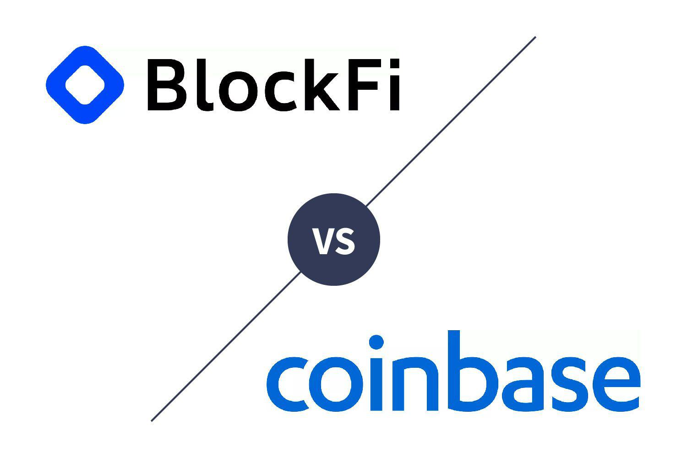

The evolution of cryptocurrency exchanges has indeed transformed the landscape of digital money management, offering unprecedented opportunities for both individual and institutional investors. Among the frontrunners in this arena are BlockFi and Coinbase, each of which provides distinctive features catering to different investor profiles. BlockFi is known for its banking-like services, such as interest-bearing accounts and crypto-backed loans, offering a unique angle on crypto asset management. On the other hand, Coinbase stands out as a comprehensive exchange platform with a wide array of cryptocurrencies available for trade, appealing to those who seek variety and depth in their trading activities.

Algo trading, or algorithmic trading, is rapidly gaining traction as it significantly enhances the efficiency and effectiveness of trading activities. By leveraging advanced computer algorithms, traders can swiftly analyze market trends, execute orders at optimal prices, and manage complex trading strategies far beyond human capabilities in terms of speed and accuracy. This has proven particularly beneficial in the volatile and fast-paced cryptocurrency market, where capturing micro-trends and swiftly executing trades can yield substantial advantages.



This article aims to explore the intersection of BlockFi, Coinbase, and algorithmic trading in the cryptocurrency market. By examining the features, benefits, and trading capabilities of these platforms, we aim to provide insights into how they can be integrated into robust trading and investment strategies, ultimately enhancing portfolio performance.

## Table of Contents

## Understanding BlockFi and Coinbase

BlockFi and Coinbase are two prominent cryptocurrency platforms based in the United States, each offering distinct services catering to various investor needs.

BlockFi provides a suite of financial services resembling traditional banking products, including loans and interest-bearing accounts alongside its trading functionalities. Users can leverage their crypto holdings to secure loans, providing liquidity without necessitating the sale of their assets. Additionally, BlockFi enables users to earn interest on their cryptocurrency holdings, acting as a bridge between conventional finance and digital assets. The platform's emphasis on financial products positions it as a versatile choice for users looking to maximize returns on their investments through interest earnings.

Coinbase, on the other hand, is a publicly traded cryptocurrency exchange known for its comprehensive offering of exchange services. The platform supports a wide array of cryptocurrencies, enabling users to buy, sell, and trade a diverse range of digital assets. As a publicly traded company on the Nasdaq, Coinbase adheres to rigorous regulatory standards, enhancing its credibility and security. The platform's focus on security and regulatory compliance makes it a reliable option for investors prioritizing safety in their trading activities.

Both platforms prioritize security and regulatory compliance to protect users' assets and personal information. BlockFi implements robust security measures, including two-[factor](/wiki/factor-investing) authentication (2FA) and encrypted data storage, while Coinbase incorporates advanced security features such as biometric logins and insurance coverage for digital assets held on the platform.

In summary, while BlockFi focuses on integrating [cryptocurrency](/wiki/cryptocurrency) with traditional financial services to provide added value through banking products, Coinbase excels in offering diverse exchange services and a broad range of cryptocurrencies, backed by strong security and regulatory adherence.

## Algo Trading in the Cryptocurrency Space

Algorithmic trading, often referred to as algo trading, employs computer algorithms to automate trading decisions and order placements in financial markets, including cryptocurrencies. These algorithms are designed to execute defined instructions based on variables such as timing, price, and [volume](/wiki/volume-trading-strategy), optimizing the trading process by reducing the latency associated with human intervention.

One of the core advantages of [algorithmic trading](/wiki/algorithmic-trading) is its ability to process intricate trading strategies and execute orders at optimal prices. By analyzing large data sets and leveraging advanced mathematical models, algo trading systems can identify trading opportunities that may be imperceptible to human traders. These systems can optimize entry and [exit](/wiki/exit-strategy) strategies through predefined rules, thus maximizing potential profits while minimizing losses.

In the volatile and rapidly changing cryptocurrency markets, the speed and precision of algo trading are particularly advantageous. Algorithms can capture fleeting micro-trends and execute trades at speeds far exceeding human capability, often in fractions of a second. This ability to react almost instantaneously to market fluctuations provides a significant edge in a market characterized by high [volatility](/wiki/volatility-trading-strategies) and [liquidity](/wiki/liquidity-risk-premium).

Algo trading systems also play a crucial role in market-making and [arbitrage](/wiki/arbitrage) trading strategies. Market-making involves simultaneously buying and selling a specific cryptocurrency to profit from the bid-ask spread. Algorithms can efficiently manage these orders across numerous exchanges, ensuring liquidity and stability in the market. Similarly, algorithmic strategies can be employed to exploit price discrepancies of the same asset across different exchanges, known as arbitrage opportunities, thereby realizing risk-free profits.

Moreover, algorithmic trading can integrate [machine learning](/wiki/machine-learning) techniques and [artificial intelligence](/wiki/ai-artificial-intelligence) to further enhance trading outcomes. By continuously learning from market data, these systems can adapt to new market conditions and recognize emerging patterns, improving their predictive accuracy over time.

For traders and investors venturing into the cryptocurrency market, algo trading opens up new possibilities of strategy automation and risk management. However, successful implementation requires substantial knowledge in coding, trading, and risk assessment. Ensuring robust [backtesting](/wiki/backtesting) of these algorithms against historical data is essential to validate their effectiveness before deploying them in live markets. Managing risk remains a paramount concern, necessitating continuous monitoring and adjustment of algorithms to adapt to market dynamics and regulatory considerations.

## BlockFi and Algo Trading

BlockFi's primary focus is on financial products, particularly interest-bearing accounts that provide an attractive alternative to direct algorithmic trading. By storing digital assets in these accounts, users can earn interest, adding a passive income stream to complement their algorithmic trading strategies executed on other platforms. This approach allows investors to maintain liquidity while maximizing returns through compounded interest gains. 

In addition to interest accounts, BlockFi offers cash loans secured by cryptocurrency collateral. This feature enables traders to access liquidity without needing to liquidate their holdings, thereby allowing them to maintain their market positions and potentially benefit from future price movements. Such a mechanism can be beneficial when conducting algorithmic trading, as it provides flexibility and leverage to handle unforeseen market shifts without sacrificing asset stability.

For example, an algorithmic trader might wish to access additional funds to capitalize on a market opportunity identified by their trading algorithms. By taking out a crypto-backed loan with BlockFi, the trader could increase their trading capital, potentially increasing their returns without selling off their existing assets. This synergy between interest accounts and flexible loan options offers a comprehensive financial toolkit that aligns well with strategic trading goals.

Effectively incorporating BlockFi's offerings into an algorithmic trading strategy involves assessing the trade-off between risk and reward. While the interest earned on deposits can serve as a steady return, the risk associated with borrowing against asset security must be managed carefully to avoid asset liquidation triggered by market volatility. Investors should use tools such as risk assessment models to evaluate the potential impacts of leveraging assets through loans, ensuring that their trading algorithms can tolerate adverse market conditions.

In conclusion, BlockFi's financial products provide substantial utility in augmenting an algorithmic trading strategy. By leveraging the passive income from interest accounts and the liquidity features of crypto-backed loans, investors can enhance their portfolio performance while maintaining optimal risk management practices.

## Coinbase and Algo Trading

Coinbase stands as a prominent figure in the cryptocurrency exchange space, supporting a wide array of cryptocurrencies and offering a robust platform for algorithmic trading. Its API interface is a pivotal feature that facilitates the seamless integration of custom algorithmic trading strategies. By utilizing the API, traders can tap into real-time market data, execute trades programmatically, and implement complex trading algorithms tailored to their unique strategies.

Coinbase Pro, the platform's advanced trading offering, equips users with sophisticated tools necessary for optimizing trading performance. These features include detailed charting tools, various order types, and lower fees, which are particularly beneficial for high-frequency traders utilizing algorithms. The ability to develop and implement strategies such as arbitrage, mean reversion, and [trend following](/wiki/trend-following) is enhanced significantly with Coinbase Pro's comprehensive suite of resources.

The trading environment provided by Coinbase is crafted to cater to both novice and seasoned algorithmic traders. By facilitating access to data-driven insights, it empowers traders to automate decision-making processes, minimize human error, and capitalize on market efficiencies. Algorithmic trading systems can analyze large datasets for market patterns and signals, which are then used to forecast price movements and execute trades at optimal prices—a clear advantage in the fast-paced cryptocurrency market where timing is crucial.

Python, with its extensive libraries for data analysis and machine learning, is often the programming language of choice for developing trading algorithms. For example, traders can use Python libraries like `pandas` for data manipulation, `NumPy` for numerical computations, and `TA-Lib` for technical analysis. A simple example algorithm for moving average crossover might look like this:

```python
import pandas as pd

# Assume 'data' is a pandas DataFrame with columns 'date', 'close'
data['SMA_50'] = data['close'].rolling(window=50).mean()
data['SMA_200'] = data['close'].rolling(window=200).mean()

# Generate signals
data['Signal'] = 0
data['Signal'][50:] = np.where(data['SMA_50'][50:] > data['SMA_200'][50:], 1, 0)
data['Position'] = data['Signal'].diff()
```

This snippet calculates the 50-day and 200-day simple moving averages and generates buy/sell signals based on the crossover.

For traders, the strategic edge provided by Coinbase's platform is augmented by its reliability and security, features that are particularly reassuring given the volatile nature of cryptocurrency markets. By embracing algorithmic trading capabilities on Coinbase, traders can achieve higher efficiencies, improved accuracy in trade execution, and the potential for increased profitability.

## Implementing an Algo Trading Strategy

Implementing an algorithmic trading strategy involves a series of structured steps aimed at maximizing efficiency and profitability in trading activities. The first step is accessing public APIs, such as those offered by exchanges like Coinbase, to obtain real-time market data. These APIs provide critical information on asset prices, trading volumes, [order book](/wiki/order-book-trading-strategies) details, and other market indicators that are essential for making informed trading decisions.

Once real-time data is in hand, the next step is to develop algorithms capable of analyzing this data to make predictions and execute trades. The algorithms should be able to identify patterns and trends within the data, which can be used to predict future market movements. This can include using statistical methods like moving averages, regression models, or more advanced machine learning techniques such as neural networks and decision trees. An example of a simple moving average crossover strategy in Python could be represented as follows:

```python
import pandas as pd

def moving_average_crossover_strategy(data, short_window=40, long_window=100):
    signals = pd.DataFrame(index=data.index)
    signals['price'] = data['Close']
    signals['short_mavg'] = data['Close'].rolling(window=short_window, min_periods=1, center=False).mean()
    signals['long_mavg'] = data['Close'].rolling(window=long_window, min_periods=1, center=False).mean()
    signals['signal'] = 0.0
    signals['signal'][short_window:] = np.where(signals['short_mavg'][short_window:] > signals['long_mavg'][short_window:], 1.0, 0.0)
    signals['positions'] = signals['signal'].diff()
    return signals
```

Before deploying these algorithms in a live trading environment, it is imperative to perform thorough backtesting using historical data. Backtesting assesses how the algorithm would have performed in past market conditions, allowing for the refinement of strategies and identification of potential pitfalls. This process should involve the simulation of trading strategies against historical data to evaluate performance metrics including return on investment, risk-adjusted returns, and drawdowns.

Risk management is a crucial aspect of implementing an algorithmic trading strategy. This includes adjusting algorithms to account for market volatility and ensuring compliance with regulatory standards. Traders must consider setting parameters such as stop-loss and take-profit levels to mitigate potential losses and preserve capital. Furthermore, algorithmic strategies must be regularly monitored and updated to adapt to rapidly changing market conditions, ensuring they remain effective and compliant with current financial regulations.

By carefully implementing and refining an algorithmic trading strategy with a focus on data-driven analysis, robust backtesting, and vigilant risk management, traders can enhance the likelihood of success in the dynamic and fast-paced cryptocurrency market.

## Choosing Between BlockFi and Coinbase

When choosing between BlockFi and Coinbase, several critical factors come into play, such as the range of currencies supported, transaction fees, and the availability of interest-bearing accounts. Each platform offers distinct advantages catering to different types of cryptocurrency investors and traders.

BlockFi is particularly beneficial for those interested in staking and [earning](/wiki/earning-announcement) on their holdings. The platform provides users with the opportunity to earn interest on their crypto assets, which is a significant advantage for investors focused on generating passive income. BlockFi supports a moderate selection of cryptocurrencies but excels in offering financial products like crypto-backed loans. This allows users to leverage their cryptocurrency assets for liquidity without having to sell them, thus combining asset management with potential interest earnings.

Conversely, Coinbase is ideal for users seeking a wider range of cryptocurrencies and options for advanced algorithmic trading. Coinbase supports a significantly broader array of digital assets, making it attractive for traders looking to diversify their portfolios. The platform also offers advanced trading tools and an API interface through Coinbase Pro, enabling the implementation of sophisticated algorithmic trading strategies. This functionality is appealing to traders aiming to leverage data-driven insights for automated decisions, maximizing their trading efficiency.

In summary, the choice between BlockFi and Coinbase hinges on the user's investment priorities. BlockFi is appealing for its interest-bearing account features and lending options, which are suitable for income-focused investors. On the other hand, Coinbase provides a more comprehensive trading environment with extensive crypto offerings and robust tools for algorithmic trading, catering to those aiming for a more dynamic trading experience.

## Conclusion

Both BlockFi and Coinbase offer unique advantages that cater to diverse cryptocurrency investment strategies. BlockFi distinguishes itself by providing banking-like services, such as interest-bearing accounts and crypto-backed loans, which can be particularly advantageous for investors focused on passive income generation. These features allow users to leverage their cryptocurrency holdings as collateral, potentially maximizing returns in tandem with algorithmic trading strategies executed on other platforms.

Coinbase, on the other hand, is renowned for its extensive cryptocurrency offerings and its robust trading functionalities, including an API interface conducive to algorithmic trading. The platform's advanced tools and vast array of supported digital assets make it a preferred choice for traders looking to deploy sophisticated algorithmic models that capitalize on data-driven insights. With its publicly-traded status, Coinbase provides an extra layer of transparency and trust, which can appeal to a broad range of investors.

As algorithmic trading technologies advance, the strategic integration of platforms like BlockFi and Coinbase into an investment plan can amplify portfolio performance. Investors are encouraged to evaluate their specific goals, such as whether they prioritize earning interest or exploring algorithmic trading opportunities, to select the platform that aligns best with their objectives. This tailored approach ensures that investors can harness the strengths of each platform effectively, leading to optimized investment outcomes.

## References & Further Reading

[1]: ["Advances in Financial Machine Learning"](https://www.amazon.com/Advances-Financial-Machine-Learning-Marcos/dp/1119482089) by Marcos Lopez de Prado

[2]: ["Machine Learning for Algorithmic Trading"](https://github.com/stefan-jansen/machine-learning-for-trading) by Stefan Jansen

[3]: ["Quantitative Trading: How to Build Your Own Algorithmic Trading Business"](https://www.amazon.com/Quantitative-Trading-Build-Algorithmic-Business/dp/1119800064) by Ernest P. Chan

[4]: Singal, A. (2011). ["Beyond the Random Walk: A Guide to Stock Market Anomalies and Low-Risk Investing."](https://academic.oup.com/book/54648) Oxford University Press.

[5]: Narang, R. K. (2013). ["Inside the Black Box: A Simple Guide to Quantitative and High-Frequency Trading."](https://onlinelibrary.wiley.com/doi/book/10.1002/9781118662717) Wiley Trading.