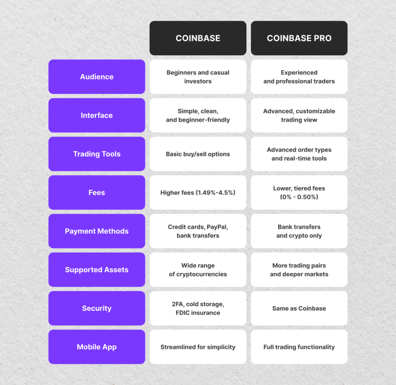

## Table of Contents

## What are Blockfolio and Coinbase?

Blockfolio is an app that helps people keep track of their cryptocurrency investments. It's like a wallet where you can see all your different cryptocurrencies in one place. You can add your coins, watch how their prices change, and get news updates about them. It's useful for anyone who wants to manage their crypto easily without having to check multiple websites or apps.

Coinbase is another popular platform, but it's more than just a tracking app. Coinbase is a cryptocurrency exchange where you can buy, sell, and store cryptocurrencies like Bitcoin, Ethereum, and others. It's like a bank for digital money. You can use Coinbase to convert your regular money into crypto and vice versa. It's a good choice for beginners because it's easy to use and has strong security features to keep your money safe.

## How do Blockfolio and Coinbase differ in their primary functions?

Blockfolio is mainly used for keeping an eye on your cryptocurrency investments. It's like a digital notebook where you can list all the different types of crypto you own. You can see how much they're worth and how their prices are changing over time. Blockfolio also sends you news and updates about your cryptocurrencies, so you stay informed about what's happening in the crypto world. It's great for people who want to manage their crypto in one place but don't need to buy or sell it directly through the app.

Coinbase, on the other hand, is a platform where you can actually buy, sell, and store your cryptocurrencies. It's like a bank and a marketplace rolled into one. You can use Coinbase to trade your regular money for Bitcoin, Ethereum, or other cryptocurrencies, and then trade them back if you want. Coinbase also has a wallet where you can keep your crypto safe. It's designed for people who want to actively trade and manage their cryptocurrency investments, not just track them.

## Can you explain the user interface of Blockfolio compared to Coinbase?

Blockfolio's user interface is clean and easy to use. When you open the app, you see a list of all your cryptocurrencies with their current prices and how much they've changed since you last checked. At the top, there's a big number showing the total value of your portfolio. You can swipe left or right to see different sections like news, price alerts, and your transactions. The design is simple, so it's easy for anyone to use, even if they're new to cryptocurrencies.

Coinbase's user interface is a bit more complex because it does more things. When you open Coinbase, you see a dashboard with charts showing the prices of different cryptocurrencies. There are buttons to buy or sell crypto, and you can switch between different accounts if you have more than one. The app also has a menu at the bottom where you can go to your portfolio, see your transactions, and learn about different cryptocurrencies. It's designed to be user-friendly, but it might take a little time to get used to all the features if you're new to trading.

## What are the fees associated with using Blockfolio versus Coinbase?

Blockfolio doesn't charge any fees for using the app itself. You can add your cryptocurrencies and track them for free. However, if you want to buy or sell crypto through Blockfolio, you'll use their trading feature called Blockfolio Trade. This feature has fees, but they can be different depending on what you're trading and how much you're trading. It's good to check their website for the latest fee information because it can change.

Coinbase charges fees for buying, selling, and trading cryptocurrencies. When you use Coinbase to buy or sell crypto, they take a percentage of the total amount. This fee can be around 0.5% to 4.5%, depending on how you're paying and what you're trading. Coinbase also has a fee for transferring crypto in and out of your wallet. These fees can add up, so it's important to look at their fee page to understand how much you might have to pay.

## How do the security features of Blockfolio and Coinbase compare?

Blockfolio has some good security features to keep your information safe. You can use two-factor authentication (2FA), which means you need a code from your phone to log in. This makes it harder for someone else to get into your account. Blockfolio also lets you set up a PIN code to add an extra layer of protection. However, since Blockfolio doesn't hold your cryptocurrencies directly (it just tracks them), the main security risk is someone getting into your account to see your portfolio details.

Coinbase takes security very seriously because it's a place where people keep their money. They use two-factor authentication too, and they also keep most of the cryptocurrencies in "cold storage," which means they're not connected to the internet and are harder for hackers to reach. Coinbase also has insurance to protect your money if something goes wrong. They monitor your account for anything unusual and will freeze it if they think something fishy is happening. So, Coinbase has more security features because it's dealing with actual money, not just tracking it like Blockfolio.

## Which cryptocurrencies are supported on Blockfolio and Coinbase?

Blockfolio supports a lot of different cryptocurrencies. You can add and track popular ones like Bitcoin, Ethereum, and Litecoin, but it also includes many smaller and newer cryptocurrencies. This means you can keep an eye on almost any crypto you own or are interested in, all in one place. Blockfolio updates its list regularly, so you can usually find new cryptocurrencies added pretty quickly.

Coinbase also supports many cryptocurrencies, but it has a more limited selection compared to Blockfolio. You can buy, sell, and store popular ones like Bitcoin, Ethereum, and Litecoin on Coinbase. They also have some other well-known cryptocurrencies like Bitcoin Cash and Ethereum Classic. Coinbase is always adding new cryptocurrencies, but they take their time to make sure each one meets their standards for security and reliability.

## How does the process of buying and selling cryptocurrencies differ between Blockfolio and Coinbase?

With Blockfolio, you can't buy or sell cryptocurrencies directly within the main app. Instead, you use a separate feature called Blockfolio Trade to do that. When you want to buy or sell, you go into Blockfolio Trade, pick the cryptocurrency you want, and then enter how much you want to trade. Blockfolio Trade will show you the fees before you make the trade. It's pretty easy to use, but remember, you need to go to this special section to make any trades.

On Coinbase, buying and selling cryptocurrencies is easier because it's all in one place. You just go to the main screen, pick the cryptocurrency you want to trade, and then choose if you want to buy or sell. You enter how much you want to trade, and Coinbase shows you the fees right away. After you confirm, the trade happens quickly. Coinbase also lets you set up recurring buys if you want to invest a little bit every week or month.

## What are the customer support options available on Blockfolio and Coinbase?

Blockfolio has customer support, but it's not as easy to get help as with some other apps. You can send them an email if you have a problem or a question. They also have a help center on their website where you can find answers to common questions. But if you need to talk to someone right away, you might have to wait because they don't have live chat or phone support.

Coinbase has more ways to get help. You can use their help center to find answers to common questions, just like with Blockfolio. But if you need to talk to someone, Coinbase has live chat support, so you can get help right away. They also have phone support for some issues, which can be really helpful if you're having a big problem. So, Coinbase makes it easier to get the help you need quickly.

## How do Blockfolio and Coinbase handle transaction speeds and limits?

Blockfolio doesn't handle transactions directly in its main app, so you won't see transaction speeds or limits there. If you use Blockfolio Trade to buy or sell cryptocurrencies, the speed and limits depend on the exchanges they work with. It can take a few minutes to a few hours for a trade to go through, and the limits can change based on how much you're trading and what you're trading. It's a good idea to check with Blockfolio Trade directly to know the exact details.

Coinbase, on the other hand, handles transactions right in the app, so they control the speed and limits. When you buy or sell on Coinbase, it usually takes just a few minutes for the trade to complete. But if you're moving money to or from your bank, it might take a few days. Coinbase has limits on how much you can buy or sell each day or week, and these limits can change based on things like how much you've verified your account and how much you're trading. You can see your limits in the app, and if you need higher limits, you can go through more verification steps.

## What advanced trading features does Coinbase offer that Blockfolio does not?

Coinbase has some special tools for people who like to trade a lot. They have something called Coinbase Pro, which is like a more advanced version of the regular Coinbase app. With Coinbase Pro, you can use things like limit orders, where you set a price you want to buy or sell at, and it will only happen if the price gets there. You can also use stop orders to help protect your money if the price starts to drop a lot. Coinbase Pro shows you lots of charts and graphs to help you make smart choices about when to trade. It's great for people who want to do more than just buy and sell at the current price.

Blockfolio doesn't have these advanced trading features. It's more about keeping track of your cryptocurrencies and getting news about them. If you want to buy or sell, you can use Blockfolio Trade, but it's not as fancy as Coinbase Pro. Blockfolio Trade lets you trade, but you don't get the special orders or all the charts and graphs that Coinbase Pro has. So, if you're someone who likes to trade a lot and use advanced tools, Coinbase would be a better choice for you.

## How do the mobile apps of Blockfolio and Coinbase compare in terms of functionality and user experience?

Blockfolio's mobile app is great for keeping track of your cryptocurrencies. When you open it, you see a list of all your coins with their current prices and how much they've changed. It's easy to add new coins and get news updates about them. The app is simple to use, which is good if you're new to crypto. You can set price alerts to know when to buy or sell. But if you want to actually trade your crypto, you have to use a different part of the app called Blockfolio Trade, which can be a bit confusing at first.

Coinbase's mobile app does more than just track your cryptocurrencies. You can buy, sell, and store your crypto right in the app. It's easy to switch between different cryptocurrencies and see how much you own. The app has a lot of features, like charts and graphs, which can help you decide when to trade. It might take a little time to get used to all the options, but it's good for people who want to do more than just keep track of their coins. Coinbase also lets you set up recurring buys, which is handy if you want to invest a little bit every week or month.

## What are the long-term investment and portfolio management tools available on Blockfolio compared to Coinbase?

Blockfolio is great for keeping an eye on your cryptocurrencies over the long term. You can add all your coins to the app and see how they're doing over time. It shows you the current prices and how much your portfolio is worth in total. You can also set price alerts, so you know when to buy or sell. Blockfolio sends you news and updates about your cryptocurrencies, which can help you make smart choices about your long-term investments. But remember, Blockfolio doesn't let you buy or sell directly in the main app; you need to use Blockfolio Trade for that.

Coinbase has more tools for managing your long-term investments. You can buy, sell, and store your cryptocurrencies all in one place, which makes it easier to manage your portfolio over time. Coinbase lets you set up recurring buys, so you can invest a little bit every week or month without having to remember to do it. They also have charts and graphs that show you how your investments are doing over the long term. This can help you decide when to buy more or sell what you have. Coinbase is good for people who want to actively manage their long-term crypto investments.

## References & Further Reading

[1]: Bergstra, J., Bardenet, R., Bengio, Y., & Kégl, B. (2011). ["Algorithms for Hyper-Parameter Optimization."](https://papers.nips.cc/paper/4443-algorithms-for-hyper-parameter-optimization) Advances in Neural Information Processing Systems 24.

[2]: ["Advances in Financial Machine Learning"](https://www.amazon.com/Advances-Financial-Machine-Learning-Marcos/dp/1119482089) by Marcos Lopez de Prado

[3]: ["Evidence-Based Technical Analysis: Applying the Scientific Method and Statistical Inference to Trading Signals"](https://www.amazon.com/Evidence-Based-Technical-Analysis-Scientific-Statistical/dp/0470008741) by David Aronson

[4]: ["Machine Learning for Algorithmic Trading"](https://github.com/stefan-jansen/machine-learning-for-trading) by Stefan Jansen

[5]: ["Quantitative Trading: How to Build Your Own Algorithmic Trading Business"](https://www.amazon.com/Quantitative-Trading-Build-Algorithmic-Business/dp/1119800064) by Ernest P. Chan