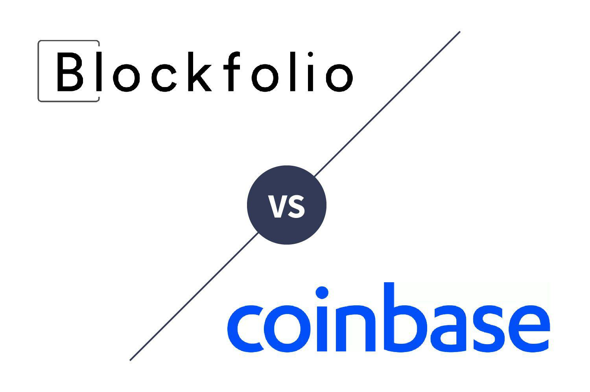

Cryptocurrency trading has seen a remarkable rise in popularity over the past decade, becoming a mainstream investment activity. Platforms like Coinbase and Blockfolio have emerged as significant players in this space, each offering distinct advantages to investors. Coinbase, with its headquarters in the United States, is renowned for its transparent operations and user-friendly interface. It provides a secure environment for both novice and experienced traders to buy, sell, and manage a variety of cryptocurrencies. On the other hand, Blockfolio, initially launched as a comprehensive portfolio tracker, has evolved into a versatile platform under the FTX brand, integrating trading functionalities while maintaining its strength in portfolio management.

In the rapidly evolving world of cryptocurrency, algorithmic trading has gained traction as an effective strategy for maximizing efficiency and potential returns. This automated trading approach relies on pre-defined criteria to execute trades, minimizing the need for continuous human intervention and allowing for more precise market timing.

This article aims to present a detailed comparative analysis of Coinbase and Blockfolio, with a particular focus on the opportunities for algorithmic trading that these platforms provide. Both platforms have tailored their services to meet the diverse needs of investors, from beginners seeking a straightforward user experience to seasoned traders looking for sophisticated tools to enhance their trading strategies. Understanding these offerings will empower investors to make informed decisions suited to their individual trading goals and risk appetites.

## Table of Contents

## Overview of Coinbase and Blockfolio

Coinbase and Blockfolio, each with distinct origins and characteristics, are prominent platforms in the cryptocurrency industry, serving the varied needs of investors and traders.

Coinbase was established in 2012 and is headquartered in San Francisco, California. It has grown to become one of the largest and most popular cryptocurrency exchanges in the United States. Known for its transparency and user-friendly interface, Coinbase provides a platform where users can buy, sell, and store a wide variety of digital currencies. The exchange is celebrated for its adherence to regulatory compliance and is registered with the U.S. Securities and Exchange Commission. Its intuitive interface is designed to cater to both novice and seasoned investors, which has contributed to its widespread adoption. Coinbase's commitment to security is evident in its extensive measures to protect users' funds, including insurance policies for USD balances and the use of cold storage for the majority of cryptocurrencies held on the platform.

Blockfolio, initially launched in 2014 as a cryptocurrency portfolio tracking application, has evolved significantly since its inception. It was acquired by FTX, a leading cryptocurrency exchange, and now functions under the FTX brand. Originally designed to help users manage and track their cryptocurrency investments across different exchanges, Blockfolio has expanded its offerings to incorporate trading features. This transition has allowed users not only to monitor prices and portfolio performances but also to engage in trading activities directly from the app. Blockfolio's user interface remains heavily geared towards mobile users, reflecting its origins as a tool for portfolio management on smartphones.

Despite their different starting points—Coinbase as an exchange and Blockfolio as a portfolio tracker—both platforms have developed unique features to meet the needs of [cryptocurrency](/wiki/cryptocurrency) users. Coinbase appeals largely to users who prioritize a straightforward, secure trading experience with comprehensive support for numerous digital assets. In contrast, Blockfolio draws users who prefer a mobile-centric approach, offering convenient tracking and trading capabilities within a single application. Each platform leverages its inherent strengths to serve diverse segments of the cryptocurrency market effectively.

## Features and Services Comparison

Coinbase and Blockfolio offer features tailored to different needs in the cryptocurrency trading landscape. Coinbase, a major cryptocurrency exchange, is renowned for its extensive support of over 50 digital currencies, enabling users to trade a wide range of assets. A distinguishing feature of Coinbase is its strong focus on security, offering FDIC insurance for USD balances up to $250,000, a crucial consideration for U.S.-based users seeking protection for their fiat holdings. Additionally, Coinbase employs advanced security measures, such as cold storage solutions and two-[factor](/wiki/factor-investing) authentication, to safeguard user funds, enhancing its reputation as a secure platform.

Blockfolio, initially established as a cryptocurrency portfolio tracker, has evolved under the FTX brand to include trading features, maintaining its competitive zero-fee trading structure. This approach allows users to engage in cryptocurrency transactions without incurring the typical trading fees found on many exchanges, potentially maximizing profitability. Despite its roots in tracking, Blockfolio supports trading a diverse array of cryptocurrencies, making it a versatile tool for both portfolio management and active trading. 

The unique features of each platform cater to specific user segments. Coinbase, with its user-friendly interface and strong security infrastructure, appeals particularly to novice investors and those prioritizing regulatory compliance and asset protection. Its wide currency support also attracts users seeking to diversify their portfolios across various digital assets.

Blockfolio, with its zero-fee structure and efficient tracking capabilities, targets cost-conscious traders and those focused on monitoring their investment performance in real-time. The integration with FTX further bolsters its offering by providing advanced trading features, thus appealing to more experienced traders who value cost efficiency without compromising on access to a broad spectrum of cryptocurrencies.

In summary, Coinbase's comprehensive support and security measures are suited for investors valuing protection and straightforward trading across numerous currencies. Conversely, Blockfolio attracts users aiming for cost-effective trading with robust portfolio tracking capabilities, especially appealing to those familiar with the ecosystem of FTX exchanges.

## Algorithmic Trading on Coinbase and Blockfolio

Algorithmic trading is a method of executing orders using automated pre-programmed trading instructions accounting for variables like timing, price, and [volume](/wiki/volume-trading-strategy). This method can benefit investors by minimizing human intervention, reducing market impact, and executing trades at optimal conditions. The practice leverages quantitative models and is primarily driven by large institutional investors for stock trading, yet it is increasingly being adopted in the cryptocurrency market due to its high [volatility](/wiki/volatility-trading-strategies) and [liquidity](/wiki/liquidity-risk-premium).

Coinbase, a renowned cryptocurrency exchange, provides robust support for [algorithmic trading](/wiki/algorithmic-trading) through its Application Programming Interface (API). The Coinbase API allows traders to automate trading by providing real-time market data and enabling order execution programmatically. Third-party applications and tools can integrate with this API to enhance trading strategies, offering capabilities such as [backtesting](/wiki/backtesting) and technical analysis. This ability to seamlessly integrate with algorithmic trading software provides a significant advantage for traders looking to employ sophisticated trading strategies on the Coinbase platform.

Conversely, Blockfolio, known for its portfolio tracking capabilities, has evolved following its acquisition by FTX. While Blockfolio is primarily focused on tracking user portfolios, its integration with FTX has expanded its capabilities in algorithmic trading. FTX, a comprehensive trading platform known for its extensive range of trading products, offers an API that supports advanced algorithmic trading functionalities. This partnership allows Blockfolio to cater to algorithmic traders, although its main application remains tracking and managing multiple cryptocurrency assets.

The incorporation of FTX's technology offers enhanced capabilities for Blockfolio users interested in algorithmic trading, providing access to advanced trading features and analytics. For example, traders can utilize the FTX API to automate trades based on algorithm-defined criteria, leveraging FTX's robust trading infrastructure. Therefore, despite Blockfolio's primary orientation towards portfolio tracking, its partnership with FTX opens opportunities for algorithmic trading, thus broadening its appeal to a wider array of investors, particularly those interested in automated trading solutions.

In summary, both Coinbase and Blockfolio offer valuable resources for investors interested in algorithmic trading, albeit through different approaches shaped by their technological capabilities and strategic partnerships. Traders should assess these options based on their specific trading requirements and the technological resources available through each platform.

## Security and Transparency

Coinbase and Blockfolio approach security and transparency with different strategies, reflective of their unique origins and operations. 

Coinbase is highly regarded for its robust security infrastructure, which is crucial in instilling trust among its users. It employs a combination of industry-standard security measures, including advanced encryption, two-factor authentication (2FA), and biometric logins. A notable feature is its use of cold storage solutions, where approximately 98% of customer funds are stored offline. This measure significantly mitigates the risk of cyber attacks on the funds. Furthermore, Coinbase provides FDIC insurance for USD balances up to $250,000, offering an additional layer of protection and reassurance to its users [^1].

Blockfolio, now integrated within the FTX ecosystem, adopts a distinct approach focusing on both security and transparency. Originally developed as a portfolio tracker, Blockfolio's security measures revolve around the integrity of data and user privacy. With the acquisition by FTX, Blockfolio has expanded its security infrastructure by incorporating FTX's enterprise-level security protocols, which include SSL encryption and cold wallet storage akin to that of Coinbase. The acquisition has also brought Blockfolio under the scrutiny of broader transparency standards, aligning it with FTX’s policies on maintaining open lines of communication with its user base regarding platform operations and any incidents that may arise [^2].

The importance of security and transparency in cryptocurrency trading platforms cannot be overstated. For users entrusting their digital assets to these platforms, security breaches can result in significant financial losses. Thus, robust security measures are essential to protect user funds and personal data. Transparency, on the other hand, involves clear communication from the platform about its security policies, operational processes, and any incidents or changes that might affect users. Trust in a platform is fundamentally built on these two pillars—security ensures the safety of user investments, while transparency fosters user confidence in the platform’s integrity and reliability.

[^1]: Coinbase. (n.d.). *Coinbase Security*. [https://www.coinbase.com/security](https://www.coinbase.com/security)
[^2]: FTX. (n.d.). *Security at FTX*. [https://ftx.com/security](https://ftx.com/security)

## Fees and Pricing Structure

Coinbase employs a tiered fee structure that is impacted by several factors including the size of the transaction, the payment method used, and the region of the user. For example, the platform charges a spread of approximately 0.50% for cryptocurrency purchases and sales. In addition to this spread, a flat fee is applied based on the transaction amount. For instance, as of this writing, transactions under $10 incur a fee of $0.99, those between $10 and $25 incur a fee of $1.49, transactions between $25 and $50 incur a fee of $1.99, and transactions between $50 and $200 incur a fee of $2.99. Beyond $200, the fee transitions to a percentage-based model. Moreover, Coinbase adds fees depending on payment methods. Using a bank account for transactions might incur lower fees compared to debit card payments, which are generally subject to higher fees (around 3.99% of the transaction value).

Blockfolio, which operates under the FTX brand, presents a contrasting approach with its zero-fee trading model. This model eliminates explicit trading fees, making it attractive for frequent traders. However, the absence of direct fees may introduce hidden costs embedded in the price spread. While explicit fees are transparent, spread costs can be less obvious and potentially vary with market conditions, affecting the effective price at which a trade is executed. 

To appreciate how these costs influence trading profitability, consider a hypothetical scenario where an investor trades $1,000 worth of Bitcoin. On Coinbase, assuming a 0.50% spread plus a fee of $14.68 for using a debit card (at 3.99%), the total cost could amount to approximately $19.68. Conversely, on Blockfolio, the absence of explicit fees means the cost depends primarily on the spread, which can vary. If Blockfolio's spread differs significantly from Coinbase's, it could impact the net value realized from the trade. 

Therefore, traders need to weigh these cost structures in their decision-making process, factoring in trading frequency, transaction size, and the payment methods used. High-frequency traders may benefit from Blockfolio's model despite potential spreads, while occasional traders might prioritize transparency and opt for Coinbase despite its higher transaction fees. Understanding the interplay between explicit fees and price spreads is crucial for optimizing trading profitability and aligning platform choice with personal trading strategies.

## Ease of Use and Accessibility

Coinbase is renowned for its user-friendly interface, making it particularly appealing to beginner cryptocurrency traders. Its platform is designed with simplicity in mind, featuring a clean layout, easy navigation, and straightforward execution of trades. Users are welcomed by a dashboard that provides a comprehensive view of their portfolio, market trends, and recent transactions. The streamlined design reduces the learning curve associated with understanding and engaging in cryptocurrency trading. Additionally, Coinbase offers extensive educational resources, including tutorials and articles, which empower new users to become acquainted with the intricacies of digital asset management and trading.

Coinbase's ease of use is further complemented by its robust customer support, offering assistance through email, phone, and an extensive help center, which is especially beneficial for users who may need guidance as they acclimate to trading. However, accessibility in terms of geographic reach can be a limitation, as Coinbase is not available in all countries, and its feature set might vary depending on the user's location.

Blockfolio, by contrast, takes a mobile-first approach, providing a platform optimized for on-the-go users. Its application is primarily designed for mobile devices, which enhances its accessibility and convenience. The interface is intuitive, offering features such as automatic notifications on price changes, news alerts, and the ability to manage multiple portfolios. This design caters to a younger, tech-savvy user base that prioritizes the flexibility of monitoring and executing trades from their smartphones.

The mobile-focused design of Blockfolio can significantly enhance usability, particularly for those who prefer real-time updates and seamless transitions between portfolio tracking and trading features. While Blockfolio supports a wide array of cryptocurrencies, its interface may require a more nuanced understanding of the market to fully utilize its advanced capabilities, which might present a slight challenge for absolute beginners.

Both platforms strive to be inclusive of users with varying levels of experience, yet the choice between them often depends on the investor's specific needs and preferences regarding platform accessibility and ease of use. Coinbase’s web-centric platform with extensive educational support is ideal for beginners seeking a straightforward and educational environment. Conversely, Blockfolio’s mobile-first design is more suitable for traders who desire flexibility and a comprehensive, mobile-centric trading solution.

## Conclusion

Coinbase and Blockfolio serve distinct roles within the cryptocurrency trading ecosystem, each offering unique solutions tailored to various investor needs, particularly concerning algorithmic trading. Coinbase, as a major U.S.-based cryptocurrency exchange, provides a robust infrastructure with extensive API support, enabling algorithmic traders to seamlessly automate their strategies. This access, combined with Coinbase's comprehensive currency support, strong security measures, and user-friendly interface, makes it an attractive choice for both novice and experienced traders looking to incorporate algorithmic methods into their trading repertoire.

Conversely, Blockfolio, operating under the FTX brand, originally focused on portfolio tracking before integrating trading functionalities. While its primary emphasis remains on tracking capabilities, Blockfolio enhances algorithmic trading opportunities through the advanced features offered by its integration with FTX. This partnership provides users with zero-fee trading, broad cryptocurrency support, and effective tools for sophisticated algorithmic trading, especially benefiting traders who prioritize detailed tracking and cost-efficient transactions.

When choosing between these platforms, investors should align their selection with their individual trading strategies and goals. For those seeking a comprehensive trading platform with strong security, regulatory support, and the ability to engage in algorithmic trading, Coinbase offers a compelling package. Alternatively, investors who prioritize cost efficiency, portfolio tracking, and the advanced features brought by FTX might find Blockfolio more suitable to their needs.

Ultimately, the choice between Coinbase and Blockfolio depends on an investor's specific priorities, whether they focus on security, cost, user experience, or algorithmic trading features. As the cryptocurrency landscape continues to evolve, being clear about one's investment objectives and trading strategies will help investors make informed decisions, optimizing their trading experiences across these platforms.

## References & Further Reading

[1]: Bergstra, J., Bardenet, R., Bengio, Y., & Kégl, B. (2011). ["Algorithms for Hyper-Parameter Optimization."](https://papers.nips.cc/paper/4443-algorithms-for-hyper-parameter-optimization) Advances in Neural Information Processing Systems 24.

[2]: ["Advances in Financial Machine Learning"](https://www.amazon.com/Advances-Financial-Machine-Learning-Marcos/dp/1119482089) by Marcos Lopez de Prado

[3]: ["Evidence-Based Technical Analysis: Applying the Scientific Method and Statistical Inference to Trading Signals"](https://www.amazon.com/Evidence-Based-Technical-Analysis-Scientific-Statistical/dp/0470008741) by David Aronson

[4]: ["Machine Learning for Algorithmic Trading"](https://github.com/stefan-jansen/machine-learning-for-trading) by Stefan Jansen

[5]: ["Quantitative Trading: How to Build Your Own Algorithmic Trading Business"](https://www.amazon.com/Quantitative-Trading-Build-Algorithmic-Business/dp/1119800064) by Ernest P. Chan