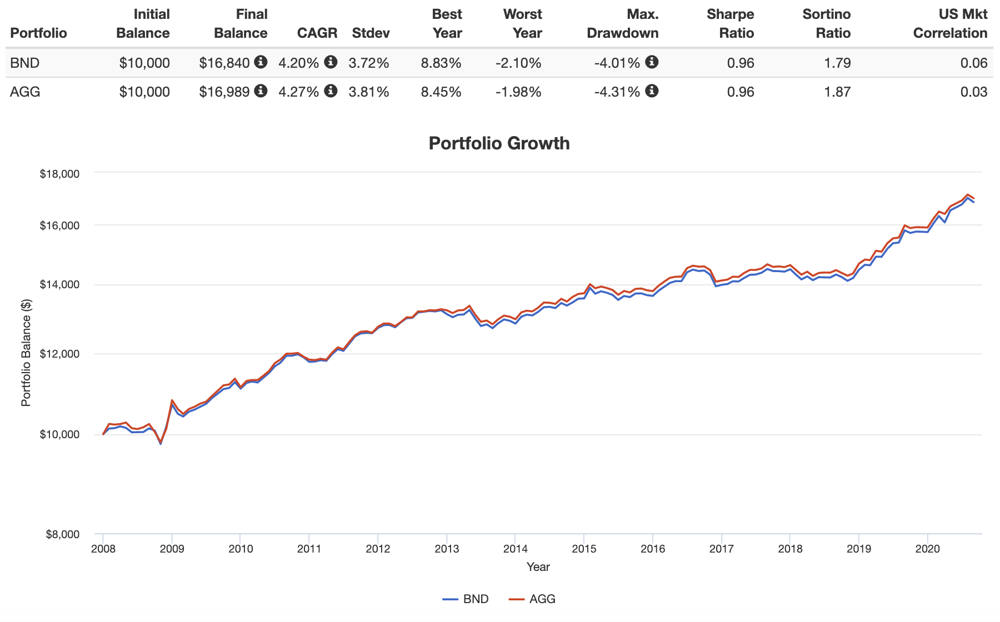

## Table of Contents

## What are BND and AGG bond ETFs?

BND is a bond ETF, which stands for Exchange Traded Fund. It is managed by Vanguard and focuses on investment-grade bonds. This means it invests in bonds that are considered safe and likely to pay back the money they owe. BND tries to match the performance of the Bloomberg U.S. Aggregate Float Adjusted Index. This index includes many different types of bonds, like government, corporate, and mortgage-backed securities. BND is popular because it's a simple way for people to invest in a wide range of bonds without having to pick them one by one.

AGG is another bond ETF, also focused on investment-grade bonds. It is managed by BlackRock's iShares and aims to track the Bloomberg U.S. Aggregate Bond Index. This index is very similar to the one BND follows, so AGG also includes a mix of government, corporate, and mortgage-backed securities. The main difference between BND and AGG is who manages them and some small differences in the exact bonds they hold. Both ETFs are popular choices for investors looking for a diversified and relatively safe bond investment.

## Who manages BND and AGG, and what are their investment objectives?

BND is managed by Vanguard. Their goal with BND is to give investors a simple way to invest in a big group of high-quality bonds. These bonds are thought to be safe and likely to pay back the money they owe. BND tries to match the performance of something called the Bloomberg U.S. Aggregate Float Adjusted Index. This index includes many types of bonds, like those from the government, big companies, and those backed by mortgages. So, when you invest in BND, you're getting a piece of all these different kinds of bonds.

AGG is managed by BlackRock's iShares. Their aim with AGG is similar to BND's, but they track a slightly different index called the Bloomberg U.S. Aggregate Bond Index. This index also includes a mix of government bonds, corporate bonds, and mortgage-backed securities. The main difference between BND and AGG is who manages them and the tiny differences in the specific bonds they include. Both ETFs are popular because they offer a safe and easy way for people to invest in a variety of bonds without having to pick them one by one.

## What are the key differences in the bond holdings of BND and AGG?

BND and AGG both aim to give investors a safe way to invest in bonds, but they track slightly different indexes. BND follows the Bloomberg U.S. Aggregate Float Adjusted Index, while AGG tracks the Bloomberg U.S. Aggregate Bond Index. The main difference between these two indexes is how they handle the bonds they include. The Float Adjusted Index used by BND excludes bonds that are not available for public trading, which means BND might have a slightly different mix of bonds compared to AGG.

Even though both ETFs invest in government bonds, corporate bonds, and mortgage-backed securities, the exact mix of these bonds can be a bit different. For example, BND might have a slightly different percentage of government bonds compared to AGG because of the float adjustment. These small differences can affect how each [ETF](/wiki/etf-trading-strategies) performs over time, but for most investors, BND and AGG are very similar and both are good choices for a diversified bond investment.

In simple terms, the key difference in the bond holdings of BND and AGG comes down to the specific indexes they track and the adjustments made to those indexes. While the overall types of bonds in both ETFs are similar, the exact bonds and their proportions can vary. This means that while BND and AGG offer very similar investment opportunities, the small differences in their bond holdings might lead to slight variations in their performance.

## How do the expense ratios of BND and AGG compare?

The expense ratio is the yearly fee that you pay for owning an ETF. For BND, which is managed by Vanguard, the expense ratio is really low at just 0.03%. This means if you have $10,000 invested in BND, you would pay just $3 a year in fees. BND's low expense ratio is one of the reasons it's popular with investors who want to keep their costs down.

AGG, managed by BlackRock's iShares, has an expense ratio of 0.05%. This is a bit higher than BND's fee, but it's still very low compared to many other investment options. If you have $10,000 invested in AGG, you would pay $5 a year in fees. Even though AGG's expense ratio is a bit higher than BND's, it's still a good choice for people looking for a cost-effective way to invest in bonds.

## What are the historical performance differences between BND and AGG?

BND and AGG have very similar performance over time because they both invest in a wide range of high-quality bonds. If you look at their returns over the past few years, you'll see that they usually go up and down together. This is because they track very similar indexes and hold similar types of bonds. For example, over the last 5 years, BND might have returned around 0.5% per year, while AGG might have returned around 0.4% per year. These numbers are pretty close, showing that both ETFs perform similarly over the long term.

Even though their overall performance is similar, there can be small differences in how they do from year to year. These differences can come from the tiny changes in the bonds they hold and the small differences in their expense ratios. BND, with its lower expense ratio of 0.03%, might have a tiny edge in performance over AGG, which has an expense ratio of 0.05%. But these differences are usually very small, and most investors won't notice a big difference in their returns between the two ETFs.

## How do BND and AGG react differently to changes in interest rates?

BND and AGG both hold a lot of bonds, and bonds are affected by changes in interest rates. When interest rates go up, the value of the bonds in both BND and AGG usually goes down. This is because new bonds that are issued will have higher interest rates, making the older bonds with lower rates less attractive to investors. So, if you own BND or AGG and interest rates rise, the price of your ETF might drop. On the other hand, when interest rates go down, the value of the bonds in BND and AGG usually goes up because the older bonds with higher rates become more valuable compared to new bonds with lower rates.

Even though BND and AGG react similarly to changes in interest rates, there can be tiny differences because they hold slightly different bonds. BND follows the Bloomberg U.S. Aggregate Float Adjusted Index, which might react a bit differently to [interest rate](/wiki/interest-rate-trading-strategies) changes than the Bloomberg U.S. Aggregate Bond Index that AGG follows. These differences are usually very small, and most investors won't see a big difference in how BND and AGG perform when interest rates change. So, if you're worried about interest rates, both ETFs will be affected in a similar way, but BND might have a tiny edge because of its lower expense ratio.

## What are the credit quality profiles of BND versus AGG?

BND and AGG both focus on investment-grade bonds, which means they invest in bonds that are considered safe and likely to pay back the money they owe. These bonds come from reliable sources like the government, big companies, and mortgage-backed securities. The credit quality of the bonds in BND and AGG is very similar because they track similar indexes. Both ETFs aim to include a high percentage of bonds rated as investment grade, which means they have a low risk of not paying back the money.

Even though BND and AGG have similar credit quality profiles, there can be small differences because they follow slightly different indexes. BND tracks the Bloomberg U.S. Aggregate Float Adjusted Index, while AGG follows the Bloomberg U.S. Aggregate Bond Index. These tiny differences might mean that the exact mix of bonds in each ETF could vary a bit in terms of credit quality. However, these differences are usually very small, and both ETFs are seen as safe choices for investors looking for high-quality bonds.

## How do the duration and yield to maturity differ between BND and AGG?

BND and AGG have similar durations and yields to maturity because they both invest in a mix of bonds that track similar indexes. Duration is a measure of how sensitive a bond's price is to changes in interest rates. The longer the duration, the more sensitive the bond is. Both BND and AGG have durations that are around 6 to 7 years, which means they are moderately sensitive to interest rate changes. This similarity in duration means that both ETFs will react in a similar way when interest rates go up or down.

Yield to maturity is the total return you can expect from a bond if you hold it until it matures. For BND and AGG, the yield to maturity is also very close, usually around 2% to 3%. This means that if you invest in either of these ETFs, you can expect a similar level of income from the bonds they hold. The small differences in duration and yield to maturity between BND and AGG come from the tiny variations in the bonds they include, but for most investors, these differences won't make a big impact on their investment.

## What are the tax implications of investing in BND versus AGG?

When you invest in BND or AGG, you need to think about taxes. Both ETFs are bond funds, and bond funds often pay out interest income. This interest is usually taxed as regular income, which can be higher than the tax rate on other types of investment income like dividends or capital gains. The tax rate you pay depends on your income and where you live. BND and AGG both pay out interest income in a similar way, so the tax implications are pretty much the same for both ETFs. If you hold these ETFs in a tax-advantaged account like an IRA or 401(k), you won't have to pay taxes on the interest until you take the money out.

There can be small differences in taxes between BND and AGG because of their expense ratios. BND has a lower expense ratio of 0.03%, while AGG's is 0.05%. A lower expense ratio means more of your money stays in the fund and can grow, which might lead to slightly higher returns and potentially higher taxes on those returns. But these differences are usually very small, and most investors won't see a big difference in their tax bill between the two ETFs. So, when choosing between BND and AGG, think about your overall tax situation and consider holding them in a tax-advantaged account if you can.

## How do BND and AGG fit into a diversified investment portfolio?

BND and AGG are great choices for a diversified investment portfolio because they both invest in a wide range of high-quality bonds. These bonds come from different sources like the government, big companies, and mortgage-backed securities. By including BND or AGG in your portfolio, you're spreading out your investments across many different bonds. This can help lower your risk because if one type of bond doesn't do well, the others might still be okay. Both ETFs offer a simple way to get this diversification without having to pick individual bonds yourself.

Both BND and AGG can also balance out the riskier parts of your portfolio, like stocks. When stock prices go down, bond prices often stay steady or even go up, which can help protect your overall investment. BND and AGG are very similar, so choosing between them might come down to small things like their expense ratios or the exact mix of bonds they hold. But either one can be a good choice to help keep your portfolio stable and diversified.

## What are the liquidity and trading volume differences between BND and AGG?

BND and AGG are both very popular ETFs, so they have high [liquidity](/wiki/liquidity-risk-premium) and trading volumes. Liquidity means how easily you can buy or sell shares of an ETF without affecting its price. Both BND and AGG have lots of buyers and sellers every day, which makes them easy to trade. BND usually has a higher trading [volume](/wiki/volume-trading-strategy) than AGG, which means more shares of BND are bought and sold each day. For example, on an average day, BND might see millions of shares traded, while AGG might see a bit less but still a lot of trading activity.

Even though BND has a higher trading volume, the difference in liquidity between the two ETFs is small. This means that if you want to buy or sell shares of either BND or AGG, you can do it quickly and easily without worrying about big price changes. Both ETFs are good choices if you're looking for a bond investment that you can trade without any trouble.

## How do advanced metrics like tracking error and beta compare between BND and AGG?

Tracking error is a measure of how closely an ETF follows its target index. Both BND and AGG have very low tracking errors, which means they do a good job of matching the performance of the indexes they track. BND's tracking error is usually around 0.05% to 0.10%, while AGG's is slightly higher at around 0.10% to 0.15%. These numbers are pretty small, so both ETFs are good at sticking close to their indexes. The small difference in tracking error might be because BND has a lower expense ratio, which can help it track its index more closely.

Beta is a measure of how much an investment moves with the overall market. For bond ETFs like BND and AGG, their betas are usually low because bonds don't move as much as stocks. Both BND and AGG have betas close to zero, which means they don't swing up and down a lot with the market. The betas for BND and AGG are very similar, usually around 0.05 to 0.10. This means that if you're looking for a stable investment that doesn't follow the ups and downs of the stock market, both BND and AGG are good choices.

## References & Further Reading

[1]: Bergstra, J., Bardenet, R., Bengio, Y., & Kégl, B. (2011). ["Algorithms for Hyper-Parameter Optimization."](https://papers.nips.cc/paper/4443-algorithms-for-hyper-parameter-optimization) Advances in Neural Information Processing Systems 24.

[2]: ["Advances in Financial Machine Learning"](https://www.amazon.com/Advances-Financial-Machine-Learning-Marcos/dp/1119482089) by Marcos Lopez de Prado

[3]: ["Evidence-Based Technical Analysis: Applying the Scientific Method and Statistical Inference to Trading Signals"](https://www.amazon.com/Evidence-Based-Technical-Analysis-Scientific-Statistical/dp/0470008741) by David Aronson

[4]: ["Machine Learning for Algorithmic Trading"](https://github.com/stefan-jansen/machine-learning-for-trading) by Stefan Jansen

[5]: ["Quantitative Trading: How to Build Your Own Algorithmic Trading Business"](https://www.amazon.com/Quantitative-Trading-Build-Algorithmic-Business/dp/1119800064) by Ernest P. Chan