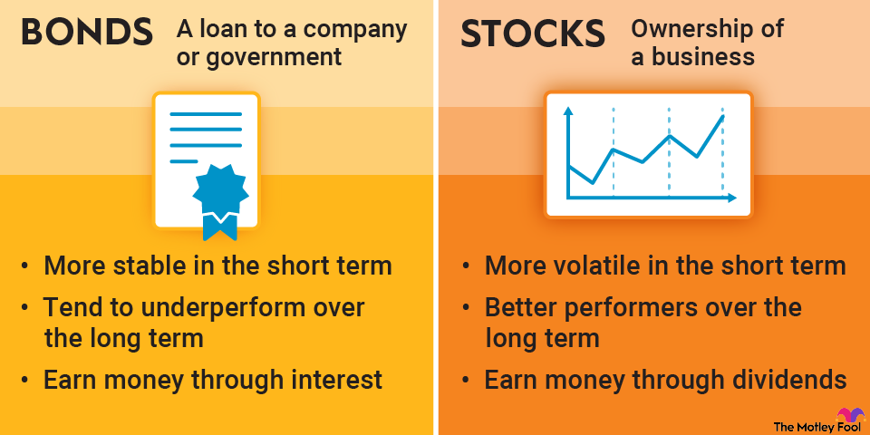

## Table of Contents

## What are bonds and how do they differ from stocks?

Bonds are like loans that you give to a company or government. When you buy a bond, you're lending them money, and in return, they promise to pay you back the amount you lent them, plus some extra money called interest, over a certain period of time. This makes bonds a bit safer than other investments because you know you'll get your money back as long as the company or government doesn't go bankrupt.

Stocks, on the other hand, are like owning a tiny piece of a company. When you buy a stock, you become a part-owner of that company. If the company does well, the value of your stock can go up, and you might get some extra money called dividends. But if the company doesn't do well, the value of your stock can go down, and you could lose money. Stocks can be riskier than bonds because their value can change a lot, but they also have the potential to make you more money if the company grows.

## What is the primary function of the bond market?

The bond market is like a big place where people and organizations can borrow and lend money. When someone wants to borrow money, they can create a bond and sell it to investors. This helps governments and companies get the money they need to do things like build roads, schools, or new factories. On the other hand, investors buy these bonds because they want to earn some extra money through interest payments over time.

The bond market also helps set the price for borrowing money. When lots of people want to buy bonds, the price goes up, and the interest rates go down. But if fewer people want to buy bonds, the price goes down, and the interest rates go up. This way, the bond market helps balance how much it costs to borrow money and how much people can earn by lending it.

## How does the stock market function and what is its primary purpose?

The stock market is like a big store where people can buy and sell pieces of companies called stocks. When a company wants to grow, it can sell these pieces to the public. People who buy these stocks become part-owners of the company. The price of a stock goes up and down based on how well people think the company is doing. If many people want to buy a stock, its price goes up. If fewer people want it, the price goes down. People can make money by selling their stocks for more than they paid for them, or by getting dividends, which are like little payments from the company.

The main purpose of the stock market is to help companies get money to grow and to give people a way to invest their money. When a company sells stocks, it gets money it can use to build new things or start new projects. This helps the economy grow because companies can create more jobs and products. For people, the stock market is a way to save and invest money. They can buy stocks and hopefully make more money over time as the companies they invest in do well. This way, the stock market helps connect people who want to invest with companies that need money to grow.

## What are the key differences in risk between investing in bonds versus stocks?

Investing in bonds is generally seen as safer than investing in stocks. When you buy a bond, you're basically lending money to a company or government. They promise to pay you back the money you lent them, plus some extra money called interest, over a set period of time. As long as the company or government doesn't go bankrupt, you'll get your money back. This makes bonds less risky because you have a good idea of what you'll get in the end. But, if interest rates go up after you buy a bond, the value of your bond might go down if you want to sell it before it matures.

On the other hand, investing in stocks is riskier but can offer bigger rewards. When you buy a stock, you own a small piece of a company. The value of your stock can go up or down based on how well the company is doing. If the company does great, your stock might be worth a lot more, and you could make a lot of money. But if the company doesn't do well, the value of your stock can drop, and you could lose money. Stocks don't come with the same promise of getting your money back like bonds do, so they're considered riskier.

Overall, bonds give you a more predictable return and are less likely to lose value, while stocks can grow a lot but also have a higher chance of losing value. It's like choosing between a steady, reliable path with bonds and a potentially more exciting but bumpier ride with stocks.

## How do interest rates affect the bond and stock markets?

Interest rates can have a big impact on the bond market. When interest rates go up, new bonds start to pay more interest to attract buyers. But this makes older bonds, which pay less interest, less attractive. So, the price of these older bonds goes down. On the other hand, when interest rates go down, new bonds pay less interest, making older bonds that pay more interest more attractive. This can make the price of these older bonds go up. So, interest rates and bond prices move in opposite directions. If you're thinking about buying or selling bonds, it's good to keep an eye on interest rates.

Interest rates also affect the stock market, but in a different way. When interest rates go up, borrowing money becomes more expensive for companies. This can slow down their growth and make their profits smaller. When profits are smaller, the value of their stocks might go down. Also, when interest rates go up, people might move their money from stocks to bonds because bonds start to look more attractive with higher interest payments. On the flip side, when interest rates go down, borrowing becomes cheaper for companies, which can help them grow and make more profit. This can make their stock prices go up. So, interest rates can influence how people decide to invest their money between stocks and bonds.

## What are the typical returns one might expect from bonds compared to stocks?

When you invest in bonds, you can usually expect to get a steady but smaller return compared to stocks. Bonds are like loans that you give to a company or government, and they pay you back with interest over time. The interest you get from bonds can be anywhere from 2% to 6% per year, depending on the type of bond and how safe it is. For example, government bonds are usually safer and might give you around 2% to 3%, while corporate bonds can be riskier but might offer 4% to 6%. The main thing with bonds is that you know what you're going to get, as long as the company or government doesn't go bankrupt.

Stocks, on the other hand, can give you much bigger returns, but they're also riskier. When you buy stocks, you're buying a piece of a company, and if the company does well, the value of your stock can go up a lot. Over the long term, the stock market has given returns of about 7% to 10% per year on average. But this can change a lot from year to year, and you could lose money if the company doesn't do well. So, stocks can be a roller coaster ride, but they have the potential to make you more money than bonds if you're willing to take the risk.

## How does liquidity vary between the bond and stock markets?

The stock market usually has better [liquidity](/wiki/liquidity-risk-premium) than the bond market. This means it's easier and quicker to buy and sell stocks. When you want to sell your stocks, there are often lots of people ready to buy them, so you can usually do it fast and at a good price. This is because lots of people trade stocks every day, and there are many different stocks to choose from. So, if you need your money back quickly, stocks can be a good choice because you can sell them more easily.

The bond market can be less liquid, especially for certain types of bonds. When you want to sell a bond, it might take longer to find someone who wants to buy it, and you might not get as good a price. This is because fewer people trade bonds every day, and there are more types of bonds, which can make it harder to find a buyer. So, if you invest in bonds, you might need to be ready to hold onto them for a longer time before you can sell them.

## What role do bonds and stocks play in diversifying an investment portfolio?

Bonds and stocks play a big role in making your investment portfolio more diverse. When you have both bonds and stocks in your portfolio, you spread out your risk. This means if one type of investment doesn't do well, the other might help balance it out. For example, if the stock market goes down, the steady interest from your bonds can help keep your overall investment from losing too much value. This way, you're not putting all your eggs in one basket, and you can feel more secure about your investments.

Having a mix of bonds and stocks can also help you reach your financial goals in different ways. Stocks can grow your money faster over time, which is great if you're saving for something far in the future, like retirement. On the other hand, bonds give you a more predictable return and can be a safer place to keep your money if you need it sooner. By balancing these two types of investments, you can create a plan that fits your needs, whether you want to grow your money or keep it safe.

## How do economic cycles impact the performance of bond and stock markets?

Economic cycles can really affect how well stocks and bonds do. When the economy is growing and doing well, it's called an expansion. During this time, companies make more money and their stocks usually go up in value. People feel good about the future and are more likely to invest in stocks, which can make the stock market do even better. But bonds might not do as well during an expansion because people want the bigger returns they can get from stocks. So, if you have stocks during an expansion, you might see them grow a lot, but your bonds might not change much.

On the other hand, when the economy slows down and goes into a recession, things change. Companies might not make as much money, and people start to worry about the future. This can make stock prices go down because fewer people want to buy them. But this is when bonds can shine. People start looking for safer places to put their money, and bonds become more attractive because they offer a steady return, even if it's smaller. So, during a recession, your bonds might help protect your money while your stocks might lose value. By having both stocks and bonds, you can balance out the ups and downs of economic cycles and keep your investments more stable.

## What are the tax implications of investing in bonds versus stocks?

When you invest in bonds, you have to think about taxes. The interest you get from bonds is usually taxed as regular income. This means you'll pay taxes on it at the same rate as your salary or wages. But there's a special kind of bond called a municipal bond. The interest from these bonds is often tax-free at the federal level, and sometimes at the state level too. So, if you're in a high tax bracket, municipal bonds can be a good choice because you get to keep more of the interest you earn.

Stocks have different tax rules. If you sell a stock for more money than you paid for it, you have a capital gain. If you hold the stock for more than a year before selling, this gain is taxed at a lower rate, called the long-term capital gains rate. But if you sell it in less than a year, it's taxed as regular income, just like bond interest. Also, if a company pays you dividends for owning their stock, those dividends are usually taxed at a special rate that's lower than regular income tax. So, the tax you pay on stocks can depend a lot on how long you hold them and whether they pay dividends.

## How do global events influence the bond and stock markets differently?

Global events can really shake up both the bond and stock markets, but they affect them in different ways. When something big happens, like a war or a big economic crisis, people might get scared and start moving their money to safer places. Bonds are seen as safer than stocks because they promise to pay you back with interest over time. So, during global events that make people worried, bond prices might go up because more people want to buy them. On the other hand, stocks can be riskier because their value can go up and down a lot based on how well companies are doing. If a global event makes people think companies won't do well, stock prices can go down as people sell their stocks and look for safer investments.

But not all global events are bad for stocks. Sometimes, good news like a new trade deal or a big technological breakthrough can make people feel hopeful about the future. This can make stock prices go up because people think companies will do better and make more money. Bonds might not do as well during these times because people are more interested in the bigger returns they can get from stocks. So, global events can push people to move their money between stocks and bonds, depending on whether the news makes them feel worried or hopeful about the future.

## What advanced strategies can investors use to optimize returns in both bond and stock markets?

Investors can use a few smart strategies to make more money from both bonds and stocks. One way is called "bond laddering." This means you buy bonds that mature at different times, like a ladder with steps at different heights. When one bond pays you back, you can use that money to buy a new bond. This helps you get a steady stream of money and can protect you if interest rates change. Another way is to use "dividend reinvestment" with stocks. When a company pays you dividends, you can use that money to buy more stocks instead of taking the cash. Over time, this can help your investment grow bigger because you're buying more and more shares.

Another strategy is to use "sector rotation" with stocks. This means you pay attention to which parts of the economy are doing well at different times and move your money to those sectors. For example, if technology companies are doing great, you might want to buy more tech stocks. When the economy changes and another sector starts to do better, you can switch your money to that one. This can help you make more money by being in the right place at the right time. Also, you can use "duration management" with bonds. This means you choose bonds based on how long you want to keep your money tied up. If you think interest rates will go up, you might want shorter-term bonds so you can reinvest at higher rates sooner. If you think rates will go down, longer-term bonds might be better because they'll pay you more interest over time.

## What insights can we gain from holding the keys to the bond market?

The bond market is a critical component of the global financial system, providing a platform for trading debt securities. It is often considered a more stable yet lower-risk investment avenue compared to equities. Investors in the bond market lend money to an issuer (such as a government or corporation) in exchange for periodic interest payments and the return of the bond's face value at maturity.

**Types of Bonds**

1. **Government Bonds**: Issued by national governments, these bonds are often deemed the safest form of investment in the bond market due to the low risk of default. U.S. Treasury bonds are a prime example, offering a secure investment with modest returns.

2. **Corporate Bonds**: These are issued by companies seeking capital to fund business activities, including expansion and development. Corporate bonds tend to offer higher yields than government bonds to compensate for the increased risk of default associated with business ventures.

3. **Municipal Bonds**: Issued by states, cities, or other local entities, municipal bonds finance public projects like infrastructure development. They often carry tax advantages, making them an attractive option for certain investors.

**Bond Ratings**

Understanding bond ratings is critical for investors making informed decisions. Rating agencies such as Moody’s, Standard & Poor’s, and Fitch assess a bond issuer's creditworthiness and assign ratings that reflect the likelihood of default. Investment-grade bonds (rated Baa3/BBB- and above) suggest lower risk, whereas high-yield or "junk" bonds (rated below Baa3/BBB-) involve higher risk but potentially greater returns.

The formula that represents a bond's yield, considering its price and coupon payments, is crucial for evaluating its desirability:

$$

\text{Current Yield} = \frac{\text{Annual Coupon Payment}}{\text{Current Market Price of the Bond}} 
$$

This yield helps compare the profitability of different bonds and assess their appeal given an investor's risk tolerance and market conditions. 

Investors in the bond market need to stay informed about shifts in economic policies, [interest rate](/wiki/interest-rate-trading-strategies) changes, and issuer financial health, all of which can significantly impact bond prices and yields. A thorough understanding of these dynamics, combined with vigilant monitoring of bond ratings, aids in crafting a robust, risk-adjusted portfolio.

## How do stock and bond markets compare?

The stock and bond markets are two foundational elements of the global financial system, each playing a pivotal role in investment strategies due to their differing characteristics in terms of risk, return, and market structure.

Stocks, representing shares in a corporation, are traded on stock exchanges like the New York Stock Exchange (NYSE) and Nasdaq. They are inherently more volatile than bonds because they are directly tied to the performance and profitability of individual companies and broader economic conditions. Consequently, the potential for higher returns with stocks comes with increased risk. The [volatility](/wiki/volatility-trading-strategies) can be attributed to factors such as market sentiment, company earnings reports, and macroeconomic indicators. As stock prices fluctuate, investors stand to gain substantial returns during bullish markets, but they are also exposed to significant losses when markets decline.

In contrast, bonds are debt securities that offer a fixed income, making them a generally lower-risk investment compared to stocks. When investors purchase bonds, they essentially lend money to the issuer (be it a government, corporation, or municipality) in exchange for periodic interest payments and the return of the bond's face value at maturity. This predictable stream of income, alongside the promise of principal repayment, makes bonds a relatively stable investment. The primary risks associated with bonds include interest rate fluctuations, credit risk, and inflation, but they are generally considered more secure than equities.

A well-diversified portfolio often includes a mix of stocks and bonds to harness the growth potential of equities and the stability of fixed-income assets. The classic model for balancing these investments considers the investor's risk tolerance and financial goals. For instance, an aggressive investor seeking substantial gains might allocate a larger percentage of their portfolio to stocks. Conversely, a conservative investor nearing retirement may prefer a heavier allocation in bonds to preserve capital and ensure a steady income stream.

To find the optimal balance between stocks and bonds, investors may often employ models such as the Modern Portfolio Theory (MPT) to maximize expected returns based on a given level of market risk. Through quantitative analyses, such as calculating the portfolio's expected return and standard deviation, investors can determine an asset allocation that aligns with their risk appetite:

$$
\text{Expected Portfolio Return} = \sum (w_i \times r_i)
$$

where $w_i$ is the weight of asset i in the portfolio, and $r_i$ is the expected return of asset i.

Despite their differences, both markets are indispensable to long-term investment strategies, providing opportunities for capital growth and income generation. By understanding the unique characteristics of stocks and bonds, investors can make informed decisions to achieve their financial objectives while mitigating risks.

## References & Further Reading

[1]: Bergstra, J., Bardenet, R., Bengio, Y., & Kégl, B. (2011). ["Algorithms for Hyper-Parameter Optimization."](https://dl.acm.org/doi/10.5555/2986459.2986743) Advances in Neural Information Processing Systems 24.

[2]: ["Advances in Financial Machine Learning"](https://www.amazon.com/Advances-Financial-Machine-Learning-Marcos/dp/1119482089) by Marcos Lopez de Prado

[3]: ["Evidence-Based Technical Analysis: Applying the Scientific Method and Statistical Inference to Trading Signals"](https://www.amazon.com/Evidence-Based-Technical-Analysis-Scientific-Statistical/dp/0470008741) by David Aronson

[4]: ["Machine Learning for Algorithmic Trading"](https://github.com/stefan-jansen/machine-learning-for-trading) by Stefan Jansen

[5]: ["Quantitative Trading: How to Build Your Own Algorithmic Trading Business"](https://www.amazon.com/Quantitative-Trading-Build-Algorithmic-Business/dp/1119800064) by Ernest P. Chan