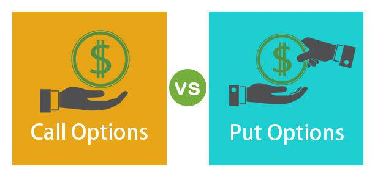

The world of financial trading offers diverse instruments and strategies designed to maximize returns. Options trading, particularly call and put options, presents an intriguing avenue for both speculative and hedging purposes. Options are versatile financial instruments that provide traders with the ability to capitalize on price movements in the market while also offering mechanisms for risk management. In options trading, call options grant the right to purchase an asset at a predetermined price, whereas put options grant the right to sell under similar conditions. These options enable traders to leverage their portfolio positions, which can lead to substantial gains or losses depending on market conditions.

In recent years, the integration of algorithmic trading has transformed how options are traded, emphasizing speed and precision. Algorithmic trading uses computer algorithms to execute trades based on predefined criteria, allowing traders to process large volumes of data and respond to market movements swiftly. The elimination of human emotions from trading decisions results in more consistent outcomes and enables traders to capture fleeting opportunities that would be difficult to act upon manually. In this changing landscape, algorithmic trading has become a crucial tool for optimizing options trading strategies.



This article explores the dynamics of call and put options trading and how algorithmic trading can optimize these strategies. We will examine the benefits, strategies, and practical applications of combining options trading with algorithmic methods. By leveraging algorithmic insights, traders can enhance their ability to identify optimal entry and exit points, implement efficient risk management techniques, and maintain competitive trading performance in a constantly evolving financial environment.

Understanding and utilizing the combination of options and algorithmic trading can provide a competitive edge by ensuring that trades are executed with increased accuracy and speed. As traders become more adept at using these technologies, they will be better equipped to navigate the complexities of modern financial markets and achieve their trading objectives.

## Table of Contents

## Understanding Call and Put Options

Call options and put options are fundamental instruments in options trading, each serving distinct purposes and benefits for investors. A call option grants the holder the right, but not the obligation, to purchase an underlying asset at a predetermined price, known as the exercise or strike price, within a specified timeframe. This enables investors to capitalize on price increases, as the value of a call option generally rises when the market price of the underlying asset surpasses the strike price.

In contrast, a put option offers the holder the right, but again not the obligation, to sell the underlying asset at the strike price within a specified period. This provides a form of insurance against price declines, allowing investors to mitigate potential losses if the asset's market value falls below the strike price. Both call and put options are versatile tools that allow traders to speculate on market movements or hedge existing positions.

The leverage inherent in options trading is critical, as these contracts enable the control of a more substantial asset position with a relatively smaller investment. This leverage can amplify profits, but it also carries the risk of significant losses if the market does not move in the anticipated direction. Hence, call and put options can significantly impact a trading portfolio, providing both opportunities and risks.

To develop effective trading strategies, understanding the mechanics of call and put options is crucial. Key factors include the option's premium, which is the price the buyer pays to acquire the option. This premium is influenced by various elements such as the underlying asset's current price, the option's strike price, time to expiration, and market [volatility](/wiki/volatility-trading-strategies). The Black-Scholes model, for example, is a widely-used mathematical approach to calculate the theoretical price of an option, incorporating these factors.

A simplified Python code snippet for calculating a call option's Black-Scholes price might resemble:

```python
import math
from scipy.stats import norm

def black_scholes_call(S, K, T, r, sigma):
    d1 = (math.log(S / K) + (r + 0.5 * sigma**2) * T) / (sigma * math.sqrt(T))
    d2 = d1 - sigma * math.sqrt(T)
    call_price = S * norm.cdf(d1) - K * math.exp(-r * T) * norm.cdf(d2)
    return call_price

# S = current stock price, K = strike price, T = time to expiration, r = risk-free rate, sigma = volatility
```

This quantitative foundation is essential for traders aiming to construct robust strategies that account for market dynamics, time decay, and option pricing intricacies. Understanding the interplay between these variables helps in anticipating the behavior of options in various market scenarios, thus enhancing decision-making capabilities in trading portfolios.

## The Power of Algorithmic Trading

Algorithmic trading utilizes sophisticated computer programs to execute trades based on predetermined criteria, eliminating the influence of human emotions which often lead to irrational decision-making in financial markets. This technique leverages high-speed computing and advanced algorithms to analyze extensive datasets, making decisions in milliseconds and enabling traders to exploit short-lived market opportunities. By automating the trading process, [algorithmic trading](/wiki/algorithmic-trading) ensures consistent and emotion-free execution, which is crucial in the volatile environment of financial trading.

Platforms such as uTrade Algos and Alpaca offer comprehensive tools and APIs that facilitate the development and deployment of these algorithms, empowering traders and developers to create customized trading strategies. For instance, Alpaca provides a Python-based API which allows for seamless integration of algorithmic strategies with real-time market data and order execution. Developers can write scripts that continuously monitor market trends and execute trades in response to specific triggers or patterns they identify.

Algorithmic trading significantly enhances operational efficiency by automating repetitive tasks and executing trades at optimal times, often beyond the capabilities of human traders. This not only reduces transaction costs but also minimizes the impact of latency in the execution of trades. For instance, an algorithm can be programmed to use moving averages to identify potential signals, adjusting parameters like the short-term and long-term moving averages to determine buy or sell signals. In Python, such a strategy might be implemented as follows:

```python
def moving_average_strategy(short_window, long_window, data):
    data['short_mavg'] = data['price'].rolling(window=short_window).mean()
    data['long_mavg'] = data['price'].rolling(window=long_window).mean()
    data['signal'] = 0
    data['signal'][short_window:] = np.where(data['short_mavg'][short_window:]
                                             > data['long_mavg'][short_window:], 1, 0)
    data['position'] = data['signal'].diff()
    return data
```

Furthermore, algorithmic trading supports advanced risk management techniques whereby algorithms can precisely assess and manage trading risks. Through dynamic hedging, traders can effectively protect their portfolios against adverse market movements by adjusting their positions automatically. For example, an algorithm can continuously calculate the optimal hedging ratios to maintain a balanced exposure, utilizing techniques like Delta Hedging to stabilize the portfolio irrespective of market dynamics.

In summary, algorithmic trading represents a transformative approach in financial markets by leveraging computational efficiency, thorough data analysis, and strategic execution. It simplifies complex trading processes, allowing for robust risk management and strategic positioning, ultimately facilitating a more streamlined and effective trading environment.

## Combining Options Trading with Algorithmic Trading

Integrating call and put options with algorithmic strategies can significantly enhance the outcomes of trading activities by leveraging the precision, speed, and adaptability inherent in algorithms. 

At the core of this integration is the ability of algorithms to identify optimal entry and [exit](/wiki/exit-strategy) points for options trades. Algorithms analyze large sets of data in real-time to determine favorable conditions for executing trades. For instance, by using historical data, indicators, and statistical models, algorithms can estimate the expected price movement of underlying assets. This allows traders to execute options trades at moments when the potential for profit is maximized, thus improving the overall efficacy of the strategy.

Incorporating algorithms into options trading also facilitates sophisticated risk management strategies. Automated hedging, a key feature of algorithmic trading, allows for dynamic adjustments based on market conditions. For example, if an adverse price movement is detected, algorithms can quickly modify the delta of an options position to maintain a desired level of market exposure, using strategies like gamma [scalping](/wiki/gamma-scalping). This automated process ensures that risk is continuously monitored and managed without human intervention.

Furthermore, algorithms can seamlessly execute complex multi-leg strategies such as straddles and strangles. These strategies, which involve holding positions in multiple options at different strike prices, can be computationally intensive to manage manually. However, with algorithmic trading, these strategies can be executed with greater accuracy and speed. For instance, a Python script utilizing a trading API can be employed to initiate a strangle by simultaneously buying a call and a put option:

```python
def execute_strangle(api, underlying, strike_price_call, strike_price_put, expiration_date):
    # Buy call option
    call_order = api.submit_order(
        symbol=underlying,
        qty=1,
        side='buy',
        type='market',
        time_in_force='gtc',
        option_type='call',
        strike=strike_price_call,
        expiration_date=expiration_date
    )

    # Buy put option
    put_order = api.submit_order(
        symbol=underlying,
        qty=1,
        side='buy',
        type='market',
        time_in_force='gtc',
        option_type='put',
        strike=strike_price_put,
        expiration_date=expiration_date
    )

    return call_order, put_order
```

The example demonstrates how algorithms efficiently handle multiple components of complex strategies to ensure consistent execution amidst fluctuating market conditions.

In conclusion, combining options trading with algorithmic strategies equips traders with advanced tools to optimize trading performance. This integration not only improves execution precision and timing but also enhances risk management and strategy complexity, enabling traders to navigate the financial markets with greater competence and confidence.

## Practical Applications and Strategy Execution

Volatility trading, such as through straddles and strangles, significantly benefits from the precision and timing provided by algorithmic trading. In particular, these strategies involve taking advantage of predicted volatility rather than directional market movements. A straddle involves buying both a call and a put option with the same strike price and expiration date, while a strangle involves buying a call and put with different strike prices but the same expiration date. By employing algorithmic trading, traders can precisely time the initiation of these strategies based on volatility indicators.

For implementing directional strategies, such as bullish or bearish spreads, algorithms enhance the speed and accuracy of execution. Directional strategies are based on predicting the future direction of an asset's price. A bullish spread, for instance, involves buying a call option and selling another call option with a higher strike price, expecting the underlying asset to increase in value. Conversely, a bearish spread anticipates a decrease in the asset's price. The speed of algorithmic systems ensures traders can place and execute these trades as soon as market conditions are favorable. Below is an example of a Python function, using the `pandas` and `numpy` libraries, that might be utilized to automate the detection and execution of a basic spread strategy based on moving averages:

```python
import pandas as pd
import numpy as np

def execute_spread_strategy(data, short_window=40, long_window=100):
    data['short_mavg'] = data['Close'].rolling(window=short_window, min_periods=1).mean()
    data['long_mavg'] = data['Close'].rolling(window=long_window, min_periods=1).mean()

    data['Signals'] = 0
    data['Signals'][short_window:] = np.where(data['short_mavg'][short_window:] > data['long_mavg'][short_window:], 1, -1)

    trades = pd.DataFrame(index=data.index)
    trades['Buy_Signal'] = (data['Signals'] == 1)
    trades['Sell_Signal'] = (data['Signals'] == -1)

    return trades
```

In hedging and portfolio protection strategies, such as protective puts and collars, algorithmic insights provide optimization by dynamically generating signals and executing trades based on predefined parameters. A protective put involves buying a put option while holding the underlying asset, serving as insurance against a drop in asset value. Collars combine buying a protective put and selling a call option, and algorithms can adjust positions as market conditions evolve, automatically balancing risk and potential returns.

The combination of options and algorithmic trading equips traders with robust tools to navigate modern financial markets effectively. Such integration allows for the seamless execution of complex multi-leg strategies, enhancing both profitability and risk mitigation. This synergy enables the practical application of advanced trading strategies, empowering traders to manage portfolios with greater precision and confidence.

## Risk Management and Algorithmic Trading

Effective risk management is a cornerstone of options trading, primarily due to the high volatility and leverage associated with these financial instruments. Traders must employ strategies that effectively mitigate risks while optimizing potential returns. Algorithmic trading plays a pivotal role by enabling dynamic hedging and precise position adjustments to navigate unpredictable market conditions. 

Algorithms, through predefined criteria and continuous data analysis, allow traders to automate the execution of hedging strategies, such as Delta Hedging. Delta Hedging involves neutralizing the directional risk associated with options by maintaining a delta-neutral portfolio. Delta, defined as the sensitivity of an option's price to changes in the underlying asset, can be counterbalanced by adjusting the positions in options or the underlying asset. The formula to calculate Delta is:

$$
\Delta = \frac{\partial V}{\partial S}
$$

where $\Delta$ is the delta, $V$ is the option's value, and $S$ is the price of the underlying asset. A Delta-neutral position implies that the weighted sum of the deltas of the options and the underlying asset equals zero, thereby minimizing directional risk.

Algorithmic systems can continually monitor the market and automatically adjust the positions to maintain a Delta-neutral stance, even as market conditions and asset prices change. This dynamic adjustment is crucial for managing the option's exposure to price movements and protecting against adverse market shifts.

Moreover, robust monitoring systems integrated with algorithmic trading platforms ensure that market conditions are continuously assessed to identify potential risk factors. These systems can automatically trigger alerts or actions when certain thresholds are reached, such as significant price volatility or [volume](/wiki/volume-trading-strategy) changes, enabling swift responses to mitigate risks. Algorithms utilize real-time data analysis and [machine learning](/wiki/machine-learning) techniques to enhance the predictive accuracy of risk assessments, facilitating more informed decision-making.

Overall, the use of algorithmic strategies for risk management in options trading not only enhances precision and speed in executing risk mitigation tactics but also provides a structured framework for traders to balance risk and reward effectively. As financial markets evolve and new technologies emerge, the integration of algorithms in risk management strategies remains an essential tool for navigating the complexities of options trading.

## Conclusion

The integration of options trading with algorithmic strategies fundamentally enhances the trading process, bringing greater efficiency, precision, and consistency to financial markets. This synergy allows traders to harness the speed and analytical capabilities of algorithms to maximize returns. By seamlessly executing complex trades, managing risk, and reacting swiftly to market changes, algorithms help traders at every step of their strategy.

As technology continues to evolve, further opportunities arise for refining and optimizing trading practices. The continuous iteration of software and algorithmic capabilities means that traders can consistently improve their methods, ensuring they remain competitive in an ever-changing landscape. This progress aligns with advancements in machine learning and data analytics, offering unprecedented insights and decision-support tools.

Success in financial trading requires not only leveraging the best tools available but also maintaining a commitment to continuous learning and strategy development. Traders who stay informed about technological developments and market trends, and who proactively refine their strategies, will be better positioned to capitalize on market opportunities while effectively managing risks. This dynamic approach is critical for navigating the complexities of modern financial markets.

## References & Further Reading

[1]: Hull, J. C. (2018). ["Options, Futures, and Other Derivatives"](https://www.semanticscholar.org/paper/Options%2C-Futures%2C-and-Other-Derivatives-Hull/89bdee500c8623864fc9eb7a471546aa713acc44) (10th Edition). Pearson.

[2]: Black, F., & Scholes, M. (1973). ["The Pricing of Options and Corporate Liabilities."](https://www.cs.princeton.edu/courses/archive/fall09/cos323/papers/black_scholes73.pdf) The Journal of Political Economy, 81(3), 637-654.

[3]: Narang, R. (2013). ["Inside the Black Box: The Simple Truth About Quantitative Trading"](https://www.amazon.com/Inside-Black-Box-Quantitative-Trading/dp/0470432063) (2nd Edition). Wiley.

[4]: Kissell, R. (2013). ["The Science of Algorithmic Trading and Portfolio Management"](https://www.sciencedirect.com/book/9780124016897/the-science-of-algorithmic-trading-and-portfolio-management). Academic Press.

[5]: Chan, E. P. (2008). ["Quantitative Trading: How to Build Your Own Algorithmic Trading Business"](https://github.com/ftvision/quant_trading_echan_book). Wiley.

[6]: Lopez de Prado, M. (2018). ["Advances in Financial Machine Learning"](https://www.amazon.com/Advances-Financial-Machine-Learning-Marcos/dp/1119482089). Wiley.