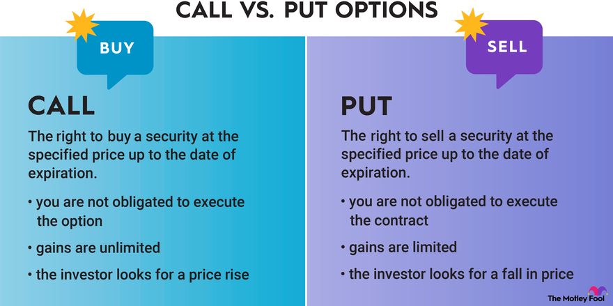

## Table of Contents

## What is a call option?

A call option is a financial contract that gives you the right, but not the obligation, to buy a specific stock at a set price within a certain time period. Imagine you think a stock's price will go up. You can buy a call option for that stock. If the stock price does go up, you can buy it at the lower, set price and then sell it at the higher market price, making a profit.

For example, let's say you buy a call option for XYZ stock with a set price of $50, and the option expires in three months. If the stock price goes above $50 before the three months are up, you can buy the stock at $50 and sell it at the higher market price. If the stock price stays below $50, you don't have to buy it, and you only lose the money you paid for the option. This way, call options can be a way to potentially make money if you think a stock's price will increase.

## What is a put option?

A put option is a financial contract that gives you the right, but not the obligation, to sell a specific stock at a set price within a certain time period. Imagine you think a stock's price will go down. You can buy a put option for that stock. If the stock price does go down, you can buy the stock at the lower market price and then sell it at the higher, set price, making a profit.

For example, let's say you buy a put option for ABC stock with a set price of $100, and the option expires in two months. If the stock price drops below $100 before the two months are up, you can buy the stock at the lower market price and sell it at $100. If the stock price stays above $100, you don't have to sell it, and you only lose the money you paid for the option. This way, put options can be a way to potentially make money if you think a stock's price will decrease.

## How do call and put options work?

Call and put options are like bets on whether a stock's price will go up or down. A call option gives you the right to buy a stock at a set price before a certain date. If you think the stock's price will go up, you can buy a call option. If the stock's price does go up, you can buy it at the lower set price and sell it at the higher market price, making a profit. If the stock's price doesn't go up, you don't have to buy it, and you only lose the money you paid for the option.

A put option works the opposite way. It gives you the right to sell a stock at a set price before a certain date. If you think the stock's price will go down, you can buy a put option. If the stock's price does go down, you can buy the stock at the lower market price and sell it at the higher set price, making a profit. If the stock's price doesn't go down, you don't have to sell it, and you only lose the money you paid for the option.

Both call and put options can be useful tools for investors. They let you make money from stocks going up or down without having to buy or sell the stocks directly. But they can also be risky because if your guess about the stock's price is wrong, you could lose the money you spent on the option.

## What are the basic differences between call and put options?

Call and put options are like two sides of the same coin. A call option gives you the right to buy a stock at a set price before a certain date. You would buy a call option if you think the stock's price will go up. If it does go up, you can buy the stock at the lower set price and sell it at the higher market price, making a profit. If the stock's price doesn't go up, you don't have to buy it, and you only lose the money you paid for the option.

A put option, on the other hand, gives you the right to sell a stock at a set price before a certain date. You would buy a put option if you think the stock's price will go down. If it does go down, you can buy the stock at the lower market price and sell it at the higher set price, making a profit. If the stock's price doesn't go down, you don't have to sell it, and you only lose the money you paid for the option.

In simple terms, call options are for betting on a stock going up, while put options are for betting on a stock going down. Both can help you make money from stocks without buying or selling them directly, but they also come with the risk of losing the money you spent on the option if your guess about the stock's price is wrong.

## What are the potential profits and losses associated with call options?

When you buy a call option, you're betting that the stock's price will go up. If it does, you can buy the stock at the lower set price (called the strike price) and then sell it at the higher market price, making a profit. The profit you can make is potentially unlimited because there's no limit to how high the stock's price can go. For example, if you buy a call option with a strike price of $50 and the stock's price goes up to $70, you can buy the stock at $50 and sell it at $70, making a $20 profit per share (minus the cost of the option).

However, if the stock's price doesn't go up above the strike price before the option expires, you won't make any money. In this case, you'll lose the money you paid for the option, which is called the premium. The most you can lose is the premium you paid, so the potential loss is limited to that amount. For example, if you paid $2 for the call option and the stock's price stays below $50, you'll lose the $2 per share you paid for the option.

## What are the potential profits and losses associated with put options?

When you buy a put option, you're betting that the stock's price will go down. If it does, you can buy the stock at the lower market price and then sell it at the higher set price (called the strike price), making a profit. The most you can make is the difference between the strike price and zero, because a stock's price can't go below zero. For example, if you buy a put option with a strike price of $100 and the stock's price drops to $80, you can buy the stock at $80 and sell it at $100, making a $20 profit per share (minus the cost of the option).

However, if the stock's price doesn't go down below the strike price before the option expires, you won't make any money. In this case, you'll lose the money you paid for the option, which is called the premium. The most you can lose is the premium you paid, so the potential loss is limited to that amount. For example, if you paid $3 for the put option and the stock's price stays above $100, you'll lose the $3 per share you paid for the option.

## How do you determine the break-even point for call and put options?

The break-even point for a call option is the price at which you start making money. To find it, you add the premium you paid for the option to the strike price. For example, if you bought a call option with a strike price of $50 and you paid a premium of $2, your break-even point would be $52. This means the stock's price needs to go above $52 for you to start making a profit. If the stock's price is below $52 when the option expires, you'll lose the $2 premium you paid.

The break-even point for a put option is a bit different. It's the price at which you start making money, and you find it by subtracting the premium you paid from the strike price. For example, if you bought a put option with a strike price of $100 and you paid a premium of $3, your break-even point would be $97. This means the stock's price needs to drop below $97 for you to start making a profit. If the stock's price is above $97 when the option expires, you'll lose the $3 premium you paid.

## What factors affect the pricing of call and put options?

The price of call and put options, also known as the premium, is influenced by several key factors. One important factor is the current price of the stock compared to the strike price. For call options, if the stock price is higher than the strike price, the option is worth more because you can buy the stock at a lower price and sell it at the higher market price. For put options, if the stock price is lower than the strike price, the option is worth more because you can sell the stock at a higher price than its current market value. Another factor is the time until the option expires. The more time there is before the option expires, the more valuable it is because there's more time for the stock price to move in your favor.

Other factors that affect the price of options include the expected volatility of the stock's price and interest rates. If the stock is expected to have big price swings, the option is more valuable because there's a higher chance the stock price will move in a way that makes the option profitable. Interest rates also play a role, especially for longer-term options. Higher interest rates can make call options more expensive and put options less expensive. All these factors together help determine how much you'll pay for an option, and understanding them can help you make smarter investment decisions.

## How can call and put options be used for hedging?

Call and put options can be used for hedging to protect against potential losses in your investments. Imagine you own a stock and you're worried its price might go down. You can buy a put option for that stock. If the stock's price does go down, the put option lets you sell the stock at a higher set price, which helps limit your losses. This way, even if the stock's price drops, you can still sell it at the price you set with the put option, protecting your investment.

On the other hand, if you're worried about missing out on potential gains because you're holding cash or another investment, you can buy a call option. If the stock's price goes up, the call option lets you buy the stock at a lower set price, so you can still make money from the stock's increase. This way, you're protected against missing out on gains while you wait to see how the market moves. Using call and put options for hedging can help manage risk and give you more control over your investments.

## What are the advanced strategies involving both call and put options?

One advanced strategy involving both call and put options is called a straddle. This strategy involves buying both a call option and a put option for the same stock with the same strike price and expiration date. You would use a straddle if you think the stock's price is going to move a lot, but you're not sure which way. If the stock's price goes up a lot, the call option will make money, and if it goes down a lot, the put option will make money. The downside is that you need the stock's price to move a lot in either direction to cover the cost of both options, otherwise you'll lose money.

Another strategy is called a strangle. This is similar to a straddle, but you buy a call option with a higher strike price and a put option with a lower strike price, both with the same expiration date. The idea is the same: you think the stock's price is going to move a lot, but you're not sure which way. The advantage of a strangle is that it's cheaper than a straddle because the options are less likely to be in the money, but you need an even bigger move in the stock's price to make a profit. Both straddles and strangles can be useful if you expect big changes in the stock's price but aren't sure which direction it will go.

## How do implied volatility and time decay influence the value of call and put options?

Implied volatility is a measure of how much the market thinks a stock's price will move in the future. It's like a guess about how wild the stock's price might get. When implied volatility goes up, it means people think the stock's price could change a lot, so both call and put options become more expensive. This is because there's a bigger chance the options will end up being worth something. On the other hand, if implied volatility goes down, it means people think the stock's price won't change much, so options become cheaper because there's less chance they'll be worth something.

Time decay, or theta, is another important factor that affects the value of options. It's like a clock ticking down on the life of an option. As time goes by, options lose value because there's less time left for the stock's price to move in your favor. This happens faster as the option gets closer to its expiration date. For both call and put options, the closer you get to the expiration date, the more the option's value drops. So, if you're holding an option, you want the stock's price to move in your favor quickly before time decay eats away at its value.

## What are the tax implications of trading call and put options?

Trading call and put options can have tax consequences that you need to think about. If you make money from options, it's usually considered capital gains. If you hold the option for a year or less before selling it, the gain is a short-term capital gain, which is taxed at your regular income tax rate. If you hold it for more than a year, it's a long-term capital gain, which is taxed at a lower rate. But, if you're using options as part of your job, like if you're a professional trader, the money you make might be taxed as regular income instead.

If you lose money on options, you can use those losses to lower your taxes. You can subtract your losses from your gains to figure out your net gain or loss. If your losses are more than your gains, you can use up to $3,000 of those losses to lower your other income. If you have more losses than that, you can carry them over to future years to use them then. It's a good idea to keep good records of all your option trades and talk to a tax professional to make sure you're doing everything right.

## How does risk management relate to algorithmic trading?

Effective risk management is a cornerstone of options trading, primarily due to the high volatility and leverage associated with these financial instruments. Traders must employ strategies that effectively mitigate risks while optimizing potential returns. Algorithmic trading plays a pivotal role by enabling dynamic hedging and precise position adjustments to navigate unpredictable market conditions. 

Algorithms, through predefined criteria and continuous data analysis, allow traders to automate the execution of hedging strategies, such as Delta Hedging. Delta Hedging involves neutralizing the directional risk associated with options by maintaining a delta-neutral portfolio. Delta, defined as the sensitivity of an option's price to changes in the underlying asset, can be counterbalanced by adjusting the positions in options or the underlying asset. The formula to calculate Delta is:

$$
\Delta = \frac{\partial V}{\partial S}
$$

where $\Delta$ is the delta, $V$ is the option's value, and $S$ is the price of the underlying asset. A Delta-neutral position implies that the weighted sum of the deltas of the options and the underlying asset equals zero, thereby minimizing directional risk.

Algorithmic systems can continually monitor the market and automatically adjust the positions to maintain a Delta-neutral stance, even as market conditions and asset prices change. This dynamic adjustment is crucial for managing the option's exposure to price movements and protecting against adverse market shifts.

Moreover, robust monitoring systems integrated with algorithmic trading platforms ensure that market conditions are continuously assessed to identify potential risk factors. These systems can automatically trigger alerts or actions when certain thresholds are reached, such as significant price volatility or [volume](/wiki/volume-trading-strategy) changes, enabling swift responses to mitigate risks. Algorithms utilize real-time data analysis and [machine learning](/wiki/machine-learning) techniques to enhance the predictive accuracy of risk assessments, facilitating more informed decision-making.

Overall, the use of algorithmic strategies for risk management in options trading not only enhances precision and speed in executing risk mitigation tactics but also provides a structured framework for traders to balance risk and reward effectively. As financial markets evolve and new technologies emerge, the integration of algorithms in risk management strategies remains an essential tool for navigating the complexities of options trading.

## References & Further Reading

[1]: Hull, J. C. (2018). ["Options, Futures, and Other Derivatives"](https://www.semanticscholar.org/paper/Options%2C-Futures%2C-and-Other-Derivatives-Hull/89bdee500c8623864fc9eb7a471546aa713acc44) (10th Edition). Pearson.

[2]: Black, F., & Scholes, M. (1973). ["The Pricing of Options and Corporate Liabilities."](https://www.cs.princeton.edu/courses/archive/fall09/cos323/papers/black_scholes73.pdf) The Journal of Political Economy, 81(3), 637-654.

[3]: Narang, R. (2013). ["Inside the Black Box: The Simple Truth About Quantitative Trading"](https://www.amazon.com/Inside-Black-Box-Quantitative-Trading/dp/0470432063) (2nd Edition). Wiley.

[4]: Kissell, R. (2013). ["The Science of Algorithmic Trading and Portfolio Management"](https://www.sciencedirect.com/book/9780124016897/the-science-of-algorithmic-trading-and-portfolio-management). Academic Press.

[5]: Chan, E. P. (2008). ["Quantitative Trading: How to Build Your Own Algorithmic Trading Business"](https://github.com/ftvision/quant_trading_echan_book). Wiley.

[6]: Lopez de Prado, M. (2018). ["Advances in Financial Machine Learning"](https://www.amazon.com/Advances-Financial-Machine-Learning-Marcos/dp/1119482089). Wiley.