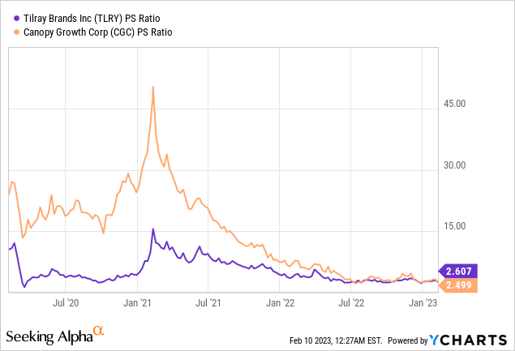

The cannabis industry has undergone a remarkable transformation over recent years, significantly influenced by key players such as Tilray and Canopy Growth. These companies have been at the forefront of this evolution, capitalizing on new opportunities while navigating the multifaceted challenges inherent in this space. Tilray and Canopy Growth have made notable advancements in expanding their operational capacities, forging strategic partnerships, and enhancing product portfolios to secure a competitive edge in the burgeoning market.

However, the journey has not been without hurdles. Regulatory barriers pose persistent challenges, given the varied legal status of cannabis across regions, particularly in the United States. Market volatility adds another layer of complexity, with fluctuating regulatory landscapes and consumer demands impacting financial performance and strategic direction. These dynamics underscore the complexities involved in sustaining growth and achieving profitability within the cannabis sector.



This article explores these competitive dynamics, highlighting the financial trajectories of both Tilray and Canopy Growth. Moreover, it examines the emerging role of algorithmic trading, a technological advancement reshaping cannabis investing by facilitating rapid, data-driven trading decisions. As the cannabis industry continues to evolve, understanding these elements will be crucial for stakeholders aiming to navigate this dynamic environment effectively.

## Table of Contents

## Overview of the Cannabis Industry

Since 2018, the cannabis industry has experienced significant growth, driven primarily by increased legalization and growing market acceptance around the world. Countries such as Canada fully legalized cannabis for recreational use, setting a precedent and encouraging other nations to reconsider their cannabis policies. Additionally, the U.S. saw a wave of state-level legalizations despite cannabis remaining illegal at the federal level, further contributing to the market's expansion.

This burgeoning industry, however, continues to face substantial legal and regulatory challenges. In the U.S., the federal prohibition of cannabis creates a complex landscape for companies operating across states with varying regulations. These legal complexities concern everything from banking restrictions to interstate commerce, which complicate operations and planning for cannabis companies. Moreover, companies must adhere to strict regulatory requirements for production, distribution, and marketing to avoid penalties and maintain compliance with government standards. These challenges require cannabis companies to navigate an array of state and federal laws to succeed.

Tilray and Canopy Growth have been prominent figures capitalizing on the industry's growth while dealing with multinational operations' intricacies. Tilray, for instance, has established itself as a key player by expanding its international presence and securing licenses in various countries, helping it to mitigate the challenges posed by regulatory variability. Similarly, Canopy Growth has pursued an aggressive expansion strategy by investing in infrastructure and establishing supply agreements across legal markets globally, enhancing its position within the industry.

The ongoing evolution of cannabis legislation continues to shape the landscape in which these companies operate, requiring adaptability and strategic foresight. As more jurisdictions move toward legalization, the industry is likely to see further growth, although the path remains fraught with unpredictable regulatory shifts and competitive pressures.

## Tilray: Strategic Initiatives and Financial Performance

Tilray's expansion strategy has been marked by significant acquisitions and mergers, the most notable being its merger with Aphria in 2021. This strategic consolidation positioned Tilray as one of the largest global cannabis companies by revenue in the emerging market. Merging with Aphria allowed Tilray to leverage economies of scale and expand its product offerings, which was crucial in a highly competitive and fragmented cannabis market.

In addition to cannabis products, Tilray has diversified its portfolio by venturing into alcohol and hemp-based products. This diversification serves as a strategic maneuver to stabilize its revenue streams, particularly in periods when cannabis sales face [volatility](/wiki/volatility-trading-strategies). By incorporating offerings such as hemp foods and craft beverages, Tilray aims to mitigate risks associated with the cannabis sector's regulatory changes and market fluctuations.

Financial performance data indicates that although Tilray has achieved revenue growth, reaching approximately USD 513 million in fiscal year 2022, the path to profitability remains challenging. The amalgamation with Aphria contributed to the top-line growth; however, various factors impede profitability. These include competitive pricing pressures, regulatory compliance costs, and the need to invest heavily in marketing and product development to sustain market share.

The financial statements reflect an increase in operational costs. Continued efforts to optimize and synergize operations post-merger are essential for improving profit margins. The following Python code snippet exemplifies how to calculate Tilray's profit margin using basic financial data:

```python
def calculate_profit_margin(revenue, cost_of_goods_sold, operating_expenses):
    gross_profit = revenue - cost_of_goods_sold
    operating_profit = gross_profit - operating_expenses
    profit_margin = (operating_profit / revenue) * 100
    return profit_margin

# Example values in USD millions
revenue = 513
cost_of_goods_sold = 350  # Hypothetical value
operating_expenses = 200  # Hypothetical value

profit_margin = calculate_profit_margin(revenue, cost_of_goods_sold, operating_expenses)
print(f"Profit Margin: {profit_margin:.2f}%")
```

Despite these challenges, Tilray continues to explore efficiencies and optimizations to steer toward profitability. Innovations in product offerings and strategic geographic expansions are likely to be focal areas as the company seeks to leverage its expanded scale to achieve sustainable growth.

## Canopy Growth: Financials and Market Strategy

Canopy Growth Corporation, one of the leading entities in the cannabis industry, has experienced significant financial challenges but remains steadfast in its commitment to growth and market expansion. These challenges are characterized by fluctuating revenues and mounting operating costs, which have necessitated a dynamic and strategic approach to business development.

A pivotal aspect of Canopy Growth's strategy is its strong alliance with Constellation Brands, a major stakeholder. This relationship has provided Canopy Growth with substantial financial backing and expertise, allowing the company to explore new market opportunities, particularly in the United States, where legislative barriers have historically impeded market entry. The U.S. market presents an attractive growth prospect, given its potential size and evolving legal landscape regarding cannabis legalization.

To navigate its financial hurdles, Canopy Growth has implemented efforts to streamline its operations. The company is prioritizing cost reduction measures to manage its cash burn effectively. This involves adopting an 'asset-light' business model, characterized by a focus on maximizing asset efficiency and reducing capital expenditure. By doing so, Canopy Growth aims to enhance its operational agility and financial sustainability.

The adoption of this model is aligned with strategic initiatives to optimize its portfolio and geographic footprint. Canopy Growth is engaged in shedding non-core assets and focusing its resources on areas with the highest potential for growth and profitability. This includes investing in high-margin product lines and scaling operations in regions with favorable regulatory environments.

In summary, while Canopy Growth faces considerable financial and market challenges, its strategic partnerships, exploration of new avenues like the U.S. market, and operational streamlining efforts position it for potential future growth. The company's commitment to an 'asset-light' model and resource optimization reflects its adaptive strategies to address both present challenges and future opportunities in the evolving cannabis industry.

## Algorithmic Trading in the Cannabis Sector

Algorithmic trading has become an integral part of the cannabis sector's financial landscape, bringing both opportunities and unpredictability. This trading method involves using computer algorithms to execute trades at speeds and frequencies beyond human capability. The emergence of [algorithmic trading](/wiki/algorithmic-trading) in the cannabis industry is largely due to the sector's high volatility and rapid market movements, which make it an attractive domain for algorithmic interventions.

The primary advantage of algorithmic trading is its ability to process vast amounts of data quickly, thereby facilitating swift decision-making. This is particularly critical in the cannabis industry, where regulatory changes, market sentiments, and emerging trends can significantly impact stock prices. Algorithms can instantly analyze news releases, financial reports, and market data to predict short-term price movements, something manual traders might miss.

However, the implementation of algorithmic trading also introduces complexities, particularly in predicting market movements and making real-time decisions. Algorithms rely heavily on historical data and statistical models. In a rapidly evolving industry such as cannabis, where new regulations and market actors constantly emerge, historical data may not always be a reliable predictor of future movements.

For instance, consider a simplified algorithmic trading strategy using Python, which reacts to price changes in cannabis stocks:

```python
import pandas as pd
import numpy as np

def simple_moving_average_strategy(prices, short_window=40, long_window=100):
    signals = pd.DataFrame(index=prices.index)
    signals['signal'] = 0.0

    # Create short and long simple moving averages
    signals['short_mavg'] = prices.rolling(window=short_window, min_periods=1, center=False).mean()
    signals['long_mavg'] = prices.rolling(window=long_window, min_periods=1, center=False).mean()

    # Generate buy signals (1) when short moving average is higher than long moving average
    signals['signal'][short_window:] = np.where(signals['short_mavg'][short_window:] > signals['long_mavg'][short_window:], 1.0, 0.0)

    # Create the trading orders
    signals['positions'] = signals['signal'].diff()

    return signals

# Prices would be a Pandas Series of stock prices
# signals = simple_moving_average_strategy(prices)
```

This basic strategy leverages short-term and long-term moving averages to generate trading signals. While illustrative, real-world strategies are far more complex, integrating various indicators and [machine learning](/wiki/machine-learning) models to refine predictions.

Investors in Tilray and Canopy Growth are embracing algorithmic trading to better manage the volatility of cannabis stocks. By employing these technologies, they aim to achieve more efficient trading processes and potentially higher returns. The sophisticated use of algorithms can allow market players to not only react to abrupt changes but also optimize their trading strategies to minimize risks.

Algorithmic trading undeniably offers a powerful toolset for navigating the cannabis market. However, its efficacy depends heavily on the adaptability and robustness of the algorithms used. As the cannabis industry continues to mature, the role of algorithmic trading is expected to grow, offering both new challenges and opportunities for those navigating this dynamic sector.

## Challenges and Opportunities Ahead

The future trajectory of the cannabis industry is heavily contingent on legislative developments in crucial markets such as the United States and Europe. Legislative landscapes in these regions continue to evolve, presenting challenges and opportunities for cannabis businesses. Tilray and Canopy Growth, two prominent players in the industry, must navigate these changes adeptly while concurrently managing their own financial performance and facing external pressures from competitors.

In the United States, cannabis legalization remains a patchwork of state-level laws lacking federal approval. Recent legislative efforts, such as the MORE Act and the SAFE Banking Act, have aimed to address this disparity, creating potential openings for Canadian companies like Tilray and Canopy Growth to extend their reach into a market valued at over $60 billion according to New Frontier Data. Operating within this fragmented regulatory environment requires strategic flexibility and an astute understanding of compliance requirements to safely capitalize on emerging opportunities.

Similarly, Europe presents a burgeoning market with increasing acceptance of both medical and recreational cannabis. Countries like Germany, Italy, and the Netherlands are at the forefront, with Germany expected to spearhead the market following its legislative push for recreational cannabis use. Companies must focus on establishing robust distribution networks and comply with diverse EU regulations to harness this growth effectively.

Despite these promising opportunities, Tilray and Canopy Growth encounter hurdles in achieving sustained profitability. Both companies must enhance internal efficiencies and adopt innovative strategies to optimize financial performance. This involves streamlining operations, capital management, and, importantly, fostering product innovation. The development of new cannabis-based products tailored to emerging wellness and medicinal trends provides a vital avenue for market expansion and revenue diversification.

To manage competitive pressures, Tilray and Canopy Growth should leverage their economies of scale and brand strength, alongside strategic alliances and partnerships. This can mitigate risks associated with market entry and expansions in the increasingly competitive global landscape.

Ultimately, the widespread legalization of cannabis presents a monumental opportunity for industry growth. As laws liberalize, the market is set to expand, allowing companies to explore previously untapped consumer bases and innovate new product categories. Adapting to these legislative changes while focusing on internal financial health will be critical for Tilray, Canopy Growth, and their peers as they seek to define the future of the cannabis industry.

## Conclusion

Tilray and Canopy Growth stand at the forefront of the cannabis industry, highlighting both the substantial opportunities and significant risks inherent in this rapidly evolving market. Their trajectories demonstrate the dynamic nature of the cannabis sector, where the ability to adapt quickly to regulatory changes and market conditions is essential for success. By continuously refining their strategies and exploring new markets, both companies aim to capitalize on the potential for global cannabis acceptance and the development of innovative cannabis products.

Investors should closely monitor how Tilray and Canopy Growth leverage modern trading technologies, such as algorithmic trading, to manage the inherent volatility and seize opportunities as they arise. These tools not only offer the potential for enhanced decision-making based on real-time data but also introduce new complexities in understanding market dynamics. The strategic deployment of these technologies could prove pivotal for investors seeking to navigate this volatile market effectively.

The growth narrative of the cannabis industry is actively unfolding, with Tilray and Canopy Growth playing key roles as industry leaders. Their ability to influence industry standards, expand their global reach, and drive innovation will likely shape the future of cannabis. As such, their continued evolution remains a critical focus for investors and stakeholders aiming to understand the full scope of possibilities within this burgeoning sector.

## References & Further Reading

[1]: ["Advances in Financial Machine Learning"](https://www.amazon.com/Advances-Financial-Machine-Learning-Marcos/dp/1119482089) by Marcos Lopez de Prado

[2]: ["Quantitative Trading: How to Build Your Own Algorithmic Trading Business"](https://www.amazon.com/Quantitative-Trading-Build-Algorithmic-Business/dp/1119800064) by Ernest P. Chan

[3]: ["Cannabis as an Alternative Investment"](https://www.disruptionbanking.com/2022/12/15/cannabis-as-an-alternative-investment-strategy/) by J.P. Morgan Research

[4]: ["The Green Regulatory Landscape: US Cannabis Regulations and Their Impact"](https://disa.com/news/2024-cannabis-regulation-changes-impact-on-industry) by Brookings Institution

[5]: ["Tilray and Aphria Merger: A Strategic Analysis"](https://ir.tilray.com/news-releases/news-release-details/tilray-aphria-announce-closing-transaction-creates-new-tilray) by Forbes