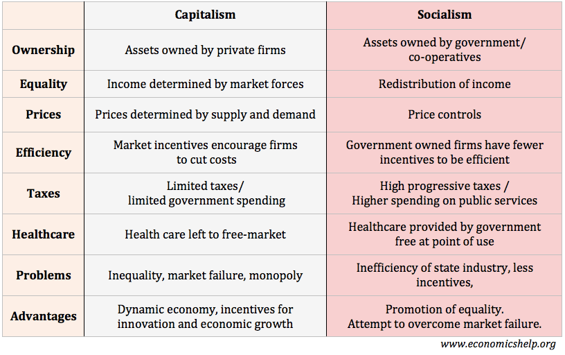

## Table of Contents

## What is capitalism?

Capitalism is an economic system where businesses and property are owned by private people, not by the government. In this system, people can start their own companies and try to make money. The main idea is that people work to earn money, and they can spend that money on things they want or need. Companies also compete with each other to offer the best products at the best prices. This competition is supposed to help the economy grow and make life better for everyone.

One important part of capitalism is the idea of supply and demand. This means that if a lot of people want something, the price of that thing will go up. If not many people want it, the price will go down. Companies try to make things that people want so they can make more money. People who have money can invest it in businesses, hoping to make even more money. This system can lead to big differences between rich and poor people, and sometimes the government needs to step in to make things fairer.

## What is socialism?

Socialism is an economic system where the government or the community owns and controls things like factories, farms, and other resources. The main idea is that everyone should share what they have so that nobody is very rich or very poor. In socialism, the government decides how to use resources and how to share the wealth among the people. This is different from capitalism, where private people own businesses and try to make money for themselves.

In a socialist system, people work together for the good of everyone, not just for their own gain. The government might provide things like healthcare, education, and housing for free or at a low cost, so that everyone can have what they need. The goal is to make sure that everyone has a fair chance in life and that the differences between rich and poor are smaller. However, some people think that socialism can make it hard for the economy to grow because there might not be as much competition or motivation to work hard.

## How do capitalism and socialism differ in terms of property ownership?

In capitalism, property and businesses are owned by private people. This means that if you start a business, you own it and can make decisions about it. You can also keep the money you make from your business. People can buy and sell property and businesses, and the government does not usually control them. This system encourages people to work hard and start new businesses because they can become rich if they are successful.

In socialism, the government or the community owns and controls property and businesses. Instead of private people owning things, the government decides how to use resources and how to share the wealth. This means that if you work in a factory, the factory is owned by the government or the community, not by you or another private person. The idea is to make sure that everyone has what they need and that the differences between rich and poor are smaller.

## What are the basic economic principles of capitalism?

Capitalism is based on the idea that private people should own businesses and property. In this system, people are free to start their own companies and try to make money. The main goal is for people to work hard and earn money, which they can then spend on things they want or need. Companies compete with each other to offer the best products at the best prices. This competition is thought to help the economy grow and make life better for everyone.

Another important principle of capitalism is supply and demand. This means that if a lot of people want something, the price of that thing will go up. If not many people want it, the price will go down. Companies try to make things that people want so they can make more money. People who have money can invest it in businesses, hoping to make even more money. This system can lead to big differences between rich and poor people, but it also encourages people to work hard and be creative.

## What are the basic economic principles of socialism?

Socialism is an economic system where the government or the community owns and controls resources like factories and farms. The main idea is that everyone should share what they have so that nobody is very rich or very poor. In socialism, the government decides how to use these resources and how to share the wealth among the people. This is different from capitalism, where private people own businesses and try to make money for themselves.

In a socialist system, people work together for the good of everyone, not just for their own gain. The government might provide things like healthcare, education, and housing for free or at a low cost, so that everyone can have what they need. The goal is to make sure that everyone has a fair chance in life and that the differences between rich and poor are smaller. However, some people think that socialism can make it hard for the economy to grow because there might not be as much competition or motivation to work hard.

## How do capitalism and socialism approach income distribution?

In capitalism, income distribution is based on how much money people can make from their work or investments. If you start a business or work hard at a job, you can earn a lot of money. But if you don't have a good job or can't start a business, you might not make much money. This can lead to big differences between rich and poor people. The government might try to help by taxing rich people more and using that money to help poor people, but the main idea is that people should keep most of the money they earn.

In socialism, the government or the community decides how to share the money and resources. The goal is to make sure that everyone has enough to live a good life, so the differences between rich and poor are smaller. The government might take money from everyone's earnings and use it to provide things like healthcare, education, and housing for free or at a low cost. This way, everyone can have what they need, but some people think this might make people less motivated to work hard because they won't get to keep as much of their own money.

## What are the historical origins of capitalism and socialism?

Capitalism started to grow during the 16th and 17th centuries in Europe, especially in places like England and the Netherlands. It became stronger during the Industrial Revolution in the 18th and 19th centuries. This was a time when new machines and factories changed the way people worked and made things. People could start their own businesses and try to make money. The idea of capitalism came from thinkers like Adam Smith, who wrote about how people working for their own gain could help the whole economy grow.

Socialism started as an idea in the late 18th and early 19th centuries. It grew as a response to the problems caused by capitalism, like poor working conditions and big differences between rich and poor people. Thinkers like Karl Marx and Friedrich Engels wrote about how socialism could be a better way to share wealth and make life fairer for everyone. They thought the government or the community should own businesses and resources, not private people. Socialism became more popular in the 20th century, especially after the Russian Revolution in 1917, when the Soviet Union became the first big country to try socialism.

## What are some real-world examples of countries practicing capitalism and socialism?

The United States is a good example of a country that practices capitalism. In the U.S., people can start their own businesses and try to make money. Companies compete with each other to offer the best products at the best prices. People can also invest their money in businesses and hope to make more money. While the government does have some rules to make things fair, most businesses and property are owned by private people. This system helps the economy grow, but it can also lead to big differences between rich and poor people.

Cuba is an example of a country that practices socialism. In Cuba, the government owns and controls most businesses and resources. The idea is to make sure everyone has what they need, like healthcare and education, and to keep the differences between rich and poor smaller. The government decides how to use resources and how to share the wealth. While this system aims to be fair, some people think it can make it hard for the economy to grow because there might not be as much competition or motivation to work hard.

Some countries try to mix both capitalism and socialism. For example, Sweden has a strong capitalist economy where people can start their own businesses, but the government also provides many services like healthcare and education for free or at a low cost. This mix is called a social democracy, where the government tries to balance the benefits of capitalism with the fairness of socialism.

## How do capitalism and socialism impact social welfare and public services?

In capitalism, the government usually does not provide as many social welfare and public services as in socialism. Instead, people can buy things like healthcare and education if they have enough money. This means that people who are rich can get better services than those who are poor. The government might help by taxing rich people more and using that money to help poor people, but the main idea is that people should take care of themselves. This can lead to big differences between rich and poor people, but it also encourages people to work hard and start businesses to make money.

In socialism, the government tries to make sure everyone has what they need, so it provides more social welfare and public services. Things like healthcare, education, and housing might be free or cost very little, so everyone can use them. The idea is to make life fair for everyone and keep the differences between rich and poor smaller. The government takes money from everyone's earnings to pay for these services. While this system aims to help everyone, some people think it might make it hard for the economy to grow because people might not be as motivated to work hard if they won't get to keep as much of their own money.

## What are the arguments for and against capitalism in terms of economic efficiency?

People who support capitalism say it is good for economic efficiency because it makes people work hard and start new businesses. In capitalism, people can keep the money they make, so they have a big reason to work hard and be creative. Companies also compete with each other to make the best products at the lowest prices. This competition makes businesses try to be more efficient and find better ways to do things. When businesses are efficient, the whole economy can grow, and people can have more things they want and need.

On the other hand, people who argue against capitalism say it can lead to big problems with economic efficiency. They say that when some people get very rich, they can use their money to control businesses and markets, which can stop fair competition. This can make it hard for new businesses to start and grow. Also, in capitalism, some people might not have enough money to buy things they need, which can slow down the economy. Critics think that the big differences between rich and poor can make the economy less efficient because not everyone can take part in it fully.

## What are the arguments for and against socialism in terms of social equity?

People who support socialism say it is good for social equity because it makes sure everyone has what they need. In socialism, the government owns businesses and resources, so it can share the wealth among everyone. This means that everyone can get things like healthcare, education, and housing for free or at a low cost. The idea is to make life fair for everyone and keep the differences between rich and poor smaller. When everyone has a fair chance, people feel more equal and can live better lives.

On the other hand, people who argue against socialism say it can hurt social equity in some ways. They think that when the government controls everything, people might not work as hard because they won't get to keep as much of their own money. This can make the economy grow slower, which can mean fewer jobs and less money for everyone. Critics also say that sometimes the government might not share things fairly, and some people might still end up with more than others. They worry that socialism can take away people's freedom to start their own businesses and make their own choices.

## How do capitalism and socialism influence innovation and technological advancement?

Capitalism encourages innovation and technological advancement because people can make a lot of money if they come up with new ideas. In a capitalist system, if you start a business or invent something new, you can keep the money you make from it. This gives people a big reason to think of new things and work hard to make them happen. Companies also compete with each other to make the best products, so they try to find new ways to do things better and faster. This competition can lead to a lot of new technology and inventions that help the economy grow and make life better for everyone.

Socialism can also lead to innovation and technological advancement, but in a different way. In a socialist system, the government or the community owns businesses and resources, so they decide what to work on. If the government thinks something is important for everyone, they can put a lot of money and effort into it. This can lead to big projects and new technology that help everyone, like better healthcare or public transportation. But some people think that socialism might not encourage as much innovation because people might not have the same reason to work hard and come up with new ideas if they won't get to keep the money they make.

## References & Further Reading

#