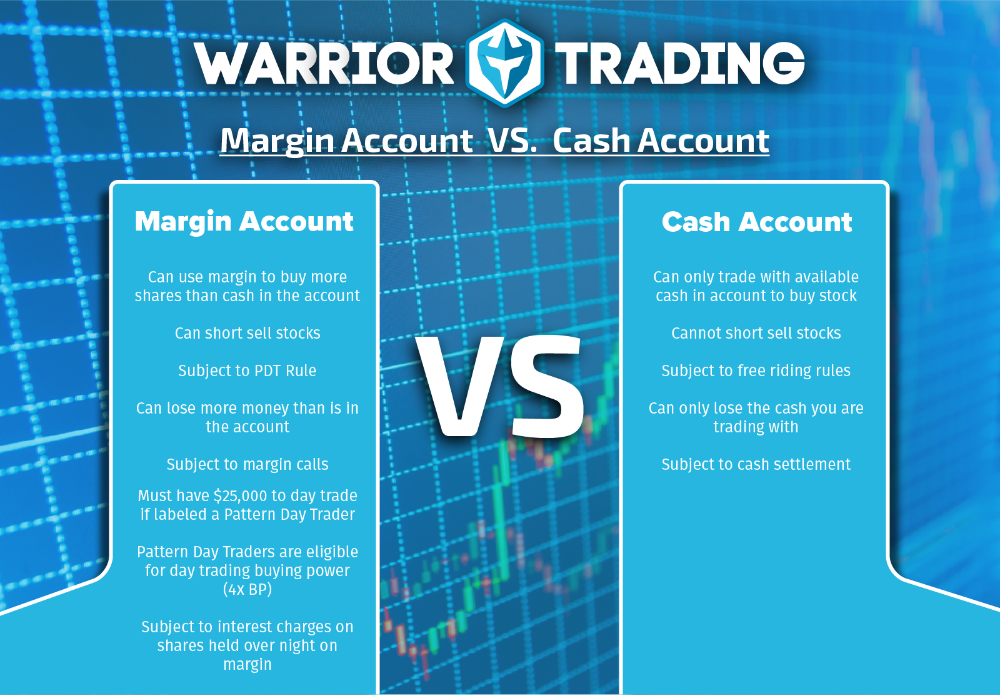

## Table of Contents

## What is a cash account?

A cash account is a type of brokerage account where you can buy and sell stocks, bonds, and other investments using the money you have in the account. Unlike a margin account, you can't borrow money from your broker to make trades. This means you can only spend what you have, which helps you avoid getting into debt.

When you want to buy something, you need to have enough money in your cash account to cover the cost. If you sell an investment, the money from the sale goes back into your account, and you can use it to buy something else or take it out. Cash accounts are popular because they are simple and help you manage your money safely.

## What is a margin account?

A margin account is a type of brokerage account that lets you borrow money from your broker to buy investments. This means you can buy more stocks, bonds, or other things than you could if you only used the money you have. The broker lends you the money, and you have to pay it back with interest. It's like getting a loan to invest, which can help you make more money if your investments do well, but it can also be risky.

The big difference between a margin account and a cash account is that you can spend more than what you have in your account. But, if your investments lose value, you might owe more money than you started with. Your broker can ask you to add more money to your account if the value of your investments goes down a lot. This is called a margin call. Because of this, margin accounts can be riskier, but they also give you the chance to make bigger profits if things go well.

## How do cash and margin accounts differ in terms of initial setup?

When you set up a cash account, you need to fill out some forms with your personal information and choose a broker. The broker will check your information and then open the account for you. You can start adding money to your account and use it to buy investments. It's a simple process because you're just using your own money, so there's no need for a credit check or anything like that.

Setting up a margin account is a bit more involved. You still need to fill out forms with your personal information, but because you're borrowing money from the broker, they need to check your credit. This means they'll look at your credit history to see if you're likely to pay back the money you borrow. If your credit is good enough, the broker will open a margin account for you. You'll then need to put some money into the account as a deposit before you can start trading on margin.

## What are the basic requirements for opening a cash account?

To open a cash account, you need to pick a brokerage firm and fill out an application form. The form will ask for your personal details like your name, address, and social security number. This is to make sure the account is really yours and to follow the rules set by the government.

Once you've filled out the form, the brokerage firm will check your information. They might ask for more documents to prove who you are, like a copy of your driver's license or passport. After they approve your application, you can start adding money to your account and use it to buy stocks, bonds, or other investments.

## What are the basic requirements for opening a margin account?

To open a margin account, you need to choose a brokerage firm and fill out an application form. The form will ask for your personal details like your name, address, and social security number. This is to make sure the account is really yours and to follow the government's rules. The brokerage firm will also check your credit history because you'll be borrowing money from them. They want to make sure you can pay it back.

After you've filled out the form and they've checked your credit, the brokerage firm might ask for more documents to prove who you are, like a copy of your driver's license or passport. Once everything is approved, you'll need to put some money into the account as a deposit. This is called the initial margin. After that, you can start trading on margin, using the money you've borrowed from the broker to buy investments.

## How does the use of funds differ between cash and margin accounts?

In a cash account, you can only use the money you have put into the account to buy investments. If you want to buy a stock, you need to have enough money in your account to cover the cost of that stock. When you sell an investment, the money goes back into your account, and you can use it to buy something else or take it out. This means you can't spend more than what you have, so you don't have to worry about owing money to anyone.

In a margin account, you can use the money you have in the account plus money that you borrow from your broker to buy investments. This means you can buy more stocks or other things than you could if you were only using your own money. But, you have to pay back the money you borrow with interest. If the value of your investments goes down a lot, your broker might ask you to add more money to your account. This can be risky, but it also gives you the chance to make bigger profits if your investments do well.

## What are the risks associated with using a margin account?

Using a margin account can be risky because you're borrowing money to invest. If the value of your investments goes down, you might lose more money than you put in. This is because you still have to pay back the money you borrowed from your broker, plus interest. If your investments keep losing value, your broker might ask you to put more money into your account. This is called a margin call. If you can't add more money, the broker might sell your investments to get their money back, and you could end up losing a lot.

Another risk is that using a margin account can make you feel like you have more money to spend than you really do. This can lead to making risky choices or buying things you wouldn't normally buy. If the market goes down, you might owe more money than you can pay back. It's important to be careful and only use a margin account if you understand the risks and can handle the possibility of losing money.

## How does interest work in a margin account?

When you use a margin account, you're borrowing money from your broker to buy investments. This borrowed money comes with a cost, which is called interest. The [interest rate](/wiki/interest-rate-trading-strategies) is set by the broker and can change over time. You'll start paying interest as soon as you borrow the money, and it's usually charged on a monthly basis. The interest adds to the amount you owe, so you need to make sure your investments are making enough money to cover the interest and still make a profit.

The amount of interest you pay depends on how much you borrow and how long you keep the borrowed money. If you borrow a lot of money and take a long time to pay it back, you'll end up paying more interest. It's important to keep an eye on the interest because it can eat into your profits. If your investments don't do well, the interest can make your losses even bigger. So, it's a good idea to think carefully about how much you borrow and how long you plan to use the margin account.

## What are the potential benefits of using a margin account over a cash account?

Using a margin account can let you buy more investments than you could with just a cash account. This is because you can borrow money from your broker to buy stocks or other things. If your investments go up in value, you could make more money than if you only used the money you had in a cash account. It's like getting a bigger piece of the pie because you're using more money to invest.

But there's a catch. You have to be careful because using a margin account is riskier. If your investments go down in value, you could lose more money than you put in. You still have to pay back the money you borrowed, plus interest. So, while a margin account can help you make bigger profits, it can also lead to bigger losses if things don't go well.

## How do regulatory requirements differ between cash and margin accounts?

When you open a cash account, the rules are pretty simple. You need to fill out some forms with your personal information, like your name and social security number. The broker will check your details to make sure you are who you say you are. This is to follow the government's rules and keep things safe. You can start buying and selling investments as soon as you add money to your account. There's no need to worry about borrowing money, so the rules are not too strict.

On the other hand, opening a margin account has more rules because you're borrowing money from the broker. Besides filling out the same personal information forms, the broker will also check your credit history. They want to make sure you can pay back the money you borrow. The government sets rules about how much money you can borrow, which is called the initial margin. There are also rules about how much money you need to keep in your account, known as the maintenance margin. If your investments lose too much value, you might get a margin call, where you have to add more money to your account. These extra rules help keep things safe but make margin accounts a bit more complicated.

## What strategies can be employed more effectively with a margin account?

Using a margin account can help you make more money if you use it the right way. One good strategy is called leverage. This means you use the money you borrow to buy more stocks or other investments. If the price of those investments goes up, you can make a bigger profit than if you only used your own money. But remember, it's risky because if the price goes down, you could lose more money too. So, you have to be smart and pick investments that you think will do well.

Another strategy is short selling. This is when you borrow a stock from your broker and sell it right away, hoping the price will go down. If it does, you can buy it back cheaper later and give it back to your broker, making a profit from the difference. This is something you can't do with a cash account. But it's also risky because if the stock price goes up instead, you'll lose money when you have to buy it back at a higher price. So, you need to be careful and know what you're doing.

A third strategy is diversification. With a margin account, you can spread your borrowed money across different types of investments. This can help you lower the risk because if one investment goes down, others might go up. It's like not putting all your eggs in one basket. But again, you have to keep an eye on everything because the borrowed money means you could lose more if things don't go as planned.

## How do cash and margin accounts impact long-term investment strategies?

A cash account is great for long-term investing if you want to keep things simple and safe. You can only spend the money you have, so you won't get into debt. This means you can take your time and choose investments that you believe will grow over many years. You don't have to worry about paying back borrowed money or interest, so your focus can be on finding good investments and holding onto them for a long time. This makes a cash account a good choice if you want to build wealth slowly and steadily without taking big risks.

A margin account can be useful for long-term investing if you're okay with taking more risk. You can borrow money to buy more investments, which could help you make bigger profits if those investments do well over time. But you have to be careful because if your investments lose value, you could end up owing a lot of money. You'll also have to pay interest on the money you borrow, which can eat into your profits. So, if you use a margin account for long-term investing, you need to pick your investments wisely and make sure you can handle the extra risk and costs.

## References & Further Reading

[1]: Securities and Exchange Commission (SEC). ["Margin: Borrowing Money to Pay for Stocks."](https://www.sec.gov/about/reports-publications/investorpubsmarginhtm)

[2]: Financial Industry Regulatory Authority (FINRA). ["Understanding Margin Accounts, Why Brokers Do What They Do."](https://www.finra.org/rules-guidance/key-topics/margin-accounts)

[3]: Bergstra, J., Bardenet, R., Bengio, Y., & Kégl, B. (2011). ["Algorithms for Hyper-Parameter Optimization."](https://proceedings.neurips.cc/paper/2011/file/86e8f7ab32cfd12577bc2619bc635690-Paper.pdf) Advances in Neural Information Processing Systems 24.

[4]: Lopez de Prado, Marcos. ["Advances in Financial Machine Learning."](https://www.amazon.com/Advances-Financial-Machine-Learning-Marcos/dp/1119482089)

[5]: Chan, Ernest P. ["Quantitative Trading: How to Build Your Own Algorithmic Trading Business."](https://github.com/ftvision/quant_trading_echan_book)