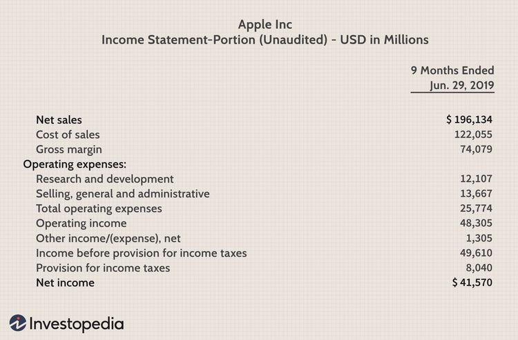

## Table of Contents

## What is cash flow?

Cash flow is the money that moves in and out of a business or a person's bank account. It is important because it shows how well a business can pay its bills and manage its money. When a business earns more money than it spends, it has a positive cash flow. This means the business is doing well and has money left over to save or invest. On the other hand, if a business spends more money than it earns, it has a negative cash flow, which can lead to financial problems.

Understanding cash flow is crucial for making smart financial decisions. For example, a business might use its cash flow to decide when to buy new equipment or hire more employees. By keeping track of cash flow, a business can avoid running out of money and can plan for future growth. For individuals, managing cash flow means making sure there is enough money coming in to cover expenses like rent, food, and bills, and perhaps even saving for the future.

## What is revenue?

Revenue is the total amount of money a business earns from its normal business activities, like selling products or services. It's the money that comes in before any expenses are taken out. For example, if a store sells 100 shirts at $10 each, its revenue is $1,000.

Revenue is important because it shows how well a business is doing at bringing in money. It's different from profit, which is what's left after all the costs are paid. A business can have high revenue but still not make a profit if its expenses are too high. By looking at revenue, business owners can see if their sales strategies are working and plan for the future.

## How do cash flow and revenue differ?

Cash flow and revenue are two important money concepts for a business, but they are different. Revenue is all the money a business makes from selling things or services. It's like the total sales before any costs are taken out. For example, if a bakery sells 50 cakes at $20 each, its revenue is $1,000. Revenue shows how much money is coming in from customers.

Cash flow, on the other hand, is about the movement of money in and out of a business. It includes not just the money from sales (revenue), but also money spent on things like rent, salaries, and supplies. If the bakery makes $1,000 from selling cakes but spends $800 on ingredients and other costs, its cash flow is positive because more money is coming in than going out. Cash flow helps a business know if it can pay its bills and keep running smoothly.

In simple terms, revenue is about the money earned, while cash flow is about the overall movement of money. A business can have high revenue but still have cash flow problems if its expenses are too high. Understanding both is key to managing a business well.

## Why is it important to track both cash flow and revenue?

It's really important to keep an eye on both cash flow and revenue because they tell different stories about how a business is doing. Revenue shows how much money is coming in from selling things or services. It's like a scorecard for how well the business is doing at making sales. If revenue is going up, it means more people are buying what the business is selling. This can help business owners see if their sales strategies are working and plan for the future.

Cash flow, on the other hand, is all about making sure the business has enough money to keep going. It's not just about the money coming in from sales, but also about the money going out for things like rent, salaries, and supplies. If a business has a positive cash flow, it means it's making more money than it's spending, which is good. But if the cash flow is negative, it can lead to big problems, like not being able to pay bills. By tracking cash flow, a business can make sure it has enough money to cover its costs and keep running smoothly.

Together, revenue and cash flow give a full picture of a business's financial health. Revenue tells you if the business is good at bringing in money, while cash flow tells you if the business is good at managing that money. By watching both, business owners can make smart decisions, avoid money troubles, and plan for growth.

## Can a business have positive revenue but negative cash flow?

Yes, a business can have positive revenue but negative cash flow. Revenue is the total amount of money a business makes from selling things or services. If a store sells 100 items at $10 each, its revenue is $1,000. But revenue doesn't tell the whole story. It only shows the money coming in, not the money going out.

Cash flow is different because it looks at all the money moving in and out of the business. If the same store spends $1,200 on things like rent, salaries, and supplies, its cash flow is negative even though its revenue is $1,000. This means the business is spending more money than it's making, which can lead to problems like not being able to pay bills on time.

Understanding both revenue and cash flow is important for a business to stay healthy. High revenue might look good, but if the cash flow is negative, the business could still run into money troubles. By keeping track of both, a business owner can make sure they have enough money to keep going and plan for the future.

## How does cash flow impact the day-to-day operations of a business?

Cash flow is super important for the day-to-day running of a business. It's all about making sure there's enough money to pay for things like rent, salaries, and supplies. If a business has a good cash flow, it can easily cover these costs and keep everything running smoothly. For example, if a restaurant has enough cash coming in, it can pay its staff on time and buy fresh ingredients every day. This helps keep the customers happy and the business going strong.

On the other hand, if a business has a negative cash flow, it can really mess things up. It might struggle to pay bills on time, which can lead to late fees or even having services cut off. For instance, if a small shop doesn't have enough cash to pay its electric bill, it might have to close for a while. This can hurt the business because it loses customers and money. So, keeping an eye on cash flow is key to making sure a business can keep its doors open and run smoothly every day.

## What are common sources of revenue for a business?

Common sources of revenue for a business include selling products or services. For example, a clothing store makes money by selling clothes, and a restaurant earns revenue by selling food and drinks. Businesses can also make money from things like membership fees or subscriptions. A gym might charge people a monthly fee to use its facilities, and a streaming service like Netflix earns revenue from people paying to watch movies and shows.

Another source of revenue is through licensing or royalties. This happens when a business lets another company use its brand or technology for a fee. For example, a toy company might pay a fee to use a popular cartoon character on its toys. Additionally, businesses can earn revenue from investments, like interest from a bank account or dividends from stocks. This money comes in without the business having to sell anything directly.

Overall, businesses can have many different ways to bring in money. It's important for them to find the right mix of these sources to keep their revenue strong and support their day-to-day operations.

## How can discrepancies between cash flow and revenue be analyzed?

Discrepancies between cash flow and revenue can be analyzed by looking at the timing and nature of the business's income and expenses. Revenue is the total money a business makes from selling things or services, but it might not all come in at once. For example, if a business sells something on credit, the revenue is recorded right away, but the cash might not come in until later. This can lead to a situation where the business has high revenue but low cash flow because the money hasn't actually been received yet.

To understand these differences, a business should look at its accounts receivable and accounts payable. Accounts receivable are the amounts of money owed to the business by customers, while accounts payable are the amounts the business owes to others. If a business has a lot of money owed to it (high accounts receivable), its revenue might look good, but its cash flow could be low because it's waiting to get paid. On the other hand, if the business has to pay a lot of bills soon (high accounts payable), it might have a negative cash flow even if its revenue is strong. By keeping track of these, a business can see why its cash flow and revenue might not match up and make plans to fix any problems.

## What financial statements are used to report cash flow and revenue?

Cash flow is reported on the cash flow statement. This statement shows how money moves in and out of a business over a certain time, like a month or a year. It's divided into three parts: money from running the business (operating activities), money from buying or selling things like buildings or equipment (investing activities), and money from loans or paying back loans (financing activities). By looking at the cash flow statement, you can see if the business is making more money than it's spending, which is important for keeping the business going strong.

Revenue is shown on the income statement, also called the profit and loss statement. This statement lists all the money a business makes from selling things or services (revenue) and subtracts all the costs of running the business (expenses) to find out if the business made a profit or a loss. The income statement gives a clear picture of how well the business is doing at bringing in money and managing its costs. By comparing the revenue on the income statement with the cash flow on the cash flow statement, you can see if the business is actually getting the money it's [earning](/wiki/earning-announcement) and if it's spending more than it's making.

## How do seasonal businesses manage their cash flow in relation to their revenue?

Seasonal businesses, like ice cream shops or ski resorts, have to be really careful about managing their cash flow because their revenue can change a lot depending on the time of year. When it's busy, like summer for an ice cream shop, they make a lot of money. But when it's slow, like winter, they might not make much at all. So, they need to save up money during the busy times to make sure they can still pay their bills during the slow times. This means keeping a close eye on how much money is coming in and going out, and making sure they have enough saved up to cover the quiet months.

One way seasonal businesses manage their cash flow is by planning ahead. They look at their past sales to guess how much money they will make during the busy and slow times. Then, they can set aside some of the money they make during the busy season to use later. They might also try to find other ways to bring in money during the slow times, like offering special deals or starting new services. By doing this, they can make sure they have enough money to keep going all year, even when their revenue goes down.

## What advanced techniques can be used to forecast cash flow based on revenue projections?

To forecast cash flow based on revenue projections, businesses can use a technique called scenario analysis. This means they look at different situations that might happen in the future, like if sales go up a lot, stay the same, or go down. They use their past sales data to guess how much money they might make in each situation. Then, they look at their costs and see how much money they will need to spend. By doing this, they can see if they will have enough money coming in to cover their costs, even if things don't go as planned.

Another advanced technique is using cash flow modeling. This involves creating a detailed model of the business's money coming in and going out. The model uses formulas and past data to predict future cash flow based on different revenue scenarios. Businesses can change the numbers in the model to see how different things, like a new product or a change in prices, might affect their cash flow. This helps them make better plans and be ready for whatever might happen with their revenue.

## How do international businesses handle cash flow and revenue in multiple currencies?

International businesses have to deal with money in different countries, which means they have to handle cash flow and revenue in multiple currencies. This can be tricky because the value of money can change from one day to the next. For example, if a business in the United States sells things to people in Europe, it might get paid in Euros. But if the value of the Euro goes down compared to the US Dollar, the business might end up with less money than it expected. To manage this, businesses often use something called currency hedging. This means they make deals to protect themselves from big changes in currency values, so they can better predict how much money they will actually get.

Keeping track of cash flow and revenue in multiple currencies also means businesses need good systems to convert and track money. They use special software that can handle different currencies and show them all in one place. This helps them see how much money is coming in and going out in total, no matter what currency it's in. It's important for these businesses to keep a close eye on exchange rates and adjust their plans if needed. By doing this, they can make sure they have enough money to keep running smoothly, even when dealing with different currencies.

## References & Further Reading

[1]: Bergstra, J., Bardenet, R., Bengio, Y., & Kégl, B. (2011). ["Algorithms for Hyper-Parameter Optimization."](https://papers.nips.cc/paper/4443-algorithms-for-hyper-parameter-optimization) Advances in Neural Information Processing Systems 24.

[2]: ["Advances in Financial Machine Learning"](https://www.amazon.com/Advances-Financial-Machine-Learning-Marcos/dp/1119482089) by Marcos Lopez de Prado

[3]: ["Evidence-Based Technical Analysis: Applying the Scientific Method and Statistical Inference to Trading Signals"](https://www.amazon.com/Evidence-Based-Technical-Analysis-Scientific-Statistical/dp/0470008741) by David Aronson

[4]: ["Machine Learning for Algorithmic Trading"](https://github.com/stefan-jansen/machine-learning-for-trading) by Stefan Jansen

[5]: ["Quantitative Trading: How to Build Your Own Algorithmic Trading Business"](https://www.amazon.com/Quantitative-Trading-Build-Algorithmic-Business/dp/1119800064) by Ernest P. Chan