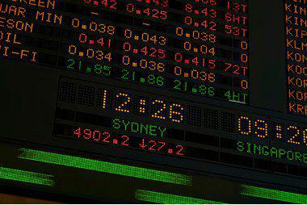

In recent years, spread betting, Contracts for Difference (CFDs), and algorithmic trading have attracted increasing attention from traders and investors across global financial markets. These financial instruments and trading strategies enable participants to leverage price movements and derive potential profits without owning the actual underlying assets. Spread betting allows traders to speculate on price direction by placing bets, while CFDs involve entering a contract to settle the difference between the opening and closing prices of an asset. Both methods provide a means to engage with a wide array of markets, such as equities, forex, commodities, and indices.

Algorithmic trading, a technological advancement in executing trades, has emerged as a powerful tool in enhancing spread betting and CFD strategies. It involves the use of automated systems that execute pre-determined orders based on complex algorithms and market conditions, thus removing human emotion and error from the trading equation. The combination of these trading instruments with algorithmic strategies not only refines execution speed but also optimizes decision-making processes, giving traders an edge in volatile markets. 



The integration of these methodologies provides innovative opportunities for profit, although it also presents challenges that require comprehensive understanding and skill. The growing popularity of spread betting, CFDs, and algorithmic trading underscores the evolving landscape of financial markets, where technology and strategy converge to create potential competitive advantages for skilled traders and investors.

## Table of Contents

## Understanding Spread Betting and CFDs

Spread betting and Contracts for Difference (CFDs) are financial derivatives that provide traders the ability to speculate on the price movements of various assets without the necessity of owning the assets themselves. These instruments are widely used across diverse markets, including equities, [forex](/wiki/forex-system), commodities, and indices, providing flexibility and potentially lucrative opportunities due to their leveraged nature.

### Spread Betting

Spread betting is a form of wagering on the price movement of an asset. Traders do not buy or sell the asset; instead, they place a bet on whether the price will rise or fall. The magnitude of profit or loss is determined by the degree to which the market moves in favor or against the position taken, multiplied by the magnitude of the bet. For instance, if a trader believes the price of a stock will increase, they will 'buy' or 'go long'. Conversely, if they anticipate the price will fall, they will 'sell' or 'go short'. This approach allows traders to profit from both rising and falling markets.

The financial outcome of a spread bet is calculated as follows:

$$
\text{Profit/Loss} = (\text{Closing Price} - \text{Opening Price}) \times \text{Stake per Point}
$$

This means if the market moves in the predicted direction, the profit will be the difference between the closing and opening prices multiplied by the stake per point. If the market moves in the opposite direction, this formula calculates the loss.

### Contracts for Difference

Similar to spread betting, CFDs enable traders to speculate on price movements without actually purchasing the underlying asset. However, unlike spread betting, a CFD is a contract between a trader and a broker to exchange the difference in the value of an asset between the opening and closing of the contract. CFD trading is conducted on leverage, providing traders the potential for significant returns relative to the investment capital.

The calculation of profit and loss in CFD trading is similar:

$$
\text{Profit/Loss} = (\text{Closing Price} - \text{Opening Price}) \times \text{Number of Contracts}
$$

Each contract represents a specific quantity of the underlying asset, amplifying both potential profits and losses. 

### Leverage and Risk

A key characteristic of both spread betting and CFDs is leverage. Leverage allows traders to open positions significantly larger than their initial capital. Although this magnifies potential gains, it also increases the risk of substantial losses. Traders are required to maintain a minimum margin, a sum of money reserved to cover potential losses. If the market moves unfavorably, additional funds might be required to maintain the position, or the position might be automatically closed out, which is known as a margin call.

In essence, while both spread betting and CFDs offer dynamic ways to engage in trading without full asset ownership, they demand a strong understanding of leverage and risk management to avoid adverse financial impacts.

## Key Differences and Similarities

Spread betting and Contracts for Difference (CFDs) are two popular financial instruments that facilitate trading without owning the underlying assets. They enable traders to speculate on price movements, utilizing leverage to enhance potential returns. Despite their similar functionalities, there are notable distinctions in their tax treatments and trading structures.

Both spread betting and CFDs allow traders to take advantage of rising and falling markets through long (buy) and short (sell) positions. Traders can utilize margin accounts to magnify their trading power, which means engaging in larger trades than the actual capital available. This leverage enables potentially higher returns on investment but also increases risk exposure, as losses are similarly amplified when trades do not move in the predicted direction.

A primary difference lies in tax implications. In some jurisdictions, notably the United Kingdom, spread betting gains are not subject to capital gains tax, making them attractive to many investors seeking tax efficiencies. This lack of taxation stems from spread betting being legally classified as betting rather than investing. In contrast, CFD trading typically falls under the purview of capital gains tax, with profits considered taxable income, depending on the country's tax regulations. It is important for traders to be aware of the specific tax treatments applicable in their regions to avoid legal issues and optimize tax liabilities.

Trading structures also vary between the two. Spread betting is generally considered a more straightforward process. It involves placing a bet on whether the price of an asset will rise or fall, with the profit or loss determined by the magnitude of the price movement in relation to the amount wagered per point of movement. CFDs, however, involve entering into a contract with a broker to exchange the difference in the asset's value from the position's opening to its closing. This contract-based structure of CFDs offers greater versatility, such as trading on lower margins and the ability to hedge other investments, which spread betting may not provide.

In essence, while both spread betting and CFDs cater to similar market speculation activities and offer leverage, they cater to different trader needs and objectives, informed by their distinct tax implications and trading mechanics. Understanding these differences is essential for traders aiming to optimize their strategies in line with their financial goals.

## Advantages of Algorithmic Trading

Algorithmic trading, commonly referred to as algo trading, leverages sophisticated algorithms to automate trading decisions based on predetermined criteria and real-time market data. This automation is particularly valuable for spread betting and CFD trading, where the ability to execute trades swiftly can provide a significant edge. 

One of the primary benefits of [algorithmic trading](/wiki/algorithmic-trading) is its ability to minimize emotional interference. Human traders can make impulsive decisions driven by fear or greed, which can lead to inconsistent results. Algorithms, on the other hand, execute trades based solely on logic and market conditions, ensuring more disciplined and systematic trading practices.

Additionally, algorithmic trading provides enhanced precision. Algorithms can compute complex calculations required to determine optimal entry and [exit](/wiki/exit-strategy) points much faster and more accurately than a human could. This precision is crucial when dealing with the leverage inherent in spread betting and CFDs, as even slight misjudgments can lead to magnified losses.

The ability to process and analyze vast amounts of data in real-time is another advantage. Algorithms can monitor multiple trading instruments across various markets simultaneously, identifying opportunities that might be missed by individual traders. This capability enables traders to capitalize on small price discrepancies quickly before the market adjusts.

Moreover, algorithmic systems can execute complex trading strategies that involve multiple conditions and sophisticated models. These strategies can include trend-following, market-making, or [arbitrage](/wiki/arbitrage), among others. The ability to diversify and implement such strategies efficiently increases the potential for profit while managing risk.

A simple example of an algorithmic strategy in Python might involve using moving averages to determine buy or sell signals. Below is a basic illustration of this:

```python
def moving_average_strategy(prices, short_window=20, long_window=50):
    signals = {'buy': [], 'sell': []}
    short_moving_avg = prices.rolling(window=short_window).mean()
    long_moving_avg = prices.rolling(window=long_window).mean()

    for i in range(1, len(prices)):
        if short_moving_avg[i] > long_moving_avg[i] and short_moving_avg[i - 1] <= long_moving_avg[i - 1]:
            signals['buy'].append(i)
        elif short_moving_avg[i] < long_moving_avg[i] and short_moving_avg[i - 1] >= long_moving_avg[i - 1]:
            signals['sell'].append(i)

    return signals

# Example usage with a pandas Series of prices
# import pandas as pd
# prices = pd.Series([100, 101, 102, ..., 150])  # example price data
# signals = moving_average_strategy(prices)
```

This code shows how to identify buy and sell signals using short-term and long-term moving averages, automating decisions based on these criteria. By relying on such systematic methods, traders can ensure that they act on high-probability scenarios rather than on speculative impulses.

In conclusion, algorithmic trading offers significant advantages by reducing emotional and cognitive biases, increasing precision, and enabling the execution of sophisticated, data-driven trading strategies. For spread betting and CFD trading, where speed and accuracy are crucial, adopting algorithmic approaches can significantly enhance trading outcomes.

## Implementing Algorithmic Trading with Spread Betting and CFDs

Implementing algorithmic trading within spread betting and CFDs requires the integration of sophisticated algorithms designed to capitalize on market inefficiencies. The process typically begins with the development of a trading algorithm that monitors market dynamics and identifies potential entry and exit points. Programming languages such as Python are particularly useful in this endeavor due to their extensive libraries and tools for data analysis and [machine learning](/wiki/machine-learning).

To start, traders need to define clear trading strategies that are rule-based and can be automated. These strategies often involve technical indicators or patterns that signal buying or selling opportunities. For instance, a simple moving average crossover strategy can be implemented, where a short-term moving average crossing above a long-term moving average signals a buy, and vice versa for a sell signal.

A simplified Python implementation of a moving average crossover strategy might look like this:

```python
import pandas as pd
import numpy as np

# Load historical data
data = pd.read_csv('market_data.csv')
short_window = 40
long_window = 100

# Compute moving averages
data['short_mavg'] = data['Close'].rolling(window=short_window, min_periods=1).mean()
data['long_mavg'] = data['Close'].rolling(window=long_window, min_periods=1).mean()

# Generate buy/sell signals
data['signal'] = 0
data['signal'][short_window:] = np.where(data['short_mavg'][short_window:] > data['long_mavg'][short_window:], 1, 0)
data['position'] = data['signal'].diff()

# Output the signal to execute trades
print(data[['Date', 'Close', 'signal', 'position']])
```

This code calculates the short and long moving averages of the market data and generates buy/sell signals based on their crossover.

Backtesting is a critical component in validating the effectiveness of the developed algorithm. It involves running the algorithm against historical data to evaluate how it would have performed in different market conditions. This step helps in identifying the robustness of the strategy, allowing for adjustments to improve performance and mitigate risk. The performance can be measured using metrics like the Sharpe ratio, maximum drawdown, and cumulative returns.

Additionally, risk management must be integrated into the algorithmic framework to prevent excessive losses. Traders can implement stop-loss orders or adjust the leverage used based on [volatility](/wiki/volatility-trading-strategies) assessments. Incorporating stochastic models such as the GARCH (Generalized Autoregressive Conditional Heteroskedasticity) can help forecast future market volatility and adjust strategies accordingly.

A sophisticated structure also requires constant monitoring and maintenance to deal with any technical or data issues that could impact trading outcomes. Automated systems can alert traders to potential discrepancies or model drifts, triggering reviews and recalibrations.

Overall, algorithmic trading enhances spread betting and CFD activities by offering precision, speed, and the ability to manage complex strategies. However, it demands a strong grasp of both programming and financial market principles to be executed successfully.

## Risks and Considerations

Spread betting, CFDs, and algorithmic trading, while offering potentially lucrative opportunities, also come with a set of inherent risks that traders must carefully consider. Leveraged trading, a common feature of both spread betting and CFDs, allows traders to control large positions with a relatively small amount of capital. This leverage can significantly amplify both gains and losses. For example, a relatively small adverse price movement in the market can disproportionately affect capital due to the magnified exposure offered by leverage. The formula for leverage is expressed as:

$$
\text{Leverage Ratio} = \frac{\text{Total Exposure}}{\text{Equity}}
$$

Market volatility represents another significant risk. Financial markets can experience rapid changes in price due to various factors such as economic data releases, geopolitical events, and sudden shifts in investor sentiment. Such volatility can lead to swift changes in the value of positions, making it critical for traders to implement effective risk management strategies.

Algorithmic trading introduces additional layers of risk. Although it automates trading processes and can improve efficiency, the reliance on algorithms means there is potential for technical issues such as software bugs, algorithm malfunctions, and incorrect data inputs. These problems can lead to inadvertent trades and substantial financial losses. Continuous monitoring and robust testing are vital to ensure the integrity of the trading system.

To mitigate these risks, traders must apply rigorous risk management techniques. This includes setting stop-loss orders to limit potential losses, diversifying portfolios to spread risk, and regularly reviewing and adapting trading algorithms to align with changing market conditions. Additionally, [backtesting](/wiki/backtesting) strategies using historical data can help assess their effectiveness before deployment in live markets. For instance, utilizing Python libraries such as pandas and NumPy can assist in analyzing data trends and optimizing algorithmic models:

```python
import pandas as pd
import numpy as np

# Example: Backtesting a simple moving average crossover strategy
# Load historical data
data = pd.read_csv('historical_data.csv')
data['SMA_50'] = data['Close'].rolling(window=50).mean()
data['SMA_200'] = data['Close'].rolling(window=200).mean()

# Generate buy/sell signals
data['Signal'] = np.where(data['SMA_50'] > data['SMA_200'], 1, 0)

# Calculate returns
data['Returns'] = data['Signal'].shift(1) * data['Close'].pct_change()

# Evaluate performance
cumulative_returns = (1 + data['Returns']).cumprod()
print(f"Cumulative returns: {cumulative_returns.iloc[-1]}")
```

Enforcing robust discipline in adhering to trading plans and managing risk exposure is crucial for successful trading. This includes maintaining sufficient capital reserves to cover potential losses and avoiding emotional decision-making. By understanding and preparing for these risks, traders can navigate the complexities of spread betting, CFDs, and algorithmic trading more effectively.

## Conclusion

Spread betting and CFDs, enhanced by algorithmic trading, offer significant opportunities for traders aiming to profit from market dynamics. These trading strategies allow for engaging in financial markets without actual ownership of the underlying assets, presenting both opportunities and risks that require thorough understanding and careful management.

Algorithmic trading introduces automation and precision, allowing traders to execute trades swiftly in response to changing market conditions. This method mitigates emotional biases that may hinder manual trading, thereby improving decision-making and potential profitability. However, implementing such strategies effectively demands a comprehensive understanding of market mechanics and the technical skills necessary to develop and maintain trading algorithms. Utilizing programming languages, such as Python, traders can build algorithms capable of identifying patterns, executing trades, and managing risks in real-time.

Despite the advantages, the combination of leverage with algorithmic trading magnifies both potential gains and losses. Misjudgments in strategy or unexpected market events can lead to substantial financial setbacks. Technical issues, such as algorithmic errors or incorrect data inputs, further contribute to the complexity of this trading approach. Therefore, rigorous backtesting, ongoing evaluation, and sound risk management remain critical to sustaining success.

Given the dynamic nature of markets and frequent technological advancements, continuous education is vital for traders. Staying informed about market trends, regulatory changes, and advancements in algorithmic techniques is necessary to maintain a competitive edge. By refining their strategies and adapting to new insights, traders can better position themselves to capitalize on the intricate opportunities presented by spread betting, CFDs, and algorithmic trading.

## Further Reading

To deepen your understanding of spread betting, CFDs, and algorithmic trading, a variety of resources can be utilized. Academic publications and industry reports often provide comprehensive analysis of these financial instruments and trading methods. Books such as "Algorithmic Trading: Winning Strategies and Their Rationale" by Ernest P. Chan offer practical insights into developing automated strategies for a range of financial markets. For CFD and spread betting specifics, "The Financial Spread Betting Handbook" by Malcolm Pryor serves as an excellent guide, detailing techniques and strategies tailored for retail traders.

Online courses are another valuable resource for learning about these complex topics. Platforms such as Coursera and Udemy offer courses taught by financial experts that cover the theory and application of algorithmic trading, including programming in Python to create trading algorithms. For instance, the [course](/wiki/best-algorithmic-trading-courses) "Algorithmic Trading with Python" provides a step-by-step approach to developing and implementing your own algorithms, focusing on risk management, portfolio construction, and backtesting using historical data.

Research papers and articles published in financial journals can also be instrumental in staying updated with the latest trends and methodologies. Journals such as the "Journal of Financial Markets" and "Algorithmic Finance" frequently feature studies and discussions on new advancements in trading technologies, algorithmic strategies, and the implications of regulatory changes on spread betting and CFD markets.

Lastly, online trading forums and communities can be a rich source of peer advice and shared experiences. Websites like Elite Trader and Stack Exchange provide platforms for traders to ask questions, share algorithmic codes, and discuss strategies with fellow market participants, contributing to a collaborative learning environment. Engaging with these communities can offer practical, real-world insights and solutions to common trading challenges.

## References & Further Reading

[1]: Chan, E. P. (2009). ["Quantitative Trading: How to Build Your Own Algorithmic Trading Business."](https://github.com/ftvision/quant_trading_echan_book) John Wiley & Sons.

[2]: Chan, E. P. (2013). ["Algorithmic Trading: Winning Strategies and Their Rationale."](https://github.com/ftvision/quant_trading_echan_book) Wiley Trading.

[3]: Pryor, M. (2007). ["The Financial Spread Betting Handbook: A Guide to Making Money Trading Spread Bets."](https://archive.org/details/financialspreadb0000pryo) Harriman House.

[4]: Jansen, S. (2020). ["Machine Learning for Algorithmic Trading: Predictive models to extract signals from market and alternative data for systematic trading strategies with Python."](https://github.com/stefan-jansen/machine-learning-for-trading) Packt Publishing.

[5]: Lopez de Prado, M. (2018). ["Advances in Financial Machine Learning."](https://www.amazon.com/Advances-Financial-Machine-Learning-Marcos/dp/1119482089) Wiley.