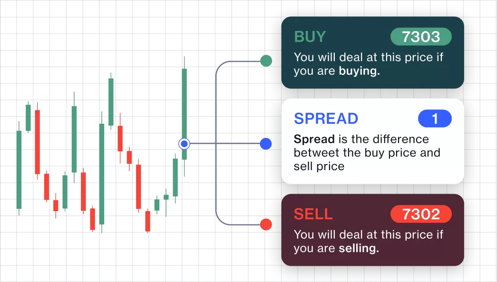

## Table of Contents

## What are CFDs and how do they work?

CFDs, or Contracts for Difference, are financial instruments that allow you to speculate on the price movements of various assets without actually owning them. When you trade a CFD, you are entering into an agreement with a broker to exchange the difference in the price of an asset from the time the contract is opened to when it is closed. This means you can potentially profit from both rising and falling markets, depending on whether you decide to 'buy' or 'sell' the CFD.

The way CFDs work is quite straightforward. If you believe the price of an asset, like a stock or a commodity, will go up, you would 'buy' a CFD on that asset. If the price does indeed rise, you can close the contract at the new, higher price and make a profit equal to the difference between the opening and closing prices, minus any fees or commissions. Conversely, if you think the price will fall, you would 'sell' the CFD. If the price drops, you can close the contract at the lower price and again profit from the difference. However, if the market moves against your prediction, you could face losses, which is why using stop-loss orders to limit potential losses is a common practice among CFD traders.

## What is spread betting and how does it differ from CFDs?

Spread betting is a way to bet on whether the price of something, like a stock or a currency, will go up or down without actually owning it. When you place a spread bet, you're betting a certain amount per point that the price will move in your chosen direction. If you're right, you win money for each point the price moves in your favor. If you're wrong, you lose money for each point it moves against you. Spread betting is popular in the UK and is often used for trading on financial markets.

The main difference between spread betting and CFDs is how profits and losses are calculated. With spread betting, you bet a fixed amount per point of movement, so your potential profit or loss depends on how many points the price moves and how much you bet per point. With CFDs, you trade a certain number of contracts, and the value of each contract is based on the price of the asset. So, your profit or loss with CFDs is the difference between the opening and closing prices of the contract, multiplied by the number of contracts you traded. Both methods let you speculate on price movements without owning the asset, but they use different ways to calculate your gains or losses.

## What are the basic risks involved in CFD trading?

Trading CFDs can be risky because the market can move against your prediction. If you think the price will go up and it goes down instead, you could lose money. The amount you could lose is not limited to what you put in, which means you might lose more than you initially invested. This is called leverage, and it can make your gains bigger but also your losses.

Another risk is that prices can change quickly. Things like news events or economic reports can make prices jump suddenly, and if you're not careful, you might not be able to close your trade in time to avoid a big loss. Also, CFD trading often involves fees and charges, like overnight financing costs, which can eat into your profits or increase your losses if you're not keeping an eye on them.

## What are the basic risks involved in spread betting?

Spread betting can be risky because you could lose more money than you put in. This happens because spread betting uses leverage, which means you're betting with borrowed money. If the price moves against you, you might have to pay back more than you bet. This is why it's important to understand how much you could lose before you start betting.

Another risk is that prices can change very quickly. News or other events can make prices jump suddenly, and if you don't close your bet in time, you could lose a lot of money. Also, spread betting comes with fees and charges, like the spread itself and overnight funding costs. These can add up and reduce your profits or increase your losses if you're not careful.

## How does leverage work in CFDs and spread betting?

Leverage in CFDs and spread betting lets you trade with more money than you actually have. It's like borrowing money from your broker to make bigger bets. For example, if you have $100 and the leverage is 10:1, you can trade as if you have $1,000. This means you can control a larger position in the market with a smaller amount of your own money. But, it's a double-edged sword. If the market moves in your favor, your profits can be much bigger. But if it moves against you, your losses can also be much bigger, and you might lose more than you initially put in.

The risk with leverage is that it can lead to big losses if the market goes the wrong way. Because you're trading with borrowed money, even a small move in the market can have a big impact on your account. If the market moves against you, you might get a margin call, which means you need to add more money to your account to keep your trade open. If you can't, your broker might close your trade to limit their risk, and you could lose your entire investment. So, it's important to understand how leverage works and use it carefully.

## What are the tax implications of trading CFDs versus spread betting in different countries?

In the UK, spread betting is tax-free, which means you don't have to pay capital gains tax or stamp duty on your profits. This makes spread betting attractive to many traders. On the other hand, trading CFDs in the UK is subject to capital gains tax, which means you have to report your profits and pay tax on them if they exceed the annual allowance. This difference in tax treatment can affect which trading method you choose.

In other countries, the tax rules can be very different. For example, in Australia, both CFDs and spread betting are subject to capital gains tax, so you have to pay tax on your profits from both types of trading. In the United States, spread betting is not allowed at all, so you can't trade that way. CFDs in the US are treated as a type of futures contract and are subject to specific tax rules, which can be complicated. It's important to check the tax laws in your country before you start trading to understand how your profits will be taxed.

## How do the costs and fees compare between CFDs and spread betting?

When you trade CFDs, you usually pay a spread, which is the difference between the buy and sell price of the asset you're trading. This spread is one of the main costs you'll face. Besides the spread, you might also have to pay overnight financing fees if you keep your trade open overnight. These fees can add up, especially if you hold your position for a long time. Some brokers also charge a commission on top of the spread, but this depends on the broker and the type of account you have.

Spread betting also involves a spread, which is the main cost you'll encounter. Like CFDs, you might have to pay overnight funding costs if you keep your bet open overnight. However, spread betting usually doesn't come with a commission, which can make it a bit cheaper than CFDs if your broker charges a commission on CFD trades. The exact costs can vary depending on the broker and the market you're trading, so it's a good idea to compare different brokers to see which one offers the best deal for your trading style.

## What are the regulatory differences between CFDs and spread betting?

In the UK, both CFDs and spread betting are regulated by the Financial Conduct Authority (FCA). The FCA sets rules to protect traders, like making sure brokers give clear information about the risks and costs of trading. But there are some differences. For spread betting, the FCA treats it like gambling, so it's regulated under gambling laws as well. This means that spread betting firms have to follow extra rules about responsible gambling. For CFDs, the FCA focuses more on making sure brokers are fair and transparent with their clients.

In other countries, the rules can be very different. In the United States, spread betting is not allowed at all, so you can't do it. But CFDs are allowed and are regulated by the Commodity Futures Trading Commission (CFTC) and the National Futures Association (NFA). These organizations make sure that CFD trading is done fairly and that brokers follow the rules. In Australia, both CFDs and spread betting are regulated by the Australian Securities and Investments Commission (ASIC), which sets rules to protect traders and make sure brokers are honest. So, the rules can change a lot depending on where you live, and it's important to know what they are before you start trading.

## How can one manage risk effectively when using CFDs and spread betting?

Managing risk when trading CFDs and spread betting is really important because you can lose a lot of money if you're not careful. One way to manage risk is by using stop-loss orders. A stop-loss order is like a safety net that automatically closes your trade if the price moves against you by a certain amount. This helps you limit how much you can lose on a single trade. Another way to manage risk is by not using too much leverage. Leverage can make your gains bigger, but it can also make your losses bigger. So, it's a good idea to use less leverage and trade with money you can afford to lose.

Another important part of managing risk is to have a clear trading plan. This means deciding ahead of time how much you're willing to risk on each trade and sticking to that plan. It's also a good idea to spread your money across different trades instead of putting it all into one trade. This is called diversification, and it can help reduce your risk. Finally, always keep an eye on the market and be ready to adjust your trades if things change. By following these steps, you can manage your risk better and protect your money when trading CFDs and spread betting.

## What advanced strategies can be applied to CFD trading?

One advanced strategy for CFD trading is called hedging. Hedging means opening a new trade that goes in the opposite direction of your current trade. This can help you reduce your risk. For example, if you have a CFD trade betting that the price of a stock will go up, you might open another trade betting that the same stock will go down. If the price goes down, the loss on your first trade might be offset by the gain on your second trade. Hedging can be a bit complicated, but it's a good way to protect your money when the market is unpredictable.

Another strategy is called [scalping](/wiki/gamma-scalping). Scalping means making a lot of small trades to take advantage of tiny price changes. Traders who use this strategy often hold their trades for just a few seconds or minutes. The idea is to make a small profit on each trade, but because you're making so many trades, these small profits can add up to a big total. Scalping requires a lot of focus and quick decision-making, so it's not for everyone. But if you're good at it, it can be a very effective way to make money from CFD trading.

A third strategy is called [trend following](/wiki/trend-following). This means watching the market to see which way the price is moving and then trading in that direction. If the price is going up, you buy a CFD. If the price is going down, you sell a CFD. Trend following works best in markets that have a clear direction. To use this strategy, you need to be good at spotting trends and knowing when they might change. It can be a bit tricky, but if you get it right, you can make good profits from following the market's direction.

## What advanced strategies can be applied to spread betting?

One advanced strategy for spread betting is called hedging. This means you open a new bet that goes in the opposite direction of your current bet. It's like a safety net that can help you reduce your risk. For example, if you bet that the price of a stock will go up, you might open another bet that the same stock will go down. If the price goes down, the loss on your first bet might be offset by the gain on your second bet. Hedging can be a bit tricky, but it's a good way to protect your money when the market is unpredictable.

Another strategy is called scalping. This means making a lot of small bets to take advantage of tiny price changes. People who use this strategy often hold their bets for just a few seconds or minutes. The idea is to make a small profit on each bet, but because you're making so many bets, these small profits can add up to a big total. Scalping needs a lot of focus and quick decision-making, so it's not for everyone. But if you're good at it, it can be a very effective way to make money from spread betting.

A third strategy is called trend following. This means watching the market to see which way the price is moving and then betting in that direction. If the price is going up, you bet that it will keep going up. If the price is going down, you bet that it will keep going down. Trend following works best in markets that have a clear direction. To use this strategy, you need to be good at spotting trends and knowing when they might change. It can be a bit tricky, but if you get it right, you can make good profits from following the market's direction.

## How do market conditions affect the choice between CFDs and spread betting?

Market conditions can really affect whether you choose to trade CFDs or spread betting. If the market is moving a lot, with big ups and downs, CFDs might be a better choice because you can set stop-loss orders to limit your losses. This can be helpful in a volatile market where prices can change quickly. On the other hand, if the market is more stable, with smaller price movements, spread betting might be more appealing because you can bet on small changes and still make a profit. Also, if you're in a country where spread betting is tax-free, like the UK, you might choose it over CFDs to save on taxes, no matter what the market is doing.

Another thing to think about is how much leverage you want to use. In a fast-moving market, high leverage can lead to big gains but also big losses, so you might prefer CFDs because you can control your leverage more easily. But if the market is slow and you want to use high leverage to make bigger bets with less money, spread betting could be a good choice. It's important to understand the market conditions and how they match with the features of CFDs and spread betting before you decide which one to use.

## What is Understanding Spread Betting and CFDs?

Spread betting and Contracts for Difference (CFDs) are financial derivatives that provide traders the ability to speculate on the price movements of various assets without the necessity of owning the assets themselves. These instruments are widely used across diverse markets, including equities, [forex](/wiki/forex-system), commodities, and indices, providing flexibility and potentially lucrative opportunities due to their leveraged nature.

### Spread Betting

Spread betting is a form of wagering on the price movement of an asset. Traders do not buy or sell the asset; instead, they place a bet on whether the price will rise or fall. The magnitude of profit or loss is determined by the degree to which the market moves in favor or against the position taken, multiplied by the magnitude of the bet. For instance, if a trader believes the price of a stock will increase, they will 'buy' or 'go long'. Conversely, if they anticipate the price will fall, they will 'sell' or 'go short'. This approach allows traders to profit from both rising and falling markets.

The financial outcome of a spread bet is calculated as follows:

$$
\text{Profit/Loss} = (\text{Closing Price} - \text{Opening Price}) \times \text{Stake per Point}
$$

This means if the market moves in the predicted direction, the profit will be the difference between the closing and opening prices multiplied by the stake per point. If the market moves in the opposite direction, this formula calculates the loss.

### Contracts for Difference

Similar to spread betting, CFDs enable traders to speculate on price movements without actually purchasing the underlying asset. However, unlike spread betting, a CFD is a contract between a trader and a broker to exchange the difference in the value of an asset between the opening and closing of the contract. CFD trading is conducted on leverage, providing traders the potential for significant returns relative to the investment capital.

The calculation of profit and loss in CFD trading is similar:

$$
\text{Profit/Loss} = (\text{Closing Price} - \text{Opening Price}) \times \text{Number of Contracts}
$$

Each contract represents a specific quantity of the underlying asset, amplifying both potential profits and losses. 

### Leverage and Risk

A key characteristic of both spread betting and CFDs is leverage. Leverage allows traders to open positions significantly larger than their initial capital. Although this magnifies potential gains, it also increases the risk of substantial losses. Traders are required to maintain a minimum margin, a sum of money reserved to cover potential losses. If the market moves unfavorably, additional funds might be required to maintain the position, or the position might be automatically closed out, which is known as a margin call.

In essence, while both spread betting and CFDs offer dynamic ways to engage in trading without full asset ownership, they demand a strong understanding of leverage and risk management to avoid adverse financial impacts.

## What are the risks and considerations?

Spread betting, CFDs, and [algorithmic trading](/wiki/algorithmic-trading), while offering potentially lucrative opportunities, also come with a set of inherent risks that traders must carefully consider. Leveraged trading, a common feature of both spread betting and CFDs, allows traders to control large positions with a relatively small amount of capital. This leverage can significantly amplify both gains and losses. For example, a relatively small adverse price movement in the market can disproportionately affect capital due to the magnified exposure offered by leverage. The formula for leverage is expressed as:

$$
\text{Leverage Ratio} = \frac{\text{Total Exposure}}{\text{Equity}}
$$

Market [volatility](/wiki/volatility-trading-strategies) represents another significant risk. Financial markets can experience rapid changes in price due to various factors such as economic data releases, geopolitical events, and sudden shifts in investor sentiment. Such volatility can lead to swift changes in the value of positions, making it critical for traders to implement effective risk management strategies.

Algorithmic trading introduces additional layers of risk. Although it automates trading processes and can improve efficiency, the reliance on algorithms means there is potential for technical issues such as software bugs, algorithm malfunctions, and incorrect data inputs. These problems can lead to inadvertent trades and substantial financial losses. Continuous monitoring and robust testing are vital to ensure the integrity of the trading system.

To mitigate these risks, traders must apply rigorous risk management techniques. This includes setting stop-loss orders to limit potential losses, diversifying portfolios to spread risk, and regularly reviewing and adapting trading algorithms to align with changing market conditions. Additionally, [backtesting](/wiki/backtesting) strategies using historical data can help assess their effectiveness before deployment in live markets. For instance, utilizing Python libraries such as pandas and NumPy can assist in analyzing data trends and optimizing algorithmic models:

```python
import pandas as pd
import numpy as np

# Example: Backtesting a simple moving average crossover strategy
# Load historical data
data = pd.read_csv('historical_data.csv')
data['SMA_50'] = data['Close'].rolling(window=50).mean()
data['SMA_200'] = data['Close'].rolling(window=200).mean()

# Generate buy/sell signals
data['Signal'] = np.where(data['SMA_50'] > data['SMA_200'], 1, 0)

# Calculate returns
data['Returns'] = data['Signal'].shift(1) * data['Close'].pct_change()

# Evaluate performance
cumulative_returns = (1 + data['Returns']).cumprod()
print(f"Cumulative returns: {cumulative_returns.iloc[-1]}")
```

Enforcing robust discipline in adhering to trading plans and managing risk exposure is crucial for successful trading. This includes maintaining sufficient capital reserves to cover potential losses and avoiding emotional decision-making. By understanding and preparing for these risks, traders can navigate the complexities of spread betting, CFDs, and algorithmic trading more effectively.

## References & Further Reading

[1]: Chan, E. P. (2009). ["Quantitative Trading: How to Build Your Own Algorithmic Trading Business."](https://github.com/ftvision/quant_trading_echan_book) John Wiley & Sons.

[2]: Chan, E. P. (2013). ["Algorithmic Trading: Winning Strategies and Their Rationale."](https://github.com/ftvision/quant_trading_echan_book) Wiley Trading.

[3]: Pryor, M. (2007). ["The Financial Spread Betting Handbook: A Guide to Making Money Trading Spread Bets."](https://archive.org/details/financialspreadb0000pryo) Harriman House.

[4]: Jansen, S. (2020). ["Machine Learning for Algorithmic Trading: Predictive models to extract signals from market and alternative data for systematic trading strategies with Python."](https://github.com/stefan-jansen/machine-learning-for-trading) Packt Publishing.

[5]: Lopez de Prado, M. (2018). ["Advances in Financial Machine Learning."](https://www.amazon.com/Advances-Financial-Machine-Learning-Marcos/dp/1119482089) Wiley.