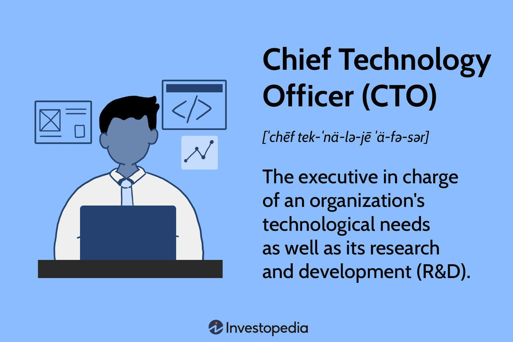

In today's fast-paced digital world, the roles of Chief Digital Officer (CDO) and Chief Marketing Officer (CMO) have become increasingly important within organizations. These roles are crucial in steering businesses through the challenges and opportunities presented by digital technologies and the dynamic market landscape. CDOs are primarily responsible for driving the digital transformation of an organization, ensuring that digital technologies are integrated across all facets of business operations. CMOs, on the other hand, focus on creating and executing marketing strategies that bolster brand awareness and drive customer engagement.

The significance of these roles is particularly evident in complex and data-intensive sectors, such as algorithmic trading. Algorithmic trading, which relies on the use of automated systems to execute trades, demands a blend of technological prowess and market insight. As organizations strive to adopt algorithmic trading strategies, the distinct yet complementary roles of CDOs and CMOs emerge as vital components. CDOs bring technological innovation to the table, enabling the creation and maintenance of robust trading platforms, while CMOs contribute valuable market intelligence that informs trading strategies in alignment with consumer trends.

This article will explore the distinctions and overlaps between the CDO and CMO roles and how these differences impact algorithmic trading strategies. The integration of digital transformation initiatives with advanced marketing insights holds the potential to significantly enhance business performance in the competitive realm of algorithmic trading. By harnessing the unique strengths of both CDOs and CMOs, organizations can create a synergistic environment that drives business success through effective and market-driven algorithmic trading strategies.

## Table of Contents

## Understanding the Roles of CDO and CMO

A Chief Digital Officer (CDO) plays a crucial role in steering an organization through digital transformation processes by incorporating digital technologies across various business operations. This involves a comprehensive understanding and implementation of modern digital tools to enhance the efficiency, scalability, and responsiveness of the enterprise. CDOs are responsible for creating a digital roadmap that aligns with the company's overall strategy, identifying technologies that can deliver value, and ensuring the seamless integration of these technologies into existing systems. Their focus is not just on adopting new technologies but also on fostering a digital culture within the organization that encourages innovation and agility.

On the other hand, a Chief Marketing Officer (CMO) is primarily concerned with the development and execution of marketing strategies. These strategies are designed to build brand awareness, cultivate customer loyalty, and drive engagement with target audiences. CMOs spearhead initiatives that utilize data analytics, customer insights, and market trends to tailor marketing campaigns effectively. They work towards optimizing the customer journey by creating personalized experiences that increase brand value and enhance customer satisfaction.

Despite their distinct areas of focus, both CDOs and CMOs share a common objective: driving business performance through innovation and strategic customer interaction. The CDO's emphasis on digital transformation complements the CMO's marketing strategies, as the integration of advanced digital solutions can empower marketing efforts with precise targeting, automation, and data-driven decision-making. In essence, while CDOs lay the groundwork for digital advancement, CMOs bring that digital potential to life through creative and effective marketing endeavors. By working in tandem, these roles can significantly elevate an organization's competitive edge and market positioning.

## The Intersection of Marketing and Digital Strategy

In the modern business landscape, marketing and digital strategy are increasingly intertwined, particularly in sectors like finance where [algorithmic trading](/wiki/algorithmic-trading) is prevalent. This symbiotic relationship is primarily due to the growing need for organizations to adapt rapidly to technological advancements and market dynamics.

Chief Digital Officers (CDOs) play a pivotal role in this integration by leveraging digital tools to drive operational efficiency. Their focus on digital transformation involves implementing cutting-edge technologies such as [artificial intelligence](/wiki/ai-artificial-intelligence) (AI), big data analytics, and cloud computing. These technologies are essential in algorithmic trading, as they enable the processing of vast amounts of data in real-time and facilitate the development of complex trading algorithms. The end goal for CDOs is to create a technological infrastructure that supports rapid, accurate, and cost-effective trading operations. For example, a CDO might deploy [machine learning](/wiki/machine-learning) models to predict market trends, thereby optimizing trading strategies.

On the other hand, Chief Marketing Officers (CMOs) utilize these digital tools to enhance customer experience and engagement. In the context of algorithmic trading, CMOs focus on understanding consumer behavior and market trends to tailor trading strategies that align with these insights. This involves analyzing consumer data to identify patterns and preferences, which can then inform marketing strategies that attract and retain customers. For instance, a CMO might use predictive analytics to forecast consumer behavior, enabling the development of personalized marketing campaigns that improve customer interaction with trading platforms.

The synergy between digital strategy and marketing efforts, therefore, becomes a significant driver of revenue growth and improved market positioning. By aligning digital initiatives with marketing objectives, organizations can create a more cohesive and responsive business strategy. This integration allows for more targeted marketing efforts, increased customer satisfaction, and ultimately, a more competitive position in the market. Combining the technological expertise of CDOs with the customer-centric approach of CMOs ensures that businesses are not only meeting operational efficiency standards but are also enhancing their engagement with consumers.

In summary, the intersection of marketing and digital strategy illustrates a transformative shift in how businesses operate, particularly in fast-paced sectors like finance. The collaborative efforts of CDOs and CMOs enable organizations to harness the full potential of digital tools, driving both efficiency and customer engagement, which are crucial for sustained business success.

## CDOs, CMOs, and Algo Trading: A Collaborative Approach

Algorithmic trading involves the use of sophisticated software and algorithms to perform trading activities, which demands a confluence of technological acumen and in-depth market knowledge. Collaborating effectively, Chief Digital Officers (CDOs) and Chief Marketing Officers (CMOs) form a powerful alliance that can drive efficiency and innovation in such trading systems.

CDOs play a critical role by supplying the technological infrastructure that underpins algorithmic trading systems. They ensure that the architecture is robust, scalable, and equipped with the latest technological advancements. This includes the development of high-frequency trading platforms, data analytics tools, and integrating artificial intelligence to predict market trends and automate decision-making processes. For instance, machine learning algorithms can be deployed to identify patterns and correlations in vast datasets that human traders might overlook. Consider a simple linear regression model:

$$
y = \beta_0 + \beta_1x + \epsilon
$$

A similar model could be used to predict stock prices based on historical data inputs, where $y$ is the stock price, $x$ is the time, and $\epsilon$ is the error term.

On the other hand, CMOs contribute valuable market insights necessary for effective trading strategies. They leverage consumer data, market analytics, and competitive trends to forecast market movements and refine trading strategies to align with customer expectations. This market-driven approach ensures that algorithmic systems are aligned with emerging consumer trends and behaviors, thereby enhancing the chance of success in trading decisions.

The collaboration between CDOs and CMOs transcends mere technological setup and market analysis; it embodies a symbiotic relationship where each role enhances the other's strengths. By integrating digital solutions with consumer behavior insights, CDOs and CMOs can design algorithmic systems that are not only technically advanced but also deeply attuned to market dynamics. For example, a dynamic trading algorithm might adjust trading strategies in real time based on consumer sentiment analysis data, which the CMO provides.

This strategic partnership ultimately enables organizations to harness both digital prowess and market intelligence, crafting algorithmic trading strategies that are efficient, adaptable, and competitively positioned in the financial markets. This fusion of technological precision and market insight can significantly enhance organizational performance in the highly competitive domain of algorithmic trading.

## Overcoming Challenges in CMO-CDO Collaboration

Collaboration between Chief Marketing Officers (CMOs) and Chief Digital Officers (CDOs) is essential in leveraging digital transformation for effective marketing strategies. However, this collaboration is often challenged by differing priorities and communication gaps. CMOs typically prioritize customer engagement and brand development, focusing on market trends and consumer behavior. On the other hand, CDOs are primarily concerned with adopting digital technologies to increase operational efficiency and drive innovation. This divergence can lead to misalignment in objectives and hinder cohesive strategy development.

To address these challenges, organizations should focus on fostering open communication channels that allow for continuous dialogue and understanding between these roles. Establishing regular cross-departmental meetings or workshops can serve as a forum for sharing insights and aligning strategies. During these sessions, discussing key performance indicators (KPIs) that measure both digital transformation and marketing success can help in aligning objectives. For instance, a common KPI could be the improvement in customer acquisition costs, which reflects both marketing efforts and digital enhancements.

Additionally, aligning objectives requires establishing common goals centered around overall business growth and customer satisfaction. A unified objective could be enhancing customer experience, a domain where both digital efficiency and marketing strategy intersect. By defining shared goals with clear metrics, such as increased customer retention rates or improved digital engagement metrics, both CMOs and CDOs can work more collaboratively.

In complex fields like algorithmic trading, where precision and market responsiveness are crucial, the integration of digital technology and marketing initiatives becomes even more critical. Algorithmic trading systems benefit from the technological prowess provided by CDOs, while CMOs offer market insights that inform these systems on consumer behavior trends. This integration ensures that trading algorithms are both technically advanced and market-driven, maximizing their efficiency and effectiveness.

Ultimately, overcoming the challenges in CMO-CDO collaboration requires a strategic approach that emphasizes communication, alignment of goals, and shared metrics. By doing so, organizations can successfully integrate digital and marketing efforts, paving the way for innovative strategies and sustainable growth.

## Conclusion

In the current era characterized by digital transformation and advanced trading methods, the roles of Chief Digital Officer (CDO) and Chief Marketing Officer (CMO) are more crucial than ever. Both positions play integral roles in shaping and executing effective algorithmic trading strategies. By leveraging the expertise of CDOs, organizations can ensure that the necessary technological frameworks and digital platforms are in place to facilitate efficient and effective algorithmic trading. Meanwhile, the insights and strategic direction provided by CMOs help in aligning trading strategies with prevailing market trends and consumer behaviors.

The combined efforts of CDOs and CMOs can significantly enhance overall business growth and customer engagement. This symbiotic relationship between technology and marketing is key to creating trading strategies that are not only technically robust but also responsive to market demands. The ability to integrate advanced data analytics, machine learning models, and digital marketing insights is essential for developing algorithms that optimize trading decisions and outcomes.

This collaborative approach is expected to evolve continually, driven by innovations in technology and shifts in consumer behavior. As such, the roles of CDOs and CMOs will be pivotal in shaping the future direction of digital strategies in algorithmic trading. Successful collaboration between these roles will lead to enhanced algorithm performance, more targeted marketing efforts, and an overall competitive edge in the financial markets. The strategic alignment and integration of these roles will drive advancements in trading technology and marketing methodologies, setting the stage for sustained innovation and growth.

## References & Further Reading

[1]: Bergstra, J., Bardenet, R., Bengio, Y., & Kégl, B. (2011). ["Algorithms for Hyper-Parameter Optimization."](https://dl.acm.org/doi/10.5555/2986459.2986743) Advances in Neural Information Processing Systems 24.

[2]: ["Advances in Financial Machine Learning"](https://www.amazon.com/Advances-Financial-Machine-Learning-Marcos/dp/1119482089) by Marcos Lopez de Prado

[3]: ["Evidence-Based Technical Analysis: Applying the Scientific Method and Statistical Inference to Trading Signals"](https://www.amazon.com/Evidence-Based-Technical-Analysis-Scientific-Statistical/dp/0470008741) by David Aronson

[4]: ["Machine Learning for Algorithmic Trading"](https://github.com/stefan-jansen/machine-learning-for-trading) by Stefan Jansen

[5]: ["Quantitative Trading: How to Build Your Own Algorithmic Trading Business"](https://www.amazon.com/Quantitative-Trading-Build-Algorithmic-Business/dp/1119800064) by Ernest P. Chan