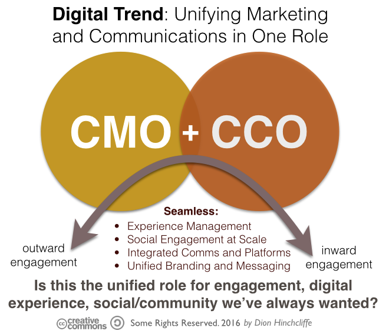

## Table of Contents

## What is the role of a Chief Marketing Officer (CMO)?

A Chief Marketing Officer (CMO) is a top executive in a company who is in charge of planning, creating, and carrying out marketing strategies. The main job of a CMO is to make sure that the company's products or services are known and liked by customers. They do this by figuring out who the customers are, what they need, and the best ways to reach them. This involves working with other parts of the company like sales, product development, and customer service to make sure everyone is working towards the same goals.

In addition to managing marketing campaigns, a CMO also keeps an eye on how well these campaigns are doing. They use data and feedback to see what is working and what needs to be changed. This helps the company stay competitive and grow. A good CMO also needs to be good at talking to people, both inside the company to motivate the team, and outside the company to build strong relationships with partners and the media. Overall, the role of a CMO is very important for making sure a company's brand stays strong and its marketing efforts are successful.

## What is the role of a Chief Digital Officer (CDO)?

A Chief Digital Officer (CDO) is a top executive who leads a company's digital strategy. Their main job is to make sure the company uses technology in the best way to reach its goals. This includes using digital tools to improve how the company works, how it talks to customers, and how it makes money. The CDO works with other leaders in the company to make sure everyone is on the same page about using technology.

In addition to planning, the CDO also keeps an eye on how well the company is doing with its digital efforts. They look at data to see what is working and what needs to be changed. This helps the company stay ahead of others in the market. A good CDO needs to be good at understanding technology and also good at talking to people, so they can explain their plans clearly to the team and to others outside the company.

## How do the responsibilities of a CMO differ from those of a CDO?

The Chief Marketing Officer (CMO) and the Chief Digital Officer (CDO) have different jobs in a company. The CMO focuses on the company's overall marketing strategy. They work on figuring out who the customers are, what they need, and the best ways to reach them. The CMO makes plans to promote the company's products or services, and they work with other teams like sales and product development to make sure everyone is working together. They also look at how well their marketing campaigns are doing and make changes if needed to keep the company's brand strong.

On the other hand, the Chief Digital Officer (CDO) is all about the company's digital strategy. Their main job is to make sure the company uses technology well to reach its goals. This can mean using digital tools to make the company work better, to talk to customers in new ways, and to find new ways to make money. The CDO works with other leaders to make sure the company's digital plans fit with its overall goals. They also keep an eye on how well the company is doing with its digital efforts and make changes based on data to stay ahead in the market.

While both roles involve strategy and working with other teams, the CMO focuses more on marketing and customer engagement, and the CDO focuses more on technology and digital transformation. Both roles are important for a company's success, but they handle different parts of the business.

## What are the typical backgrounds and skills required for a CMO?

A Chief Marketing Officer (CMO) usually has a background in marketing, business, or a related field. Many CMOs have a bachelor's or master's degree in marketing, business administration, or communications. They often start their careers in entry-level marketing positions and work their way up through different roles like marketing manager or director of marketing. This gives them a lot of experience in creating and managing marketing campaigns, understanding customer behavior, and working with different teams within a company.

The skills needed for a CMO are both technical and interpersonal. They need to be good at analyzing data to understand market trends and customer needs. They should also know how to create marketing strategies that work and how to use different marketing tools and platforms. On the interpersonal side, a CMO needs to be good at communicating and leading a team. They have to be able to work well with other leaders in the company and build strong relationships with partners and the media. Being creative and able to think of new ideas is also important for a CMO to keep the company's marketing fresh and effective.

## What are the typical backgrounds and skills required for a CDO?

A Chief Digital Officer (CDO) usually has a background in technology, business, or a related field. Many CDOs have a bachelor's or master's degree in computer science, information technology, or business administration. They often start their careers in technology roles and move up through positions like IT manager or director of digital strategy. This experience helps them understand how to use technology to improve a company's work and reach its goals.

The skills needed for a CDO include both technical and leadership abilities. They need to know a lot about technology, like how to use digital tools and platforms to make a company more efficient and innovative. They should also be good at analyzing data to see how well digital strategies are working. On the leadership side, a CDO needs to be good at communicating their plans to other leaders in the company and motivating their team. They also need to be good at working with others, both inside and outside the company, to make sure everyone is on the same page about using technology.

## How do CMOs and CDOs collaborate within an organization?

CMOs and CDOs work together in a company to make sure the company's marketing and digital strategies work well together. The CMO focuses on understanding customers and creating marketing plans to reach them. They need the CDO's help to use digital tools and platforms to make these marketing plans work better. For example, the CMO might want to run a new online ad campaign, and the CDO can help by choosing the right digital tools and making sure the campaign reaches the right people online.

The CDO, on the other hand, needs the CMO's input to make sure the company's digital efforts fit with its overall marketing goals. The CDO might be working on a new app or website, and they need the CMO's help to make sure it appeals to customers and fits with the company's brand. By working together, the CMO and CDO can make sure the company uses technology in the best way to reach customers and grow the business. They share data and ideas to keep improving their strategies and stay ahead in the market.

## What are the key performance indicators (KPIs) for a CMO?

The key performance indicators (KPIs) for a Chief Marketing Officer (CMO) help them see how well their marketing plans are working. Some important KPIs for a CMO include how many people visit the company's website, how many of those visitors become customers, and how much money the company makes from marketing efforts. These KPIs show if the marketing strategies are reaching the right people and turning them into customers.

Other important KPIs for a CMO are about how well the company's brand is known and liked by customers. This can include things like how many people talk about the brand on social media, how happy customers are with the company, and how the company's reputation compares to its competitors. By keeping an eye on these KPIs, a CMO can make sure the company's marketing is working well and make changes if needed to keep the brand strong.

## What are the key performance indicators (KPIs) for a CDO?

The key performance indicators (KPIs) for a Chief Digital Officer (CDO) help them see how well the company's digital plans are working. Some important KPIs for a CDO are about how well the company uses technology to do its work. This can include things like how fast the company's website loads, how many people use the company's digital tools, and how much money the company saves by using technology better. These KPIs show if the digital strategies are making the company work better and save money.

Other important KPIs for a CDO are about how well the company's digital efforts help it reach customers and make money. This can include things like how many people visit the company's website or app, how many of those visitors become customers, and how much money the company makes from its digital efforts. By keeping an eye on these KPIs, a CDO can make sure the company's digital plans are working well and make changes if needed to keep the company ahead in the market.

## How has the rise of digital technology impacted the roles of CMOs and CDOs?

The rise of digital technology has changed the job of a Chief Marketing Officer (CMO) a lot. Before, CMOs focused on traditional ways of marketing like TV ads and billboards. Now, they need to know about digital marketing too, like social media, online ads, and email campaigns. This means CMOs have to work closely with the digital team to make sure their marketing plans work well online. They also need to use data from digital tools to see how well their marketing is doing and make changes to keep up with new trends.

The role of a Chief Digital Officer (CDO) has also changed because of digital technology. CDOs used to focus on making the company's work better with technology, but now they have to think about how to use digital tools to reach customers and make money too. They work with the marketing team to make sure the company's digital plans fit with its marketing goals. CDOs also need to keep up with new technology and use data to see how well their digital strategies are working. This helps the company stay ahead in the market and keep growing.

## What are some case studies or examples of successful CMO and CDO partnerships?

One good example of a successful CMO and CDO partnership is at Nike. The CMO and CDO worked together to create the Nike+ app. The CMO helped make sure the app was fun and appealing to customers, while the CDO made sure the app used the latest technology to track fitness and connect with users. This partnership helped Nike reach more customers and make more money. The app became very popular and helped Nike stay ahead of other sports brands.

Another example is at Coca-Cola. The CMO and CDO worked together on the "Share a Coke" campaign. The CMO came up with the idea to put people's names on Coke bottles, and the CDO helped make it happen online. They used digital tools to let people create and share personalized Coke bottles on social media. This made the campaign very successful and helped Coca-Cola connect with a lot of young customers. The partnership showed how working together can make marketing and digital strategies work better.

## How do organizational structures influence the effectiveness of CMOs and CDOs?

The way a company is set up can really affect how well the Chief Marketing Officer (CMO) and Chief Digital Officer (CDO) can do their jobs. If the CMO and CDO are part of the same team or report to the same boss, they can work together more easily. They can share ideas and plans quickly, which helps them make sure the company's marketing and digital strategies work well together. But if the CMO and CDO are in different parts of the company and don't talk much, it can be hard for them to work together. This can make it harder for them to reach their goals and help the company grow.

Also, the company's structure can affect how much power the CMO and CDO have. If they have a lot of say in big decisions, they can make sure the company uses the best marketing and digital plans. But if they don't have much power, they might not be able to make the changes they need to keep the company ahead in the market. So, having a good structure where the CMO and CDO can work together and have enough power is really important for them to be successful.

## What future trends might affect the roles and responsibilities of CMOs and CDOs?

The future will bring many changes that will affect the jobs of CMOs and CDOs. One big trend is the growth of artificial intelligence (AI) and machine learning. These technologies will help CMOs understand customers better and make better marketing plans. CMOs will use AI to look at a lot of data and find out what customers want. At the same time, CDOs will use AI to make the company's digital tools work better. They will make sure the company uses the latest technology to stay ahead of others. This means both CMOs and CDOs will need to learn more about AI and how to use it.

Another trend is the rise of privacy and data protection laws. These laws will make it harder for CMOs to collect and use customer data for marketing. CMOs will need to find new ways to reach customers without breaking the rules. CDOs will also need to make sure the company's digital tools follow these laws. They will have to keep the company's data safe and make sure it is used in the right way. This means both CMOs and CDOs will need to work together more to make sure the company's marketing and digital plans follow the new rules.

## How can CDOs, CMOs, and Algo Trading work together in a collaborative approach?

Algorithmic trading involves the use of sophisticated software and algorithms to perform trading activities, which demands a confluence of technological acumen and in-depth market knowledge. Collaborating effectively, Chief Digital Officers (CDOs) and Chief Marketing Officers (CMOs) form a powerful alliance that can drive efficiency and innovation in such trading systems.

CDOs play a critical role by supplying the technological infrastructure that underpins algorithmic trading systems. They ensure that the architecture is robust, scalable, and equipped with the latest technological advancements. This includes the development of high-frequency trading platforms, data analytics tools, and integrating artificial intelligence to predict market trends and automate decision-making processes. For instance, machine learning algorithms can be deployed to identify patterns and correlations in vast datasets that human traders might overlook. Consider a simple linear regression model:

$$
y = \beta_0 + \beta_1x + \epsilon
$$

A similar model could be used to predict stock prices based on historical data inputs, where $y$ is the stock price, $x$ is the time, and $\epsilon$ is the error term.

On the other hand, CMOs contribute valuable market insights necessary for effective trading strategies. They leverage consumer data, market analytics, and competitive trends to forecast market movements and refine trading strategies to align with customer expectations. This market-driven approach ensures that algorithmic systems are aligned with emerging consumer trends and behaviors, thereby enhancing the chance of success in trading decisions.

The collaboration between CDOs and CMOs transcends mere technological setup and market analysis; it embodies a symbiotic relationship where each role enhances the other's strengths. By integrating digital solutions with consumer behavior insights, CDOs and CMOs can design algorithmic systems that are not only technically advanced but also deeply attuned to market dynamics. For example, a dynamic trading algorithm might adjust trading strategies in real time based on consumer sentiment analysis data, which the CMO provides.

This strategic partnership ultimately enables organizations to harness both digital prowess and market intelligence, crafting algorithmic trading strategies that are efficient, adaptable, and competitively positioned in the financial markets. This fusion of technological precision and market insight can significantly enhance organizational performance in the highly competitive domain of algorithmic trading.

## References & Further Reading

[1]: Bergstra, J., Bardenet, R., Bengio, Y., & Kégl, B. (2011). ["Algorithms for Hyper-Parameter Optimization."](https://dl.acm.org/doi/10.5555/2986459.2986743) Advances in Neural Information Processing Systems 24.

[2]: ["Advances in Financial Machine Learning"](https://www.amazon.com/Advances-Financial-Machine-Learning-Marcos/dp/1119482089) by Marcos Lopez de Prado

[3]: ["Evidence-Based Technical Analysis: Applying the Scientific Method and Statistical Inference to Trading Signals"](https://www.amazon.com/Evidence-Based-Technical-Analysis-Scientific-Statistical/dp/0470008741) by David Aronson

[4]: ["Machine Learning for Algorithmic Trading"](https://github.com/stefan-jansen/machine-learning-for-trading) by Stefan Jansen

[5]: ["Quantitative Trading: How to Build Your Own Algorithmic Trading Business"](https://www.amazon.com/Quantitative-Trading-Build-Algorithmic-Business/dp/1119800064) by Ernest P. Chan