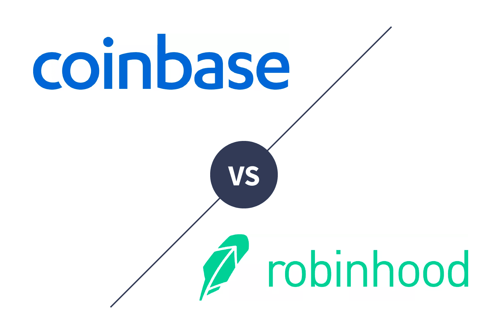

In cryptocurrency and stock trading, Robinhood and Coinbase have emerged as prominent platforms, each offering unique advantages to investors. This article intends to provide an in-depth comparison of these platforms, with a particular focus on their capabilities in algorithmic trading.

Algorithmic trading involves the use of computer algorithms to execute trading orders, aiming to benefit from the speed and precision that human traders cannot achieve. As such, assessing Robinhood and Coinbase through this lens provides valuable insights for investors who prioritize automation in their investment strategies.

Robinhood is renowned for its beginner-friendly approach and commission-free trading, making it an attractive option for novice investors. The platform supports a diverse range of asset classes, including stocks, options, ETFs, and a limited selection of cryptocurrencies. Its simplicity is a key feature, appealing to those who seek an accessible entry into the world of trading, without the burden of high fees.

Conversely, Coinbase's strengths lie in its comprehensive cryptocurrency offerings and advanced trading features. With support for over 250 cryptocurrencies, Coinbase caters to investors who are keen on digital assets. Its robust trading tools, including staking and derivatives trading, offer versatility for more experienced investors, particularly those interested in automated trading.

This article promises to explore these platforms' services and tools, examining how they cater to different investor types, especially those interested in automation. We aim to equip readers with a solid understanding of the strengths and weaknesses inherent in each platform, facilitating informed decisions. The following sections will provide an overview of the main offerings and benefits of Robinhood and Coinbase, setting the stage for a detailed analysis.

## Table of Contents

## Platform Features

Robinhood and Coinbase each offer distinct features tailored to different types of investors, especially those interested in algorithmic trading. Robinhood is well-known for providing a user-friendly interface that makes it especially appealing to novice investors. It enables no-commission trading on a variety of financial instruments, including stocks, options, ETFs, and cryptocurrencies. This ease of access and minimal cost structure help beginners get started without the concern of substantial trading fees, making it a straightforward platform for those new to investment.

In contrast, Coinbase focuses on offering a diverse selection of cryptocurrencies and advanced trading functionalities. Its platform supports a wide range of over 250 cryptocurrencies, which is ideal for crypto enthusiasts and advanced traders who are interested in more complex investment strategies like staking and derivatives trading. The availability of such options enables more sophisticated [algorithmic trading](/wiki/algorithmic-trading) strategies and allows for significant diversification within the [cryptocurrency](/wiki/cryptocurrency) market.

Despite having a simplistic approach, Robinhood does provide some basic features for users interested in algorithmic trading. It supports API access, albeit with some limitations, for users who wish to automate their trading processes. The platform's emphasis on ease of use ensures that even these features are accessible to those with limited trading experience, thus continuing its focus on a seamless user experience.

On the other hand, Coinbase offers more advanced tools and APIs designed to accommodate complex trading algorithms. The platform’s Pro version, Coinbase Pro, gives traders access to various data points and analytics, essential for those crafting sophisticated trading algorithms. The range of available features enables in-depth analysis and could benefit algorithmic traders who require comprehensive tools to refine and execute their strategies.

Ultimately, both Robinhood and Coinbase offer capabilities that serve their primary audiences effectively. Robinhood’s focus remains on delivering a user-friendly experience with a broad yet simplified investment platform suitable for beginners. Conversely, Coinbase provides the depth and breadth of tools needed by crypto enthusiasts who demand robust features, advanced trading options, and support for automation. Each platform’s orientation aligns with the distinct needs of their core user bases, whether it be for straightforward investing or complex cryptocurrency trading.

## Supported Currencies

Coinbase supports an extensive array of over 250 cryptocurrencies, establishing itself as a prime option for investors deeply engaged in the crypto market. This broad selection allows users to engage with a diverse range of digital currencies, appealing particularly to algorithmic traders who require access to a wide portfolio. By offering a multitude of cryptocurrencies, Coinbase enables traders to implement sophisticated trading algorithms that can leverage opportunities across various crypto assets. The extensive list of available trading pairs also facilitates [arbitrage](/wiki/arbitrage) strategies and diversification, thus aligning with the needs of adept crypto traders.

In contrast, Robinhood provides support for a relatively limited roster of 15 cryptocurrencies. However, it differentiates itself by integrating stock, options, [ETF](/wiki/etf-trading-strategies), and crypto trading into one platform. This amalgamation suits investors managing a multi-asset portfolio, providing a holistic trading experience where users can simultaneously engage with traditional and digital assets. The platform's broader investment offerings can be advantageous for traders who wish to automate investment strategies across different asset types, though the limited crypto options might restrict those focused solely on cryptocurrency trading.

The difference in asset offerings between these platforms directly impacts algorithmic traders. Those who prioritize cryptocurrency diversity and require access to numerous coins for their algorithms may find Coinbase's extensive range more appealing. Conversely, traders interested in managing a mixed portfolio with both stocks and cryptocurrencies might prefer Robinhood's integrated approach. Each platform presents unique advantages, and the decision should align with the trader's specific strategy and investment focus.

## Security and Investor Protection

Security is a paramount consideration when selecting a trading platform, particularly for algorithmic traders who handle significant transaction volumes. As digital asset trading grows, the security measures adopted by trading platforms like Coinbase and Robinhood become increasingly critical to safeguard investors' assets and ensure trust in the system.

Coinbase is recognized for its rigorous security framework tailored specifically for cryptocurrency investments. One of its fundamental security measures is the use of cold storage, where approximately 98% of customer funds are kept offline to protect them from cyber threats. Additionally, Coinbase incorporates Two-Factor Authentication (2FA), requiring users to provide a second piece of information, usually a one-time code generated by an app such as Google Authenticator, to access their accounts. This added layer of security significantly reduces the risk of unauthorized access. Furthermore, Coinbase provides insurance against breaches, covering the digital currency stored on its servers, which gives investors additional peace of mind regarding the safety of their digital assets.

Robinhood, while also focusing on security, provides a different set of protections aligned with its comprehensive investment offerings, including stocks and cryptocurrencies. For cash deposits, Robinhood offers Federal Deposit Insurance Corporation (FDIC) insurance, which protects users' cash deposits up to $250,000 in the event of a bank failure. Furthermore, the Securities Investor Protection Corporation (SIPC) coverage shields securities investments up to $500,000, including a $250,000 limit for cash claims. While Robinhood extends protections to crypto holdings, its primary crypto-related security measures are less detailed compared to Coinbase's approach, reflecting its broader asset focus.

Both Coinbase and Robinhood prioritize investment security, yet Coinbase's extensive crypto-centric security may provide it an edge in safeguarding digital assets. As algorithmic traders often engage with larger volumes and more complex transactions, understanding the intricacies of each platform's security offerings is crucial for minimizing risk and ensuring the safety of investments. This awareness enables users to make informed decisions aligned with their security priorities, thereby enhancing their trading confidence.

## Fee Structures

Robinhood and Coinbase offer distinct fee structures that are crucial for algorithmic traders to understand in order to optimize their trading strategies. Robinhood is known for its no-commission trading model. However, it employs a payment for order flow (PFOF) model, where it earns revenue by routing customer orders to market makers in exchange for compensation. This model may impact execution price subtly, as the market maker may adjust the price slightly in its favor. Consequently, while users benefit from no direct commissions, the actual transaction costs might be embedded within the bid-ask spread. This nuance is important for traders focused on high-frequency trading where marginal cost differences can accumulate significantly over time.

Conversely, Coinbase features a more complex fee structure based on a maker-taker model, where fees are determined by whether a trader adds [liquidity](/wiki/liquidity-risk-premium) to the market (maker) or removes it (taker). The tiered fee system on Coinbase also varies depending on trading [volume](/wiki/volume-trading-strategy), with higher volume traders receiving lower rates. Additionally, Coinbase imposes fees based on transaction types and user regions. For example, transactions conducted on Coinbase Pro generally have lower fees compared to the basic Coinbase platform, making it more advantageous for high-volume traders or algorithmic trading pursuits.

For algorithmic traders, understanding these fee structures is pivotal. On Robinhood, the absence of straightforward commissions may attract traders who prioritize simplicity and predictability. However, they must account for the potential hidden costs within the PFOF model. On Coinbase, the explicit maker-taker fees require traders to evaluate their strategy's focus on liquidity provision or extraction to minimize expenses. Calculating these costs can be embedded within algorithmic models to forecast and control for expense-related impacts on trading outcomes.

Thus, the profitability of algorithmic trading ventures on either platform is significantly influenced by their respective fee structures. Traders must carefully assess which platform aligns with their financial expectations and trading volumes. This involves not only a comparison of direct fees but also an analysis of indirect costs that could affect the overall performance of their trading strategies.

## Ease of Use

Robinhood's app is renowned for its simplistic and intuitive design, making it particularly attractive to novice traders. The interface minimizes complexity by providing easy access to essential functions such as buying and selling stocks, options, ETFs, and cryptocurrencies without needing extensive financial knowledge. This user-friendly approach is maintained throughout the app, promoting accessibility and ease of understanding for individuals new to the trading sphere.

Coinbase, in contrast, offers a more robust platform that caters to both beginners and seasoned traders. While maintaining an accessible user interface, Coinbase provides a plethora of advanced trading features. These include detailed charting tools, multiple order types, and access to a broad array of cryptocurrencies, facilitating a more comprehensive trading experience. The platform is also designed to support more complex investment strategies, which algorithmic traders may find particularly advantageous due to the availability of additional tools to monitor and manage trading activities effectively.

For traders employing automated strategies, the intuitiveness of the platform is crucial. Coinbase offers an advanced trading interface, formerly known as Coinbase Pro, which includes features such as API support for automated trading, advanced order types, and in-depth performance analytics. These tools are essential for managing complex algorithms that require precise execution and analysis. As a result, algorithmic traders can effectively automate their strategies with minimal manual intervention.

The overall usability of a platform significantly impacts the trading experience, influencing not just the speed and efficiency of trades but also the ability to manage multiple assets or execute bulk transactions seamlessly. Robinhood's simplicity may appeal to those who prefer a straightforward, unencumbered trading process, whereas Coinbase's comprehensive toolset is better suited for traders who require more advanced capabilities to optimize their trading strategies. Each platform’s interface and available tools align with the typical needs of their respective user bases, supporting diverse trading objectives and experience levels.

## Conclusion

Both Robinhood and Coinbase have established prominent positions within the investment community by offering distinct features tailored to different types of investors. For traders who prioritize access to a wide variety of cryptocurrencies coupled with strong security measures for algorithmic trading, Coinbase emerges as a compelling choice. Its extensive support for over 250 cryptocurrencies, combined with advanced security features such as two-[factor](/wiki/factor-investing) authentication, cold storage, and insurance for crypto holdings, makes it attractive for serious crypto enthusiasts and algo traders. Additionally, Coinbase's comprehensive fee structure, though complex, provides traders with a range of options suited to varied trading strategies, which can be beneficial for those engaging in high-frequency trading activities.

On the other hand, Robinhood presents a compelling option for those who seek a straightforward, user-friendly platform with no trading commissions, making it especially appealing to novice investors. Its integration of multiple investment classes, including stocks, options, ETFs, and a limited selection of cryptocurrencies, caters to users interested in managing a diversified portfolio within a single interface. Despite its simpler range of cryptocurrencies, Robinhood’s emphasis on accessibility and ease of use aligns well with the needs of those less focused on extensive crypto trading.

Ultimately, the optimal choice between Robinhood and Coinbase will depend on individual trading objectives, experience levels, and specific investment priorities. While Coinbase provides a robust environment for crypto-focused traders who require advanced tools and security for high-stakes investments, Robinhood offers a more approachable and cost-effective solution for investors looking to balance various asset types seamlessly. Equipped with this comparison, traders can more effectively navigate their options in the dynamic and rapidly evolving landscape of digital asset trading.

## References & Further Reading

[1]: Bergstra, J., Bardenet, R., Bengio, Y., & Kégl, B. (2011). ["Algorithms for Hyper-Parameter Optimization."](https://papers.nips.cc/paper/4443-algorithms-for-hyper-parameter-optimization) Advances in Neural Information Processing Systems 24.

[2]: ["Advances in Financial Machine Learning"](https://www.amazon.com/Advances-Financial-Machine-Learning-Marcos/dp/1119482089) by Marcos Lopez de Prado

[3]: ["Evidence-Based Technical Analysis: Applying the Scientific Method and Statistical Inference to Trading Signals"](https://www.amazon.com/Evidence-Based-Technical-Analysis-Scientific-Statistical/dp/0470008741) by David Aronson

[4]: ["Machine Learning for Algorithmic Trading"](https://github.com/stefan-jansen/machine-learning-for-trading) by Stefan Jansen

[5]: ["Quantitative Trading: How to Build Your Own Algorithmic Trading Business"](https://www.amazon.com/Quantitative-Trading-Build-Algorithmic-Business/dp/1119800064) by Ernest P. Chan