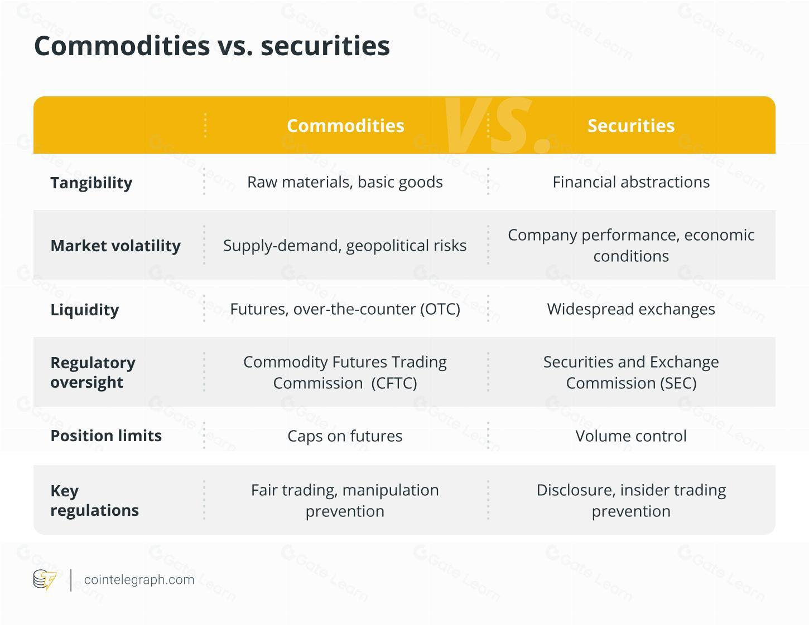

## Table of Contents

## What are commodities?

Commodities are basic goods that are used in everyday life and can be bought and sold. These include things like oil, gold, wheat, and coffee. They are usually traded in large amounts and are seen as raw materials that businesses use to make other products. For example, a bakery might buy wheat as a commodity to make bread.

People and businesses trade commodities on special markets called commodity exchanges. These markets help set the prices for commodities based on how much people want them and how much is available. Trading commodities can be a way for people to invest their money, hoping that the price will go up so they can sell it for a profit later. It's important for the economy because it helps keep the supply of these basic goods stable.

## What are securities?

Securities are like special pieces of paper or digital records that show you own a part of a company or that you've loaned money to a company or government. They can be stocks, which are shares in a company, or bonds, which are like IOUs where you lend money and get it back with interest later. People buy and sell securities on places called stock exchanges, where the prices go up and down based on what people think they're worth.

When you buy securities, you're hoping their value will go up so you can sell them for more money later, or in the case of bonds, you want to get your money back with interest. Securities are important because they help companies and governments raise money to do big projects or grow their business. They also give people a way to invest their savings and maybe earn more money over time.

## How do commodities differ from securities in terms of physical characteristics?

Commodities are things you can touch and use every day, like oil, gold, or wheat. They are physical items that businesses need to make other products. For example, a car factory uses steel, which is a commodity, to build cars. Commodities are usually traded in big amounts because they are the raw materials that keep industries running.

Securities, on the other hand, are not physical things you can hold in your hand. They are more like pieces of paper or digital records that show you own a part of a company or have loaned money to someone. For example, if you buy a stock, you get a piece of paper or a digital record saying you own a small part of that company. Securities are traded on stock exchanges, and they represent ownership or debt, but you can't use them directly like you can with commodities.

## What are the main types of commodities and securities?

Commodities are basic goods that people use every day. They are divided into two main types: hard commodities and soft commodities. Hard commodities come from the ground and include things like gold, oil, and natural gas. These are often used in making things like jewelry, fuel, and energy. Soft commodities are grown or raised, like wheat, corn, and cattle. Farmers and ranchers produce these, and they are used for food and other products like clothes.

Securities are financial items that people buy and sell. The main types of securities are stocks, bonds, and derivatives. Stocks are pieces of a company that you can own. When you buy a stock, you own a little bit of that company. Bonds are like loans that you give to a company or government, and they promise to pay you back with interest. Derivatives are more complex; they are based on the value of other things like stocks or commodities, and people use them to bet on whether prices will go up or down.

## How do the markets for commodities and securities function?

Commodity markets are places where people buy and sell basic goods like oil, gold, and wheat. These markets help set the prices for these goods based on how much people want them and how much is available. If lots of people want oil but there's not much of it, the price goes up. Farmers, miners, and other producers bring their goods to these markets to sell them to businesses that need them to make other products. People can also trade commodities as a way to invest their money, hoping that the price will go up so they can sell it later for a profit. Commodity exchanges, like the Chicago Mercantile Exchange, are where these trades happen.

Securities markets are where people buy and sell stocks, bonds, and other financial items. These markets, like the New York Stock Exchange, help companies and governments raise money. When a company wants to grow, it can sell pieces of itself, called stocks, to people who want to invest. If you buy a stock, you own a little bit of that company, and if the company does well, the value of your stock might go up. Bonds are like loans; when you buy a bond, you're lending money to a company or government, and they promise to pay you back with interest. The prices of securities go up and down based on what people think they're worth, which can be influenced by news about the company or the economy.

## What are the typical investment strategies for commodities versus securities?

When people invest in commodities, they often use strategies that try to guess where prices will go based on things like weather, politics, or how much of the commodity is available. One common strategy is called futures trading, where you agree to buy or sell a commodity at a set price in the future. This can help farmers and businesses plan ahead, but it's also risky because prices can change a lot. Another way to invest in commodities is through commodity ETFs or mutual funds, which let you invest in a bunch of different commodities at once, spreading out your risk. Some people also buy physical commodities like gold as a way to keep their money safe if they think other investments might lose value.

For securities, investors often look at a company's future growth and profits to decide if its stocks or bonds are a good buy. One popular strategy is called "buy and hold," where you buy a stock and keep it for a long time, hoping the company will grow and the stock price will go up. Another strategy is called "value investing," where you look for stocks that seem cheap compared to what the company is worth, hoping their price will go up as more people realize the company's true value. For bonds, people often focus on the interest they'll get back and how safe the bond is, choosing bonds from stable companies or governments. Both stocks and bonds can be part of a diversified portfolio, where you spread your money across different types of investments to reduce risk.

## How do the risk profiles of commodities compare to those of securities?

Commodities can be very risky to invest in. Their prices can go up and down a lot because they depend on things like the weather, politics, and how much of the commodity is available. For example, if there's a drought, the price of wheat might go up because there's less of it. Trading futures, which means agreeing to buy or sell a commodity at a set price in the future, can be even riskier because if the price changes a lot, you could lose a lot of money. But some people like to invest in commodities because they can be a good way to protect their money if they think other investments might lose value.

Securities, like stocks and bonds, also have risks but they can be different. Stocks can go up and down based on how well the company is doing and what people think about the company's future. If a company does badly, the stock price can drop a lot, but if it does well, the price can go up a lot too. Bonds are usually seen as less risky because they promise to pay you back with interest, but if the company or government can't pay, you could lose your money. People often try to reduce their risk by spreading their money across different types of securities, which is called diversification. Overall, securities might seem less risky than commodities because they're based more on the company's performance and less on unpredictable things like the weather.

## What are the regulatory differences between commodities and securities markets?

Commodities markets are regulated by different groups depending on the country. In the United States, the main regulator is the Commodity Futures Trading Commission (CFTC). The CFTC makes sure that trading in commodities like oil and wheat is fair and that people don't cheat. They also watch over the exchanges where commodities are traded, like the Chicago Mercantile Exchange. The rules for commodities can be different from those for securities because commodities are physical things that can be affected by things like weather and politics, so the regulations need to take that into account.

Securities markets, on the other hand, are usually overseen by different regulators. In the U.S., the main one is the Securities and Exchange Commission (SEC). The SEC's job is to protect people who invest in stocks, bonds, and other securities. They make sure that companies tell the truth about their business and that the stock markets are fair. The SEC also keeps an eye on how people trade securities to stop fraud and other bad behavior. Because securities are about owning part of a company or lending money, the rules focus more on making sure investors have good information and that the markets work well.

## How do commodities and securities respond to economic cycles?

Commodities often go up and down with the economy. When the economy is doing well, businesses need more raw materials to make things, so the demand for commodities like oil and steel goes up, and their prices go up too. But when the economy slows down, businesses don't need as many raw materials, so the demand for commodities drops and their prices go down. Some commodities, like gold, can act differently. People often buy gold when they're worried about the economy because it's seen as a safe place to keep their money, so gold prices might go up even when the economy is bad.

Securities, like stocks and bonds, also move with the economy, but in different ways. When the economy is growing, companies usually make more money, so their stock prices go up because people want to own part of a successful company. But when the economy slows down, companies might not make as much money, so their stock prices can go down. Bonds can be a bit safer because they promise to pay you back with interest, but if the economy gets really bad and companies or governments can't pay, bond prices can go down too. People often move their money between stocks and bonds depending on what they think will happen with the economy.

## What are the tax implications of investing in commodities versus securities?

When you invest in commodities, the taxes can be a bit tricky. If you buy and sell commodities like oil or gold through futures contracts, any money you make is usually taxed as a capital gain. If you hold the commodity for less than a year, it's a short-term capital gain, which is taxed at your regular income tax rate. If you hold it for more than a year, it's a long-term capital gain, which has a lower tax rate. But if you invest in commodities through an [ETF](/wiki/etf-trading-strategies) or mutual fund, the tax rules can be different. These funds might give you dividends, which are taxed as regular income, and any gains from selling the fund are taxed as capital gains.

For securities like stocks and bonds, the tax rules are a bit more straightforward. If you sell a stock for more than you paid for it, that profit is a capital gain. Like with commodities, short-term capital gains from stocks held for less than a year are taxed at your regular income tax rate, and long-term capital gains from stocks held for more than a year are taxed at a lower rate. If you get dividends from stocks, they're usually taxed at a special dividend tax rate, which is often lower than your regular income tax rate. Bonds can be a bit different because the interest you get from them is usually taxed as regular income, but some bonds, like municipal bonds, might be tax-free at the federal level.

## How can derivatives be used in the trading of commodities and securities?

Derivatives are financial tools that people use to bet on what will happen to the price of commodities or securities in the future. For commodities like oil or wheat, people often use futures contracts, which are agreements to buy or sell the commodity at a set price on a certain date. This helps farmers and businesses plan ahead because they can lock in a price now, even if the price changes later. For example, a farmer might use a futures contract to sell their wheat at today's price, so they know how much money they'll get even if the price drops before they harvest. Investors can also use these contracts to guess where prices will go, hoping to make money if they're right.

In the world of securities, derivatives like options and swaps are common. An option gives you the right, but not the obligation, to buy or sell a stock at a set price before a certain date. This can be useful if you think a stock's price will go up or down, but you're not sure when. For example, if you think a company's stock will go up in the next few months, you can buy a call option to buy the stock at today's price, and if the stock does go up, you can make money. Swaps are agreements to exchange cash flows or other financial things, and they're often used by big investors to manage risk. For instance, a company might use an [interest rate](/wiki/interest-rate-trading-strategies) swap to change a variable interest rate loan into a fixed rate one, making their payments more predictable.

## What advanced trading techniques are unique to commodities or securities markets?

In the commodities market, one advanced trading technique is called spread trading. This is when you buy and sell two related commodities at the same time, hoping to make money from the difference in their prices. For example, you might buy wheat for one month and sell wheat for a different month, betting that the price difference between the two will change in your favor. Another technique is hedging, where farmers or businesses use futures contracts to protect themselves from price changes. If a farmer thinks the price of their crop might go down before they sell it, they can use a futures contract to lock in today's price, so they don't lose money if the price drops later.

In the securities market, one advanced technique is [algorithmic trading](/wiki/algorithmic-trading), where computers use math formulas to decide when to buy and sell stocks. These algorithms can look at lots of data very quickly and make trades in milliseconds, trying to make small profits from tiny price changes. Another technique is short selling, which is when you borrow a stock and sell it, hoping the price will go down so you can buy it back cheaper and make a profit. For example, if you think a company's stock is going to drop, you can short sell it, and if the price does go down, you can buy it back at the lower price and keep the difference.

## References & Further Reading

[1]: Bergstra, J., Bardenet, R., Bengio, Y., & Kégl, B. (2011). ["Algorithms for Hyper-Parameter Optimization."](https://papers.nips.cc/paper/4443-algorithms-for-hyper-parameter-optimization) Advances in Neural Information Processing Systems 24.

[2]: ["Advances in Financial Machine Learning"](https://www.amazon.com/Advances-Financial-Machine-Learning-Marcos/dp/1119482089) by Marcos Lopez de Prado

[3]: ["Evidence-Based Technical Analysis: Applying the Scientific Method and Statistical Inference to Trading Signals"](https://www.amazon.com/Evidence-Based-Technical-Analysis-Scientific-Statistical/dp/0470008741) by David Aronson

[4]: ["Machine Learning for Algorithmic Trading"](https://github.com/stefan-jansen/machine-learning-for-trading) by Stefan Jansen

[5]: ["Quantitative Trading: How to Build Your Own Algorithmic Trading Business"](https://www.amazon.com/Quantitative-Trading-Build-Algorithmic-Business/dp/1119800064) by Ernest P. Chan