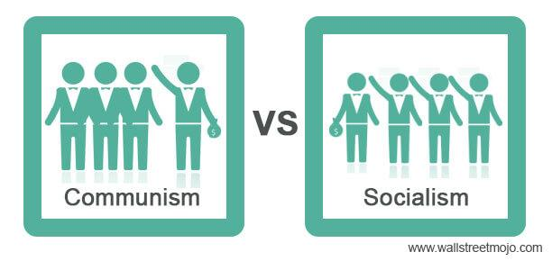

## Table of Contents

## What is communism?

Communism is a type of political and economic system where everything is shared equally among people. In a communist society, there is no private ownership of things like land, factories, or businesses. Instead, the government or the community owns everything and decides how to use these resources for the benefit of everyone. The main idea behind communism is to create a society where there are no rich or poor people, and everyone has what they need to live a good life.

The concept of communism was developed by philosophers Karl Marx and Friedrich Engels in the 19th century. They believed that communism would eventually replace capitalism, a system where businesses are owned by private individuals and people work for wages. Marx and Engels thought that under capitalism, the rich got richer by exploiting the working class. They argued that communism would end this exploitation by making sure that wealth and power were distributed fairly among all people. However, in practice, countries that have tried to implement communism have often faced many challenges, including economic problems and issues with personal freedoms.

## What is socialism?

Socialism is a way of organizing society where the government or the community owns and controls things like factories, land, and businesses. The main idea is to make sure that everyone gets a fair share of what the country produces. In a socialist system, people work together to meet everyone's needs, and the goal is to reduce the gap between the rich and the poor.

Socialism is different from capitalism, where businesses are owned by private individuals who aim to make a profit. In socialism, the focus is on providing for everyone's needs rather than making money for a few people. Some countries, like Sweden and Norway, use a mix of socialism and capitalism, where the government provides services like healthcare and education, but people can still own businesses.

The idea of socialism has been around for a long time, and it has many different forms. Some people believe in a more extreme version where the government controls almost everything, while others think that a balance between government control and private ownership works best. Socialism aims to create a fairer society where everyone has a chance to live well, but it can be hard to put into practice because different people have different ideas about what is fair and how to achieve it.

## How do communism and socialism differ in their core principles?

Communism and socialism both want to make society fairer, but they have different core ideas about how to do it. Communism believes in a world where there is no private ownership at all. Everything, like land, factories, and businesses, is owned by the community or the government. The main goal is to create a society where there are no rich or poor people, and everyone shares everything equally. Karl Marx and Friedrich Engels, who came up with the idea of communism, thought that it would replace capitalism, where rich people own businesses and make money off workers. They believed that communism would end this unfairness by making sure that everyone has the same amount of wealth and power.

Socialism, on the other hand, also wants to reduce the gap between rich and poor, but it allows for some private ownership. In a socialist system, the government or the community owns and controls important things like factories and healthcare, but people can still own their own homes or small businesses. The main focus is on making sure everyone has what they need, like good healthcare and education, and that wealth is shared more fairly. Socialism can work alongside capitalism, where private businesses exist but the government steps in to help make things more equal. While communism aims for a completely equal society with no private property, socialism tries to balance fairness with some personal freedoms and private ownership.

## What are the historical origins of communism and socialism?

The ideas of communism and socialism started in the 19th century. Communism was mainly developed by Karl Marx and Friedrich Engels. They wrote a book called "The Communist Manifesto" in 1848, where they explained their ideas. Marx and Engels believed that society was divided into two groups: the rich capitalists who owned everything and the working class who had to work for them. They thought this was unfair and that communism would fix it by making everything owned by everyone, so there would be no rich or poor people. They predicted that workers would eventually rise up against the capitalists and create a communist society.

Socialism also started around the same time, but it had different ideas about how to make society fairer. Early socialists like Robert Owen and Charles Fourier wanted to create communities where people worked together and shared everything. They thought this would help everyone live better lives. Later, socialists like Eduard Bernstein believed in reforming capitalism instead of overthrowing it. They wanted the government to own important things like factories and provide services like healthcare, but still allow some private businesses. Socialism became popular in Europe, and many countries started to mix socialist ideas with capitalism to create a more equal society.

## Can you explain the economic systems associated with communism and socialism?

In communism, the economic system is all about sharing everything equally. There are no private businesses or private property. Instead, the government or the community owns all the factories, land, and businesses. People work together to produce things like food, clothes, and houses, and then everyone gets what they need. The idea is to make sure no one is rich or poor, and everyone has enough to live well. But, in practice, it can be hard to make this work because it's tough to decide exactly how to share everything fairly, and sometimes the government can make mistakes or be unfair.

In socialism, the economic system is a mix of government control and private ownership. The government owns important things like factories, healthcare, and education, but people can still own their own homes or small businesses. The goal is to make sure everyone has what they need, like good healthcare and education, and to share wealth more fairly. The government might set rules for businesses to make sure they treat workers well and pay them fairly. This system tries to balance fairness with some personal freedoms and private ownership. Many countries use a mix of socialism and capitalism, where the government helps make things more equal, but people can still own businesses and make money.

## How do communism and socialism approach the concept of private property?

In communism, there is no private property at all. Everything, like land, factories, and homes, is owned by the community or the government. The idea is that if nobody owns anything privately, then everyone can share everything equally. This means that people don't have their own houses or businesses; instead, they use what the community provides. The goal is to make sure that nobody is rich or poor, and everyone has what they need to live well. But, it can be hard to make this work because deciding how to share everything fairly is tricky, and sometimes the government can make mistakes.

In socialism, private property is allowed, but the government owns important things like factories, healthcare, and sometimes big businesses. People can still own their own homes and small businesses, but the government makes sure that everyone gets a fair share of what the country produces. The idea is to make sure that everyone has what they need, like good healthcare and education, and to reduce the gap between rich and poor. Socialism tries to balance fairness with some personal freedoms and private ownership. Many countries use a mix of socialism and capitalism, where the government helps make things more equal, but people can still own businesses and make money.

## What role does the state play in communist and socialist systems?

In a communist system, the state plays a big role. The government owns everything, like land, factories, and businesses. It decides how to use these resources to make sure everyone gets what they need. The state also makes sure that wealth and power are shared equally among all people. The idea is that the government will eventually go away once everyone is equal, but until then, it has to control everything to make sure things are fair. In practice, this can be hard because the government might make mistakes or be unfair.

In a socialist system, the state also has an important role, but it's different from communism. The government owns important things like healthcare, education, and sometimes big businesses, but people can still own their own homes and small businesses. The state makes rules to make sure businesses treat workers fairly and that everyone gets a fair share of what the country produces. The goal is to reduce the gap between rich and poor and make sure everyone has what they need. Many countries mix socialism with capitalism, where the government helps make things more equal, but people can still own businesses and make money.

## How have communism and socialism been implemented in different countries?

Communism has been tried in countries like the Soviet Union, China, Cuba, and North Korea. In the Soviet Union, after the 1917 revolution, the government took over all businesses and land. They wanted to make sure everyone was equal, but it was hard. The government made all the decisions, and sometimes they made mistakes. People didn't always have what they needed, and many felt they had less freedom. In China, after the communists took over in 1949, they also tried to share everything equally. They had big projects like the Great Leap Forward, but it led to a lot of problems, like famine. Today, China still calls itself communist, but it has some private businesses and more economic freedom.

Socialism has been implemented in many different ways around the world. In countries like Sweden and Norway, they mix socialism with capitalism. The government owns things like healthcare and education, making sure everyone gets these services for free. People can still own their own businesses and homes, but the government makes rules to make sure everyone is treated fairly. In Venezuela, they tried a more extreme form of socialism. The government took over many businesses and tried to share wealth equally, but it led to economic problems and shortages of food and medicine. Each country's experience with socialism is different, showing that there are many ways to try to make society fairer.

## What are the criticisms and failures associated with communism and socialism?

People often criticize communism because it's hard to make it work well. In countries like the Soviet Union and China, the government tried to share everything equally, but it led to big problems. People didn't always have enough food or things they needed. The government made all the decisions, and sometimes they made big mistakes. Also, people felt they didn't have much freedom because the government controlled everything. Critics say that communism can lead to a lot of suffering and that it's hard to make sure everyone is treated fairly.

Socialism also gets criticized, but in different ways. In places like Venezuela, the government tried to control a lot of businesses and share wealth equally, but it led to shortages and economic problems. Critics say that when the government owns too much, it can make bad decisions and cause more harm than good. In countries like Sweden and Norway, where they mix socialism with capitalism, some people think the government spends too much on things like healthcare and education. They worry it might slow down the economy. But supporters of socialism say it helps make sure everyone has what they need and reduces the gap between rich and poor.

## How do communism and socialism view class struggle and social equality?

Communism sees class struggle as the main problem in society. It believes that the rich, who own businesses and land, make money by making the working class work hard for low wages. Communists think this is unfair and that the only way to fix it is by getting rid of private property completely. They want a world where there are no rich or poor people, and everyone shares everything equally. The idea is that once the working class takes over and creates a communist society, there won't be any more class struggle because everyone will be equal.

Socialism also believes in reducing the gap between rich and poor, but it sees class struggle a bit differently. Socialists think that the government should own important things like healthcare and big businesses to make sure everyone gets what they need. They believe this can help reduce class struggle by making society more equal. But unlike communism, socialism allows for some private property and businesses. The goal is to balance fairness with some personal freedoms, so people can still own their own homes and small businesses. Socialists want to make sure everyone has a fair share of what the country produces, but they think it's possible to do this without getting rid of all private property.

## What are the theoretical differences between Marxism and other forms of socialism?

Marxism is a specific type of socialism that was developed by Karl Marx and Friedrich Engels. It focuses on the idea that history is all about class struggle, where the rich capitalists exploit the working class. Marxists believe that the only way to fix this is by having a revolution where the working class takes over and creates a communist society. In this society, there would be no private property, and everything would be owned by everyone. Marx thought that this would eventually lead to a world where there are no rich or poor people, and everyone is equal. But, Marxism is different from other forms of socialism because it wants to completely get rid of capitalism and private property.

Other forms of socialism, like democratic socialism or social democracy, have different ideas about how to make society fairer. These types of socialism believe that it's possible to mix some socialist ideas with capitalism. They think the government should own important things like healthcare and education to make sure everyone gets what they need, but people can still own their own homes and small businesses. Unlike Marxism, these forms of socialism don't want to get rid of all private property. They believe that by making rules and having the government help out, it's possible to reduce the gap between rich and poor without a big revolution. So, while Marxism aims for a complete change to communism, other forms of socialism try to balance fairness with some personal freedoms and private ownership.

## How do modern interpretations and adaptations of communism and socialism compare to their original theories?

Modern interpretations of communism have changed a lot from what Karl Marx and Friedrich Engels first thought. In the beginning, they wanted a world where there was no private property at all, and everything was shared equally. But in countries like China, while they still call themselves communist, they now allow some private businesses and more economic freedom. This is different from the original idea because it mixes some capitalism with communism. Also, many people today see communism as a system that can lead to less freedom and more government control, which is not what Marx and Engels wanted. They thought communism would make everyone free and equal, but in practice, it has been hard to make this work.

Modern socialism also looks different from what early socialists like Robert Owen and Charles Fourier imagined. Today, many countries mix socialism with capitalism, like Sweden and Norway. They have government-owned healthcare and education, but people can still own their own homes and small businesses. This is different from the original socialist ideas, which wanted to create communities where everything was shared. Also, some countries like Venezuela tried a more extreme form of socialism, where the government controlled a lot, but it led to economic problems. So, modern socialism tries to balance fairness with some personal freedoms, which is not exactly what the early socialists wanted, but it's a way to make society more equal without getting rid of all private property.

## References & Further Reading

[1]: Karl Marx & Friedrich Engels, ["The Communist Manifesto"](https://www.marxists.org/admin/books/manifesto/Manifesto.pdf), 1848.

[2]: Rosa Luxemburg, ["Reform or Revolution"](https://www.marxists.org/archive/luxemburg/1900/reform-revolution/), 1900.

[3]: Eduard Bernstein, ["Evolutionary Socialism"](https://www.marxists.org/reference/archive/bernstein/works/1899/evsoc/ch03-2.htm), 1899.

[4]: Marcos Lopez de Prado, ["Advances in Financial Machine Learning"](https://www.amazon.com/Advances-Financial-Machine-Learning-Marcos/dp/1119482089), Wiley, 2018.

[5]: David Aronson, ["Evidence-Based Technical Analysis: Applying the Scientific Method and Statistical Inference to Trading Signals"](https://www.amazon.com/Evidence-Based-Technical-Analysis-Scientific-Statistical/dp/0470008741), Wiley, 2006.

[6]: Stefan Jansen, ["Machine Learning for Algorithmic Trading"](https://github.com/stefan-jansen/machine-learning-for-trading), Packt Publishing, 2020.

[7]: Ernest P. Chan, ["Quantitative Trading: How to Build Your Own Algorithmic Trading Business"](https://www.amazon.com/Quantitative-Trading-Build-Algorithmic-Business/dp/0470284889), Wiley, 2008.

[8]: Donald MacKenzie, ["An Engine, Not a Camera: How Financial Models Shape Markets"](https://direct.mit.edu/books/monograph/2002/An-Engine-Not-a-CameraHow-Financial-Models-Shape), MIT Press, 2006.

[9]: Michael Lewis, ["Flash Boys: A Wall Street Revolt"](https://en.wikipedia.org/wiki/Flash_Boys), W. W. Norton & Company, 2014.