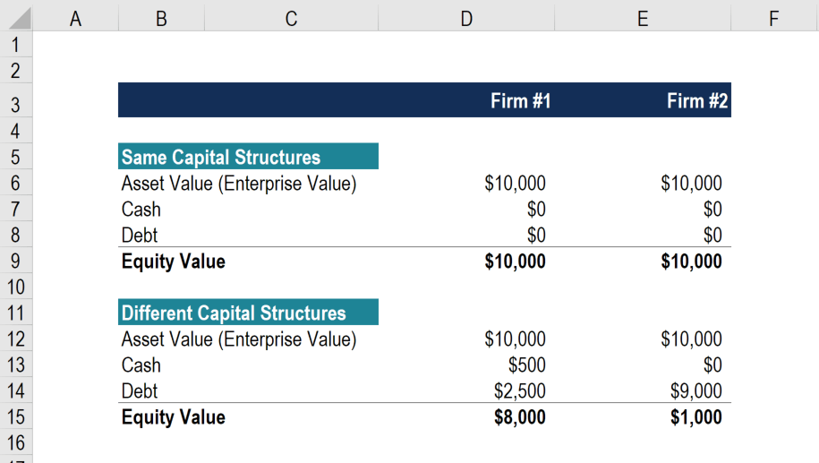

In the modern financial landscape, enterprise value (EV) and algorithmic trading have become integral components of investment strategies. As markets evolve rapidly with technological advancements, accurately determining a company's true worth is becoming increasingly important for investors and analysts. Enterprise value serves as a comprehensive measure of a company's overall valuation and provides a more holistic view than traditional metrics like market capitalization. 

Algorithmic trading, on the other hand, leverages computational power and advanced algorithms to execute trades at speeds and efficiencies beyond human capabilities. Together, they allow investors to analyze, strategize, and respond to market shifts with precision and insight.



This article explores the concept of EV, detailing its calculation and application within financial analysis and trading. We'll examine how EV draws a more complete picture of company valuation and how it's employed alongside algorithmic trading methods to enhance investment decisions. As the pace of technological innovation accelerates market dynamics, mastering these elements is key to optimizing financial strategies.

## Table of Contents

## Understanding Enterprise Value (EV)

Enterprise Value (EV) is a fundamental financial metric that captures the total valuation of a company, providing insights that go beyond traditional market capitalization measures. While market capitalization merely reflects the total value of a company's outstanding shares, EV offers a more complete picture by including additional financial obligations and assets.

The calculation of Enterprise Value is given by the formula:

$$
\text{EV} = \text{Market Capitalization} + \text{Total Debt} - \text{Cash and Cash Equivalents}
$$

1. **Market Capitalization**: This component represents the aggregate value of a company's equity and is calculated as the product of the current share price and the total number of outstanding shares. It serves as a base figure in the EV computation but does not account for other financial factors that can influence a company's value.

2. **Total Debt**: To understand a company's true financial standing, it is essential to account for all interest-bearing debts, including both short-term and long-term obligations. Debt increases the enterprise value because it represents financial liabilities that must be settled.

3. **Cash and Cash Equivalents**: These assets are subtracted from the EV calculation as they represent liquid resources that can be used to pay off some of the company's liabilities. High levels of cash and cash equivalents lower the net financial obligations and, consequently, the enterprise value.

By aggregating these components, EV provides a more comprehensive assessment of a company’s financial health and worth. It considers both equity and debt financing structures, thereby allowing investors and analysts to evaluate a company in a holistic manner. There are no accounting effects like depreciation or tax rates that might obscure the true cost of acquiring the firm in a market transaction.

Additionally, EV is particularly useful when comparing companies with different capital structures or analyzing potential acquisition targets. Since it encapsulates both equity and debt, EV allows for meaningful cross-company comparisons, enhancing the ability of investors to discern the underlying financial health and comparative value of companies.

## The Role of Debt and Cash

Debt and cash are paramount factors in determining a firm's enterprise value (EV). These elements intricately influence a company's valuation by affecting the perceived cost of acquisition and value retention.

Debt essentially represents financial obligations that a company must settle, typically under terms defined by creditors. When considering EV, debt is an essential part because it is the amount a new owner would have to pay to acquire the business, assuming all liabilities. Consequently, debt increases the EV as it adds to the cost of acquiring the company's overall business operations. 

Conversely, cash and cash equivalents reflect liquid assets readily available to reduce acquisition costs. Having substantial cash reserves effectively lowers the EV because these assets can be used to offset the cost of debt repayment. This substantial [liquidity](/wiki/liquidity-risk-premium) implies that less additional capital would be required to settle outstanding obligations, thereby reducing the effective purchase price of a firm.

The relationship between debt, cash, and EV can be distilled into a simple equation:

$$
\text{EV} = \text{Market Capitalization} + \text{Total Debt} - \text{Cash and Cash Equivalents}
$$

This formula highlights how debt adds to EV, while cash subtracts from it. It underscores the necessity to account for both when evaluating a firm's financial standing. For example, a company with high levels of debt may appear costly to acquire, but if it also possesses significant cash reserves, the EV could be comparatively lower.

Understanding the interplay between these components is vital for investors seeking to ascertain the genuine worth of a company. Evaluating these metrics provides a more nuanced perspective on a firm's financial health by integrating both positive and negative financial obligations into its valuation. Consequently, discerning investors incorporate both debt and cash levels to navigate the complexities of enterprise valuation effectively.

To better grasp the implications of these adjustments, financial analysts often model scenarios using programming tools like Python:

```python
def calculate_enterprise_value(market_cap, total_debt, cash_equivalents):
    return market_cap + total_debt - cash_equivalents

market_cap = 500000000  # Example market capitalization in dollars
total_debt = 200000000  # Example total debt in dollars
cash_equivalents = 75000000  # Example cash and cash equivalents in dollars

ev = calculate_enterprise_value(market_cap, total_debt, cash_equivalents)
print(f"Enterprise Value: ${ev}")
```

This simple calculator underscores how changes in debt or cash levels can significantly alter a firm's EV, reflecting its actual financial situation. It is imperative for investors and analysts to evaluate these changes to form an accurate judgment of a company's value beyond its market capitalization alone.

## Enterprise Value Ratios

Enterprise value ratios are critical tools for assessing corporate financial health. By comparing enterprise value (EV) against specific financial metrics, investors can gain deeper insights into a company's performance and valuation. Among the most notable of these ratios are EV/EBITDA and EV/Sales, each offering distinct advantages for evaluating firms with varied capital structures.

### EV/EBITDA

The EV/EBITDA ratio is a popular tool for appraising a company's value relative to its earnings before interest, taxes, depreciation, and amortization (EBITDA). The formula for this ratio is:

$$
\text{EV/EBITDA} = \frac{\text{Enterprise Value (EV)}}{\text{EBITDA}}
$$

This ratio provides a clear picture of a company's operational profitability and is often favored in corporate valuation because it excludes irregular accounting and financing effects. Unlike the price-to-earnings (P/E) ratio, which is influenced by a company's capital structure and tax environment, EV/EBITDA standardizes earnings and is a more transparent indicator of operational efficiency.

### EV/Sales

Another valuable metric is the EV/Sales ratio, calculated as follows:

$$
\text{EV/Sales} = \frac{\text{Enterprise Value (EV)}}{\text{Total Sales}}
$$

This ratio is especially useful in assessing companies with negative earnings, such as those in early-stage or technology sectors, where profits may not yet be substantial or stable. EV/Sales provides insights into how much value the market assigns per unit of sales, helping investors evaluate how effectively a company converts its sales into enterprise value.

### Utility and Comparisons

Both EV/EBITDA and EV/Sales ratios enable investors to draw insightful comparisons across companies. They account for variations in accounting policies and capital structures, making them more reliable for benchmarking companies within the same industry or across different sectors. For instance, a high EV/EBITDA ratio might suggest that a company is overvalued compared to its peers, prompting further analysis of its business model or growth prospects.

Integrating these ratios as part of a comprehensive financial analysis allows investors to account for differences in leverage and business models, highlighting companies that might have been overlooked using traditional valuation metrics. These ratios present a nuanced view, enabling more strategic investment decisions.

## EV vs. Market Cap and P/E Ratio

Enterprise Value (EV), Market Capitalization, and Price-to-Earnings (P/E) Ratio are three pivotal metrics in financial analysis, each offering unique insights into a company's valuation. Market capitalization, calculated as the stock price multiplied by the number of outstanding shares, provides a straightforward measure of a company's equity value. However, it overlooks the company’s debt and cash, potentially leading to an incomplete financial picture.

On the other hand, the P/E ratio, which is the market capitalization divided by net income, measures a company's current share price relative to its per-share earnings. While useful in assessing profitability, the P/E ratio does not account for the value of cash holdings or outstanding debt, thus exclusively focusing on equity profitability.

In contrast, EV encompasses a more comprehensive view. EV is formulated as follows:

$$
\text{EV} = \text{Market Capitalization} + \text{Total Debt} - \text{Cash and Cash Equivalents}
$$

This metric includes the company's net debt, offering a holistic picture by reflecting its total value in the market, encompassing debt obligations and liquidity. Consequently, EV often presents a more accurate representation of a company's economic value, especially when compared to metrics like Market Cap and P/E.

Consider the scenario where two companies have identical market capitalizations but different debt and cash levels. Company A might have significant debt, making its EV considerably higher than Company B, which might be relatively debt-free and cash-rich. Thus, while their market caps suggest parity, their EVs reveal differing financial health and investment risk profiles.

Similarly, contrasting EV with the P/E ratio can enrich an investor's understanding of valuation. High P/E ratios might suggest overvaluation unless accompanied by high EV/EBITDA or EV/Sales ratios, which can confirm a company's market value by integrating aspects of debt and cash.

Essentially, by integrating EV with these metrics, investors gain a multifaceted view of corporate valuation, helping them disentangle equity performance from underlying indebtedness and liquidity, thus making more informed investment decisions.

## Integrating EV with Algorithmic Trading

Algorithmic trading has revolutionized financial markets, largely owing to its ability to process vast quantities of data quickly and make informed investment decisions within milliseconds. A key metric used by [algorithmic trading](/wiki/algorithmic-trading) systems is Enterprise Value (EV), which offers a comprehensive assessment of a company's value. By incorporating EV into trading algorithms, traders can better evaluate investment opportunities and optimize trading strategies.

### Utilizing EV in Algorithmic Strategies

EV's primary advantage in trading algorithms is its ability to provide a more complete picture of a company's financial health than other metrics like market capitalization alone. Algorithmic trading systems can leverage this by comparing EV with various financial ratios and performance indicators to identify undervalued or overvalued stocks. This rapid comparison capability allows trading systems to execute buy or sell orders based on pre-defined criteria whenever a stock's EV indicates potential for price movement or mispricing relative to its peers or the market overall.

### Implementing EV Calculations in Python

Python, a widely used programming language in financial technology, facilitates the calculation and integration of EV into trading algorithms. Here is a basic implementation of calculating EV using Python:

```python
def calculate_enterprise_value(market_cap, total_debt, cash_and_equivalents):
    """
    Calculates the Enterprise Value (EV) of a company.

    Args:
    market_cap (float): Market capitalization of the company.
    total_debt (float): Total debt of the company.
    cash_and_equivalents (float): Total cash and cash equivalents of the company.

    Returns:
    float: Calculated enterprise value.
    """
    return market_cap + total_debt - cash_and_equivalents

# Example usage
market_cap = 1000000000  # Example market capitalization
total_debt = 200000000   # Example total debt
cash_and_equivalents = 50000000  # Example cash and cash equivalents

enterprise_value = calculate_enterprise_value(market_cap, total_debt, cash_and_equivalents)
print(f"Enterprise Value: {enterprise_value}")
```

This script highlights EV's role in algorithmic trading systems as it can be dynamically updated with real-time financial data inputs. Python libraries, such as pandas for data manipulation and NumPy for numerical computations, enable efficient handling of the data stream, ensuring that EV-centric trading strategies are both potent and responsive to market conditions.

### High-Frequency Trading and Enterprise Value

In high-frequency trading ([HFT](/wiki/high-frequency-trading-strategies)), algorithms use EV metrics to make split-second decisions, exploiting minute discrepancies between a company's enterprise value and its market pricing. By continuously recalculating EV and integrating it into trading strategies, HFT systems can capitalize on brief inefficiencies in the market, leading to improved trade execution and increased profitability. Python's ability to interface with financial data providers, combined with EV calculations, forms the backbone of high-frequency trading models that optimize strategies on a millisecond-by-millisecond basis.

Incorporating EV into algorithmic trading frameworks empowers traders with a robust metric to guide the development of sophisticated financial models and trading strategies. As technology and market dynamics evolve, the role of EV in trading algorithms is poised to grow, transforming how investment decisions are made and executed.

## Limitations and Considerations in EV

Enterprise Value (EV) is a powerful tool for gauging a company's total worth, amalgamating market capitalization with debt and deducting cash and cash equivalents. However, despite its comprehensive nature, EV is not without its limitations. One primary consideration is the potential variance in its effectiveness when comparing companies across different industries. This occurs because industry-specific factors can profoundly impact the capital structure and operating mechanisms of firms, leading to discrepancies when EV is used as a comparative metric.

For example, industries with inherently high debt levels, such as utilities, may naturally present higher EVs compared to technology firms, which might have lower leverage. This difference suggests that relying solely on EV could mislead investors about relative company values, unless industry contexts are meticulously accounted for. Adjusting for these industry norms is essential to avoid skewed interpretations. 

Secondly, EV does not inherently account for qualitative factors such as market conditions, regulatory changes, or consumer behavior trends, which can be pivotal in assessing future company performance. Thus, while EV provides a snapshot of a company's financial standing at a given moment, it might not reflect its true potential or operational challenges. This limitation underscores the necessity of considering supplementary metrics and qualitative assessments for a holistic evaluation.

Moreover, the accuracy of EV can be compromised by financial statement anomalies such as off-balance-sheet financing or aggressive accounting practices, which could inflate or deflate a company's true debt or cash positions. To mitigate these inaccuracies, careful due diligence and cross-verification with other valuation metrics like Price-to-Earnings (P/E) ratios, and in-depth financial analysis are imperative.

Incorporating broader financial insights into the evaluation process allows investors and analysts to integrate both quantitative metrics and qualitative factors. This balanced approach ensures that the complexities of different business models, competitive landscapes, and market dynamics are adequately reflected, providing a more nuanced understanding of a company's true valuation.

## Conclusion

Understanding enterprise value (EV) is essential for modern investors due to its comprehensive scope in assessing a company's true worth. Unlike market capitalization alone, which merely reflects equity value, EV offers a holistic measure by accounting for debt obligations and cash reserves, thus providing a fuller picture of a company's financial health.

Aligning EV with algorithmic trading strategies enhances the precision and timeliness of financial decisions. By integrating EV into algorithmic models, investors can swiftly analyze vast datasets and execute trades based on nuanced valuations. This integration is pivotal in high-frequency trading, where the speed and accuracy of data interpretation are crucial. Algorithms can harness EV metrics to distinguish undervalued or overvalued companies, adjusting trading strategies in milliseconds to capitalize on market inefficiencies.

For instance, Python's versatility in financial analysis allows developers to calculate EV within automated trading systems actively. Users can incorporate libraries such as NumPy and Pandas to handle large datasets and perform the complex calculations involved in EV assessments. This computational power enables a responsive approach to investing, adapting strategies based on real-time data.

Moreover, mastering EV enhances both traditional and algorithmic trading methods. In traditional investing, EV can refine the process of evaluating potential acquisitions or mergers, where understanding a comprehensive company valuation is imperative. For algorithmic trading, EV ensures that investment models are grounded in solid valuation principles, thus improving the predictive accuracy of market movements.

In conclusion, EV stands as a powerful tool in the investor's arsenal, bridging the gap between equity market signals and broader financial conditions. By leveraging this metric within sophisticated trading platforms, investors can achieve a well-rounded and strategic approach to capital allocation, optimizing both investment performance and risk management.

## References & Further Reading

For those seeking to expand their understanding of enterprise value (EV) and algorithmic trading, several academic and professional resources offer comprehensive insights and analyses. Below are recommended readings and resources that cover the various nuances and applications of these concepts in the financial sector:

### Books

1. **"Valuation: Measuring and Managing the Value of Companies" by McKinsey & Company Inc.**
   - This book delivers an in-depth exploration of the principles of valuation, including detailed discussions on enterprise value. It is a recommended source for understanding the financial metrics that underpin a company’s valuation.

2. **"Algorithmic Trading: Winning Strategies and Their Rationale" by Ernie Chan**
   - A practical guide to algorithmic trading strategies, this book provides insights into how quantitative models and metrics, including EV, can be employed for systematic trading. It also offers Python code examples for implementing these strategies.

### Academic Journals and Papers

1. **Journal of Finance**
   - Regularly publishes peer-reviewed articles that explore various financial metrics and strategies, including enterprise value in the context of market valuation and investment strategies.

2. **"Advantages of Enterprise Value over Market Capitalization"—an article in the Journal of Financial Economics.**
   - This article provides a comparative analysis of EV and market capitalization, highlighting the scenarios in which EV offers a more accurate picture of a company’s valuation.

### Online Courses and Lectures

1. **Coursera - "Financial Markets" by Yale University**
   - This online course offers modules on modern finance, including the roles of different financial metrics such as enterprise value, enhancing understanding through expert-led video lectures and interactive quizzes.

2. **edX - "Algorithmic Trading and Finance Models with Python, R, and Stata Essential Training"**
   - This course provides practical training on implementing algorithmic trading strategies, with a focus on utilizing financial metrics like EV, through efficient coding practices in Python and other programming languages.

### Industry Reports and Websites

1. **Bloomberg Terminal**
   - Provides comprehensive data and tools for financial analysis, including detailed enterprise value metrics for publicly traded companies. It's an essential platform for professionals conducting in-depth market research and analysis.

2. **Investopedia - Enterprise Value Explained**
   - An accessible online resource that breaks down complex financial concepts, including a thorough explanation of enterprise value, its components, and its applications in financial analysis and trading strategies.

Through engaging with these resources, individuals can further their knowledge and effectively apply enterprise value and algorithmic trading principles to real-world financial scenarios. This curated list of readings and resources offers valuable starting points for anyone interested in mastering these sophisticated financial tools.

