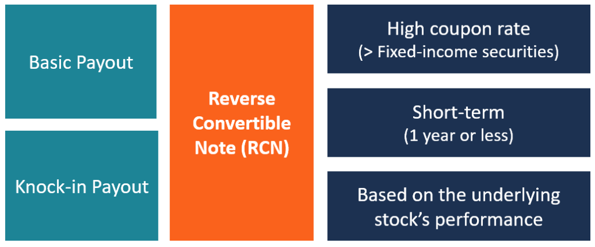

## Table of Contents

## What is a convertible bond?

A convertible bond is a type of bond that can be changed into a certain number of shares of the company's stock. Imagine you have a bond that pays you interest regularly. With a convertible bond, you have the option to trade that bond for stock in the company if you want to. This can be a good choice if you think the company's stock will go up in value.

Convertible bonds are popular because they offer a mix of safety and potential for growth. The bond part gives you regular interest payments, which is safer than just owning stock. But if the company does well and the stock price goes up, you can convert your bond into stock and possibly make more money. This makes convertible bonds attractive to investors who want to balance risk and reward.

## What is a reverse convertible bond?

A reverse convertible bond is a type of bond that works a bit differently from a regular bond. When you buy a reverse convertible bond, you lend money to a company and they promise to pay you back with interest at the end of the bond's term. But there's a twist: instead of getting your money back, you might get shares of the company's stock instead. This happens if the stock price falls below a certain level.

This kind of bond can be riskier because you might end up with stock that's worth less than the money you originally lent. But it can also offer higher interest rates than regular bonds to make up for that risk. Investors who are okay with taking on more risk might find reverse convertible bonds interesting because of the potential for higher returns, but they need to be ready for the possibility of getting stock instead of cash at the end.

## How do convertible bonds work?

A convertible bond is like a special type of loan you give to a company. When you buy a convertible bond, the company promises to pay you interest regularly, just like with a normal bond. But there's something extra: you can choose to turn your bond into shares of the company's stock if you want to. This choice is up to you, and you can make it during a certain time period.

This feature makes convertible bonds interesting because they give you a bit of safety with the regular interest payments, but also a chance to make more money if the company does well and the stock price goes up. If you think the stock will be worth more than your bond, you can convert it and get those shares instead. It's like having the best of both worlds - the steady income from a bond and the potential growth from stocks.

## How do reverse convertible bonds work?

A reverse convertible bond is a special kind of bond where you lend money to a company, and they promise to pay you back with interest at the end of the bond's term. But there's a catch: instead of getting your money back, you might get shares of the company's stock instead. This happens if the stock price falls below a certain level, called the "trigger price."

This type of bond can be riskier because you might end up with stock that's worth less than the money you originally lent. But to make up for that risk, reverse convertible bonds often offer higher interest rates than regular bonds. Investors who are willing to take on more risk might find them interesting because of the potential for higher returns, but they need to be ready for the possibility of getting stock instead of cash at the end.

## What are the key features of convertible bonds?

Convertible bonds are special types of bonds that let you switch them into shares of the company's stock. This means you can get regular interest payments like a normal bond, but you also have the option to turn your bond into stock if you think the company will do well. You can make this choice during a specific time period set by the bond.

This feature makes convertible bonds attractive because they give you a mix of safety and potential for growth. The interest payments provide a steady income, which is safer than just owning stock. But if the company's stock price goes up, you can convert your bond into stock and possibly make more money. This makes convertible bonds a good choice for investors who want to balance risk and reward.

## What are the key features of reverse convertible bonds?

A reverse convertible bond is a type of bond where you lend money to a company, and they promise to pay you back with interest at the end of the bond's term. But there's a twist: instead of getting your money back, you might get shares of the company's stock instead. This happens if the stock price falls below a certain level, called the "trigger price." This makes reverse convertible bonds different from regular bonds because there's a chance you won't get your money back in cash.

This type of bond can be riskier because you might end up with stock that's worth less than the money you originally lent. But to make up for that risk, reverse convertible bonds often offer higher interest rates than regular bonds. Investors who are willing to take on more risk might find them interesting because of the potential for higher returns, but they need to be ready for the possibility of getting stock instead of cash at the end.

## What are the benefits of investing in convertible bonds?

Investing in convertible bonds can give you the best of both worlds. They work like regular bonds, so you get regular interest payments, which is safer than just owning stock. This steady income can help you feel more secure about your investment. Plus, if the company does well and the stock price goes up, you can turn your bond into stock and possibly make more money. This means you have a chance to grow your investment if things go well for the company.

Another big benefit is flexibility. With convertible bonds, you can choose when to convert your bond into stock, based on what you think will happen with the stock price. This choice is up to you and can be made during a certain time period. This means you can decide to stick with the bond for its safety or switch to stock for potential growth, depending on how you see the market moving.

## What are the benefits of investing in reverse convertible bonds?

Investing in reverse convertible bonds can be good if you like taking a bit more risk for a chance to earn more money. These bonds usually offer higher interest rates than regular bonds. That means you can get more money back in interest payments while you wait for the bond to mature. This higher interest can be a big draw for investors who are okay with the risk that comes with these bonds.

The other benefit is that reverse convertible bonds can give you a chance to own the company's stock at a lower price. If the stock price falls below a certain level, you get the stock instead of your money back. If you think the stock might go back up, this can be a good way to buy the stock at a discount. But you need to be ready for the chance that the stock might not go up and you could end up with stock worth less than what you lent.

## What are the risks associated with convertible bonds?

Investing in convertible bonds comes with some risks. One big risk is that the company might not do well, and its stock price could go down. If that happens, you might decide not to convert your bond into stock because the stock isn't worth as much. But if you don't convert, you're stuck with a bond from a struggling company, which could mean you might not get all your money back when the bond matures.

Another risk is that interest rates might go up. If they do, the value of your bond could go down because new bonds might offer higher interest rates. This makes your bond less attractive to other investors, which can hurt its value if you want to sell it before it matures. So, even though convertible bonds give you a chance to turn them into stock, they still carry the same risks as regular bonds when it comes to interest rates and the company's health.

## What are the risks associated with reverse convertible bonds?

Investing in reverse convertible bonds can be risky because you might not get your money back in cash. If the company's stock price falls below a certain level, called the trigger price, you'll get shares of the stock instead of your money. If the stock is worth less than what you lent, you could lose money. This makes reverse convertible bonds riskier than regular bonds because you're betting on the stock price not falling too much.

Another risk is that the company might not do well, and its stock price could drop a lot. If that happens, the shares you get at the end could be worth much less than what you expected. Plus, if interest rates go up, the value of your bond could go down because new bonds might offer better rates. This means you could lose money if you need to sell your bond before it matures. So, while reverse convertible bonds offer higher interest rates, they come with a lot of risk that you need to be ready for.

## How do convertible and reverse convertible bonds perform under different market conditions?

Convertible bonds can do well in different market conditions, but they shine when the stock market is going up. If the company's stock price rises, you can turn your bond into stock and make more money. This is great when the market is doing well. But if the stock market goes down, you might not want to convert your bond into stock because the stock isn't worth as much. In that case, you can stick with the bond and keep getting interest payments, which gives you some safety. So, convertible bonds can be a good choice when you think the market will go up but want some protection if it goes down.

Reverse convertible bonds, on the other hand, can be riskier in bad market conditions. If the stock market falls and the company's stock price drops below a certain level, you'll get the stock instead of your money back. If the stock is worth less than what you lent, you could lose money. This makes reverse convertible bonds less safe when the market is going down. But in a good market, if the stock price stays above the trigger level, you get your money back plus higher interest rates. So, reverse convertible bonds can be a good choice if you're okay with the risk and think the market will stay stable or go up, but they can be risky if the market goes down.

## What are the tax implications of investing in convertible versus reverse convertible bonds?

When you invest in convertible bonds, the tax implications depend on whether you keep the bond or convert it into stock. If you hold onto the bond and get interest payments, those payments are usually taxed as regular income. This is similar to how interest from other types of bonds is taxed. If you decide to convert the bond into stock, you don't have to pay taxes right away on the conversion itself. But if you later sell the stock for more than what you paid for the bond, you'll owe capital gains tax on the profit. The tax rate for capital gains can be lower than the rate for regular income, which could be a plus.

With reverse convertible bonds, the tax situation can be a bit more complicated. If you get interest payments while holding the bond, those are taxed as regular income, just like with convertible bonds. But if the stock price falls below the trigger level and you get stock instead of cash when the bond matures, things change. If you sell the stock right away and it's worth less than what you paid for the bond, you could claim a capital loss, which might help lower your taxes. But if you hold onto the stock and it goes up in value, you'll owe capital gains tax when you sell it. So, the tax implications of reverse convertible bonds depend a lot on what happens with the stock price and when you decide to sell.

## What are the differences between Convertible and Reverse Convertible Bonds?

Convertible bonds and reverse convertible bonds are both hybrid financial instruments with unique structures and functions, offering different risk-return profiles to investors. Understanding the differences between these two types of securities is crucial for investors looking to incorporate them into their portfolios.

### Structural and Functional Differences

**Convertible Bonds** are debt instruments that provide the bondholder with the option, but not the obligation, to convert their bonds into a predetermined number of shares of the issuing company. This conversion feature gives the bondholder the potential to participate in the equity upside while enjoying fixed income-like stability.

**Reverse Convertible Bonds**, on the other hand, obligate the issuer to deliver a quantity of underlying assets, typically shares, to the bondholder if certain conditions are met, such as the stock price falling below a specified level. The bondholder receives a high coupon rate as compensation for the risk of receiving shares instead of cash at maturity.

### Side-by-Side Comparison

1. **Features**:
   - Convertible Bonds:
     - Option to convert into equity.
     - Lower coupon rates compared to traditional bonds.
   - Reverse Convertible Bonds:
     - Mandatory delivery of stock under specific conditions.
     - Higher coupon rates as compensation for higher risk.

2. **Risks**:
   - Convertible Bonds:
     - Interest rate risk.
     - Equity risk (post-conversion).
   - Reverse Convertible Bonds:
     - Equity risk.
     - Credit risk due to issuer's obligation.

3. **Returns**:
   - Convertible Bonds:
     - Potential for capital appreciation through conversion.
     - Regular interest payments.
   - Reverse Convertible Bonds:
     - High coupon payments.
     - Potential loss if stock value decreases significantly.

### Conversion Rights and Bond Valuation

Conversion rights influence the valuation of convertible bonds significantly. The value of a convertible bond is typically the sum of its straight bond value plus the value of the conversion option. Mathematically, its value can be expressed as:

$$
V_{CB} = V_{SB} + V_{CO}
$$

where $V_{CB}$ is the value of the convertible bond, $V_{SB}$ is the straight bond value, and $V_{CO}$ is the value of the conversion option.

In reverse convertible bonds, there are no conversion rights per se, but rather a conversion obligation imposed on certain conditions, thereby affecting the bond's pricing model differently. The bond’s value often hinges more on the stock's [volatility](/wiki/volatility-trading-strategies) and the creditworthiness of the issuer.

### Investor Considerations

Investors choosing between these instruments must weigh several factors:

- **Risk Tolerance**: Convertible bond investors need to be comfortable with equity market risks, particularly if conversion aligns with their strategic objectives. In contrast, reverse convertible bond investors should be ready to accept equity at potentially lower valuations.

- **Income Needs**: If immediate income is a priority, reverse convertible bonds with their higher coupon rates might be more attractive. Conversely, lower yield convertible bonds cater to those looking to balance fixed income with potential equity growth.

- **Market Conditions**: In bullish markets, convertible bonds can offer equity upside, enhancing their attractiveness. In volatile or bearish markets, the higher known coupon returns of reverse convertible bonds might provide a better risk-adjusted return.

Ultimately, the choice between these financial instruments depends on individual investment goals, market outlook, and risk appetite. Investors must carefully assess their financial situation and the characteristics of each bond type before making a decision.

## References & Further Reading

1. **Books:**
   - Hull, J. C. (2018). *Options, Futures, and Other Derivatives*. Pearson Education. This book provides a comprehensive overview of financial derivatives, including detailed explanations of convertible bonds and trading strategies.
   - Fabozzi, F. J. (2008). *Bond Markets: Analysis and Strategies*. This book covers bond market mechanics, including discussions on convertible bonds, reverse convertibles, and bond valuation principles.

2. **Academic Papers:**
   - Ammann, M., Kind, A., & Wilde, C. (2003). *Are convertible bonds useful for financing? An empirical analysis of the international market*. Journal of Banking & Finance, 27(4), 635-638. This paper evaluates different motives for firms issuing convertible bonds and the impact on market performance.
   - De Jong, F., & Driessen, J. (2012). *Liquidity risk premia in corporate bond markets*. Quarterly Journal of Finance, 2(02), 1250011. This paper investigates into the impact of liquidity risk on corporate bond markets, suitable for understanding nuances in bond trading.

3. **Online Articles:**
   - Investopedia. *Convertible Bond Definition and Examples*. Available at: [https://www.investopedia.com/terms/c/convertiblebond.asp](https://www.investopedia.com/terms/c/convertiblebond.asp). An introductory resource for understanding the basic mechanics and benefits of convertible bonds.
   - CFA Institute. *Guide to Convertible Securities*. Available at: [https://www.cfainstitute.org/en](https://www.cfainstitute.org/en). This guide offers insights into the pricing, valuation, and strategic use of convertible securities.

4. **Further Reading on Algorithmic Trading:**
   - Narang, R. K. (2009). *Inside the Black Box: The Simple Truth about Quantitative Trading*. Wiley. This book is a staple for understanding algorithmic trading mechanics and strategies, relevant to bond trading applications.
   - Aldridge, I. (2013). *High-Frequency Trading: A Practical Guide to Algorithmic Strategies and Trading Systems*. Wiley. This text explores the high-frequency and algorithmic trading environments, emphasizing their impact on modern financial markets, including bonds.

5. **Research Reports:**
   - Bank for International Settlements (BIS). (2016). *Changing patterns of the global corporate bond market*. This report discusses the evolving dynamics of corporate bond markets, with insights into convertible bond trends.
   - McKinsey & Company. (2020). *The future of algorithmic trading*. A report detailing advancements and the future outlook for algorithmic trading practices in financial markets.

These resources cater to both foundational understanding and advanced analyses of convertible and reverse convertible bonds, as well as algorithmic trading.

