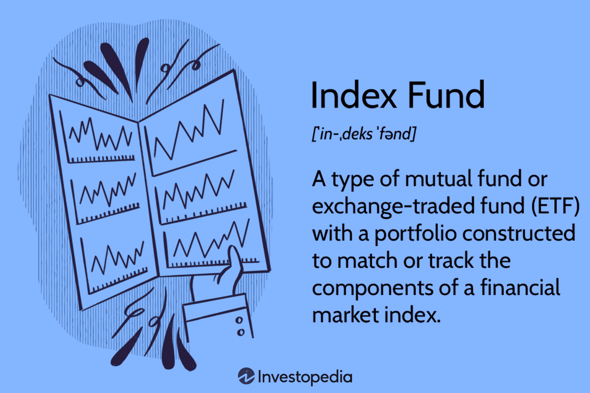

Agricultural investments represent a significant portion of the global investment landscape, offering investors opportunities to diversify their portfolios while engaging with one of the world's most essential sectors. As food production becomes increasingly critical due to a growing global population, investments in agricultural commodities such as wheat, corn, and soy have emerged as attractive options. These commodities serve not only as fundamental dietary staples but also as essential components in various industrial applications, making their demand relatively inelastic.

Diversification remains a pivotal strategy in investment to mitigate risk and enhance potential returns. By allocating assets across various sectors, including agriculture, investors can buffer their portfolios against market volatility. Agricultural commodities, with their distinct price dynamics compared to traditional financial instruments like stocks and bonds, provide a valuable hedge, often moving independently of other asset classes.

Wheat, corn, and soy are among the most traded agricultural commodities worldwide. Each represents unique market dynamics driven by factors such as weather conditions, geopolitical considerations, and technological advancements. For instance, wheat is critical for global food security, corn is a staple in both food products and biofuels, and soy is vital for animal feed and oil production. Understanding these markets allows investors to make informed decisions about allocating resources to these significant agricultural commodities.

The advent of algorithmic trading has once again transformed agricultural commodities' trading landscape. By employing advanced algorithms and machine learning techniques, investors can process vast amounts of market data and execute trades with precision and speed that were previously unattainable. Algorithmic trading enables improved market efficiency, reduced transaction costs, and enhanced risk management, making it a compelling tool for investors in agricultural markets.

This article aims to provide a comprehensive examination of investments in wheat, corn, and soy, highlighting the opportunities and challenges associated with each. It will further explore the burgeoning role of algorithmic trading in these markets, illustrating how technological advancements are reshaping investment strategies. By elucidating key concepts and offering insights into both traditional and modern approaches, this article seeks to equip investors with the knowledge necessary to navigate the ever-evolving landscape of agricultural commodity investments.

## Table of Contents

## Understanding Agricultural Commodities as Investments

Agricultural commodities represent raw materials produced through farming and livestock, serving as fundamental components of the global economy. These commodities include staple crops like wheat, corn, and soybeans, which are integral to food production, animal feed, and various industrial applications. Agricultural commodities are crucial not only for providing nutritional resources but also for their economic impact on farming communities and their contribution to the gross domestic product (GDP) of many countries.

The global economy heavily depends on agricultural commodities due to their role in food security and international trade. These commodities support economic stability in exporting countries and influence international relations and trade negotiations. For instance, disruptions in major agricultural markets can lead to significant price [volatility](/wiki/volatility-trading-strategies), affecting both producers and consumers worldwide.

Historically, agricultural markets have exhibited a cyclical performance, characterized by periods of boom and bust due to factors like technological advancements, changes in consumer demand, and geopolitical developments. These cyclical patterns are also influenced by seasonal changes and weather conditions, making agricultural commodities susceptible to external environmental factors.

Several key factors influence the pricing of agricultural commodities:

1. **Supply and Demand Dynamics**: As with any economic good, the prices of agricultural commodities are heavily dictated by supply and demand factors. For example, favorable weather conditions typically lead to higher yields, increasing supply and potentially lowering prices if demand remains constant.

2. **Weather Conditions**: Unpredictable climatic changes can significantly impact crop yields. Droughts, floods, and other extreme weather events can disrupt supply chains, leading to increased volatility in commodity prices.

3. **Government Policies and Subsidies**: Agricultural subsidies and trade policies can alter the competitive landscape, affecting global supply chains and pricing structures.

4. **Technological Advances**: Innovations in agriculture, such as genetically modified organisms (GMOs) and advanced farming techniques, can improve productivity and alter market dynamics, influencing prices.

5. **Global Economic Conditions**: Economic growth, inflation rates, and currency fluctuations can also impact commodity prices. For instance, economic downturns may reduce consumer spending on agricultural products, affecting demand and prices.

6. **Biofuels and Alternative Uses**: The use of crops such as corn and soybeans for biofuel production adds another layer of complexity to the commodity markets, influencing prices based on energy sector demand.

Understanding these factors is vital for investors considering agricultural commodities, as they provide insight into potential risks and opportunities in these volatile markets.

## Wheat Investment: Opportunities and Challenges

## Wheat Investment: Opportunities and Challenges

### Overview of the Wheat Market

Wheat is one of the most globally produced and consumed cereal grains, serving as a staple food for millions. It is a critical component in the human diet and a key ingredient in a variety of food products such as bread, pasta, and pastries. As a significant agricultural commodity, wheat investment presents both opportunities and challenges for investors. 

### Demand and Supply Dynamics for Wheat

The demand for wheat is driven by its essential role in food consumption. Factors affecting demand include population growth, dietary patterns, and changes in consumer preferences. In recent years, there has been an increasing demand for wheat in developing countries due to rising incomes and urbanization, leading to changes in consumption patterns.

Supply is heavily influenced by production levels, which are affected by climatic conditions, technological advancements in agriculture, and agricultural policies. Wheat production is concentrated in regions such as North America, Europe, and parts of Asia and Australia. Adverse weather conditions, such as droughts or floods, can significantly impact yield and thus supply levels. 

### Investment Vehicles for Wheat: ETFs, Futures, and Options

Investors have several options for participating in wheat markets:

1. **Exchange-Traded Funds (ETFs):** ETFs provide a way to gain exposure to wheat prices without directly trading futures contracts. These funds typically track indices related to agricultural commodities, including wheat, offering diversification benefits.

2. **Futures Contracts:** Futures are agreements to buy or sell a specific amount of wheat at a predetermined price on a future date. Trading futures allows investors to speculate on price movements or hedge against price volatility. The Chicago Board of Trade (CBOT) is one of the primary platforms for wheat futures trading.

3. **Options:** Options give investors the right, but not the obligation, to buy or sell wheat futures at a specified price before the expiration date. Options can be used for hedging purposes or to take advantage of market volatility while limiting downside risk.

### Risks Associated with Wheat Investing

Investing in wheat carries several risks:

- **Price Volatility:** Wheat prices can exhibit significant volatility due to supply and demand imbalances, geopolitical events, and changes in weather patterns. 

- **Political and Regulatory Risks:** Government policies, such as export restrictions or subsidies, can influence market conditions and affect wheat prices.

- **Currency Risk:** Since wheat is traded globally, fluctuations in foreign exchange rates can impact the value of international transactions for non-domestic investors.

### Recent Trends and Future Prospects in Wheat Market

Recent trends in the wheat market have been shaped by climate change, technological innovations, and evolving trade patterns. Climate change poses a threat to wheat production due to the increased frequency of extreme weather events. However, advancements in agricultural technology, such as genetically modified crops and precision farming, offer potential solutions to enhance yield and sustainability.

The future of wheat investment will likely be influenced by several factors:

- **Technological Advancements:** Innovations in crop genetics, irrigation, and farm management practices could lead to increased productivity and efficiency in wheat production.

- **Sustainability and Climate Resilience:** As the focus on sustainable agriculture intensifies, strategies to improve resilience to climate change will play a crucial role in shaping the wheat market.

- **Global Trade Dynamics:** Changes in trade policies and international relations can alter export and import patterns, impacting global wheat flows.

Investing in wheat requires a thorough understanding of these factors to navigate the complexities of the market effectively.

## Corn Investment: Examining the Market

Corn is a vital agricultural commodity with wide-ranging applications, significantly influencing both the agricultural and broader economic sectors. It is utilized not only as a staple food in numerous cultures but also as a key ingredient in animal feed, biofuels, and various industrial products. As of recent years, corn's prominence has been underscored by its role in biofuel production, particularly ethanol, which has become a major [factor](/wiki/factor-investing) in determining global corn demand and prices.

### Understanding the Significance of Corn in Agriculture

Corn's importance in agriculture can be attributed to its versatility and high yield potential. As a crop, it exhibits a robust adaptability to diverse climatic and soil conditions, which allows it to be cultivated in various regions across the globe. The United States, China, and Brazil represent some of the largest corn producers, collectively accounting for a significant portion of global production. This geographic diversity in production helps stabilize supply to meet global demand, although localized events can still influence price dynamics.

### Factors Driving Corn Prices: Weather, Policies, and Biofuels

Several key factors affect corn prices:

1. **Weather Conditions**: Corn production is highly sensitive to adverse weather conditions such as droughts, floods, and temperature extremes. Weather anomalies in major corn-producing regions can lead to yield fluctuations, affecting supply levels and causing price volatility.

2. **Agricultural Policies**: National and international agricultural policies, including subsidies, tariffs, and trade agreements, can impact corn prices. For instance, subsidies to corn growers in the US can affect global market prices by reducing production costs and influencing supply levels.

3. **Biofuels**: The demand for biofuels, particularly ethanol, is a crucial driver of corn prices. Policies promoting biofuels, such as renewable fuel standards, increase demand for corn as a feedstock, thus affecting its market price. As biofuel markets expand, the integration of corn into these markets continues to influence its profitability.

### Investment Strategies in Corn Markets

Investors looking to participate in the corn market can use various strategies, including:

- **Futures Contracts**: These are standardized contracts to buy or sell corn at a predetermined price and time, allowing investors to hedge against price volatility.
- **Exchange-Traded Funds (ETFs)**: These funds provide an accessible means for investors to gain exposure to corn markets without the complexities of directly trading futures.
- **Options on Futures**: These give investors the right, but not the obligation, to execute a futures contract, offering flexibility in responding to market movements.

### Risks and Volatility in Corn Investments

Investing in corn involves multiple risks:

- **Price Volatility**: Corn prices can fluctuate significantly due to changes in weather, political policies, and market demand, leading to potential losses.
- **Market Speculation**: Speculative activities can further exacerbate price swings, adding to the unpredictability of returns.
- **Economic and Policy Changes**: Unexpected shifts in agricultural policy, such as the alteration of tariffs or subsidies, can impact market dynamics rapidly.

### Outlook for Corn as an Investment

The outlook for corn as an investment remains optimistic, driven by both global population growth and the rising demand for renewable energy sources like ethanol. As technology advances and yields improve, the efficiency of corn production is expected to increase, potentially stabilizing supply and mitigating some investment risks. Nevertheless, investors must remain vigilant of the inherent volatility associated with agricultural commodities and the impact of unforeseen global events on market trends. 

In conclusion, corn investment offers significant opportunities given its integral role in agriculture and energy markets, but it requires careful risk management and an understanding of market dynamics to optimize investment outcomes.

## Soy Investment: Navigating the Potential

The soybean market is an integral component of the global agricultural economy, functioning as both a staple food source and a primary input for numerous industrial applications. As the world's leading provider of protein and oil, soybeans are in high demand across various regions, notably North America, South America, and Asia. 

### Global Demand and Trade Flows of Soybeans

Soybean demand is largely driven by the animal feed industry, which accounts for the majority of global soy use. Soybeans are processed into soybean meal and soybean oil, with the meal primarily used as livestock feed due to its high protein content. Additionally, the edible oil extracted from soybeans is a major component in cooking oil production. In recent years, the demand for soy oil in biodiesel production has further bolstered global demand. Key consumers include China, which imports the largest share globally, significantly influencing international trade dynamics.

Trade flows are dominated by major exporters such as the United States, Brazil, and Argentina. These countries benefit from vast arable land and favorable climatic conditions, making them the top producers globally. The interconnectedness of these trade routes means geopolitical and climatic events can have wide-reaching implications for soybean price stability.

### Investment Methods: Direct and Derivative Markets

Investors can participate in the soybean market through direct and derivative avenues. Direct investment typically involves purchasing physical soybeans, often impractical due to storage and perishability challenges, but feasible for consumers or processors requiring raw materials. Alternatively, investors often engage in derivative markets, enabling exposure to soy without handling the physical product. 

Common derivative instruments include futures contracts, options, and exchange-traded funds (ETFs) linked to soybeans. Futures contracts allow investors to speculate or hedge against future price shifts, a popular choice given the volatility in agricultural markets. Options provide the right, but not the obligation, to buy or sell soybeans at a predetermined price, offering flexibility and risk management. ETFs typically track indices or baskets of commodities, providing diversified exposure and [liquidity](/wiki/liquidity-risk-premium) for investors.

### Market Risks Specific to Soy Investment

Investing in soy involves numerous risks, predominantly weather-related impacts, geopolitical tensions, and policy changes. Weather conditions, including droughts and floods, directly affect crop yields and hence supply levels, causing significant price volatility. Geopolitical tensions, especially between major trading partners like the U.S. and China, can lead to shifts in tariffs and trade policies, impacting market access and prices. Furthermore, changes in domestic agricultural policies, subsidies, and renewable energy mandates (e.g., biodiesel production incentives) can lead to shifts in supply and demand dynamics.

### Analysis of Soy's Future as an Investment Asset

The future of soybeans as an investment asset appears promising given their critical role in global food security and energy production. Growth in population and rising protein consumption, particularly in developing nations, are anticipated to drive long-term demand. Additionally, advancements in agricultural technology and sustainable farming practices could mitigate some supply risks, enhancing yields and resilience against climatic adversities.

Emerging markets and innovations in biotechnology also hold potential to transform the landscape of soybean investment. Genetic modifications and improved agronomic practices aim to boost productivity and adapt to changing climate conditions. As the agricultural commodities sector continues its evolution, the blend of traditional demand drivers with emerging trends suggests a dynamic yet stable outlook for soy investments.

## Algorithmic Trading in Agricultural Commodities

Algorithmic trading in agricultural commodities involves the use of computer algorithms to execute trading orders rapidly and efficiently. This form of trading has gained prominence due to its ability to process vast amounts of data, identify trading opportunities, and execute orders at high speeds, often beyond human capability.

**Introduction to Algorithmic Trading**

Algorithmic trading employs mathematical models and automated systems to make empirical decisions about placing trades. These systems can process real-time information and automatically buy or sell commodities based on predefined strategies. This is particularly beneficial in volatile markets, where swift decision-making is crucial.

**Advantages of Using Algorithms in Commodity Trading**

Algorithmic trading offers several advantages in the commodity markets, including:

1. **Speed and Efficiency**: Algorithms can process and respond to market conditions in milliseconds, allowing traders to capitalize on short-lived opportunities.

2. **Data Processing**: They can handle and analyze large datasets, enabling traders to identify patterns and make informed decisions without the delays inherent in manual processing.

3. **Reduced Emotional Bias**: Automation minimizes the influence of human emotions, such as fear and greed, which can lead to poor decision-making in trading.

4. **Cost Reduction**: By increasing the efficiency of trades, algorithms can reduce transaction costs and improve profit margins.

**How Algos are Changing the Landscape of Agricultural Investments**

Algorithms are reshaping agricultural investments by enabling traders to adopt sophisticated strategies and access global markets with reduced latency. They facilitate the management of complex portfolios and allow for more precise risk management and diversification strategies.

**Examples of Algorithmic Strategies in Action**

Several algorithmic strategies are employed in agricultural commodity trading:

- **Trend Following**: This strategy identifies and exploits market movements by buying commodities that are trending upwards and selling those trending downwards.

- **Arbitrage**: Algorithms identify price discrepancies between different markets or instruments and execute trades to profit from these variations.

- **Statistical Arbitrage**: Utilizing statistical models, algorithms predict the future behavior of commodity prices based on historical data, allowing traders to make data-driven decisions.

- **Market Making**: These algorithms provide liquidity to the markets by continuously quoting both buy and sell prices, profiting from the bid-ask spread.

**Challenges and Limitations of Algo Trading in Agriculture**

Despite the advantages, there are also challenges associated with [algorithmic trading](/wiki/algorithmic-trading) in agricultural commodities:

1. **Market Volatility**: Algorithms must be precisely calibrated to handle erratic price movements to avoid unexpected losses.

2. **Latent Market Risks**: High-frequency trading can exacerbate market volatility and cause flash crashes if not properly managed.

3. **Technical Failures**: Any system outage or glitch can lead to significant financial losses, necessitating robust system monitoring and fallback mechanisms.

4. **Regulatory Compliance**: Different regions have varying regulations governing algorithmic trading, requiring constant adaptation to maintain compliance.

In summary, while algorithmic trading offers significant benefits in agricultural commodity markets, it also presents unique challenges that require diligent management and constant technological advancement.

## Integrating Algo Trading with Wheat, Corn, and Soy Investing

Algorithmic trading has revolutionized the investment landscape in agricultural commodities such as wheat, corn, and soy. By leveraging computational algorithms, traders can analyze vast datasets to identify trading opportunities with greater precision and speed compared to traditional methods. This fundamental shift provides several benefits and introduces unique challenges to market participants.

### How Algorithmic Trading Enhances Market Analysis

Algorithmic trading enhances market analysis in agricultural investments by employing sophisticated algorithms to process large volumes of data. Algorithms can scrutinize historical price data, weather patterns, supply chain disruptions, and geopolitical events to forecast price movements. For instance, [machine learning](/wiki/machine-learning) models can identify complex patterns and correlations that are not evident through traditional analysis.

Statistical [arbitrage](/wiki/arbitrage) is a popular approach within algorithmic trading, involving mathematical modeling of price spreads between correlated agricultural products. This method allows traders to exploit small price discrepancies efficiently, which would otherwise be challenging to detect manually.

### Case Studies of Successful Algo Strategies in Grain Trading

Several successful algorithmic strategies have emerged in grain trading. For example, a [momentum](/wiki/momentum)-based strategy utilizes algorithms to capitalize on short-term trends by identifying and following upward or downward movements in wheat, corn, or soy prices. By constantly recalibrating positions based on real-time data streams, traders can optimize their returns and mitigate risks.

Another example is the use of natural language processing (NLP) algorithms, which analyze news articles, reports, and social media to gauge market sentiment. Such sentiment analysis models provide traders with insights into potential market shifts due to recent developments, enhancing their decision-making process.

### Blending Traditional and Modern Investing Approaches

Integrating algorithmic trading with traditional investing approaches offers a balanced strategy, combining the robustness of seasoned insights with the precision of technical analysis. Traditional methods focus on [fundamental analysis](/wiki/fundamental-analysis), such as evaluating crop yields, global demand-supply metrics, and trade policies. Algorithms complement these insights by processing quantitative data at scale, providing a dynamic edge.

An effective hybrid strategy might involve using algorithms for short-term trades while retaining long-term positions based on fundamental analysis. This multifaceted approach allows investors to navigate volatility while tapping into broader market trends.

### Technologies Driving Algo Trading in Commodity Markets

The rapid advancement in technology has been a key driver of algorithmic trading. High-frequency trading ([HFT](/wiki/high-frequency-trading-strategies)) employs sophisticated algorithms to execute trades at extremely high speeds, taking advantage of minute price changes. Cloud computing enables massive computational capacity for real-time data analysis, facilitating the timely execution of trades.

Moreover, the integration of blockchain technology enhances transparency and security in transactions, reducing the risk of fraud. Blockchain’s immutable ledger ensures that every trade is recorded and verified, fostering greater trust among market participants.

In summary, algorithmic trading offers significant advantages in the agricultural commodities sector, particularly for wheat, corn, and soy investing. By integrating cutting-edge technologies with traditional investment strategies, traders can achieve a more comprehensive market understanding, leading to informed and strategic investment decisions. As technology continues to evolve, its role in shaping the future of commodity trading is anticipated to grow, promising exciting developments in this critical market sector.

## Conclusion

In summarizing the exploration of agricultural commodity investments, it's clear that these assets, particularly wheat, corn, and soy, play a pivotal role in diversifying portfolios. This diversification is essential to mitigate risks inherent in financial markets, driven by varying factors such as weather, political policies, and global demand trends. Historically, agricultural commodities have demonstrated significant fluctuations, influenced by these factors, which investors should carefully consider when looking at potential returns.

The future of agricultural commodity investment appears promising, particularly with technological advancements reshaping traditional trading methodologies. Integration of algorithmic trading as a tool for enhancing investment strategies in agricultural markets is paving the way for smarter, quicker decision-making. This blend of technology with traditional investment avenues offers numerous advantages such as improved market analysis, efficiency, and potential for increased returns.

Combining traditional investments with innovation allows investors to capitalize on the depth of historical data and the speed and precision of modern technology. Algorithmic trading, when applied to the wheat, corn, and soy markets, has demonstrated the potential to optimize trading strategies and adapt to market changes more rapidly than manual methods alone. This synergy not only elevates the investment process but also equips investors with robust mechanisms to navigate the complexities of these markets.

Looking forward, the trajectory for investments in agricultural commodities, enhanced by algorithmic trading, suggests a landscape ripe with opportunity. As technology continues to evolve, investors who embrace these innovations while maintaining a grounded understanding of traditional market dynamics stand to benefit greatly. In conclusion, by harnessing the dual strengths of traditional market knowledge and algorithmic precision, investors are better positioned to make informed, strategic decisions across the wheat, corn, and soy markets.

## Call to Action

Exploring agricultural investments presents a unique opportunity to diversify one's portfolio and engage with a dynamic sector that plays a crucial role in the global economy. With commodities such as wheat, corn, and soybeans offering various avenues for investment, there is a wealth of knowledge and strategy to be uncovered. Investors are encouraged to expand their understanding of agricultural commodities and consider the potential returns these markets offer.

For those looking to further enrich their knowledge, several resources are available. Books such as "Commodity Investing" by Adam Dunsby and "The New Commodity Trading Guide" by George Kleinman provide in-depth insights into commodity markets and strategies. Online platforms like Investopedia offer comprehensive guides and tutorials on agricultural commodities. Additionally, government and industry websites like the U.S. Department of Agriculture (USDA) and the Food and Agriculture Organization (FAO) provide reports and statistical data that are instrumental for market analysis.

Engaging with industry experts and participating in webinars can significantly enhance one's understanding of agricultural investments. Webinars hosted by financial institutions such as CME Group and educational platforms offer opportunities to learn directly from professionals who navigate the market. These sessions often cover a broad spectrum of topics, including market trends, risk management, and innovative trading strategies such as algorithmic trading.

Participating in forums and networking groups can also provide valuable connections and insights. Platforms like LinkedIn host numerous discussion groups focused on commodity trading and investment strategies, where one can interact with fellow investors and experts. Attending industry conferences and seminars is another excellent way to stay updated on the latest trends and technologies shaping the future of agricultural investments.

By leveraging these resources and engaging with the community, investors can better navigate the complexities of agricultural commodities and algorithmic trading, paving the way for informed and profitable investment decisions.

## References & Further Reading

[1]: Dunsby, A., Eckel, C., Gaspar, J., & Mulholland, D. (2008). ["Commodity Investing: Maximizing Returns through Fundamental Analysis"](https://www.amazon.com/Commodity-Investing-Maximizing-Fundamental-Analysis/dp/0470223103). Wiley Finance.

[2]: Kleinman, G. (2009). ["The New Commodity Trading Guide: Breakthrough Strategies for Capturing Market Profits"](https://archive.org/details/newcommoditytrad0000klei). FT Press.

[3]: Geman, H. (2005). ["Commodities and Commodity Derivatives: Modelling and Pricing for Agriculturals, Metals, and Energy"](https://download.e-bookshelf.de/download/0000/5675/90/L-G-0000567590-0015270354.pdf). Wiley Finance.

[4]: Investopedia. ["Introduction to Commodities"](https://www.investopedia.com/investing/commodities-trading-overview/).

[5]: U.S. Department of Agriculture (USDA). ["World Agricultural Supply and Demand Estimates"](https://www.usda.gov/oce/commodity/wasde).

[6]: Food and Agriculture Organization (FAO) of the United Nations. ["FAOSTAT"](https://www.fao.org/faostat/en/).

[7]: CME Group. ["Agricultural Products"](https://www.cmegroup.com/markets/agriculture.html).

[8]: Lopez de Prado, M. (2018). ["Advances in Financial Machine Learning"](https://www.amazon.com/Advances-Financial-Machine-Learning-Marcos/dp/1119482089). Wiley.