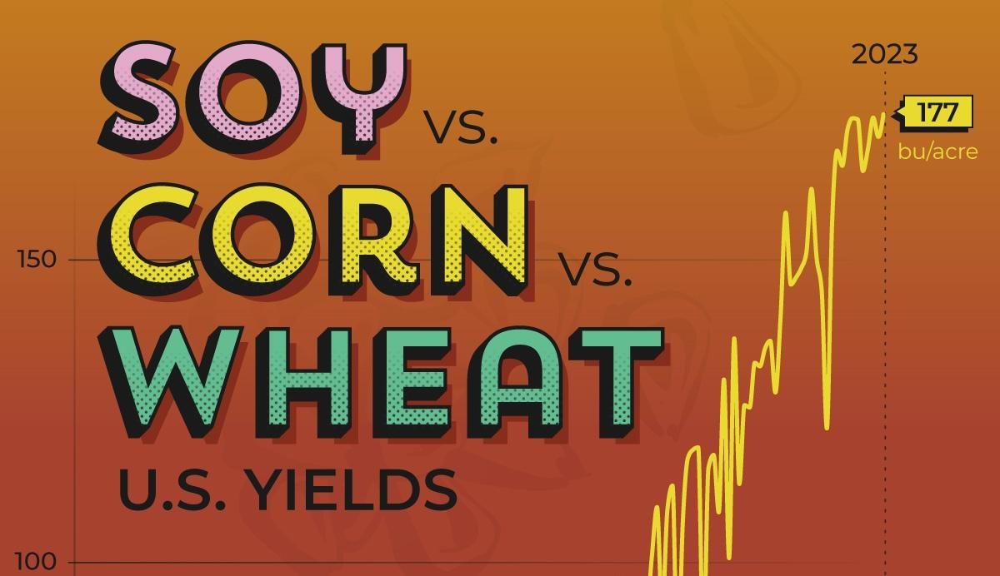

## Table of Contents

## What are the basic differences between corn, soy, and wheat as investment options?

Corn, soy, and wheat are all important crops that can be invested in, but they have some key differences. Corn is used for many things like food for people and animals, ethanol for fuel, and even in making plastics. It's grown a lot in the U.S., and its price can go up and down based on how much is grown and used. Soy, on the other hand, is mostly used for animal feed and oil. It's also important in making things like soy sauce and tofu. Soy prices can be affected by demand from places like China, where a lot of soy is imported. Wheat is mainly used to make flour for bread and pasta. Its price can change based on weather, how much is grown around the world, and changes in diets.

When thinking about investing in these crops, it's important to look at how each one is used and what affects their prices. Corn might be a good choice if you think there will be more demand for ethanol or if there are new uses for corn in industry. Soy could be a good investment if you believe demand from countries like China will keep growing or if more people start eating plant-based foods. Wheat might be a good option if you think there will be good weather for growing it or if more people around the world start eating more bread and pasta. Each crop has its own risks and opportunities, so it's good to learn about them before deciding where to invest your money.

## How do the global production levels of corn, soy, and wheat affect their investment potential?

Global production levels of corn, soy, and wheat play a big role in their investment potential. When there's a lot of corn, soy, or wheat being grown around the world, the prices of these crops might go down because there's more supply than demand. For example, if farmers in many countries have a good year and grow a lot of corn, the price of corn might drop because there's more corn than people need. On the other hand, if there's not enough of these crops being grown, maybe because of bad weather or diseases, the prices can go up because there's less supply to meet the demand.

Investors need to keep an eye on how much of these crops are being produced globally. If they think production will be high, they might wait to invest or look for other opportunities. But if they believe production will be low, they might see it as a good time to invest because prices could go up. For example, if there's a drought in a big wheat-producing country like Russia, investors might think wheat prices will rise and decide to invest in wheat. Understanding global production trends helps investors make smarter choices about when and where to put their money into these crops.

## What are the typical price volatility patterns for corn, soy, and wheat?

Corn, soy, and wheat all have different patterns when it comes to how much their prices go up and down. Corn prices can be pretty volatile, meaning they can change a lot. This is because corn is used for so many things, like food, animal feed, and making ethanol. If there's a big change in how much ethanol is needed, or if there's a problem with the corn crop, the price can swing a lot. Also, the time of year can affect corn prices because farmers usually sell a lot of corn after it's harvested, which can make prices go down.

Soy prices can also be pretty jumpy. They often go up and down based on what's happening in big countries like the U.S. and Brazil, which grow a lot of soy, and China, which buys a lot of it. If China decides to buy more or less soy, that can really move the price. Weather problems in places like Brazil can also make soy prices go up if it means there's less soy to go around. 

Wheat prices tend to be a bit less wild than corn or soy, but they still have their ups and downs. Wheat is grown all over the world, so problems in one place, like a drought in Russia, might not affect the price as much because other places can still grow wheat. But if there are big problems in a lot of places at once, wheat prices can go up. Also, changes in what people eat around the world can affect wheat prices, like if more people start eating more bread or pasta.

## How do government policies and subsidies influence the investment in corn, soy, and wheat?

Government policies and subsidies can have a big impact on how people invest in corn, soy, and wheat. When governments give money to farmers to grow these crops, it can make it cheaper for farmers to grow them. This means more corn, soy, or wheat might be grown, which can change the prices. If the government decides to pay farmers more to grow corn for making ethanol, then more farmers might start growing corn instead of soy or wheat. This can make corn prices go down because there's more corn, but it might make soy or wheat prices go up if less of those crops are being grown.

Also, government rules about how much of these crops can be traded between countries can affect prices and investments. If a country puts limits on how much soy it will import, that can make soy prices go up in that country because there's less soy to go around. On the other hand, if a government decides to let in more wheat from other countries, that can make wheat prices go down because there's more wheat available. Investors need to keep an eye on these government decisions because they can change how good of an investment corn, soy, or wheat might be.

## What are the major markets and uses for corn, soy, and wheat, and how do they impact investment returns?

Corn is used in many ways, which can affect its investment returns. It's a big part of animal feed, and it's also used to make ethanol, which is a type of fuel. People eat corn too, in things like corn chips and corn syrup. Because corn has so many uses, its price can go up if more ethanol is needed or if there's a new way to use corn in industry. But if there's too much corn grown one year, the price might go down. So, investors need to watch how much corn is being used for all these things to decide if it's a good time to invest.

Soy is mainly used for animal feed and to make oil for cooking. It's also important for making things like soy sauce and tofu, especially as more people eat plant-based foods. The biggest market for soy is often countries like China, which import a lot of it. If China decides to buy more or less soy, that can really change the price. So, investors in soy need to pay attention to what's happening in these big markets. If demand from places like China goes up, soy prices might go up too, making it a good investment. But if demand goes down, soy might not be as good of an investment.

Wheat is mostly used to make flour, which goes into bread, pasta, and other foods. Its biggest markets are where a lot of people eat these foods, like Europe and North America. The price of wheat can change based on how much is grown around the world and what people are eating. If more people start eating bread and pasta, wheat prices might go up. But if there's a lot of wheat grown one year, the price might go down. Investors in wheat need to watch these trends to decide if it's a good time to invest. If they think more people will want wheat products, it could be a good investment, but if they think there will be too much wheat, they might want to wait.

## How do weather patterns and climate change affect the yields and prices of corn, soy, and wheat?

Weather patterns and climate change can really change how much corn, soy, and wheat farmers can grow. If it's too hot or too dry, like during a drought, the crops might not grow as well, and there could be less corn, soy, or wheat. This happened in places like the U.S. Midwest, where a lot of these crops are grown. On the other hand, if there's too much rain or floods, that can also hurt the crops. Climate change makes these weather problems more likely to happen, which means farmers might not be able to count on good weather every year. This can make the amount of corn, soy, and wheat go up and down a lot from year to year.

When the weather affects how much corn, soy, and wheat are grown, it can also change their prices. If there's less of these crops because of bad weather, the prices can go up because there's not enough to meet everyone's needs. For example, if a drought in Brazil means less soy is grown, the price of soy might go up because there's less to sell. But if the weather is good and farmers can grow a lot of corn, soy, or wheat, the prices might go down because there's more than people need. Investors need to watch the weather and think about how climate change might affect these crops to decide if it's a good time to invest in them.

## What are the historical performance trends of corn, soy, and wheat as commodities?

Corn, soy, and wheat have had different ups and downs over the years. Corn prices have been pretty bumpy. They went up a lot in the early 2000s because more corn was being used to make ethanol. But then, they went down when there was too much corn grown. Soy prices have also had big changes. They went up a lot around 2007 and 2008 because countries like China were buying more soy. But then, they went down when more soy was grown in places like Brazil. Wheat prices have had their own roller coaster. They went up a lot in 2008 because of less wheat being grown and more people wanting to eat bread and pasta. But then, they went down when more wheat was grown around the world.

In the last ten years, these crops have kept having ups and downs. Corn prices went up again around 2012 because of a big drought in the U.S., but then they went down when more corn was grown. Soy prices have been affected a lot by what's happening in big countries like the U.S., Brazil, and China. If China buys more soy, the prices go up, but if they buy less, the prices go down. Wheat prices have been less wild than corn or soy, but they still go up and down. They went up in 2010 and 2011 because of bad weather in big wheat-growing countries like Russia, but then they went down when more wheat was grown.

## How can investors use futures and options to invest in corn, soy, and wheat?

Investors can use futures and options to invest in corn, soy, and wheat. Futures are agreements to buy or sell a certain amount of these crops at a set price on a future date. If an investor thinks the price of corn will go up, they can buy a futures contract now and sell it later at a higher price. But if the price goes down, they could lose money. Options give investors the right, but not the obligation, to buy or sell these crops at a set price before a certain date. This means they can choose to use the option if it's good for them, or just let it expire if it's not. Options can be a safer way to invest because they limit how much an investor can lose.

Using futures and options can help investors manage the risks of investing in corn, soy, and wheat. For example, a farmer might use futures to lock in a good price for their corn before they harvest it, so they know how much money they'll get. An investor who doesn't want to own the actual crops might use options to bet on whether the price will go up or down without having to buy the crops themselves. Both futures and options need careful planning and understanding of the market, because the prices of corn, soy, and wheat can change a lot based on things like weather, how much is grown, and what people want to buy.

## What are the key technical analysis indicators to watch for when investing in corn, soy, and wheat?

When investing in corn, soy, and wheat, some key technical analysis indicators to watch are moving averages and the Relative Strength Index (RSI). Moving averages help you see the average price of these crops over a certain time, like 50 days or 200 days. If the price goes above the moving average, it might mean the price is going up, which could be a good time to buy. If the price goes below the moving average, it might mean the price is going down, and it could be a time to sell. The RSI is another important indicator. It shows if a crop is being bought too much or sold too much. If the RSI is over 70, it might mean the crop is overbought and the price could go down soon. If it's under 30, it might mean the crop is oversold and the price could go up.

Another useful indicator is the MACD, which stands for Moving Average Convergence Divergence. This indicator helps you see if the short-term moving average is getting closer to or moving away from the long-term moving average. If the MACD line crosses above the signal line, it might be a good time to buy because it could mean the price is going up. If it crosses below the signal line, it might be a good time to sell because it could mean the price is going down. Watching these indicators can help investors make better choices about when to buy or sell corn, soy, and wheat.

## How do global trade agreements and tariffs impact the investment landscape for corn, soy, and wheat?

Global trade agreements and tariffs can really change how good of an investment corn, soy, and wheat might be. When countries agree to trade more with each other, it can make it easier for farmers to sell their crops in different places. This can make prices go up if more people want to buy the crops. But if a country puts a tariff, which is like a tax, on corn, soy, or wheat coming from another country, it can make those crops more expensive in that country. This might make prices go down in the country that's selling the crops because they can't sell as much. Investors need to watch these trade agreements and tariffs because they can change how much money they might make from their investments.

For example, if the U.S. and China make a deal to trade more soy, the price of soy might go up because China will buy more. But if China puts a big tariff on soy from the U.S., it might make U.S. soy more expensive in China, so China might buy less. This could make soy prices go down in the U.S. because there's less demand. So, investors need to pay attention to what's happening with trade between big countries like the U.S., China, and Brazil, because it can really affect the prices of corn, soy, and wheat.

## What are the emerging technologies and innovations in corn, soy, and wheat production that could affect future investments?

New technologies and innovations in farming are changing how corn, soy, and wheat are grown, which could affect future investments. One big change is the use of genetically modified (GM) crops. These crops are made to be stronger against bugs and diseases, and they can grow better in tough weather. This means farmers might be able to grow more corn, soy, or wheat even if the weather is bad. Another innovation is precision farming, where farmers use technology like drones and sensors to check their fields and use just the right amount of water and fertilizer. This can help them grow more crops and save money, which could make investing in these crops a good choice if these technologies become more common.

Another important technology is vertical farming, where crops are grown in tall buildings instead of fields. This can help grow more food in cities and use less water and land. If vertical farming becomes more popular for corn, soy, or wheat, it could change how much of these crops are grown and where. Also, new ways to turn these crops into biofuels, like corn into ethanol or soy into biodiesel, are being developed. If these new ways become cheaper and more common, it could make corn and soy more valuable because more people might want to use them for fuel. Investors need to keep an eye on these new technologies because they could make a big difference in how good of an investment corn, soy, and wheat might be in the future.

## How do ESG (Environmental, Social, and Governance) factors play into the investment decisions for corn, soy, and wheat?

[ESG](/wiki/esg-investing) factors are becoming more important when people decide to invest in corn, soy, and wheat. Environmental factors look at how farming these crops affects the planet. For example, growing corn and soy can use a lot of water and might lead to cutting down forests, especially in places like Brazil. Investors who care about the environment might choose to invest in farms that use less water and don't harm the forest. They might also like farms that use new ways to grow crops that are better for the planet, like precision farming or growing crops that need less water.

Social factors focus on how farming affects people. This includes how farm workers are treated and if the farming helps or hurts local communities. Some investors want to make sure that the farms they invest in treat their workers well and help the community by creating jobs or supporting local businesses. Governance factors are about how the farms are run and if they follow good rules and laws. Investors might look for farms that are run in a fair and open way, with good leaders who make decisions that are good for everyone. By thinking about these ESG factors, investors can choose to put their money into corn, soy, and wheat in a way that matches their values and helps make the world a better place.

## References & Further Reading

[1]: Dunsby, A., Eckel, C., Gaspar, J., & Mulholland, D. (2008). ["Commodity Investing: Maximizing Returns through Fundamental Analysis"](https://www.amazon.com/Commodity-Investing-Maximizing-Fundamental-Analysis/dp/0470223103). Wiley Finance.

[2]: Kleinman, G. (2009). ["The New Commodity Trading Guide: Breakthrough Strategies for Capturing Market Profits"](https://archive.org/details/newcommoditytrad0000klei). FT Press.

[3]: Geman, H. (2005). ["Commodities and Commodity Derivatives: Modelling and Pricing for Agriculturals, Metals, and Energy"](https://download.e-bookshelf.de/download/0000/5675/90/L-G-0000567590-0015270354.pdf). Wiley Finance.

[4]: Investopedia. ["Introduction to Commodities"](https://www.investopedia.com/investing/commodities-trading-overview/).

[5]: U.S. Department of Agriculture (USDA). ["World Agricultural Supply and Demand Estimates"](https://www.usda.gov/oce/commodity/wasde).

[6]: Food and Agriculture Organization (FAO) of the United Nations. ["FAOSTAT"](https://www.fao.org/faostat/en/).

[7]: CME Group. ["Agricultural Products"](https://www.cmegroup.com/markets/agriculture.html).

[8]: Lopez de Prado, M. (2018). ["Advances in Financial Machine Learning"](https://www.amazon.com/Advances-Financial-Machine-Learning-Marcos/dp/1119482089). Wiley.