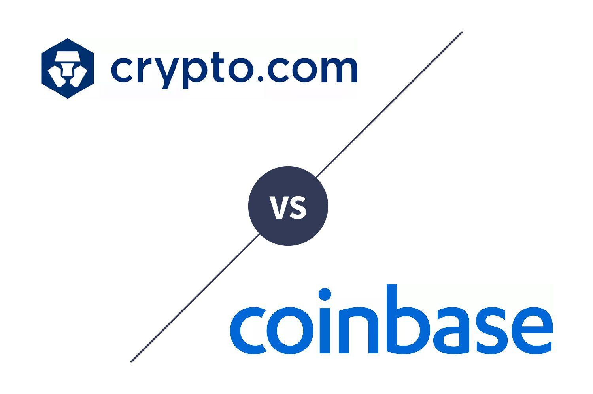

The world of cryptocurrency is ever-evolving, marked by continuous innovations and developments in digital asset trading. Numerous platforms are available to traders, each offering a unique set of features and services tailored to different trading preferences and strategies. Among these platforms, Crypto.com and Coinbase have emerged as two prominent cryptocurrency exchanges often highlighted for their distinctive offerings and user experiences.

Crypto.com and Coinbase provide traders with accessible and efficient means to engage in the cryptocurrency market. While both platforms support a wide array of cryptocurrencies and prioritize security and user-friendliness, they cater to varying needs and trader profiles. This makes them interesting choices for comparison among the myriad of exchanges available.



A rising trend in the trading world is algorithmic trading, popularly known as algo trading. This strategy involves the utilization of software and systems to automate trading processes and decisions based on predefined conditions and algorithms. Algo trading is becoming a crucial tool for traders aiming for efficiency and speed in executing complex trading strategies. Both Crypto.com and Coinbase have recognized this shift and offer tools and APIs for users interested in implementing these advanced trading techniques. 

This article examines the attributes and services provided by Crypto.com and Coinbase, emphasizing their capabilities in supporting algorithmic trading. It also discusses key factors that traders need to consider when selecting between these platforms, ultimately aiding in determining which exchange may align best with individual trading goals and needs.

## Table of Contents

## Overview of Cryptocurrency Exchanges

Cryptocurrency exchanges are digital platforms that facilitate the buying, selling, and trading of various digital currencies. These exchanges provide users with an online infrastructure to engage in cryptocurrency trade, typically through a web-based interface or a mobile application. Two notable cryptocurrency exchanges are Crypto.com and Coinbase, both lauded for their robust security measures, extensive range of supported currencies, and user-friendly interfaces.

Crypto.com and Coinbase are equipped to handle a significant number of cryptocurrency transactions securely. This security is a crucial feature given the digital and often volatile nature of cryptocurrencies. Both platforms implement advanced security protocols, including two-factor authentication (2FA) and encryption to protect users' investments and personal data. These measures reassure users that their assets are safeguarded against potential cyber threats.

In terms of currency support, Crypto.com boasts over 350 cryptocurrencies, offering a comprehensive platform for users with diverse trading preferences. This vast array of options allows traders to engage in a variety of market segments and investment strategies. Coinbase, on the other hand, supports approximately 240 cryptocurrencies but emphasizes providing a simplified and user-friendly trading experience, particularly appealing to newcomers in the [cryptocurrency](/wiki/cryptocurrency) industry.

While both exchanges facilitate crypto transactions, each has unique offerings designed to cater to different types of traders. Crypto.com's extensive list of supported currencies and additional features such as the Crypto.com Visa Card and DeFi wallet cater to traders looking for broad market access and [earning](/wiki/earning-announcement) opportunities. Conversely, Coinbase is especially noted for its accessibility and intuitive design, making it an excellent choice for novice traders who prioritize ease of use and educational resources.

In conclusion, Crypto.com and Coinbase exemplify the variety present in cryptocurrency exchanges, each offering unique advantages and features that cater to specific user needs and preferences. Whether a user values a broader currency selection or seeks an interface that simplifies the trading process, these platforms provide robust solutions for engaging in cryptocurrency trading.

## Crypto.com: Key Features

Crypto.com is a versatile cryptocurrency exchange offering an expansive selection of over 350 digital currencies. This makes it an attractive platform for traders looking for variety in their trading activities. A significant aspect that sets Crypto.com apart from other exchanges is its competitive fee structure, which tends to favor low-[volume](/wiki/volume-trading-strategy) traders. The platform operates on a maker-taker fee model, where the fees are generally lower compared to many of its competitors, thus making it cost-effective for those who trade smaller volumes.

One of the standout features of Crypto.com is its array of innovative financial products that provide users unique opportunities to earn rewards. A notable example is the Crypto.com Visa Card, a prepaid card that allows users to spend their crypto assets directly. This card offers several benefits, including cashback rewards on purchases, making it an appealing option for those who wish to integrate cryptocurrency spending into their daily financial activities.

Additionally, Crypto.com offers a Decentralized Finance (DeFi) wallet, which enables users to manage their funds while maintaining control over their private keys. This feature aligns with the self-custody ethos prevalent in the cryptocurrency community, ensuring enhanced security and autonomy for users. The DeFi wallet also provides the opportunity to earn interest on various crypto assets, adding another layer of reward potential for users.

Crypto.com's robust ecosystem is designed to cater to a wide range of users, from novice traders to seasoned crypto enthusiasts, providing an array of features that support diverse trading needs and investment strategies.

## Coinbase: Key Features

Coinbase is a widely recognized cryptocurrency exchange platform, supporting a broad range of over 240 cryptocurrencies. This extensive selection provides users with the opportunity to engage in various digital currency transactions and to diversify their investment portfolios. One of the standout features of Coinbase is its user-friendly interface, which significantly contributes to its reputation as an accessible platform, particularly for novice traders. The intuitive design simplifies the process of buying, selling, and trading cryptocurrencies, making it an ideal choice for beginners eager to navigate the complexities of crypto trading.

In addition to the straightforward user interface, Coinbase offers comprehensive educational resources designed to enhance user knowledge about cryptocurrencies and trading strategies. These education programs empower users by equipping them with the necessary skills and information to make informed trading decisions. Educational content varies from basic tutorials aimed at understanding cryptocurrencies to more advanced topics covering trading strategies and market trends.

Coinbase also provides a Visa debit card that links directly to a user's crypto account. This card enables the user to conduct transactions using their cryptocurrency holdings, offering the convenience of converting crypto to fiat currency in real-time. Purchases made with the Coinbase Visa card earn users crypto rewards, which further incentivizes the use of the platform for everyday transactions.

Security is a top priority for Coinbase, evident in its provision of a secure digital wallet service. This wallet offers users the ability to safely store their digital assets while maintaining full control over their private keys. Advanced security protocols are implemented to protect user funds, including multi-signature technology and biometric access controls, ensuring that the digital assets remain secure from theft and unauthorized access.

## Algorithmic Trading on Crypto.com and Coinbase

Algorithmic trading, commonly known as algo trading, plays an integral role in modern financial markets, including cryptocurrency exchanges such as Crypto.com and Coinbase. Algo trading uses computer algorithms to [carry](/wiki/carry-trading) out trading decisions based on pre-set parameters. This approach allows for rapid execution and can act on even the most minute market fluctuations, enhancing the efficiency and potential profitability of trading strategies.

Both Crypto.com and Coinbase equip users with Application Programming Interfaces (APIs) and other tools necessary for implementing [algorithmic trading](/wiki/algorithmic-trading) strategies. APIs serve as gateways between the user's trading software and the exchange, enabling automated interaction with the exchange's trading platform.

### Crypto.com's Algorithmic Trading Capabilities

Crypto.com's API allows users to automate their trading strategies efficiently by offering features such as real-time market data retrieval, account management, and order execution. The APIs are designed to handle high-frequency trading ([HFT](/wiki/high-frequency-trading-strategies)) and complex algorithms which require quick access to market data and rapid execution capabilities.

The API documentation provided by Crypto.com includes endpoints for retrieving historical market data, which can be invaluable for [backtesting](/wiki/backtesting) trading strategies. Backtesting is a method used to see how a trading strategy would have performed in the past, by running it against historical data. Exploring past data helps traders optimize their strategies before applying them in real-time.

### Coinbase's Algorithmic Trading Tools

Coinbase offers a comprehensive set of APIs for algorithmic trading, catering to various needs ranging from simple automated buys and sells to more intricate trading strategies. Their API provides access to real-time market data, account information, and order placement.

For example, a Python script utilizing the Coinbase API might look like this for placing an order:

```python
import cbpro

client = cbpro.AuthenticatedClient('your_key', 'your_secret', 'your_passphrase')

# Place a market order to buy 1 Bitcoin
order = client.place_market_order(product_id='BTC-USD', 
                                  side='buy', 
                                  size=1)

print(order)
```

Coinbase's API supports various order types, including limit and stop orders, which are essential for executing sophisticated trading strategies tailored to market conditions.

### Benefits and Efficiency of Algo Trading

Algorithmic trading on Crypto.com and Coinbase helps traders execute complex strategies with precision and speed unreachable by manual trading. Strategies like [arbitrage](/wiki/arbitrage), [market making](/wiki/market-making), and [trend following](/wiki/trend-following) can be automated, allowing traders to capitalize on fleeting market opportunities with minimal latency.

In summary, both Crypto.com and Coinbase provide robust tools for algorithmic trading, making them suitable choices for traders who want to leverage automation to enhance their trading efficiency and performance. Whether through high-frequency trading or long-term strategy implementation, algo trading offers significant potential advantages in the competitive landscape of cryptocurrency trading.

## Comparison: Fees and Security

Crypto.com and Coinbase both provide competitive fee structures and robust security measures, but they differ in their offerings. Crypto.com utilizes a maker-taker fee model, which is often simpler and cheaper compared to Coinbase, particularly for small-volume traders. This model typically rewards [liquidity](/wiki/liquidity-risk-premium) providers, or "makers," with lower fees compared to those incurred by "takers," who consume liquidity. For example, Crypto.com's trading fees start at approximately 0.10% for both makers and takers, and can further decrease depending on trading volume or CRO (Crypto.com Coin) staking levels. In contrast, Coinbase employs a variable fee structure that can range significantly higher, especially for retail investors engaging in smaller transactions.

Security is a top priority for both platforms. They implement several measures to protect user assets and data. Crypto.com and Coinbase employ two-step verification, which requires users to authenticate their login attempts using an additional method, such as a text message or authenticator app, beyond just a password. Additionally, they provide insurance to cover possible thefts or breaches, enhancing user confidence in the security of their platforms.

Considering the impact of fees on profitability, traders must evaluate their trading volume. For high-frequency, low-volume traders, Crypto.com's lower fees could result in substantial savings over time. Conversely, traders focusing on ease of use and educational resources may find the higher fees on Coinbase justified by its comprehensive interface and support.

In conclusion, while both Crypto.com and Coinbase emphasize security and offer distinctive fee models, the choice between the two should be aligned with a trader's specific volume and priorities.

## User Experience and Accessibility

Crypto.com and Coinbase are both lauded for their user-friendly interfaces that cater to a broad range of traders. Both platforms offer web and mobile applications ensuring users have access to their trading accounts anytime and anywhere. The mobile apps are particularly noteworthy, as they allow users to monitor real-time market data, execute trades, and manage portfolios efficiently.

Crypto.com's app is highly versatile and packed with features. It is designed to support mobile users with functionalities that extend beyond basic trading. Users can access their DeFi wallets, earn rewards through staking, and even apply for the Crypto.com Visa Card directly from the app. This integration offers a seamless experience for users who rely heavily on mobile devices for their trading activities. The app's intuitive design allows users to transition smoothly between different features, enhancing the overall trading experience for mobile-centric traders.

Conversely, Coinbase is renowned for its simplistic and intuitive interface that appeals particularly to beginners. The platform simplifies the complexities of cryptocurrency trading through its educational resources and easy-to-understand interface. Coinbase’s design focuses on making the onboarding process straightforward for new users. Its dashboard is minimalistic, offering essential data and information without overwhelming a novice trader. This is complemented by educational tools and resources provided within the app to guide beginners through the nuances of trading, making it a suitable choice for those new to cryptocurrency.

Global accessibility is a crucial [factor](/wiki/factor-investing) for traders choosing a platform, and there is a slight difference between Crypto.com and Coinbase. Crypto.com generally offers a broader reach in terms of geographic availability, supporting a larger number of countries compared to Coinbase. This extensive reach can be advantageous for users residing in regions where Coinbase might have limitations. Although both platforms cover key markets globally, users must verify the availability of services in their specific region before committing to a platform.

In summary, while Crypto.com and Coinbase both offer seamless user experiences, Crypto.com is better suited for users looking for a mobile-focused experience and diverse functionalities, especially in regions where availability is broader. Meanwhile, Coinbase’s straightforward design and educational resources make it preferable for beginners.

## Conclusion: Choosing Between Crypto.com and Coinbase

The decision between Crypto.com and Coinbase ultimately hinges on individual preferences and specific trading requirements. Crypto.com is frequently preferred by traders who prioritize lower fees, an extensive selection of cryptocurrencies, and various opportunities to earn rewards. Its competitive fee structure, especially for low-volume traders, and the availability of over 350 cryptocurrencies make it attractive to those seeking a comprehensive trading platform.

In contrast, Coinbase is often chosen by individuals who value simplicity, educational resources, and a user-friendly interface. With support for over 240 cryptocurrencies, Coinbase is renowned for its intuitive design, making it particularly appealing to beginners in crypto trading. Its focus on education helps novice traders understand the complexities of cryptocurrency markets.

When selecting between these platforms, traders must assess their own trading goals and needs. Factors such as desired fee structure, range of supported cryptocurrencies, and the importance of educational tools should be considered. By aligning platform features with personal trading objectives, users can make an informed decision on the most suitable exchange.

## References & Further Reading

[1]: Bergstra, J., Bardenet, R., Bengio, Y., & Kégl, B. (2011). ["Algorithms for Hyper-Parameter Optimization."](https://papers.nips.cc/paper/4443-algorithms-for-hyper-parameter-optimization) Advances in Neural Information Processing Systems 24.

[2]: ["Advances in Financial Machine Learning"](https://www.amazon.com/Advances-Financial-Machine-Learning-Marcos/dp/1119482089) by Marcos Lopez de Prado

[3]: ["Evidence-Based Technical Analysis: Applying the Scientific Method and Statistical Inference to Trading Signals"](https://www.amazon.com/Evidence-Based-Technical-Analysis-Scientific-Statistical/dp/0470008741) by David Aronson

[4]: ["Machine Learning for Algorithmic Trading"](https://github.com/stefan-jansen/machine-learning-for-trading) by Stefan Jansen

[5]: ["Quantitative Trading: How to Build Your Own Algorithmic Trading Business"](https://www.amazon.com/Quantitative-Trading-Build-Algorithmic-Business/dp/1119800064) by Ernest P. Chan