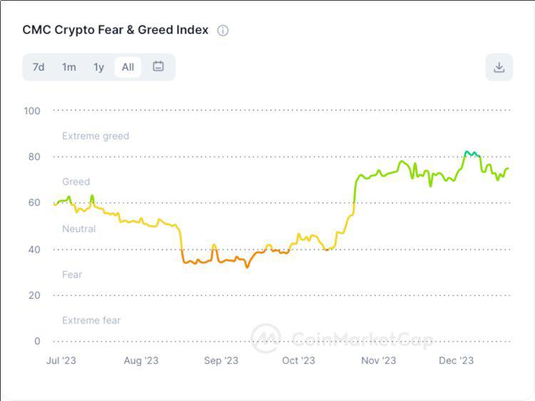

## Table of Contents

## What is a cryptocurrency price tracker?

A cryptocurrency price tracker is a tool that helps you keep an eye on the prices of different cryptocurrencies. It shows you how much each cryptocurrency is worth in real-time, so you can see if the prices are going up or down. This can be really helpful if you are thinking about buying or selling cryptocurrencies, because it lets you make decisions based on the latest information.

These trackers can be found as websites, apps on your phone, or even as part of other financial tools. They usually let you add your favorite cryptocurrencies to a list, so you can watch them all in one place. Some trackers also give you extra information like charts and news, which can help you understand why the prices are changing.

## Why is it important to track cryptocurrency prices?

Tracking cryptocurrency prices is important because the value of cryptocurrencies can change a lot in a short time. If you own cryptocurrencies, knowing their current price helps you decide if it's a good time to sell them or if you should wait for the price to go up. For example, if the price of a cryptocurrency you own suddenly goes up a lot, you might want to sell it to make a profit. On the other hand, if the price goes down, you might decide to buy more if you think it will go back up later.

Also, if you are thinking about buying cryptocurrencies, tracking their prices can help you find the best time to buy. By watching the prices, you can see when they are low and might be a good deal. This way, you can buy when the price is lower and hopefully sell later when the price is higher. Keeping an eye on cryptocurrency prices helps you make smarter choices about when to buy and sell, which can save you money and help you make more money too.

## What are the basic features to look for in a cryptocurrency price tracker?

When looking for a cryptocurrency price tracker, it's important to find one that shows real-time prices. This means the tracker updates the prices as they change, so you always know the latest value of your cryptocurrencies. Another key feature to look for is the ability to add your favorite cryptocurrencies to a watchlist. This way, you can easily keep track of the ones you care about most without having to search for them every time.

It's also helpful if the tracker includes charts and graphs. These can show you how the prices have changed over time, which can help you understand trends and make better decisions. Some trackers also give you news updates about the cryptocurrencies you're watching. This can be useful because news can affect prices, and knowing what's happening can help you predict where the prices might go next.

## How do different cryptocurrency price trackers compare in terms of user interface?

Different cryptocurrency price trackers can have very different user interfaces. Some trackers are designed to be simple and easy to use. They have a clean look with big buttons and clear labels, so it's easy to find what you're looking for. These trackers are great for people who just want to quickly check prices without any fuss. For example, apps like CoinMarketCap and CoinGecko have simple designs that make it easy to see the latest prices and add cryptocurrencies to your watchlist.

On the other hand, some trackers have more complex interfaces with lots of features. These trackers might have lots of charts, graphs, and other tools that can help you analyze prices in more detail. They can be a bit harder to use at first, but they can be very helpful if you want to understand the market better. Trackers like TradingView and CryptoCompare fall into this category, offering advanced features that can be useful for more experienced users who want to dive deeper into the data.

Overall, the best tracker for you depends on what you need. If you just want to check prices quickly, a simple tracker with a user-friendly interface might be best. But if you want to do more detailed analysis, a more complex tracker with lots of features might be worth learning to use.

## What are the most popular cryptocurrency price trackers available today?

Some of the most popular cryptocurrency price trackers today are CoinMarketCap, CoinGecko, and TradingView. CoinMarketCap is well-known for its easy-to-use interface and real-time price updates. It lets you see prices for lots of different cryptocurrencies and add them to a watchlist. CoinGecko is similar but also gives you more information like news and charts. It's great if you want to understand why prices are changing. TradingView is popular among people who like to look at detailed charts and graphs. It has a lot of tools that can help you see how prices have changed over time.

Another popular tracker is CryptoCompare. It has a mix of simple and advanced features, so it can be good for both new and experienced users. You can see prices, add cryptocurrencies to your watchlist, and look at charts. Blockfolio is another tracker that many people like because it's easy to use and also lets you keep track of your own cryptocurrency investments. It's great if you want to see how much your cryptocurrencies are worth all in one place. These trackers are all popular because they help people stay up-to-date with cryptocurrency prices and make smart decisions about buying and selling.

## How do the data sources and accuracy of different trackers vary?

Different cryptocurrency price trackers get their information from different places. Some trackers, like CoinMarketCap, use data from lots of different exchanges all over the world. This means they can show you the average price of a cryptocurrency, which can be more accurate. Other trackers might only use data from a few big exchanges, which can make their prices a bit different. For example, CoinGecko uses data from many exchanges too, but it also looks at other things like news and social media to help make its prices more accurate.

The accuracy of the prices can change from one tracker to another. Trackers that use data from more exchanges usually have more accurate prices because they can see how the price is changing in different places. But even the best trackers can have small differences in their prices because the cryptocurrency market can be a bit messy. It's a good idea to look at a few different trackers to get a good idea of what the price really is. This way, you can be more sure about the price before you decide to buy or sell.

## What advanced features do some cryptocurrency price trackers offer?

Some cryptocurrency price trackers have advanced features that can help you understand the market better. For example, TradingView offers detailed charts and technical analysis tools. These tools let you see how prices have changed over time and help you predict where they might go next. You can draw lines on the charts, add indicators like moving averages, and even set up alerts to notify you when prices hit certain levels. This can be really helpful if you want to make smart decisions about buying and selling cryptocurrencies.

Another advanced feature you might find is portfolio tracking, which is offered by trackers like Blockfolio and Delta. These tools let you add your own cryptocurrencies and see how much they are worth all together. They can also show you how much money you've made or lost over time. Some trackers even let you connect to your exchange accounts so they can update your portfolio automatically. This makes it easier to keep track of your investments and see how they are doing without having to do a lot of work.

## How do cryptocurrency price trackers integrate with other financial tools and platforms?

Cryptocurrency price trackers often work well with other financial tools and platforms. For example, some trackers like Blockfolio and Delta let you connect to your exchange accounts. This means they can automatically update your portfolio with the latest prices and show you how much your cryptocurrencies are worth. They can also show you how much money you've made or lost over time. This makes it easier to keep track of your investments without having to do a lot of work.

Other trackers, like TradingView, can be used with trading platforms. You can set up alerts on TradingView to tell you when prices hit certain levels, and then use those alerts to make trades on your trading platform. Some trackers also have APIs, which are special tools that let other programs use their data. This means you can use the price data from a tracker in your own programs or other financial tools to help you make better decisions about buying and selling cryptocurrencies.

## What are the costs associated with using different cryptocurrency price trackers?

Many cryptocurrency price trackers are free to use. For example, CoinMarketCap and CoinGecko let you check prices, add cryptocurrencies to your watchlist, and look at charts without paying any money. These free versions are great if you just want to keep an eye on prices and don't need any extra features. But some of these trackers also have paid plans that give you more features, like advanced charts or the ability to connect to your exchange accounts. These paid plans can cost a few dollars a month, depending on what you need.

Other trackers, like TradingView and some portfolio trackers, might have more costs. TradingView has a free version, but if you want to use all of its advanced charting tools and set up more alerts, you'll need to pay for a subscription. The cost can be anywhere from a few dollars to over twenty dollars a month, depending on what plan you choose. Portfolio trackers like Blockfolio and Delta also have free versions, but if you want to connect to your exchange accounts and get more detailed reports, you might need to pay for a premium plan. These plans can cost a few dollars a month too.

## How do the security and privacy policies of different trackers compare?

Different cryptocurrency price trackers have different rules about keeping your information safe and private. Some trackers, like CoinMarketCap and CoinGecko, don't need you to sign up to use their basic features. This means they don't collect a lot of personal information about you. They might use cookies to remember what you like, but they don't ask for your name or email. If you do sign up for a premium account, they might ask for more information, but they usually have strong rules to keep it safe. They use things like encryption to make sure no one else can see your data.

Other trackers, like TradingView and some portfolio trackers, might need you to sign up to use all their features. When you sign up, you have to give them more personal information, like your email address or even your phone number. These trackers usually have good security measures in place, like two-factor authentication, which makes it harder for someone to get into your account without your permission. They also have privacy policies that explain how they use your information and who they might share it with. It's a good idea to read these policies to understand what they do with your data.

## What are the mobile and desktop compatibility options for various trackers?

Many cryptocurrency price trackers work well on both mobile phones and computers. CoinMarketCap and CoinGecko have apps you can download on your phone, so you can check prices and watchlists wherever you go. They also have websites that you can use on your computer, which is good if you want to see more details or use a bigger screen. These trackers are easy to use on both types of devices, so you can pick what works best for you.

Some trackers, like TradingView, are better on computers because they have a lot of advanced features that are easier to use on a bigger screen. You can still use TradingView on your phone, but it might be a bit harder to see everything. Other trackers, like Blockfolio and Delta, have apps that are made for mobile phones. They let you keep track of your investments on the go, but they also have websites you can use on your computer if you need to. So, depending on what you need, you can find a tracker that works well on either your phone or your computer, or both.

## How do cryptocurrency price trackers cater to the needs of expert traders and investors?

Cryptocurrency price trackers help expert traders and investors by giving them lots of detailed information and tools. Trackers like TradingView have advanced charts and technical analysis tools that let traders see how prices have changed over time. They can use these charts to find patterns and make predictions about where prices might go next. Expert traders can also set up alerts to tell them when prices hit certain levels, so they can make quick decisions about buying or selling. This is really helpful because the cryptocurrency market can change a lot in a short time.

Some trackers also let expert traders connect to their exchange accounts. This means the tracker can show them how much their cryptocurrencies are worth all together and how much money they've made or lost. Trackers like Blockfolio and Delta do this, and they also have features that let traders see detailed reports about their investments. This helps expert traders keep track of everything in one place and make smart choices about what to do next. By using these advanced features, expert traders can stay on top of the market and make the best decisions possible.

## References & Further Reading

[1]: ["Advances in Financial Machine Learning"](https://www.amazon.com/Advances-Financial-Machine-Learning-Marcos/dp/1119482089) by Marcos Lopez de Prado

[2]: ["Evidence-Based Technical Analysis: Applying the Scientific Method and Statistical Inference to Trading Signals"](https://www.amazon.com/Evidence-Based-Technical-Analysis-Scientific-Statistical/dp/0470008741) by David Aronson

[3]: ["Machine Learning for Algorithmic Trading"](https://github.com/stefan-jansen/machine-learning-for-trading) by Stefan Jansen

[4]: ["Quantitative Trading: How to Build Your Own Algorithmic Trading Business"](https://www.amazon.com/Quantitative-Trading-Build-Algorithmic-Business/dp/1119800064) by Ernest P. Chan

[5]: ["Cryptocurrency Trading & Investing: Beginners Guide To Trading & Investing in Bitcoin, Alt Coins & ICOs"](https://www.amazon.com/Cryptocurrency-Trading-Investing-Beginners-Bitcoin/dp/1977924530) by Aimee Vo

[6]: Nakamoto, S. (2008). ["Bitcoin: A Peer-to-Peer Electronic Cash System."](https://nakamotoinstitute.org/library/bitcoin/) Bitcoin.org.