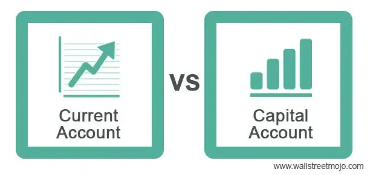

The integration of the balance of payments (BOP), current account, and capital account into algorithmic trading opens new avenues for financial innovation and strategy development. These financial components are pivotal in understanding and reacting to global market dynamics. The balance of payments is a significant economic metric, encompassing a country's total transactions with the rest of the world, divided primarily into the current account and capital account. For traders and financial analysts, comprehending the interplay between these accounts is crucial for leveraging macroeconomic indicators that inform and refine trading algorithms.

Algorithmic trading has transformed the landscape of global financial markets by employing sophisticated computer systems to execute vast numbers of transactions at lightning speeds. The data housed within the BOP can greatly enhance algorithmic trading by offering insights into market trends and potential fluctuations. By interpreting data from the current account, which encapsulates the trade balance, income from abroad, and net current transfers, as well as the capital account, which monitors changes in asset ownership, traders can develop strategies that are not only robust but also predictive.



These economic indicators, when integrated into trading algorithms, can significantly impact market predictions and trading strategies. The current account provides a window into the country's economic health, often influencing exchange rates, while the capital account can foretell shifts in investments and capital flows. By analyzing these trends, algorithmic models can be fine-tuned to predict and respond to market movements, offering a competitive edge in trading operations. This article provides an analytical perspective on how integrating BOP data can optimize trading strategies and influence financial market practices.

## Table of Contents

## Understanding the Balance of Payments

The balance of payments (BOP) serves as a comprehensive representation of all economic transactions between residents of a nation and the rest of the world over a specific time period, typically a quarter or a year. It is a vital indicator of a country's external economic standing and is closely scrutinized by policymakers, economists, and investors. 

Comprising two main components—the current account and the capital account—the BOP offers significant insights into a nation's economic health. The current account provides a detailed overview of a nation's trade balance, net income from abroad, and net current transfers. This includes exports and imports of goods and services, earnings on foreign investments, and cash transfers such as remittances. For instance, a surplus in the current account indicates that a country is a net lender to the rest of the world, while a deficit suggests the opposite.

On the other hand, the capital account details the changes in a country's ownership of assets. This includes foreign direct investment (FDI), portfolio investments, and other financial capital flows. A positive balance in the capital account suggests an influx of foreign investment, while a negative balance indicates capital outflow to foreign markets.

BOP data is crucial for policymakers as it provides essential insights into the economic activities affecting the domestic currency's exchange rate, the level of foreign reserves, and the feasibility of external debts. Understanding these elements helps in crafting policies that stabilize the economy, maintain a healthy foreign exchange reserve, and attract foreign investments. Additionally, investors and financial analysts utilize BOP [statistics](/wiki/bayesian-statistics) to predict currency movements, make informed investment decisions, and understand broader market dynamics. 

The interplay between the current account and the capital account ensures that the BOP remains balanced in theory, as any deficit or surplus in the current account is typically offset by the capital account, ensuring that the combined balance equals zero. This is expressed in the identity:

$$
\text{Current Account Balance} + \text{Capital Account Balance} + \text{Financial Account Balance} = 0
$$

In practice, the actual realized BOP may show discrepancies due to statistical errors or unrecorded transactions. These 'errors and omissions' are often included as a separate balancing item to ensure the accounts line up.

Ultimately, the balance of payments provides a significant framework for understanding the economic interactions of a country within the global landscape, influencing decisions ranging from everyday trade policies to long-term foreign direct investments.

## Algorithmic Trading Explained

Algorithmic trading utilizes sophisticated computer programs to automate and execute financial transactions with remarkable speed. These programs rely on mathematical models and algorithms that allow traders to capitalize on market inefficiencies and make numerous transactions in fractions of a second. One of the major advantages of [algorithmic trading](/wiki/algorithmic-trading) is its ability to perform trades at high velocity, thereby capturing market opportunities that may be missed by slower, manual trading methods.

The impact of algorithmic trading extends beyond speed. By minimizing the likelihood of human error, algorithmic systems enhance the precision and reliability of trading operations. These systems can simultaneously process a multitude of complex trading strategies, thereby offering flexibility and the capacity to navigate multiple market scenarios. The ability to implement intricate trading strategies without the limitations of human bandwidth allows traders to explore diversified trading models, including statistical [arbitrage](/wiki/arbitrage), [market making](/wiki/market-making), and high-frequency trading.

Algorithmic trading has become increasingly prevalent in global markets. According to various estimates, a significant portion of trading volumes in major stock exchanges are now attributed to algorithmic trading strategies.[^1] This shift towards automation in trading processes is driven by the need for efficiency, cost-effectiveness, and the capability to swiftly respond to market movements.

In modern finance, algorithmic trading plays a crucial role in facilitating efficient market operations. Its capacity to digest vast quantities of market data and convert it into actionable insights exemplifies its importance in current market dynamics. Markets benefit from enhanced [liquidity](/wiki/liquidity-risk-premium) and tighter spreads, making trading more attractive for different market participants ranging from individual investors to large financial institutions.

Overall, algorithmic trading represents a paradigm shift in trading operations, emphasizing speed, precision, and efficiency. As technology continues to evolve, so too will the capabilities and applications of algorithmic trading in the financial industry.

[^1]: Hendershott, T., Jones, C. M., & Menkveld, A. J. (2011). Does Algorithmic Trading Improve Liquidity? Journal of Finance, 66(1), 1-33.

## The Link Between BOP and Algorithmic Trading

The integration of balance of payments (BOP) data into algorithmic trading is crucial for understanding and predicting movements in foreign exchange ([forex](/wiki/forex-system)) and global equities markets. The dynamic interaction between these components allows traders to develop more refined and precise strategies. The BOP, encompassing a nation’s trade balance, net international income, and direct investments, serves as a rich repository of economic indicators that can be instrumental in shaping trading algorithms.

Algorithmic trading strategies benefit from the predictive modeling capabilities provided by BOP data. By analyzing historical and real-time economic trends encapsulated in the BOP, algorithms can forecast currency fluctuations and identify macroeconomic conditions that might signal market changes. This involves employing statistical techniques like time-series analysis, regression models, and [machine learning](/wiki/machine-learning) algorithms to predict potential movements in exchange rates. For instance, a sudden increase in a country's trade surplus, reflected in the BOP, might indicate a strengthening of its currency, thereby guiding forex trading strategies.

Incorporating BOP data into algorithmic models also challenges traders with the complexity of data management. The vast and heterogeneous data sets need to be processed and interpreted accurately and efficiently. Traders must ensure the timeliness and reliability of this data to make informed trading decisions. This necessitates sophisticated data analytics infrastructure capable of handling large volumes of data with low latency.

To tackle these challenges, traders may employ modern data processing tools and platforms. For instance, leveraging cloud computing services or using distributed computing frameworks like Apache Hadoop or Spark can manage and analyze data at scale. Developing predictive models that integrate BOP data requires expertise in data science and quantitative finance. Using Python, a preferred language due to its ecosystem rich in data analysis and machine learning libraries, traders can build and test their models efficiently. Here's an example of a simple predictive model using Python’s pandas and scikit-learn libraries:

```python
import pandas as pd
from sklearn.model_selection import train_test_split
from sklearn.linear_model import LinearRegression

# Load BOP dataset
data = pd.read_csv('bop_data.csv')

# Define features and target
features = data[['trade_balance', 'net_income', 'capital_account']]
target = data['exchange_rate']

# Split the data into training and testing sets
X_train, X_test, y_train, y_test = train_test_split(features, target, test_size=0.2, random_state=42)

# Initialize and train the model
model = LinearRegression()
model.fit(X_train, y_train)

# Predict using the test set
predictions = model.predict(X_test)

# Evaluate the model
print(f'Model Coefficients: {model.coef_}')
print(f'Model Intercept: {model.intercept_}')
```

In summary, leveraging BOP data within algorithmic trading frameworks enhances predictive power and strategic insights into the forex and equities markets. While the potential for improved market predictions and trading efficiency is significant, traders must navigate the complexities of data management and ensure access to timely and accurate economic data.

## Impacts and Implications

Integrating balance of payments (BOP) data into algorithmic trading systems creates significant opportunities for efficiency and improved price discovery. By leveraging comprehensive financial transaction data, traders can make more informed decisions, enhancing their ability to predict market movements and adapt their strategies accordingly.

The incorporation of BOP data into trading algorithms can augment predictive capabilities. This data set includes key indicators such as trade balances, foreign investments, and cross-border financial flows, offering a granular view of economic activity. Enhanced predictions can be achieved by modeling these variables to forecast currency fluctuations, enabling traders to adapt quickly to changing economic conditions and improve their strategic positioning.

Additionally, utilizing BOP data in algorithmic frameworks contributes to risk mitigation and liquidity enhancement. Accurate predictions of market conditions reduce exposure to adverse movements, allowing for more stable trading environments. Increased liquidity results from well-informed trades that align with actual economic conditions, promoting more efficient markets. However, these advancements also introduce the challenge of managing vast quantities of data, necessitating sophisticated processing techniques and timely access to relevant information.

The fusion of BOP data with algorithmic trading also presents regulatory implications. The increased complexity and potential for market influence require robust regulatory frameworks to prevent manipulation and ensure fair trading practices. Existing regulations may need adaptation to address these new dynamics, focusing on transparency and accountability to maintain market integrity.

Looking ahead, the integration of [artificial intelligence](/wiki/ai-artificial-intelligence) (AI) and quantum computing presents transformative opportunities for algorithmic trading strategies. AI-driven models can analyze extensive datasets, identifying complex patterns and insights that human analysts might overlook. Quantum computing, with its capability to process vast amounts of information quickly, could further enhance precision in trading decisions. The future of trading strategies is likely to see increased innovation, with technology playing a pivotal role in harnessing economic data for strategic advantage. 

By embracing these technologies, traders can leverage BOP insights more effectively, driving innovations in the financial markets and contributing to a more robust and equitable global economy.

## Conclusion

The comprehensive understanding of the Balance of Payments (BOP) and its integration into algorithmic trading offers strategic advantages that can significantly optimize trading practices. As algorithmic trading continues to dominate financial markets, opportunities arise in leveraging BOP data to enhance predictive models. By accurately forecasting economic trends, traders can improve decision-making processes and develop more robust trading strategies. This data-driven approach allows for greater precision in predicting market dynamics, such as currency fluctuations, providing a competitive edge in financial markets.

Nevertheless, challenges persist, particularly in data analysis and regulation. Extracting actionable insights from the vast and complex BOP data requires sophisticated analytical tools and methodologies. The need for timely and accurate data is paramount, as delays or inaccuracies can lead to suboptimal trading outcomes. Furthermore, the evolving regulatory landscape poses additional obstacles, necessitating compliance with diverse financial regulations to prevent market manipulation and ensure transparency.

Looking to the future, advancements in technology and finance promise more robust methodologies, fostering a more equitable and efficient global financial market. The convergence of artificial intelligence, machine learning, and quantum computing presents opportunities for innovation in trading strategies. These technologies can enhance the predictive capabilities of algorithmic trading systems, allowing for more precise market predictions and improved risk management. The ongoing research and development efforts in integrating economic principles with trading technologies are crucial to fully harness these opportunities, paving the way for a more sophisticated and effective financial ecosystem.

## References & Further Reading

[1]: Hendershott, T., Jones, C. M., & Menkveld, A. J. (2011). ["Does Algorithmic Trading Improve Liquidity?"](https://onlinelibrary.wiley.com/doi/full/10.1111/j.1540-6261.2010.01624.x) Journal of Finance, 66(1), 1-33.

[2]: Lane, P. R., & Milesi-Ferretti, G. M. (2007). ["The External Wealth of Nations Mark II: Revised and Extended Estimates of Foreign Assets and Liabilities, 1970–2004."](https://www.sciencedirect.com/science/article/pii/S0022199607000591) Journal of International Economics, 73(2), 223-250.

[3]: Lopez de Prado, M. (2018). ["Advances in Financial Machine Learning."](https://www.amazon.com/Advances-Financial-Machine-Learning-Marcos/dp/1119482089) Hoboken, NJ: Wiley.

[4]: Aronson, D. R. (2006). ["Evidence-Based Technical Analysis: Applying the Scientific Method and Statistical Inference to Trading Signals."](https://www.amazon.com/Evidence-Based-Technical-Analysis-Scientific-Statistical/dp/0470008741) Hoboken, NJ: John Wiley & Sons.

[5]: Bodie, Z., Kane, A., & Marcus, A. J. (2013). ["Investments."](https://www.amazon.com/Investments-Zvi-Bodie/dp/1260013839) 10th Edition. McGraw-Hill Education.

[6]: "International Financial Statistics" by the International Monetary Fund provides comprehensive data on the external financial situation of member countries, crucial for BOP analysis.

[7]: Chan, E. P. (2008). ["Quantitative Trading: How to Build Your Own Algorithmic Trading Business."](https://github.com/justinchou/books-quantitative-trading) Hoboken, NJ: Wiley.