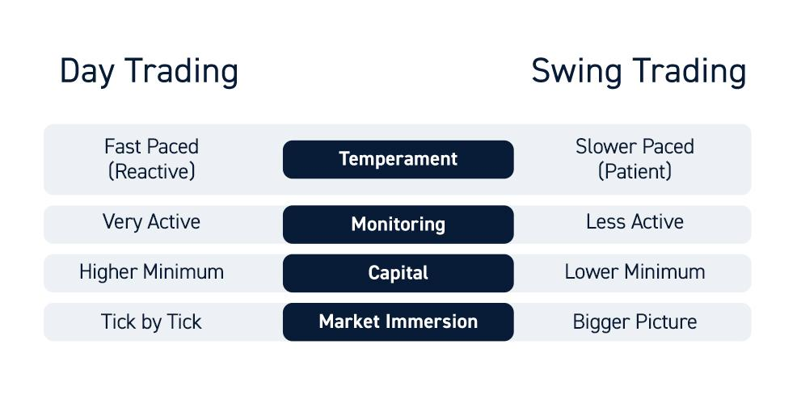

In the world of financial markets, traders employ various strategies to align with their specific investment objectives and risk appetites. Among the most popular of these strategies are swing trading, day trading, and algorithmic trading. Each of these methodologies offers distinct approaches, tools, and skill requirements, catering to the diverse needs and expertise levels of traders.

Swing trading is a medium-term approach that aims to capitalize on price swings over several days to weeks. This strategy leverages market volatility, making it suitable for those who cannot constantly monitor market movements but still wish to engage actively in trading. It blends elements of long-term investment with short-term trading, relying heavily on technical analysis and indicators to make informed decisions.



Day trading, in contrast, is characterized by the completion of all trades within a single day. Here, the goal is to profit from minor price fluctuations through a high volume of trades. This strategy demands constant market monitoring, swift decision-making, and an advanced understanding of technical analysis tools. Day trading is often associated with significant risk, necessitating a disciplined approach and a robust risk management plan. It best suits individuals who can commit full-time to trading activities.

Algorithmic trading distinguishes itself by utilizing computer programs to execute trades based on a set of predefined criteria and algorithms. By leveraging mathematical models and historical data, algorithmic trading can identify trading opportunities and execute orders at speeds unattainable by human traders. This efficiency and precision make it ideal for high-frequency trading, although it requires extensive knowledge of programming and financial markets.

The subsequent sections of this article will provide a comprehensive analysis of swing trading, day trading, and algorithmic trading. By understanding the operational mechanisms, benefits, drawbacks, and the appropriate trader profiles associated with each strategy, readers will be better equipped to select the one that aligns with their goals and market conditions.

## Table of Contents

## Understanding Swing Trading

Swing trading is a medium-term trading strategy with the primary objective of capturing gains from price swings within a trend over several days to weeks. Unlike day trading, where positions are closed within a single day, swing trading involves holding positions for a longer period, allowing traders to capitalize on larger price movements.

Swing traders utilize market [volatility](/wiki/volatility-trading-strategies) to their advantage, seeking to buy low and sell high within a broader trend. This strategy merges elements of both long-term investment and short-term trading, enabling traders to exploit [momentum](/wiki/momentum) as well as fundamental shifts that may influence price.

Central to swing trading is technical analysis. Traders employ a range of tools, such as chart patterns and technical indicators, to identify potential entry and [exit](/wiki/exit-strategy) points. Common chart patterns used in swing trading include head and shoulders, triangles, and flags, while indicators such as moving averages, Relative Strength Index (RSI), and MACD (Moving Average Convergence Divergence) offer insights into market trends and momentum.

A swing trader might utilize code to identify potential setups automatically. For example:

```python
import pandas as pd
import talib

# Load data
data = pd.read_csv('market_data.csv')

# Calculate indicators
data['RSI'] = talib.RSI(data['Close'], timeperiod=14)
data['SMA'] = talib.SMA(data['Close'], timeperiod=30)

# Define entry and exit conditions
entry_condition = (data['Close'] > data['SMA']) & (data['RSI'] < 30)
exit_condition = (data['Close'] < data['SMA']) & (data['RSI'] > 70)

# Identify entry and exit points
data['Position'] = 0  # 1 for long, -1 for short
data.loc[entry_condition, 'Position'] = 1
data.loc[exit_condition, 'Position'] = -1

print(data[['Date', 'Position']])
```

Swing trading is particularly suitable for individuals who are interested in active trading but cannot dedicate constant attention to the markets. By analyzing charts after market hours, traders can make informed decisions based on their analysis without the pressure of real-time monitoring. This makes swing trading an attractive option for part-time traders who possess fundamental knowledge of market analysis but are constrained by time.

## Exploring Day Trading

Day trading involves the purchase and sale of financial instruments within a single trading day. This strategy focuses on capitalizing on small price fluctuations and aims to close all trading positions by the end of the day to avoid overnight risks. The primary goal for day traders is to generate profits through executing a high [volume](/wiki/volume-trading-strategy) of trades rather than holding long-term positions.

To effectively implement [day trading](/wiki/day-trading-spy), constant market monitoring is essential, as market conditions can rapidly change. Day traders rely heavily on technical analysis to inform their trading decisions. This involves interpreting price charts, recognizing patterns, and using technical indicators like moving averages, relative strength index (RSI), and Bollinger Bands to predict short-term price movements. Quick decision-making is critical, as opportunities for profit might only last a fleeting moment.

Day trading is inherently risky, largely due to the volatility and unpredictability of the market within such short periods. Therefore, it requires discipline, emotional control, and a robust risk management strategy to mitigate potential losses. The risk management approach often involves setting stop-loss orders to limit losses and take-profit orders to secure gains.

This strategy demands full-time dedication from the trader. The requirement for constant attention and quick reactions makes day trading best suited for individuals who can commit significant time to monitor markets throughout the trading day. It is not uncommon for day traders to utilize advanced trading platforms that provide real-time data, complex charting tools, and quick order execution capabilities.

Overall, day trading can be rewarding for those with the ability to act swiftly and manage risk effectively, however, it poses significant challenges that require a disciplined approach and a strong grasp of market dynamics.

## Demystifying Algorithmic Trading

Algorithmic trading employs computer programs to automate and optimize the process of executing trades. These programs operate based on predefined criteria and sophisticated algorithms, eliminating the need for manual intervention. The strategy is rooted in the use of mathematical models and historical market data to uncover trading opportunities that might be missed by human traders. 

A key advantage of [algorithmic trading](/wiki/algorithmic-trading) is its capacity to process vast amounts of data and execute trades at speeds beyond human capability. This capability makes it particularly well-suited for high-frequency trading, where transactions occur in fractions of a second. By removing emotional influences from trading decisions, algorithmic trading ensures consistency and minimizes human error.

The building blocks of algorithmic trading include various types of algorithms:

1. **Trend-following algorithms**: These algorithms operate on the principle that assets which have been rising or falling will continue to do so. They use historical trends as signals for trading.

2. **Arbitrage algorithms**: These exploit price discrepancies across different markets or instruments, buying low in one instance and selling high in another.

3. **Mean reversion algorithms**: They are based on the assumption that the prices of an asset will tend to revert to a mean or average price over time.

Successful implementation of algorithmic trading requires proficiency in programming and a thorough understanding of financial markets. Python is a popular language in this domain due to its rich ecosystem of libraries and easy syntax. For instance, a basic example might include using Python's Pandas for data manipulation, NumPy for numerical calculations, and an API of a trading platform to execute trades. 

Here's a simple Python snippet for a moving average crossover strategy:

```python
import pandas as pd

# Fetch historical data
data = pd.read_csv('historical_data.csv')
data['MA50'] = data['Close'].rolling(window=50).mean()
data['MA200'] = data['Close'].rolling(window=200).mean()

# Signal generation
data['Signal'] = 0
data['Signal'][50:] = np.where(data['MA50'][50:] > data['MA200'][50:], 1, 0)
data['Position'] = data['Signal'].diff()

# Output signals
buy_signals = data[data['Position'] == 1]
sell_signals = data[data['Position'] == -1]
```

The above example highlights a simple moving average crossover strategy where a buy signal is generated when the 50-day moving average crosses above the 200-day moving average, and a sell signal is triggered when the opposite occurs. While simple, such strategies can be critically assessed and optimized using [backtesting](/wiki/backtesting) with historical data.

In summary, algorithmic trading offers significant advantages in speed, precision, and consistency, yet requires a confluence of [machine learning](/wiki/machine-learning), data analysis skills, and comprehensive market knowledge.

## Comparative Analysis of Swing, Day, and Algorithmic Trading

Comparing swing trading, day trading, and algorithmic trading involves assessing critical factors such as time commitment, risk, and skill requirements to understand how each strategy caters to different trader profiles effectively. 

Swing trading is characterized by its flexibility and potentially lower risk compared to day trading. With longer holding periods ranging from several days to weeks, swing traders can capitalize on price swings within a trend, reducing the frequency of trades and the pressure of constant market monitoring. This approach allows traders to blend elements of both long-term investing and short-term trading, making it suitable for individuals who cannot dedicate extensive time each day but still wish to engage actively in the markets. The reliance on technical analysis tools such as chart patterns and indicators helps swing traders make informed decisions with reduced time constraints.

Day trading, on the other hand, demands a higher level of commitment, as positions are opened and closed within the same trading day. This strategy aims to benefit from small price fluctuations in the market, often resulting in a high volume of trades. The need for continuous market observation, quick decision-making, and a comprehensive understanding of technical tools makes day trading a challenging strategy. Despite the increased risk due to market volatility and the necessity for strict discipline and robust risk management, day trading can be potentially lucrative for those willing and able to dedicate full-time efforts to trading activities.

Algorithmic trading distinguishes itself by utilizing computer programs that execute trades based on pre-set algorithms and criteria. This method leverages sophisticated mathematical models and historical data to automate trading decisions, thus allowing operations at speeds unattainable by human traders. The efficiency and precision of algorithmic trading make it ideal for high-frequency trading scenarios, significantly reducing emotional and manual influences. However, success in algorithmic trading demands a strong understanding of programming and financial markets. Traders need to possess technical expertise to develop and maintain complex trading algorithms, which can be a barrier for those without a technological background.

Understanding these key aspects—time commitment, risk, and skill requirements—can help traders identify which strategy aligns best with their personal circumstances and goals. Swing trading offers less immediate pressure, making it attractive for those with limited time but a desire to stay engaged. Day trading appeals to full-time traders looking for higher returns, albeit at increased risk. Meanwhile, algorithmic trading suits those with a strong technological base who seek to maximize precision and efficiency through automation. Each strategy presents distinct advantages and challenges, and careful consideration of these factors can guide traders in selecting the most appropriate path to align with their trading objectives.

## Conclusion

Swing trading, day trading, and algorithmic trading present various pathways for traders, each suited to different skills and goals. It is essential for traders to carefully evaluate their risk tolerance, availability for market participation, and technical skills when selecting a strategy. Swing trading may appeal to those with limited time but a desire for active market engagement. In contrast, day trading requires a full-time commitment and the ability to handle rapid changes. Algorithmic trading necessitates a strong foundation in programming and an understanding of financial markets, offering an automated approach that mitigates emotion-driven decisions.

Continuous education and an ability to adapt to evolving market conditions are paramount, regardless of the chosen strategy. The financial markets are dynamic, and staying informed on new tools, trends, and methodologies can significantly impact a trader's effectiveness. Each trading strategy comes with its complexities; realizing success depends on aligning them with individual goals and evolving market scenarios.

Strategic planning and a thorough understanding of risk management can enhance the chances of success. For instance, employing a risk-reward ratio and setting stop-loss orders can help manage potential losses. A thoughtful approach combined with targeted skills can increase the possibility of achieving desired outcomes in trading ventures. By meticulously matching their approach to their personal objectives and the ever-changing market landscape, traders can significantly boost their probability of success.

## References & Further Reading

[1]: ["Advances in Financial Machine Learning"](https://www.amazon.com/Advances-Financial-Machine-Learning-Marcos/dp/1119482089) by Marcos Lopez de Prado

[2]: ["Evidence-Based Technical Analysis: Applying the Scientific Method and Statistical Inference to Trading Signals"](https://www.amazon.com/Evidence-Based-Technical-Analysis-Scientific-Statistical/dp/0470008741) by David Aronson

[3]: ["Machine Learning for Algorithmic Trading"](https://github.com/PacktPublishing/Machine-Learning-for-Algorithmic-Trading-Second-Edition) by Stefan Jansen

[4]: ["Quantitative Trading: How to Build Your Own Algorithmic Trading Business"](https://www.amazon.com/Quantitative-Trading-Build-Algorithmic-Business/dp/1119800064) by Ernest P. Chan

[5]: Bergstra, J., Bardenet, R., Bengio, Y., & Kégl, B. (2011). ["Algorithms for Hyper-Parameter Optimization."](https://dl.acm.org/doi/10.5555/2986459.2986743) Advances in Neural Information Processing Systems 24.