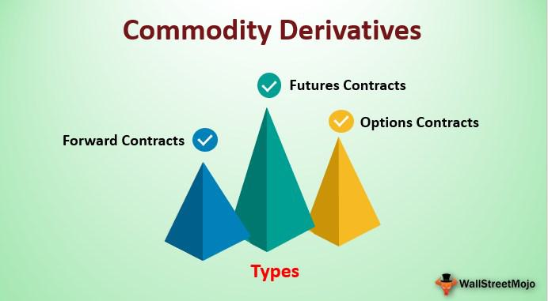

In the financial world, various instruments have been developed to manage risk and improve investment outcomes. Swaps and derivatives play a pivotal role among these tools. Swaps are a specific type of derivative that allows parties to exchange cash flows under pre-agreed terms. This financial mechanism is frequently used to manage risk or capitalize on advantageous market conditions. For example, an interest rate swap might be utilized by one party to exchange a variable interest rate for a fixed rate, thereby stabilizing cash flow expectations in a volatile interest rate environment.

Algorithmic trading, which leverages automated, computational trading strategies, has become increasingly important in the use of financial instruments like swaps and derivatives. By employing sophisticated algorithms, traders can execute orders at speeds and quantities beyond human capabilities. This advancement not only enhances efficiency but also facilitates more complex trading strategies that incorporate derivatives to achieve desired investment outcomes.



This article explores the dynamic intersection of swaps, derivatives, and algorithmic trading, examining their roles in modern finance. It highlights how these instruments and computational methods are used to navigate financial markets, manage risk, and exploit trading opportunities.

## Table of Contents

## Understanding Financial Derivatives and Swaps

Financial derivatives are financial instruments whose value is contingent upon the performance of underlying assets, such as stocks, bonds, interest rates, or market indices. These instruments enable investors and institutions to speculate on future movements in the underlying market or hedge against potential risks, providing a versatile tool for risk management and investment strategy optimization.

Swaps represent a specific category within the derivatives market, utilized predominantly to exchange cash flows or other financial instruments between two parties. They are primarily employed to manage exposures related to interest rates, currency fluctuations, or commodity prices. Swaps can be tailored to the needs of the counterparties involved, making them an essential tool for financial risk mitigation.

**Interest Rate Swaps**

Interest rate swaps are one of the most common types of swaps, whereby two parties agree to exchange streams of interest payments. Typically, one party pays a fixed [interest rate](/wiki/interest-rate-trading-strategies), while the other pays a floating interest rate, often tied to a benchmark such as the LIBOR (London Interbank Offered Rate) or the SOFR (Secured Overnight Financing Rate). This type of swap allows participants to manage interest rate exposure by transforming a variable-rate liability into a fixed one, or vice versa.

The basic formula for calculating the net swap payment in an interest rate swap is:
$$
\text{Net Swap Payment} = (\text{Notional Principal} \times (\text{Fixed Rate} - \text{Floating Rate})) \times \frac{\text{Days}}{\text{360}}
$$

**Currency Swaps**

Currency swaps involve the exchange of principal and interest payments in different currencies. This swap enables parties to gain access to foreign capital markets and hedge against fluctuations in currency exchange rates. In a typical currency swap, the counterparties exchange a series of cash flows in one currency for another, often with the principal amounts also exchanged at the beginning and end of the swap's term.

**Commodity Swaps**

Commodity swaps are used to manage risks associated with the price [volatility](/wiki/volatility-trading-strategies) of commodities like oil, natural gas, or agricultural products. In such swaps, parties agree to exchange cash flows related to the commodity's price, where one party typically pays a fixed price, while the other pays a floating market price. This agreement allows companies, especially those highly sensitive to commodity price changes, to stabilize their cash flows and budget more effectively.

**Conclusion**

Each type of swap serves distinct purposes in the financial markets, allowing participants to manage specific risks or take advantage of market conditions. Their versatility and customizable nature render swaps a critical component of modern financial strategies, enabling both risk management and the potential for profit enhancement through strategic financial operations.

## Algorithmic Trading and Its Integration with Derivatives

Algorithmic trading employs sophisticated mathematical models and algorithms to automate the execution of trades at speeds and scales that surpass human capabilities. By leveraging computational power, traders can capitalize on fleeting market opportunities, executing trades in milliseconds. This speed is crucial as financial markets become increasingly complex and competitive.

Integrating derivatives such as swaps into [algorithmic trading](/wiki/algorithmic-trading) strategies provides significant advantages in terms of leverage, risk management, and strategic execution. Swaps, which are contracts to exchange cash flows between parties, can be incorporated into algorithms to optimize trading strategies by hedging against market volatility and interest rate fluctuations. For example, interest rate swaps allow traders to manage exposure to interest rate changes, effectively stabilizing cash flows and reducing financial risk.

The integration of derivatives within algorithmic trading also enables precise market analysis and execution of complex trades. Algorithms can continuously monitor market conditions and execute trades automatically when predetermined criteria are met. This capability is essential for exploiting [arbitrage](/wiki/arbitrage) opportunities, identifying pricing discrepancies between markets, and ensuring timely execution without human intervention.

Incorporating derivatives into trading algorithms enhances the ability to perform sophisticated quantitative analyses. By using algorithms to model potential outcomes and back-test strategies against historical data, traders can optimize their approaches for better performance. Such precision facilitates strategic decisions, whether it's adjusting a portfolio's risk profile with swaps or capitalizing on directional bets using other types of derivatives.

The computational nature of algorithmic trading platforms allows for the development of multi-step, multi-instrument strategies that can simultaneously engage various market segments. For instance, a Python-based algorithm might incorporate swaps to hedge against interest rate risks in a bond portfolio while also employing options and futures contracts across different asset classes for diversification.

In summary, the synergistic integration of algorithmic trading with derivatives like swaps empowers financial market participants to manage leverage effectively, optimize risk, and execute complex, precise market strategies consistently and rapidly. This integration is a testament to the advancements in financial technology and its potential to transform trading practices dynamically.

## Benefits and Risk Management in Derivatives and Algo Trading

Financial derivatives, including swaps, offer several benefits for risk management and leverage. These instruments allow traders to hedge against unexpected price movements by transferring risk to other parties. For instance, an interest rate swap can help a corporation manage fluctuations in interest rates, thus stabilizing cash flows. By using derivatives, firms can secure more predictable financial outcomes and protect against adverse market conditions.

Algorithmic trading further enhances the utility of derivatives by enabling swift and efficient execution of trades. Algorithms can be programmed to identify and exploit arbitrage opportunities—instances where price discrepancies exist across different markets. These algorithms are capable of analyzing large datasets at high speed, executing trades that capitalize on these discrepancies. An example of an arbitrage opportunity could be a price difference between a derivative security traded on multiple exchanges.

However, the leverage offered by derivatives can also amplify risks. Leverage allows traders to control larger positions with a smaller amount of capital, which can lead to higher potential losses if the market moves unfavorably. This characteristic necessitates the implementation of robust risk management strategies to mitigate potential downsides. One approach is to use stop-loss orders, which automatically close a position when a certain price level is breached, limiting the trader's losses.

Another essential component of risk management in derivatives trading involves using quantitative models to assess and predict market behaviors. For example, the Black-Scholes model is widely used to determine the theoretical price of options, enabling traders to evaluate risk more effectively.

In Python, traders can utilize libraries such as NumPy and SciPy to implement these models:

```python
from scipy.stats import norm
import numpy as np

def black_scholes(S, K, T, r, sigma, option_type='call'):
    d1 = (np.log(S / K) + (r + 0.5 * sigma**2) * T) / (sigma * np.sqrt(T))
    d2 = d1 - sigma * np.sqrt(T)
    if option_type == 'call':
        value = S * norm.cdf(d1) - K * np.exp(-r * T) * norm.cdf(d2)
    elif option_type == 'put':
        value = K * np.exp(-r * T) * norm.cdf(-d2) - S * norm.cdf(-d1)
    return value

# Example usage
S = 100  # Current stock price
K = 100  # Strike price
T = 1    # Time to maturity in years
r = 0.05 # Risk-free rate
sigma = 0.2 # Volatility

call_price = black_scholes(S, K, T, r, sigma, 'call')
put_price = black_scholes(S, K, T, r, sigma, 'put')

print(f"Call Option Price: {call_price}")
print(f"Put Option Price: {put_price}")
```

Despite the advantages of algorithmic strategies and derivatives in managing and leveraging financial positions, it's crucial to understand the risks involved, emphasizing the importance of risk management protocols. By carefully planning and implementing these strategies, traders can maximize profits while minimizing potential downsides.

## Challenges and Risks in Derivatives and Algo Trading

Market volatility represents a critical challenge in accurately pricing derivatives. As market conditions fluctuate, the value of underlying assets can change rapidly, impacting the price and valuation of derivatives. This unpredictability requires dynamic pricing models, often incorporating stochastic calculus or Monte Carlo simulations, to assess various market scenarios.

Counterparty risk is particularly pronounced in over-the-counter (OTC) swaps. These are bilateral agreements where there's a direct obligation between parties. If one party defaults, the other faces potential financial loss. This risk necessitates stringent credit evaluations and, often, the use of collateral to mitigate possible defaults. Standardization of contracts through clearinghouses can reduce counterparty risk, but OTC swaps remain inherently riskier than exchange-traded derivatives.

Operational risks also play a significant role, particularly regarding technological aspects. The infrastructure for algorithmic trading and derivative transactions is heavily reliant on sophisticated technology. Software bugs, hardware failures, or cyber-attacks can disrupt trading activities and lead to substantial financial and reputational damage. Ensuring robust IT systems, regular maintenance, and security protocols is essential to minimize these risks. A strong emphasis on risk management strategies encompassing backup systems and disaster recovery plans is also imperative.

## Future Trends in Derivative Strategies for Algo Trading

Technological advancements are significantly shaping the future of derivative strategies in algorithmic trading, particularly through the use of [artificial intelligence](/wiki/ai-artificial-intelligence) (AI). AI-driven predictive analytics are enhancing trading algorithms by offering unparalleled data processing and analytical capabilities. These technologies can analyze vast amounts of historical and real-time market data to identify patterns and predict future price movements, thus enabling more informed decision-making.

Incorporating [alternative data](/wiki/best-alternative-data) sources is another emerging trend in the development of algorithmic trading strategies. Traditional data sources like stock prices and trading volumes are being supplemented with alternative datasets, such as social media sentiment, satellite imagery, and web traffic [statistics](/wiki/bayesian-statistics). These alternative data sources provide unique trading insights, allowing traders to develop strategies that anticipate market movements in ways traditional analysis might miss.

Ethical investing is gaining prominence and influencing derivative strategies. Environmental, social, and governance ([ESG](/wiki/esg-investing)) factors are becoming crucial in investment decision-making as investors aim to align their portfolios with their ethical values. This trend is leading to the emergence of ESG-compliant derivatives, where the underlying assets or trade strategies are evaluated based on ESG criteria. As a result, algorithmic trading systems are adapting to consider ESG scores or metrics within their trading logic, reflecting a shift toward more socially responsible investment practices.

In summary, the integration of AI, alternative data, and ethical considerations points toward a future where derivative strategies in algorithmic trading are more data-driven, socially responsible, and equipped to leverage cutting-edge technological advancements. This evolution promises not only increased efficiency and profitability but also a more conscientious approach to investing and trading.

## Conclusion

Derivatives, particularly swaps, play an integral role in modern financial markets by facilitating risk management and capitalizing on market opportunities. Swaps enable entities to exchange cash flows under terms that may mitigate risks associated with fluctuations in interest rates, currency values, or commodity prices. This dynamic nature of swaps makes them indispensable tools for financial firms seeking to maintain profitability while managing exposure to various risks.

The integration of algorithmic trading with derivatives like swaps has significantly enhanced the efficiency and strategic execution of trades. Algorithmic trading employs sophisticated algorithms to process vast datasets and execute transactions at speeds unimaginable to human traders. This capability not only increases the precision of trading strategies but also optimizes the use of derivatives by leveraging real-time market data and innovative trading strategies.

To maintain a competitive edge in today's technology-driven financial landscape, staying informed about technological and market trends is crucial. Advances in artificial intelligence, [machine learning](/wiki/machine-learning), and data analytics continually reshape the trading environment, influencing the development of derivative strategies. As market conditions evolve, incorporating insights from alternative data sources and understanding the implications of ethical considerations, such as environmental, social, and governance (ESG) factors, are becoming vital to informed decision-making.

In conclusion, the cornerstones of modern finance—derivatives, swaps, and algorithmic trading—demand continuous adaptation and learning. By embracing technological advancements and being attuned to market changes, market participants can use these financial instruments to navigate the complexities of financial markets effectively.

## References & Further Reading

For those interested in deepening their understanding of the role of derivatives, swaps, and algorithmic trading in modern finance, the following references are invaluable:

- **Advances in Financial Machine Learning by Marcos Lopez de Prado**: This book presents advanced machine learning concepts tailored for use in financial markets, providing methods that enhance predictions and strategy formation within algorithmic trading frameworks.

- **Machine Learning for Algorithmic Trading by Stefan Jansen**: Offering comprehensive insights into the use of machine learning techniques in building algorithmic trading strategies, this resource covers a wide range of applications from data acquisition to financial prediction models.

- **Quantitative Trading: How to Build Your Own Algorithmic Trading Business by Ernest P. Chan**: Chan's work provides a practical guide for individual traders interested in creating their own business in algorithmic trading. It covers essential concepts, from developing trading strategies to backtesting and risk management.

- **Options, Futures, and Other Derivatives by John C. Hull**: A classic in the field, this book offers an in-depth exploration of derivative instruments, including swaps. Hull provides analytical frameworks and real-world applications, making it a vital resource for understanding the mechanics and strategies behind derivatives.

- **Swaps and Other Derivatives by Richard Flavell**: Focused on swaps, this book delves into the specifics of these instruments. It discusses their structure, valuation, and practical use cases in risk management and financial strategy.

These resources collectively provide a robust foundation for mastering the complexities of modern financial instruments and their strategic applications through algorithmic trading.

