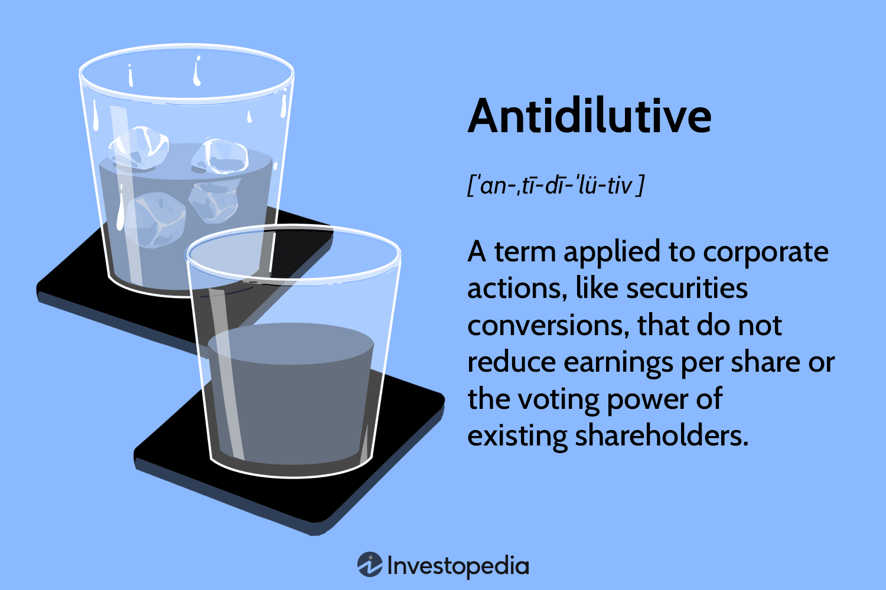

## Table of Contents

## What are dilutive securities?

Dilutive securities are financial instruments that can increase the total number of shares a company has when they are converted or exercised. This includes things like stock options, warrants, and convertible bonds. When these securities are used, they can lower the value of existing shares because the company's earnings are spread out over more shares.

This can be important for investors to know about because it can affect the value of their investments. If a company issues a lot of dilutive securities, it might mean that each share is worth less in the future. Companies often use dilutive securities to raise money or as a way to pay employees, but it's something that investors keep an eye on to understand how their investments might change in value.

## What are anti-dilutive securities?

Anti-dilutive securities are the opposite of dilutive securities. They are financial instruments that, when converted or exercised, do not increase the total number of shares a company has. This means they do not lower the value of existing shares. Instead, they can actually make each share worth more because the company's earnings are not spread out over more shares.

These securities are less common than dilutive securities but can be important for investors. For example, if a company has a lot of anti-dilutive securities, it might mean that the value of the shares could go up in the future. This can be good news for shareholders because their investments could become more valuable. Companies might use anti-dilutive securities to keep their shareholders happy and to show that they are focused on increasing the value of the company.

## How do dilutive securities affect a company's earnings per share (EPS)?

Dilutive securities can lower a company's earnings per share (EPS). EPS is the amount of money a company makes for each share of its stock. When dilutive securities like stock options or convertible bonds are used, they increase the total number of shares. This means the company's earnings are split among more shares, so each share gets a smaller piece of the earnings. For example, if a company makes $100 and has 10 shares, each share gets $10. But if the company issues more shares and now has 20 shares, each share only gets $5.

This is important for investors because EPS is a key number they look at to decide if a company is doing well. If a company's EPS goes down because of dilutive securities, investors might think the company is not as valuable as before. They might decide to sell their shares or not buy new ones. Companies need to be careful about how many dilutive securities they issue because it can affect what investors think about them and how much their stock is worth.

## Can you explain the concept of dilution in simple terms?

Dilution is when a company makes more shares, and it can make each share worth less. Think of it like a pizza. If you have a pizza and you cut it into 8 slices, each slice is pretty big. But if you cut that same pizza into 16 slices, each slice is smaller. When a company issues more shares, it's like cutting the pizza into more slices. The company's total value (the whole pizza) stays the same, but each share (each slice) is worth less because there are more of them.

This can happen when a company gives out stock options to employees or converts special bonds into shares. It's a way for the company to raise money or reward people, but it can make the value of the shares that people already own go down. Investors watch out for dilution because it can affect how much their investment is worth. If a company dilutes too much, investors might decide to sell their shares or not buy new ones, which can make the stock price go down.

## What types of securities are typically considered dilutive?

Dilutive securities are types of investments that can increase the number of shares a company has. This happens when people use these securities to get more shares. Common examples are stock options, which are like special rights that let employees buy shares at a lower price. Another example is warrants, which are similar to options but can be given to anyone, not just employees. Convertible bonds are also dilutive; these are loans that can be turned into shares instead of being paid back with money.

When these securities are used, they add more shares to the company. This means the company's total value is spread out over more pieces, so each share is worth less. It's like cutting a pizza into more slices; each slice gets smaller. Companies use dilutive securities to raise money or reward employees, but it can make the value of existing shares go down. This is something investors watch closely because it can affect how much their investment is worth.

## How can a company issue securities that are anti-dilutive?

A company can issue securities that are anti-dilutive by making sure these securities don't increase the total number of shares. One way to do this is by buying back its own shares from the market. When a company buys back shares, it reduces the total number of shares out there. So, if the company's earnings stay the same or go up, each share gets a bigger piece of the earnings. This can make the value of each share go up, which is good for the people who own the shares.

Another way a company can issue anti-dilutive securities is by using special financial instruments that are designed not to increase the number of shares. For example, a company might issue bonds that can be paid back with money instead of turning them into shares. This way, the total number of shares doesn't go up, and the value of each share can stay the same or even increase. By using these methods, a company can show its shareholders that it cares about keeping the value of their investments high.

## What is the impact of anti-dilutive securities on a company's financial statements?

Anti-dilutive securities can make a company's financial statements look better because they don't increase the number of shares. When a company has fewer shares, the earnings per share (EPS) can go up. This is because the same amount of earnings is split among fewer shares, so each share gets a bigger piece of the earnings. A higher EPS can make the company look more profitable and attractive to investors.

In the financial statements, you might see this impact in the income statement where EPS is reported. If a company is buying back its own shares or issuing securities that don't turn into more shares, the EPS number will be higher than if they had more shares. This can also affect the balance sheet because the company might show fewer shares outstanding. Investors look at these numbers to decide if they want to buy or keep the company's stock, so anti-dilutive securities can help make the company's financial health look stronger.

## How do investors analyze the potential dilution from securities?

Investors look at a company's financial statements and reports to figure out how much dilution might happen. They pay close attention to the notes in the financial statements where the company talks about things like stock options, warrants, and convertible bonds. These notes tell investors how many of these securities the company has and what could happen if they are used to get more shares. By doing this, investors can guess how many more shares might be added in the future and how that could change the value of their current shares.

Investors also use a special number called "fully diluted EPS" to understand the impact of dilution. Fully diluted EPS shows what the earnings per share would be if all the dilutive securities were turned into shares right now. This helps investors see the worst-case scenario for their investment. If the fully diluted EPS is much lower than the regular EPS, it means there could be a big drop in the value of each share if all those securities are used. This information helps investors decide if they want to keep their shares or sell them before the dilution happens.

## What are the accounting standards and rules governing dilutive and anti-dilutive securities?

The accounting standards that govern dilutive and anti-dilutive securities are mainly set by the Financial Accounting Standards Board (FASB) in the United States, which follows the Generally Accepted Accounting Principles (GAAP). Under GAAP, companies have to report how dilutive securities could affect their earnings per share. This is done through a calculation called "diluted EPS," which shows what the earnings per share would be if all the dilutive securities were turned into shares right away. Companies also have to explain these securities in the notes to their financial statements, so investors can see how much dilution might happen.

International companies follow the International Financial Reporting Standards (IFRS), set by the International Accounting Standards Board (IASB). IFRS has rules similar to GAAP for reporting dilutive securities. Under IFRS, companies also have to calculate a "diluted EPS" and report it in their financial statements. They need to tell investors about any securities that could increase the number of shares and how that might change the value of each share. Both GAAP and IFRS want to make sure investors have a clear picture of how dilution could affect their investments.

## How do dilutive and anti-dilutive securities affect company valuation?

Dilutive securities can lower a company's valuation because they increase the total number of shares. When a company issues more shares, each share is worth less because the company's earnings are spread out over more pieces. This is like cutting a pizza into more slices; each slice gets smaller. Investors might see this as a bad sign because their shares could be worth less in the future. If a company keeps issuing dilutive securities like stock options or convertible bonds, it might make investors think the company is not doing well or trying to raise money in a way that hurts existing shareholders. This can make the stock price go down and affect the overall value of the company.

On the other hand, anti-dilutive securities can help increase a company's valuation. These securities don't add more shares, so the value of each share can stay the same or even go up. If a company buys back its own shares or issues securities that don't turn into more shares, it can make the earnings per share go up. This makes the company look more profitable and attractive to investors. When investors see that a company is focused on keeping the value of their shares high, they might be more willing to buy or hold onto the stock. This can lead to a higher stock price and a better overall valuation for the company.

## Can you discuss a real-world example where the issuance of securities led to significant dilution?

A good example of a company that experienced significant dilution is Tesla. Back in 2020, Tesla announced a big stock split and also issued new shares to raise money. The stock split meant that each share was divided into more shares, which made the stock price lower and more affordable for investors. But Tesla also sold new shares to the public, which added more shares to the total number out there. This meant that the value of each share went down because the company's earnings were now spread over more shares. People who owned Tesla stock before the new shares were issued saw their shares become worth less because of this dilution.

This move by Tesla was a bit of a double-edged sword. On one hand, it helped the company raise a lot of money, which it used to grow and invest in new projects. On the other hand, it made the value of each share go down, which wasn't great for existing shareholders. Some investors were happy because they could buy more shares at a lower price, but others were upset because their shares were worth less. This shows how issuing new securities can help a company grow but can also lead to dilution that affects the value of existing shares.

## What strategies can a company employ to minimize the dilutive effects of issuing new securities?

One way a company can minimize the dilutive effects of issuing new securities is by buying back its own shares. When a company buys back shares, it reduces the total number of shares out there. This means that even if new securities are issued, the overall number of shares might not go up as much. It's like cutting a pizza into more slices but then taking some slices away; the remaining slices can be bigger. By doing this, the company can keep the value of each share higher and make shareholders happy.

Another strategy is to carefully plan when and how much new securities to issue. A company can try to time the issuance of new securities when its stock price is high, so it can raise more money without having to issue as many new shares. This means less dilution for existing shareholders. The company can also use different kinds of securities, like bonds that can be paid back with money instead of turning into shares. By using these strategies, a company can raise the money it needs without making the value of each share go down too much.

## What are Dilutive Securities and How Do They Work?

Dilutive securities are financial instruments designed to potentially increase the number of shares outstanding, thereby decreasing the earnings per share (EPS) when converted into common stock. This impact on EPS is a critical [factor](/wiki/factor-investing) for both investors and company management to monitor, as it affects the valuation metrics and shareholder value.

The most common types of dilutive securities include convertible preferred stock, convertible debt, and stock options. Convertible preferred stock can be exchanged for a predetermined number of common shares, usually at the discretion of the holder. This conversion increases the total number of shares outstanding, thus diluting the ownership percentage of existing shareholders. Convertible debt operates similarly, allowing debt holders the option to convert their notes or bonds into shares of the issuing company, a feature often attractive due to the potential for equity appreciation.

Stock options, particularly those issued to employees as a form of compensation, are another prevalent form of dilutive securities. When these options are exercised, they add to the total shares outstanding, potentially diluting EPS. Companies often grant such options to align employee interests with those of shareholders by linking compensation to stock performance.

Mathematically, the dilutive effect is expressed in terms of its impact on EPS. The formula for calculating the fully diluted EPS, which accounts for the possibility of all dilutive securities being converted, is:

$$
\text{Fully Diluted EPS} = \frac{\text{Net Income}}{\text{Weighted Average Diluted Shares Outstanding}}
$$

Where:
- $\text{Net Income}$ is the profit of the company.
- $\text{Weighted Average Diluted Shares Outstanding}$ accounts for any potential increase in shares from the conversion of dilutive securities.

Understanding the implications of dilutive securities requires recognizing that they may lead to existing shareholders owning a smaller percentage of the company post-conversion. This decrease in ownership percentage not only affects stock price and market capitalization but also has potential repercussions on voting power and dividend distributions. Thus, the analysis of dilutive securities is crucial for investors seeking to assess the long-term implications of their investments and for corporate strategists planning capital structuring.

## What is the comparative analysis between dilutive and anti-dilutive securities?

Dilutive and anti-dilutive securities play crucial roles in corporate finance, affecting both shareholder value and strategic corporate decisions. Understanding the distinctions between these two types of securities is vital for both financial decision-makers and corporate strategists.

### Dilutive Securities

Dilutive securities are those that, when exercised or converted, can lead to an increase in the number of outstanding shares, thereby reducing the earnings per share (EPS) for existing shareholders. Common examples include convertible bonds, convertible preferred shares, and stock options. The conversion of these securities into common stock typically results in a dilution of ownership percentages. As a result, existing shareholders experience a decrease in their voting power and a reduction in their share of profits. The degree of dilution can often be quantified by the dilution formula:

$$
\text{Dilution Percentage} = \left(\frac{\text{Shares Added}}{\text{Shares Outstanding} + \text{Shares Added}}\right) \times 100
$$

Where "Shares Added" is the number of shares introduced through conversions or exercises.

### Anti-Dilutive Securities

In contrast, anti-dilutive securities are designed to protect or enhance EPS and shareholder value. Such instruments include certain types of stock options and convertible bonds structured to prevent dilution. For instance, companies may issue stock repurchase agreements to offset potential dilutive effects, maintaining or increasing EPS. These measures can mitigate the negative impacts associated with new share issues, protecting both ownership stakes and voting rights.

### Comparative Impacts

While both dilutive and anti-dilutive securities are linked to EPS and shareholder value, their impacts differ significantly:

- **Shareholder Value:** Dilutive securities can decrease EPS, potentially leading to a drop in stock prices as market perceptions adjust to the diluted ownership. Conversely, anti-dilutive securities can preserve or enhance EPS, supporting or even boosting stock prices by maintaining investor confidence.

- **Corporate Strategy:** Implementing dilutive securities may provide companies with a strategic advantage by raising necessary capital or incentivizing employees through stock options, albeit at the potential cost of shareholder value dilution. Anti-dilutive tactics, such as share buybacks, can signal company strength and commitment to shareholder returns.

### Strategic Considerations

For investors and executives, weighing the potential risks and benefits associated with these securities involves careful analysis and strategic foresight. Dilutive securities may offer capital-raising benefits in exchange for potential dilution, necessitating a balance between growth objectives and shareholder dilution risks. Anti-dilutive strategies, while typically protective, may involve upfront costs, such as capital expenditure for share buybacks, that need justification through anticipated benefits.

Thus, the decision to use dilutive or anti-dilutive securities rests upon a comprehensive evaluation of market conditions, company goals, and the potential trade-offs between shareholder value dilution and strategic benefits.

## References & Further Reading

[1]: ["Options, Futures, and Other Derivatives"](https://www.amazon.com/Options-Futures-Other-Derivatives-10th/dp/013447208X) by John C. Hull

[2]: ["The Handbook of Convertible Bonds: Pricing, Strategies and Risk Management"](https://onlinelibrary.wiley.com/doi/book/10.1002/9781118374696) by Jan De Spiegeleer and Wim Schoutens

[3]: ["Algorithmic Trading and DMA: An Introduction to Direct Access Trading Strategies"](https://www.amazon.com/Algorithmic-Trading-DMA-introduction-strategies/dp/0956399207) by Barry Johnson

[4]: ["Algorithmic and High-Frequency Trading"](https://www.amazon.com/Algorithmic-High-Frequency-Trading-Mathematics-Finance/dp/1107091144) by Álvaro Cartea, Sebastian Jaimungal, and José Penalva

[5]: ["Algorithmic Trading: Winning Strategies and Their Rationale"](https://www.amazon.com/Algorithmic-Trading-Winning-Strategies-Rationale-ebook/dp/B00CY5HC0U) by Ernie Chan