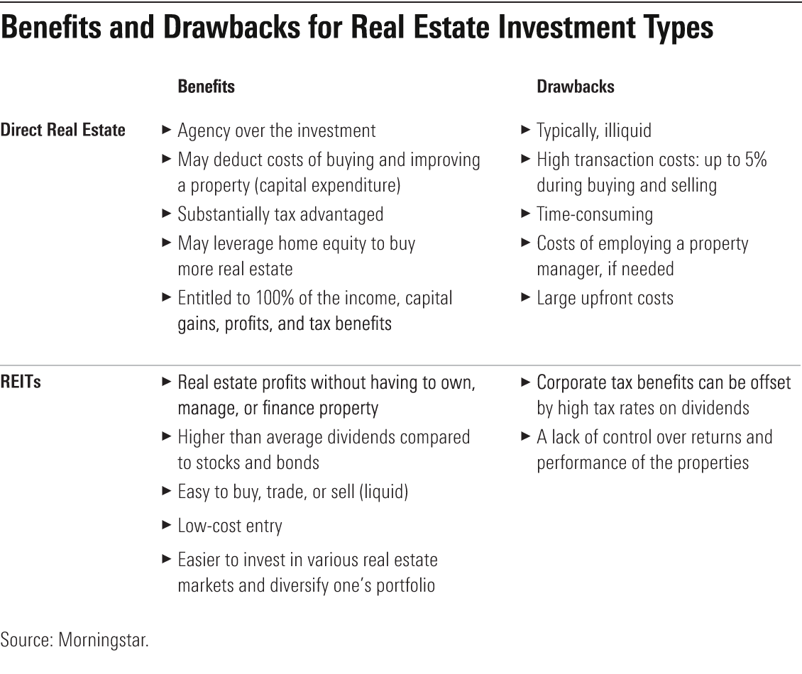

## Table of Contents

## What is direct real estate investment?

Direct real estate investment means buying property yourself, like a house or a building, instead of investing in real estate through stocks or funds. When you invest directly, you own the property and are responsible for everything that comes with it, like paying for repairs, finding tenants if it's a rental, and handling all the legal stuff. It can be a good way to make money, especially if the property value goes up over time or if you can earn rental income.

However, direct real estate investment also has its challenges. It requires a lot of money upfront to buy the property, and you need to know about the real estate market and local laws. There are also ongoing costs like maintenance, taxes, and insurance. If you can't find tenants or if the property value drops, you might lose money. It's a hands-on investment that can be rewarding but also takes time and effort to manage properly.

## What are Real Estate Investment Trusts (REITs)?

Real Estate Investment Trusts, or REITs, are companies that own or finance income-generating real estate. They work like a mutual fund for real estate, allowing people to invest in properties without having to buy, manage, or finance them directly. When you invest in a REIT, you're buying shares of a company that owns a bunch of properties, like shopping malls, apartments, or office buildings. The REIT then uses the rent it collects from these properties to pay dividends to its shareholders.

REITs are popular because they offer a way to earn money from real estate without the hassle of being a landlord. They must pay out at least 90% of their taxable income as dividends to shareholders, which can provide a steady income stream. However, like any investment, REITs come with risks. The value of the properties they own can go up or down, and economic conditions can affect how much rent they can charge or how many tenants they can find. So, while REITs can be a good addition to an investment portfolio, it's important to understand these risks before investing.

## How does one invest in direct real estate?

To invest in direct real estate, you first need to find a property you want to buy. This could be a house, an apartment building, or even land. You'll need to decide what type of property fits your investment goals, like if you want to rent it out for income or fix it up and sell it later for a profit. Once you find a property, you'll need to make an offer and go through the buying process. This usually involves getting a mortgage if you don't have enough cash to buy it outright, and hiring a real estate agent and a lawyer to help with the paperwork and legal stuff.

After you buy the property, you become the owner and are responsible for everything that comes with it. If it's a rental property, you'll need to find tenants, collect rent, and take care of any repairs or maintenance. This can take a lot of time and effort, so some people hire a property manager to help. You'll also need to pay for things like property taxes, insurance, and any fees your homeowners association might charge. Direct real estate investing can be rewarding because you can earn money from rent and see your property's value grow over time, but it also comes with risks and costs that you need to manage carefully.

## How can one invest in REITs?

Investing in REITs is pretty easy and can be done through a brokerage account, just like buying stocks. You can open an account with a broker, either online or at a physical location, and then search for REITs you want to invest in. Many brokers offer a variety of REITs, so you can pick the ones that match your goals. Once you've chosen a REIT, you can buy shares just like you would with any other stock. The price of the shares will go up and down based on the value of the properties the REIT owns and how well it's doing overall.

When you invest in REITs, you're basically buying a piece of a big real estate portfolio. The REIT collects rent from its properties and uses that money to pay dividends to shareholders like you. This can give you a steady income stream, which is one of the main reasons people like REITs. But remember, the value of the REIT can go up or down depending on the real estate market and the economy. So, it's a good idea to do some research and maybe talk to a financial advisor to make sure REITs fit well with your overall investment plan.

## What are the initial costs associated with direct real estate investment?

When you start with direct real estate investment, you need to know about the costs you'll face right away. The biggest cost is usually the down payment for the property. This is the money you pay upfront when you buy the property. Depending on the property and the loan, you might need to pay anywhere from 3% to 20% of the property's price as a down payment. You'll also need to pay for things like closing costs, which are fees for things like appraisals, title insurance, and legal fees. These can add up to around 2% to 5% of the property's price.

Besides the down payment and closing costs, there are other initial costs to think about. You might need to pay for repairs or upgrades to get the property ready for tenants or to sell it later. There could also be costs for setting up utilities, getting insurance, and maybe even hiring a property manager if you don't want to handle everything yourself. All these costs can add up quickly, so it's important to have a good plan and enough money saved up before you start investing in direct real estate.

## What are the initial costs associated with investing in REITs?

When you start investing in REITs, the main cost you'll face is the price of the shares you buy. You can buy REIT shares through a brokerage account, and the cost will depend on how many shares you want and the price of each share at the time you buy them. There might also be some small fees from your broker, like a commission for buying the shares or fees for keeping your account open. These fees can vary, so it's a good idea to check with your broker to see what they charge.

Unlike direct real estate, investing in REITs doesn't need a big down payment or money for things like repairs or closing costs. You can start investing with just the money you need to buy the shares. This makes it easier to get started, but remember that the value of your REIT shares can go up or down, just like any other investment. So, it's smart to think about these costs and how they fit into your overall investment plan.

## What are the potential returns from direct real estate investment?

Direct real estate investment can offer good returns in two main ways. First, you can earn money from rent if you have tenants. If you own a house or an apartment building, you can rent it out and collect rent every month. This can give you a steady income. Second, you might make money if the value of your property goes up over time. If you buy a property and its value increases, you can sell it later for more than you paid for it. This is called capital appreciation, and it can be a big part of your returns.

But, direct real estate investment also has risks. The property might not go up in value, or it might even go down. If you can't find tenants or if they stop paying rent, you won't earn as much income. You also have to pay for things like repairs, taxes, and insurance, which can eat into your profits. So, while direct real estate can offer good returns, it's important to think about all these things and manage your investment carefully.

## What are the potential returns from investing in REITs?

Investing in REITs can give you money in two ways. First, you can get regular payments called dividends. REITs have to pay out at least 90% of their income to shareholders, so if you own shares in a REIT, you can get these payments every few months. This can be a good way to earn some steady money. Second, the value of your REIT shares might go up over time. If the properties the REIT owns do well, the price of the shares can go up, and you can sell them for more than you paid.

But, like any investment, there are risks with REITs. The value of the properties they own can go down, which can make the price of the shares drop. If the economy is bad, it might be harder for the REIT to find tenants or to charge as much rent. This can mean less money for dividends and a lower share price. So, while REITs can be a good way to earn money from real estate without the hassle of owning property yourself, it's important to think about these risks and how they fit into your overall plan for investing.

## What are the risks involved in direct real estate investment?

Direct real estate investment has some risks you need to think about. One big risk is that the value of your property might not go up like you hope. Sometimes, the real estate market can change, and if it goes down, you could lose money if you need to sell. Another risk is not being able to find good tenants. If you're counting on rent to pay your bills, empty properties can be a big problem. You might also have to deal with tenants who don't pay or who cause damage, which can cost you even more money.

There are also costs that can eat into your profits. You'll need to pay for things like property taxes, insurance, and any repairs or upgrades the property needs. These costs can add up and make it hard to earn as much money as you planned. Plus, being a landlord takes a lot of time and effort. You have to handle all the legal stuff, find and manage tenants, and take care of the property. If you're not ready for all that work, it can be really stressful and might not be worth it in the end.

## What are the risks involved in investing in REITs?

Investing in REITs comes with some risks you should know about. One big risk is that the value of the properties the REIT owns might go down. If the real estate market has a tough time, the price of your REIT shares can drop, and you might lose money. Another risk is that the REIT might have a hard time finding good tenants or keeping the ones they have. If they can't collect enough rent, they might not be able to pay out as much in dividends, which can be a problem if you're counting on that money.

There are also other things to think about. Sometimes, REITs take on a lot of debt to buy more properties, and if they can't pay back that debt, it can hurt their value. Plus, changes in the economy or in laws about taxes and real estate can affect how well a REIT does. So, even though REITs can be a good way to earn money from real estate without the hassle of being a landlord, it's important to understand these risks and how they might affect your investment.

## How does liquidity compare between direct real estate and REITs?

When you invest in direct real estate, it can be hard to turn your investment into cash quickly. If you want to sell your property, it can take a long time to find a buyer and go through all the paperwork. This means your money is not as easy to get to if you need it fast. You have to wait for the right buyer and deal with all the steps of selling a house or building, which can take months or even longer.

On the other hand, investing in REITs is much easier if you need your money quickly. You can sell your REIT shares on the stock market anytime you want, just like selling any other stock. This means you can get your money out fast, usually within a few days. So, if you need to use your investment money for something else, REITs are a lot more liquid than direct real estate.

## What are the tax implications of direct real estate investment versus REITs?

When you invest in direct real estate, you have to think about different taxes. You'll pay property taxes every year on the property you own. If you rent it out, you'll have to report the rent as income on your taxes, but you can also deduct expenses like repairs, mortgage interest, and property management fees. When you sell the property, you might have to pay capital gains tax if you make a profit. The tax rate depends on how long you owned the property and how much money you made from selling it. It can get pretty complicated, so it's a good idea to talk to a tax professional to make sure you're doing everything right.

Investing in REITs has different tax rules. The dividends you get from REITs are usually taxed as regular income, which can be higher than the tax rate for capital gains. But, there's a special rule that lets you take a 20% deduction on your REIT dividends if you meet certain conditions. When you sell your REIT shares, you might have to pay capital gains tax on any profit you make. The good news is that with REITs, you don't have to worry about property taxes or managing rental income and expenses. It's simpler, but the tax on dividends can still add up, so it's important to understand how it will affect your overall investment returns.

## References & Further Reading

[1]: Brueggeman, W. B., & Fisher, J. D. (2010). ["Real Estate Finance and Investments"](https://archive.org/details/realestatefinanc0012brue) (14th ed.). McGraw-Hill Education.

[2]: Geltner, D., Miller, N., Clayton, J., & Eichholtz, P. (2006). ["Commercial Real Estate Analysis and Investments"](https://www.researchgate.net/publication/245702364_Commercial_Real_Estate_Analysis_and_Investments) (2nd ed.). Cengage.

[3]: NAREIT. (2023). ["What is a REIT?"](https://www.reit.com/what-reit/reit-basics) National Association of Real Estate Investment Trusts.

[4]: Poterba, J. M., & Sinai, T. (2008). ["Tax Expenditures for Owner-Occupied Housing: Deductions for Property Taxes and Mortgage Interest and the Exclusion of Imputed Rental Income"](https://www.aeaweb.org/articles?id=10.1257/aer.98.2.84) American Economic Review.

[5]: Steiner, B., & Kroencke, T. A. (2018). ["Systematic Risk in Real Estate Markets"](https://www.semanticscholar.org/paper/Time-varying-Macroeconomic-Risk-of-Real-Estate-Kroencke-Schindler/6ab5edd52ab96f2cf50ea46194d202d4b6685ad8) Journal of Financial Economics.

[6]: Tse, R. Y. C. (2013). ["The Impact of Economic Indicators on Real Estate Markets in the UK and India"](https://www.researchgate.net/scientific-contributions/Raymond-Y-C-Tse-80856369) Service Industries Journal.